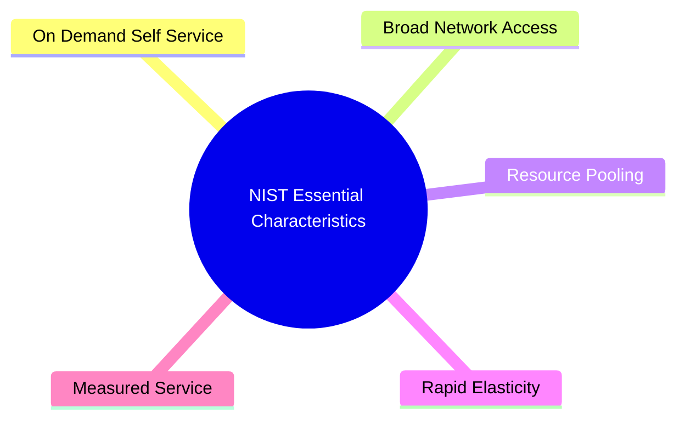

## 1.3. NIST Characteristics of Cloud Computing

The National Institute of Standards and Technology (NIST) defines five essential characteristics that distinguish cloud computing from traditional virtualized datacenters:

### 1.3.1. On-Demand Self-Service
A consumer can provision computing capabilities, such as server time and network storage, unilaterally as needed. This process is fully automated and does not require human intervention from the service provider.
*   **Behind the Scenes:** Users interact with an API Gateway. The platform's orchestrator automatically allocates virtual resources, configures networks, and mounts storage volumes in minutes.

### 1.3.2. Broad Network Access
Capabilities are available over the network and accessed through standard mechanisms. This ensures compatibility with heterogeneous client platforms, including mobile phones, tablets, laptops, and workstations.
*   **Behind the Scenes:** Services are exposed via standard protocols like HTTP/HTTPS. They rely on web-native architectures, API gateways, and global Content Delivery Networks (CDNs) to reduce latency.

### 1.3.3. Resource Pooling
The provider's computing resources are pooled to serve multiple consumers using a multi-tenant model. Physical and virtual resources are dynamically assigned and reassigned according to consumer demand. The customer generally has no control or knowledge over the exact location of the provided resources (e.g., specific country, state, or datacenter host).
*   **Behind the Scenes:** Hypervisors and container runtimes isolate tenant workloads on shared physical CPUs, RAM, and disks. Compute schedulers balance these workloads across cluster nodes to maximize hardware use.

### 1.3.4. Rapid Elasticity
Capabilities can be elastically provisioned and released—sometimes automatically—to scale rapidly outward or inward with demand. To the consumer, the capabilities available for provisioning often appear to be unlimited and can be appropriated in any quantity at any time.
*   **Behind the Scenes:** Auto-scaling groups monitor metrics like CPU utilization or request queues. When thresholds are crossed, the system automatically boots new virtual instances or schedules additional containers.

### 1.3.5. Measured Service
Cloud systems automatically control and optimize resource use by leveraging a metering capability at some level of abstraction appropriate to the type of service (e.g., storage, processing, bandwidth, and active user accounts). Resource usage can be monitored, controlled, and reported, providing transparency for both the provider and consumer.
*   **Behind the Scenes:** Background agents track resource consumption. This data is processed by billing systems to generate detailed usage reports and invoices.