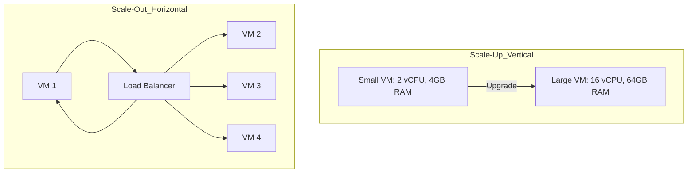

# Evolution, Elasticity, and Scalability Mechanics

## Background Context: The Path to Cloud

The slides mention the evolution from Mainframes (1950s) to Grid Computing and P2P, but the *technological thread* that connects them is often misunderstood. Each era contributed a specific, irreplaceable concept that the modern cloud inherits today.

**Mainframe (Time-sharing):** Introduced the concept of *multiplexing* -- slicing CPU time so multiple users felt like they had their own machine. It introduced **isolation**, the absolute foundation of cloud. Without isolation, multi-tenant cloud environments would be impossible, as one user's workload could interfere with another's execution, memory, or storage. The mainframe proved that a single massive hardware resource could be securely shared among independent users, a principle that underpins every modern cloud data center.

**Grid Computing:** Introduced **distributed resource pooling**. Instead of one supercomputer, thousands of smaller PCs worked together. However, Grid computing lacked *general-purpose environments*; it was usually hardcoded for specific math/science problems. Grid computing demonstrated that workload could be split across many nodes and reassembled, but it could not provide the flexible, general-purpose compute environments that modern applications require. This limitation meant grid computing remained niche, used primarily in academic and research contexts rather than commercial applications.

**Utility Computing:** Introduced the **economic model** (Pay-as-you-go). It treated computing like electricity. The utility model was revolutionary because it decoupled the cost of computing from the ownership of physical hardware. Instead of buying machines that sat idle for most of their lifecycle, organizations could pay only for the compute cycles they actually consumed, transforming IT from a capital investment into an operational expense.

**Cloud Computing:** Combined the *isolation* of mainframes, the *distributed power* of Grid, and the *billing model* of Utility computing, enabled by **Virtualization** (which detached the OS from the physical hardware). Virtualization was the crucial missing link -- it allowed the same physical server to run multiple independent operating systems simultaneously, each completely isolated from the others, while sharing the underlying hardware resources efficiently. This meant that the economic benefits of utility computing could be applied to general-purpose workloads, and the distributed power of grid computing could be harnessed through orchestrating virtual machines across data centers.

---

## Deep Dive: Elasticity vs. Scalability

These two terms are frequently used interchangeably, but technologically, they solve different problems. Understanding the distinction is critical for designing cloud architectures correctly and for passing cloud certification exams.

### Scalability (The "Capacity" Problem)

Scalability is the infrastructure's ability to handle an increasing workload by adding resources. It is typically planned and involves structural changes to the system architecture. Scalability is about ensuring that as demand grows over time, the system can accommodate that growth without degrading performance. It is a design consideration that must be built into the system from the start, whether through stateless application design, database sharding strategies, or load-balanced architectures.

**Vertical Scalability (Scale-Up):** Adding more CPU, RAM, or Disk to an *existing* machine. This is the simplest form of scalability because it does not require changes to the application architecture. However, it has a fundamental limitation: you eventually hit a hardware ceiling. A motherboard can only hold so much RAM, and a CPU socket can only accommodate processors of a certain core count. Vertical scaling also often requires downtime, as the VM may need to be rebooted to recognize the newly added RAM or CPU cores. In practice, vertical scaling is useful for short-term capacity increases but cannot serve as a long-term growth strategy.

**Horizontal Scalability (Scale-Out):** Adding *more machines* to a pool and distributing the load (usually via a Load Balancer). The advantage of horizontal scaling is that it is theoretically infinite. If an app is built as a microservice with stateless design, you can scale from 3 instances to 3,000 instances seamlessly. Horizontal scaling does require the application to be designed for distributed execution, which means handling session state externally, ensuring database concurrency, and implementing service discovery. However, once the architectural foundations are in place, horizontal scaling provides virtually unlimited growth potential without the hardware ceilings that constrain vertical scaling.

### Elasticity (The "Timing" Problem)

Elasticity relies on scalability but adds **automation and speed**. It is the system's ability to *scale out* when demand spikes, and crucially, to *scale in* (remove resources) when demand drops, ensuring you don't pay for idle servers. Elasticity is what makes cloud computing financially transformative -- it means that the infrastructure automatically matches resource allocation to actual demand in real time, eliminating both the performance penalties of under-provisioning and the financial waste of over-provisioning.

Elasticity requires monitoring systems that can detect changes in demand (such as CPU utilization exceeding a threshold), auto-scaling policies that define the response (such as adding two more VMs), and orchestration systems that can provision or deprovision resources within minutes or seconds. The speed of this response is what distinguishes an elastic system from a merely scalable one. An elastic system responds to demand changes automatically and rapidly, without human intervention.

> [!TIP] Exam/Interview Trick
> If a system requires a human engineer to click "add 5 servers" in a console, the system is **scalable**, but it is **not highly elastic**. Elasticity implies rapid, trigger-based automation (e.g., "If CPU > 80% for 5 minutes, add 2 VMs"). The key differentiator is the absence of human decision-making in the scaling loop. An elastic system makes its own scaling decisions based on predefined policies and real-time metrics, executing those decisions within seconds or minutes rather than hours or days.

---

## Mermaid Diagram: Scale-Up vs Scale-Out

