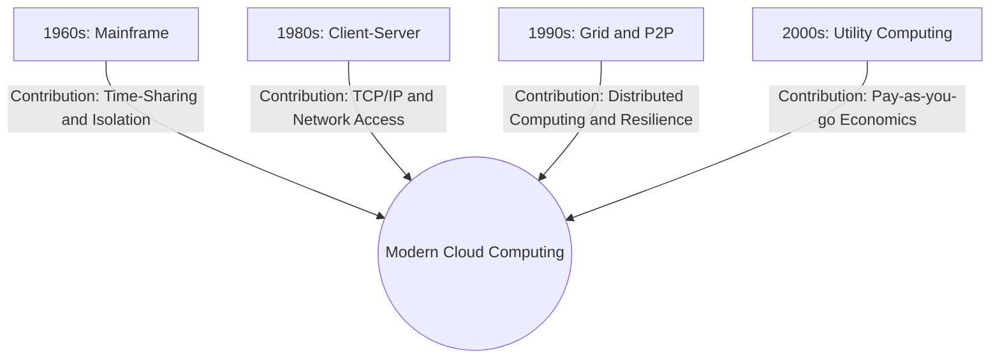

# The Historical Paradigm Shifts Preceding Cloud Computing

## Background Context: The Cloud was not invented overnight

The modern cloud did not suddenly appear in 2006 with AWS. It is the culmination of 70 years of attempting to solve two persistent problems in computer science: **Resource Underutilization** and **High Capital Expenditure (CAPEX)**. By understanding the distinct eras of computing, you understand exactly *what* specific feature each era contributed to the modern Cloud. Each paradigm shift addressed a fundamental limitation of its predecessor while introducing new capabilities that would eventually be synthesized into what we now call cloud computing. The story of the cloud is not one of a single breakthrough, but rather a gradual accumulation of ideas, each building on the last, until the technology and economics aligned to make a new model of computing possible.

---

## 1. Mainframe Computing (1950s - 1970s)

**The Paradigm:** Organizations bought massive, million-dollar supercomputers (like IBM's System/360). Employees connected to this central brain using "dumb terminals" (monitors and keyboards with no actual computing power). The entire organization's computing capability was concentrated in a single, room-sized machine that cost millions of dollars to purchase and required a dedicated team of operators to maintain. This centralized model meant that all computing resources were under the control of a single administrative group, which simplified management but created a single point of failure and a massive bottleneck for access.

**The Breakthrough (Time-Sharing):** John McCarthy introduced the concept of Time-Sharing. The Mainframe sliced its CPU time into milliseconds, serving multiple users simultaneously. Time-sharing was revolutionary because it allowed multiple users to interact with the computer as if they each had their own dedicated machine. The mainframe rapidly switched between user sessions, giving each user a small time slice of CPU attention before moving on to the next. From the user's perspective, the computer was responsive and dedicated to their task, even though it was actually serving dozens or hundreds of users concurrently.

**What it contributed to the Cloud:** The absolute foundational concept of **Resource Mutualization (Multi-tenancy)**. It proved that a single massive hardware resource could securely serve multiple independent users. Without this foundational insight, the entire economic model of cloud computing would be impossible, as the ability to share hardware among multiple tenants is what drives the cost efficiencies that make cloud computing viable.

**The Limitation:** Extreme cost. Only massive corporations and governments could afford them. The capital investment required to purchase and maintain a mainframe was so enormous that it effectively excluded small and medium-sized organizations from accessing significant computing power. This created a deeply unequal landscape where computing resources were available only to the wealthiest institutions.

---

## 2. Client-Server and The Web (1980s - 1990s)

**The Paradigm:** The invention of the microprocessor made PCs cheap. Companies stopped buying mainframes and started buying hundreds of smaller desktop computers (Clients) connected to a central Server via a Local Area Network (LAN). This shift democratized computing power, putting a dedicated processor on every desk. However, it also created a new challenge: how to coordinate and share information across these distributed machines. The client-server model addressed this by designating certain machines as servers that provided shared services (file storage, print services, database access) to the client machines on the network.

**What it contributed to the Cloud:** **Standardized Communication Protocols** (TCP/IP, HTTP) and **Decentralization**. It proved that computation didn't have to happen in one single room; it could happen over a network using standardized request-response architecture. The development of TCP/IP as a universal networking protocol and HTTP as a standard application-level protocol laid the groundwork for the global, interconnected computing infrastructure that cloud computing depends on. Without these standardized protocols, the seamless global connectivity that characterizes modern cloud services would be impossible.

**The Limitation:** Resource Silos. If Server A was at 100% capacity and Server B was at 10% capacity, there was no easy way to share the load. Each server was an island of compute power, unable to dynamically redistribute workloads to underutilized machines. This meant that organizations routinely over-provisioned their server infrastructure, buying enough hardware to handle peak loads on each individual server, even though much of that capacity sat idle for most of the time.

---

## 3. Grid Computing (1995 - 2005)

**The Paradigm:** Scientists needed supercomputers but couldn't afford them. Instead, they connected thousands of standard, geographically dispersed PCs over the internet to work together on a single massive mathematical problem (e.g., SETI@home). Grid computing represented a fundamentally different approach to distributed computing: rather than building one enormous machine, it harnessed the collective power of many ordinary machines. The SETI@home project was a landmark example, recruiting millions of volunteers who donated their idle CPU cycles to analyze radio telescope data in the search for extraterrestrial intelligence.

**What it contributed to the Cloud:** **Distributed Compute Power**. It proved that thousands of cheap, standard machines could be orchestrated to act as one giant, resilient supercomputer. Grid computing demonstrated that massive computational problems could be decomposed into smaller tasks, distributed across a heterogeneous network of machines, and reassembled into a coherent result. This principle of work decomposition and distribution is fundamental to how modern cloud platforms process large-scale workloads.

**The Limitation:** It required applications to be heavily modified to work in a grid. You couldn't just run a standard Windows Server on a Grid. Grid computing was application-specific by nature -- each application had to be explicitly designed to decompose its workload into grid-compatible tasks. This meant that grid computing could never serve as a general-purpose computing platform, limiting its adoption to specialized scientific and research applications.

---

## 4. P2P (Peer-to-Peer) (1990s - 2010s)

**The Paradigm:** Networks like BitTorrent or Napster where every node is both a client and a server simultaneously. There is no central authority. In a P2P network, every participant contributes resources (bandwidth, storage, processing power) and consumes resources from other participants. This creates a self-organizing, decentralized network that can scale organically as more nodes join. The absence of a central server eliminates the single point of failure that plagues client-server architectures.

**What it contributed to the Cloud:** **Absolute Resilience and Automated Discovery**. If a node dies in a P2P network, the network reroutes automatically without human intervention. Cloud orchestrators (like Kubernetes) borrow heavily from P2P resilience algorithms. The self-healing nature of P2P networks, where the network automatically detects failed nodes and redistributes their workload, directly inspired the fault-tolerance mechanisms built into modern cloud orchestration platforms. Service discovery in cloud environments also draws on P2P concepts, as services must be able to find and communicate with each other dynamically without hardcoded endpoints.

---

## 5. Utility Computing (2000 - 2005)

**The Paradigm:** IBM and others theorized that computing power should be sold like electricity or water. You don't buy a power plant to turn on a lightbulb; you just pay the power company for the kilowatts you use. The utility computing vision was elegantly simple: computing should be a metered service, consumed on demand and billed according to actual usage. This was a radical departure from the prevailing model, where organizations purchased and maintained their own computing infrastructure as a capital asset.

**What it contributed to the Cloud:** The **Pay-As-You-Go Economic Model**. This completely destroyed the CAPEX model and birthed the modern OPEX (Operational Expenditure) era of IT. The utility model transformed computing from a product that you buy and own into a service that you consume and pay for. This shift had profound implications for how organizations budget for IT, how they manage financial risk, and how quickly they can scale their computing capabilities in response to changing business conditions.

> [!TIP] Exam/Interview Summary
> If asked how Cloud evolved, use this formula:
> **Cloud = Mainframe (Multi-tenancy) + Client-Server (Networking) + Grid (Distributed Hardware) + Utility (Billing Model).**

---

## Mermaid Diagram: Evolutionary Timeline of Cloud

