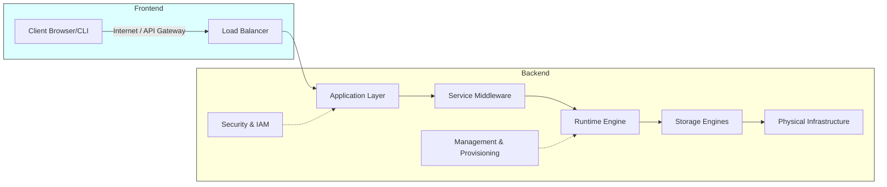

## 2.1. Hierarchical Cloud Infrastructure and Architecture

The cloud is structured into two main environments: the **Frontend** (what the user interacts with) and the **Backend** (the underlying provider infrastructure).

### 2.1.1. Frontend Components
*   **Client Infrastructure:** The user interface, such as web browsers, command-line interfaces (CLIs), native mobile applications, or thick clients. It sends API requests to the backend via standard protocols like HTTPS.

### 2.1.2. Backend Components
*   **Management Middleware:** Orchestrates and coordinates resources. It handles load balancing, virtual machine provisioning, system monitoring, and resource allocation.
*   **Application Layer:** The software applications running in the cloud that process user requests.
*   **Service Layer:** Middleware, database engines, message queues, and API gateways that support the application layer.
*   **Runtime Cloud:** The virtual execution environment, which is managed by hypervisors or container runtimes to provide CPU, memory, and OS access.
*   **Storage Layer:** Dedicated logical units, such as Block Storage, Network File Systems, or Object Storage, that persist application data.
*   **Physical Infrastructure:** The physical servers, network switches, cooling systems, and power grids housed inside secure datacenters.
*   **Security Control Planes:** Firewalls, Identity and Access Management (IAM) systems, and hardware security modules (HSMs) that protect the environment.