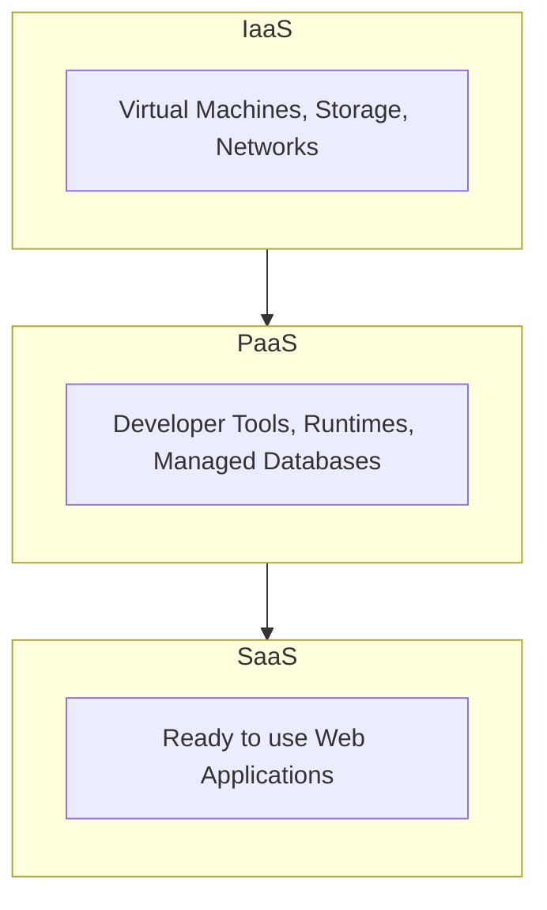
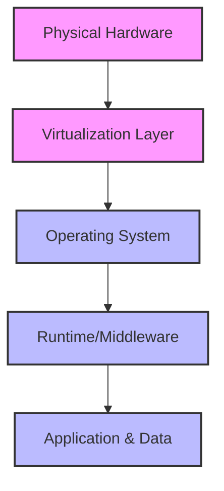
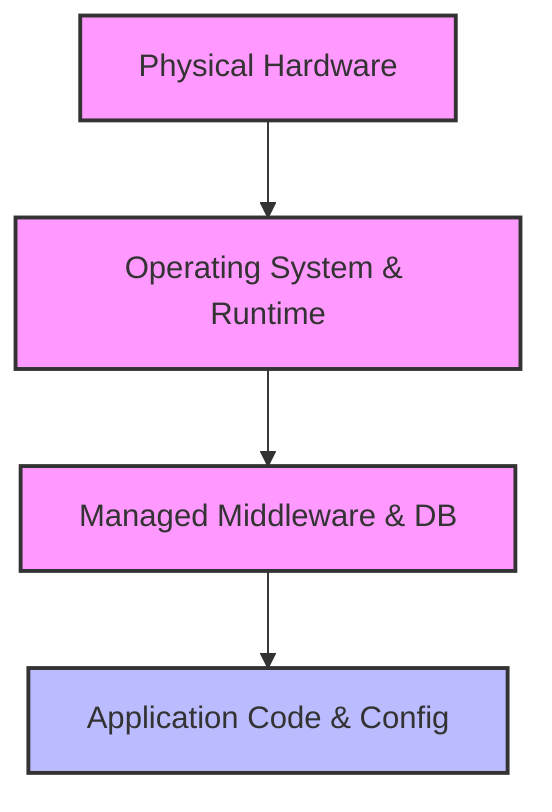
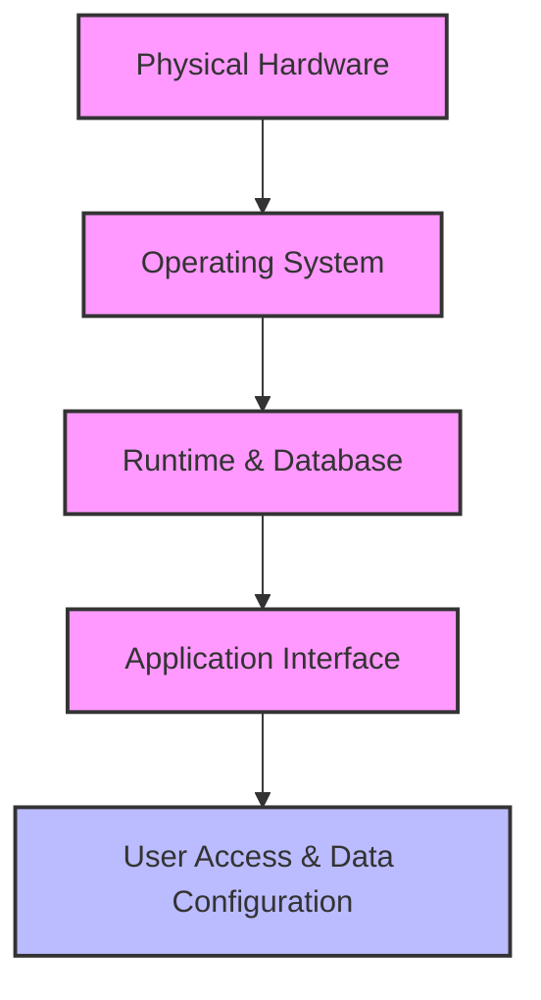

## 2.2. Cloud Service Models - IaaS PaaS SaaS Deep Dive

Cloud resources are delivered through three primary service models: **Infrastructure as a Service (IaaS)**, **Platform as a Service (PaaS)**, and **Software as a Service (SaaS)**.

### 2.2.1. Infrastructure as a Service (IaaS)
IaaS provides raw compute, storage, and networking resources. Users gain access to virtualized hardware and have full control over the operating system, middleware, and application stack.

*   **Key Characteristics:**
    *   Exposes virtual machines, network adapters, IP addresses, block storage devices, and virtual routers.
    *   Relies on hypervisors to split physical host machines into multiple virtual instances.
    *   Offers high configuration flexibility, allowing users to choose operating systems, compile kernels, and configure network topologies.
*   **Advantages:**
    *   **Maximum Control:** Full administrative access (root/admin) to virtual servers.
    *   **High Scalability:** Users can adjust instance sizes (vertical scaling) or add more instances (horizontal scaling) on demand.
    *   **Low Capital Costs:** Eliminates the need to buy and maintain physical hardware.
*   **Disadvantages:**
    *   **Complex Management:** Users must handle OS patching, security updates, firewall configurations, and backups.
    *   **Requires Specialized Expertise:** Requires systems engineers and network administrators to build and maintain the environment.
    *   **Unpredictable Billing:** Dynamic scaling and variable bandwidth use can make monthly costs difficult to predict.
*   **Industry Examples:** Amazon Web Services (EC2, EBS), Microsoft Azure VMs, Google Compute Engine, OpenStack.
*   **Concrete Case Study (Netflix):** 
    Netflix uses IaaS (AWS EC2) to run its processing pipelines and video-encoding microservices. This model allows Netflix to rent thousands of virtual instances during peak hours and spin them down when demand drops, paying only for the compute hours consumed.

---

### 2.2.2. Platform as a Service (PaaS)
PaaS provides a complete, managed environment for developing, testing, and deploying applications. The cloud provider manages the physical hardware, virtualization, operating systems, runtime libraries, and database engines, allowing developers to focus solely on writing code.

*   **Key Characteristics:**
    *   Provides built-in application servers, database middleware, compilers, and interpreters.
    *   Simplifies code deployment using mechanisms like Git integration, container uploads, or zip deployments.
    *   Handles load balancing, horizontal scaling, and security patching automatically.
*   **Advantages:**
    *   **Faster Time-to-Market:** Developers do not need to spend time configuring operating systems, runtimes, or middleware.
    *   **Automated Scaling:** PaaS platforms automatically adjust capacity in response to traffic spikes without manual intervention.
    *   **Lower Management Overhead:** The provider manages runtime and OS security patches, reducing maintenance requirements.
*   **Disadvantages:**
    *   **Vendor Lock-In:** Applications written for a specific PaaS environment may require significant rewriting to migrate elsewhere.
    *   **Limited Customization:** Developers cannot install custom OS drivers, modify kernel parameters, or use unsupported program versions.
    *   **Complex Testing:** Simulating a managed PaaS environment locally on a developer's machine can be challenging.
*   **Industry Examples:** Heroku, Google App Engine, Azure App Service, AWS Elastic Beanstalk.
*   **Concrete Case Study (Web Developer deploying Python Flask):**
    A student has built a Python Flask web application. On a local machine, they must install Python, set up virtual environments, configure Nginx, and manage system service definitions. By deploying to a PaaS provider like Heroku, the developer simply pushes their code repository. The platform automatically detects the code, installs dependencies, configures the reverse proxy, and deploys the app under a public URL.

---

### 2.2.3. Software as a Service (SaaS)
SaaS delivers complete, fully functional software applications over the internet. The provider manages the entire stack, from the physical infrastructure and operating systems up to the application code and user interface. Users access the software through web browsers or thin clients, usually on a subscription basis.

*   **Key Characteristics:**
    *   Eliminates local installation and maintenance, with applications running directly in web browsers.
    *   Uses a multi-tenant database architecture to share hardware resources efficiently among subscribers.
    *   Relies on web-native API services to handle user authentication, license tracking, and billing.
*   **Advantages:**
    *   **No Technical Overhead:** Users do not need to manage code, servers, or infrastructure.
    *   **Accessible Anywhere:** Users can log in and access the software from any internet-connected device.
    *   **Predictable Subscription Costs:** Licensing is typically based on simple seat-based or consumption-based subscriptions.
*   **Disadvantages:**
    *   **Limited Customization:** Users cannot modify application logic, database schemas, or core design elements.
    *   **High Internet Dependency:** Performance is directly tied to connection speeds, and offline access is often limited.
    *   **Data Sovereignty and Privacy Risks:** Organizations trust the provider with potentially sensitive customer and business data.
*   **Industry Examples:** Google Workspace, Microsoft Office 365, Salesforce, Dropbox, Slack.
*   **Concrete Case Study (University Google Workspace Integration):**
    A university uses Google Workspace to provide email, document collaboration, and storage services. The university IT department does not need to deploy local mail servers, database engines, or storage arrays. Google manages all technical operations, allowing the university to focus on administrative tasks like user onboarding, account provisioning, and access permissions.