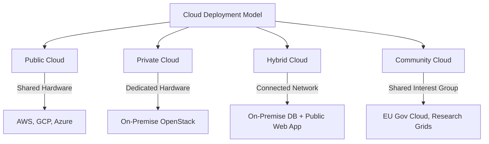

## 2.4. Cloud Deployment Models - Public Private Hybrid Community

Cloud deployment models define how resources are owned, hosted, and isolated.

### 2.4.1. Public Cloud
An organization hosts its IT infrastructure on servers owned and managed by a third-party cloud provider. Multiple companies (tenants) share the same physical hardware resources, isolated by hypervisors and network-segmentation protocols.
*   **Key Characteristics:**
    *   Resources are shared among multiple tenants over public internet channels.
    *   Features variable, pay-as-you-go pricing models.
    *   The provider is responsible for maintaining the physical facilities and hardware.
*   **Advantages:**
    *   **Low Initial Cost:** No up-front hardware investments are required.
    *   **Rapid Elasticity:** Access to nearly unlimited computing power to handle traffic spikes.
    *   **No Physical Maintenance:** The provider manages hardware cycles, cabling, and facility operations.
*   **Disadvantages:**
    *   **Less Customization:** Users cannot customize low-level hardware or physical network configurations.
    *   **Data Sovereignty Concerns:** Physical data locations may conflict with regional regulations.
    *   **Unpredictable Performance:** Shared hardware can suffer from performance fluctuations due to neighboring tenants.
*   **Industry Case Study:** Netflix runs its media catalog and user interface on AWS, utilizing its global network to stream content efficiently.

---

### 2.4.2. Private Cloud
A cloud infrastructure dedicated exclusively to a single organization. It can be hosted internally in the organization's own datacenter, or externally managed by a third-party provider.
*   **Key Characteristics:**
    *   Hardware is completely isolated from other organizations.
    *   Provides higher security, data privacy, and control.
    *   Requires dedicated physical hardware and local network management.
*   **Advantages:**
    *   **Maximum Security:** Complete isolation protects sensitive workloads and corporate intellectual property.
    *   **Predictable Performance:** Dedicated hardware eliminates performance interference from neighboring tenants.
    *   **Customization:** Full control over hardware choice, physical configurations, and network switches.
*   **Disadvantages:**
    *   **High Initial Costs:** Requires significant up-front capital investments.
    *   **Limited Elasticity:** Scaling capacity is constrained by the physical hardware installed in the datacenter.
    *   **Maintenance Overhead:** Local IT teams are responsible for all hardware, network, and power management.
*   **Industry Case Study:** High-security institutions like central banks run private clouds to host financial transactional ledgers, protecting them from public network exposure.

---

### 2.4.3. Hybrid Cloud
An IT infrastructure that connects a private cloud or local datacenter with a public cloud. This model allows data and applications to move dynamically between environments, helping organizations leverage the benefits of both.
*   **Key Characteristics:**
    *   Integrates private resources with public cloud services.
    *   Uses secure VPN tunnels or dedicated connections (e.g., AWS Direct Connect) for communication.
    *   Allows workloads to scale dynamically between environments based on demand or security needs.
*   **Advantages:**
    *   **Strategic Flexibility:** Sensitive data can remain in the private cloud, while web-facing applications run on scalable public infrastructure.
    *   **Cost Optimization:** Organizations can use the public cloud to absorb temporary traffic spikes (cloud bursting) instead of buying permanent hardware.
    *   **Seamless Migration:** Supports gradual migration of workloads from legacy systems to the cloud.
*   **Disadvantages:**
    *   **High Management Complexity:** Requires managing identity, security, and networking across two different environments.
    *   **Network Latency Issues:** Data transfer between on-premise servers and the public cloud can introduce latency.
    *   **Complex Security Policies:** Organizations must maintain consistent security policies across public and private resources.
*   **Industry Case Study:** A retail bank hosts its core customer account databases on highly secure on-premise private infrastructure, but deploys its mobile banking front-end on a public cloud (such as AWS) to scale seamlessly during peak hours.

---

### 2.4.4. Community Cloud
An infrastructure shared by several organizations with common goals, such as compliance requirements, security levels, or research objectives. It can be managed internally by the participating organizations or by a third-party provider.
*   **Key Characteristics:**
    *   Shares costs and resources among a small group of participating organizations.
    *   Access is restricted to authorized community members.
    *   Tailored to meet specific industry standards or regulatory requirements.
*   **Advantages:**
    *   **Shared Costs:** Organizations split the cost of custom infrastructure, making it more affordable than a dedicated private cloud.
    *   **Tailored Compliance:** Pre-configured to meet specific sector requirements, such as federal security standards.
    *   **Collaboration:** Facilitates secure data sharing and collaboration among member organizations.
*   **Disadvantages:**
    *   **Complex Governance:** Managing resource allocation, cost distribution, and decision-making among multiple partners can be challenging.
    *   **Shared Vulnerabilities:** If one member's account is compromised, it can put other organizations on the network at risk.
    *   **Lower Flexibility:** Resource usage policies must be negotiated and agreed upon by the entire community.
*   **Industry Case Study:** The European Research Grid (GAIA-X) connects universities, research centers, and public agencies on a shared network to collaborate on scientific computations while maintaining strict European data privacy standards.