# Cloud Architecture Layers and Responsibility Boundaries

## The Cloud Architecture: Frontend vs Backend

The cloud is not a single, monolithic system. It is a layered architecture with clearly defined boundaries between what the client interacts with and what the provider operates behind the scenes. Understanding these layers and how they communicate is essential for grasping where responsibilities begin and end.

### Frontend

The frontend represents everything the client directly sees and interacts with. It consists of the client's device (a laptop, a mobile phone, or a tablet), the network connection originating from that device, and the graphical user interface. In a cloud context, the GUI might be the AWS Management Console, the Azure Portal, or the web interface of a SaaS application like Slack or Google Workspace. The frontend is responsible for capturing user input, rendering responses, and translating human actions into API calls that get sent to the backend. Importantly, the frontend has no awareness of the physical infrastructure. A user clicking "Launch Instance" in the AWS Console has no idea whether that command is fulfilled by a server in Virginia or Oregon, nor do they need to.

### Backend

The backend is the cloud provider's realm -- the vast, hidden infrastructure that processes every request. It comprises several critical sub-layers:

- **Middleware:** Middleware acts as the bridge between the frontend's requests and the physical hardware. In cloud environments, middleware refers to API Gateways, Message Brokers (such as RabbitMQ or Amazon SQS), and Service Meshes (like Istio). When a user clicks "Create VM" in the console, that click generates an API call. The middleware receives this API call, authenticates the user, validates the request parameters, and then translates the API command into hypervisor-level instructions that execute on the bare-metal servers. Without middleware, there would be no way to translate a simple HTTP request into the complex orchestration of virtual machine creation, network configuration, and storage allocation that happens beneath the surface.

- **Runtime Cloud:** The runtime cloud is the execution environment where the actual work happens. Its composition depends on the service model in use. In IaaS, the runtime is the Hypervisor (such as KVM or Xen), which manages the virtual machines directly on the physical hardware. In PaaS, the runtime is a higher-level abstraction -- a Container Runtime (like Docker or containerd) or a managed operating system layer that the provider maintains. The runtime cloud is where the provider's responsibility is heaviest; it must ensure that the execution environment is stable, performant, and isolated from other tenants.

The communication flow between these layers follows a clear path: the user interacts with the frontend, which sends API requests through the network to the middleware, which orchestrates the runtime cloud to execute the requested operations on the physical hardware. Each layer only knows about the layer immediately adjacent to it, which is a fundamental principle of modular architecture.

---

## Granular Breakdown of the Shared Responsibility Model

The Shared Responsibility Model is the cornerstone of cloud security. It defines, with precision, which security and management tasks belong to the cloud provider and which belong to the customer. Misunderstanding this boundary is one of the most common causes of security breaches in cloud environments. The model shifts depending on the service model -- IaaS, PaaS, or SaaS -- with the provider taking on progressively more responsibility as you move from IaaS toward SaaS.

### IaaS (Infrastructure as a Service)

Infrastructure as a Service provides the most fundamental building blocks. The provider delivers raw compute, storage, and networking resources, and the customer is responsible for nearly everything above the hypervisor.

- **Provider handles:** Physical datacenter security (guards, badges, cameras), power and cooling systems, physical network switches and cabling, physical servers (motherboards, CPUs, disks), and the Hypervisor itself. The provider guarantees that the hypervisor is patched, that VMs on the same host cannot access each other's memory, and that the physical hardware is operational.

- **Client handles:** The Guest OS (choosing between Windows, Ubuntu, Amazon Linux, etc.), patching and updating the Guest OS, configuring network firewalls (Security Groups and Network ACLs), installing and managing application code, managing application dependencies, and securing all data stored on the virtual machines.

- **Common Pitfall:** If your Ubuntu VM gets a virus because you failed to install security patches for six months, the cloud provider is not responsible. If an attacker brute-forces your SSH password because you left port 22 open to the entire internet, that is a client failure, not a provider failure. The provider's responsibility ends at the hypervisor; everything running inside the VM is the customer's domain. This is why IaaS requires the most operational expertise -- you are essentially a system administrator, just without the physical hardware to manage.

### PaaS (Platform as a Service)

Platform as a Service abstracts away the infrastructure and operating system layer, allowing developers to focus exclusively on their application code and data.

- **Provider handles:** Everything in IaaS plus the Guest OS (including all OS-level patching and updates), the middleware layer, the runtime environment (e.g., Node.js, Python, Java, .NET), and managed database engines (e.g., Amazon RDS, Google Cloud SQL). The provider ensures that the runtime version is up to date, that the underlying OS is patched, and that the database engine is performing backups and failover.

- **Client handles:** The application code and the data. The developer writes the code, deploys it to the platform, and is responsible for the logic, the data models, and the access controls within the application.

- **Vendor Lock-in Risk:** Because the provider dictates the specific version of the runtime, the APIs used to interact with the platform, and the deployment mechanisms, migrating code from one PaaS provider to another often requires significant rewriting. For example, an application built on AWS Elastic Beanstalk uses AWS-specific configuration files and environment variables. Moving that same application to Google App Engine would require adapting the deployment descriptors, changing the API calls for platform-specific services (like caching or queue systems), and reconfiguring the build pipeline. This lock-in is the trade-off for the convenience of not managing the OS and runtime yourself.

### SaaS (Software as a Service)

Software as a Service represents the highest level of abstraction. The provider delivers a fully functional application, accessible through a web browser or API, and manages the entire stack from the physical cables to the application code.

- **Provider handles:** Everything. From the physical datacenter and network cables, through the hypervisor, the operating system, the runtime, the middleware, and the application code itself. The customer consumes the software as a service with no visibility into or control over the underlying infrastructure.

- **Client handles:** Data classification and Access Management. Even in a fully managed SaaS environment, the customer retains a critical responsibility: ensuring that the right people have the right level of access. If an employee shares a highly confidential Google Drive link publicly, or if an admin gives every user in the organization "Super Admin" permissions in a SaaS platform, that is a client failure, not a provider failure. The provider secures the infrastructure and the application code, but the customer must govern who can access what data and what actions they can perform.

- **Important Detail:** Many organizations mistakenly assume that using a SaaS product means they have zero security responsibilities. In reality, identity and access management (IAM), data classification policies, and compliance auditing remain squarely in the customer's court. The provider ensures the application is available and the infrastructure is secure; the customer must ensure they are using it securely.

---

## Mermaid Diagram: Shared Responsibility

```mermaid
block-beta
columns 3
  block:iaas["IaaS"]
    I_Data["Data (Client)"]
    I_App["Applications (Client)"]
    I_Runtime["Runtime (Client)"]
    I_OS["OS (Client)"]
    I_Hyp["Hypervisor (Provider)"]
    I_Phys["Physical HW (Provider)"]
  end

  block:paas["PaaS"]
    P_Data["Data (Client)"]
    P_App["Applications (Client)"]
    P_Runtime["Runtime (Provider)"]
    P_OS["OS (Provider)"]
    P_Hyp["Hypervisor (Provider)"]
    P_Phys["Physical HW (Provider)"]
  end

  block:saas["SaaS"]
    S_Data["Data/Access (Client)"]
    S_App["Applications (Provider)"]
    S_Runtime["Runtime (Provider)"]
    S_OS["OS (Provider)"]
    S_Hyp["Hypervisor (Provider)"]
    S_Phys["Physical HW (Provider)"]
  end
```

This diagram illustrates a crucial pattern: as you move from IaaS to PaaS to SaaS, the provider's rectangle grows and the client's rectangle shrinks. In IaaS, the client manages four of the six layers. In PaaS, the client manages only two. In SaaS, the client manages only data and access. This progression represents a fundamental trade-off: more control versus more convenience. IaaS gives you maximum control but demands maximum operational effort; SaaS gives you zero infrastructure management but limits your customization options.
