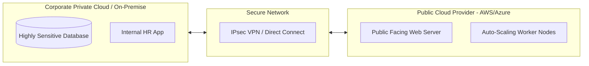

# Cloud Deployment Architectures and Network Trade-offs

## Background Context: Deployment Models

While Service Models (IaaS, PaaS, SaaS) dictate who manages what layers of the technology stack, Deployment Models dictate who has access to the hardware and where it physically lives. The two dimensions are independent: you can run IaaS on a Public Cloud or on a Private Cloud. You can consume SaaS from a Public Cloud or from a Community Cloud. The deployment model determines the physical and organizational boundaries of the infrastructure, and each model carries distinct network trade-offs that affect performance, security, compliance, and cost.

Understanding these models is not merely an academic exercise. Choosing the wrong deployment model can result in regulatory fines (if sensitive data ends up on shared hardware), massive cost overruns (if a private cloud is over-provisioned for a variable workload), or unacceptable latency (if a hybrid cloud connection is poorly architected).

---

## 1. Public Cloud

### Definition

The infrastructure is owned and operated by a third-party cloud provider (such as AWS, Microsoft Azure, or Google Cloud Platform) and delivered over the public internet. The provider owns the datacenters, the servers, the networking equipment, and everything in between.

### Mechanics

Public clouds operate on the principle of massive multi-tenancy. Your virtual machines sit on the exact same physical silicon as the virtual machines of completely unrelated companies. The hypervisor provides logical isolation between tenants, ensuring that one customer cannot access another's data or memory. However, the physical hardware is shared. This sharing is what drives the economies of scale that make public cloud pricing so attractive. The provider can purchase servers in volumes of hundreds of thousands, negotiate bulk pricing on networking equipment, and spread the cost of datacenter operations across millions of customers.

### Network Trade-offs

Public cloud resources are accessed over the public internet by default. While the traffic is encrypted (via TLS/SSL), the network path traverses the public internet infrastructure, which introduces variable latency and potential points of interception. For high-security workloads, providers offer dedicated private connections (such as AWS Direct Connect or Azure ExpressRoute) that establish a direct, private network link between the customer's datacenter and the cloud provider's network, bypassing the public internet entirely. These dedicated connections come at a significant additional cost but provide consistent low latency and enhanced security.

### Best For

Unpredictable workloads that need rapid elasticity, startups requiring zero CAPEX to get started, and globally distributed applications (like Netflix or Airbnb) that need to deploy infrastructure in multiple geographic regions to serve users worldwide with low latency.

### Drawback

Security compliance is the primary concern. Even with strict hypervisor isolation, some highly regulated industries (such as healthcare under HIPAA, or government workloads requiring FedRAMP High) forbid or heavily restrict sharing physical hardware with unknown entities. Additionally, data residency laws in certain countries require that citizen data remain on servers physically located within that country's borders, which may limit which public cloud regions are legally available.

---

## 2. Private Cloud

### Definition

Cloud infrastructure operated solely for a single organization. It can physically reside on the company's on-site datacenter, or it can be hosted by a third-party provider in a dedicated facility, but the critical distinction is that the hardware is strictly dedicated to one tenant. No other organization's workloads run on the same physical servers.

### Mechanics

A private cloud utilizes software platforms like OpenStack, VMware vCloud Suite, or Microsoft Azure Stack to give the organization cloud-like features (self-service provisioning, resource pooling, elastic scaling, metered usage) but within a fenced, private network. The organization gets the operational benefits of cloud computing -- automation, APIs, rapid provisioning -- without the multi-tenancy characteristics of the public cloud. The hypervisor isolation is still present, but it is only separating workloads within the same organization, not between different companies.

### Network Trade-offs

Because the infrastructure is privately owned and operated, network traffic never traverses the public internet. All communication between virtual machines, storage systems, and databases happens within the organization's internal network. This provides extremely low latency, predictable network performance, and complete control over the network topology. However, this isolation also means that connecting to external services or replicating data to a disaster recovery site requires explicit network configurations (VPN tunnels, leased lines) that the organization must manage and maintain.

### Best For

Banks, hospitals, military agencies, and any organization with extreme data privacy regulations or strict compliance requirements that mandate complete physical isolation of workloads. Also suitable for organizations with highly predictable, steady-state workloads that do not benefit from the elastic scaling of the public cloud.

### Drawback

The company is back to paying CAPEX. They must buy, power, cool, and maintain the hardware themselves. They must also hire staff to manage the datacenter, replace failing disks, upgrade network equipment, and handle capacity planning. There is no elastic scaling beyond the hardware they have purchased; if demand exceeds capacity, they cannot simply spin up more servers -- they must procure, install, and configure new hardware, which can take weeks or months.

---

## 3. Hybrid Cloud (The Toughest to Execute)

### Definition

A composition of two or more distinct cloud infrastructures (Private and Public) that remain unique entities but are bound together by standardized or proprietary technology, enabling data and application portability between them.

### The Technical Reality (Why It Is Hard)

A Hybrid Cloud is not just "having some stuff on-prem and some stuff in AWS." That is merely a multi-cloud or distributed environment. True Hybrid Cloud requires seamless orchestration between the private and public environments. The workloads must be able to move between environments dynamically, and the networking, identity, and management layers must be unified.

You must connect the Private network to the Public network via heavily encrypted, high-bandwidth tunnels. AWS Direct Connect and Azure ExpressRoute are the industry standard solutions for this. These are not VPN connections over the public internet; they are dedicated, private fiber-optic links that provide consistent bandwidth (1 Gbps, 10 Gbps, or even 100 Gbps) with guaranteed latency and no exposure to public internet congestion. Setting up and maintaining these connections requires specialized networking expertise and ongoing coordination with the cloud provider.

Beyond networking, the orchestration layer must handle differences in API compatibility, security policies, and resource management between the private and public environments. Tools like Kubernetes (with its cloud-agnostic container orchestration) and Terraform (with its multi-provider infrastructure-as-code approach) are commonly used to bridge this gap, but they introduce their own complexity.

### Use Case: Cloud Bursting

Cloud Bursting is the flagship use case for hybrid cloud. A company runs its daily operations on its Private Cloud, which is sized to handle the baseline workload efficiently. When a massive spike occurs (for example, processing payroll at the end of the month, or handling a seasonal sales surge during Black Friday), the application seamlessly "bursts" into the Public Cloud to borrow additional compute power. The extra capacity is provisioned automatically, the workload is processed, and once the spike subsides, the resources in the Public Cloud are released and the application shrinks back to the Private Cloud. This allows the organization to avoid the CAPEX of purchasing enough private hardware to handle peak loads that only occur a few days per year.

The challenge with cloud bursting is that moving workloads is not instantaneous. The application must be architected to be stateless (or have its state replicated to the public cloud in advance), the data must be accessible from both environments, and the DNS or load balancer must be able to redirect traffic dynamically. These requirements make cloud bursting feasible primarily for stateless web applications and batch processing workloads, rather than for monolithic, state-heavy applications.

---

## 4. Community Cloud

### Definition

Infrastructure shared by several organizations that have a shared community of interest, such as a common mission, security requirements, policy, or compliance considerations. The community cloud sits between the public cloud and the private cloud on the isolation spectrum: it is more isolated than a public cloud (which shares hardware with anyone) but less isolated than a private cloud (which dedicates hardware to a single organization).

### Mechanics

In a community cloud, the participating organizations jointly share the cost of the infrastructure and the operational responsibilities. The hardware may be hosted on-premises at one of the organizations, at a third-party provider, or at a dedicated community facility. The key is that only members of the defined community can deploy workloads on the shared infrastructure, and the security policies and compliance controls are agreed upon collectively by all members.

### Use Case

Multiple universities sharing a massive supercomputing cluster for genomic research is a classic example. Each university contributes funding, and since they all trust each other and have similar security requirements (academic research data is typically not classified as highly sensitive as financial or healthcare data), they do not need the extreme isolation or cost of a purely Private Cloud. Another example is government agencies within the same country sharing a community cloud that meets specific national security clearance requirements -- the community cloud is compliant with the necessary security standards, and only agencies with the proper clearances are permitted to join.

### Network Trade-offs

Community clouds typically operate on private network connections between the participating organizations and the shared infrastructure. This provides better network performance and security than the public internet, but the network management is a shared responsibility, which can lead to coordination challenges. If one organization's network configuration introduces a vulnerability, it could potentially affect the other members of the community.

---

## Mermaid Diagram: Hybrid Cloud Architecture

This diagram illustrates the core principle of hybrid cloud architecture: the private cloud holds the sensitive workloads (internal databases, HR applications), the public cloud holds the outward-facing and elastic workloads (web servers, auto-scaling workers), and a secure, encrypted tunnel bridges the two environments. The encrypted tunnel is the critical link; if it fails or is compromised, the hybrid architecture degrades into two disconnected environments, and workloads that depend on cross-environment communication will fail. Designing for tunnel redundancy (multiple Direct Connect links, VPN failover paths) is essential for production hybrid cloud deployments.
