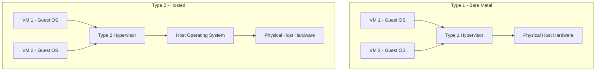

## 3.1. Core Virtualization Concepts and Hypervisors

Virtualization is the foundational technology of cloud computing. It adds an abstraction layer over physical hardware, allowing a single host to run multiple independent virtual machines.

### 3.1.1. Core Terms
*   **Host System:** The physical machine (bare metal) that provides CPU, memory, storage, and network interfaces.
*   **Guest System:** The virtual machine running on the host, which operates as an independent system with its own virtualized hardware.
*   **Hypervisor (Virtual Machine Monitor - VMM):** The software layer that manages virtual machine creation, CPU execution scheduling, memory isolation, and network routing.

### 3.1.2. Type 1 (Bare-Metal) Hypervisors
Type 1 hypervisors install directly on the host's physical hardware, with no intermediate host operating system. This allows the hypervisor to manage the hardware directly, providing low overhead and high performance.
*   **Execution Mechanics:** The hypervisor runs in the processor's most privileged ring (e.g., ring -1 in x86 architectures). It schedules guest VM execution directly on the physical processor, ensuring that guest operating systems run with minimal virtualization overhead.
*   **Advantages:**
    *   **Near-Native Performance:** Direct hardware access minimizes execution latency.
    *   **Strong Isolation:** No host operating system means fewer security vulnerabilities and a smaller attack surface.
    *   **Enterprise-Grade Scalability:** Designed to manage thousands of VMs across cluster nodes.
*   **Disadvantages:**
    *   **Complex Installation:** Requires dedicated physical servers and cannot be installed on a standard desktop OS.
    *   **Limited Hardware Compatibility:** Requires hardware certified by the hypervisor manufacturer.
*   **Industry Examples:** VMware ESXi, Microsoft Hyper-V, Xen.

---

### 3.1.3. Type 2 (Hosted) Hypervisors
Type 2 hypervisors run as an application on top of an existing host operating system. The host OS handles hardware interactions and scheduling, making this model easy to set up but less efficient.
*   **Execution Mechanics:** When a guest VM executes an instruction, the type 2 hypervisor intercepts it and translates it into system calls. The host operating system then schedules these calls alongside normal desktop processes.
*   **Advantages:**
    *   **Simple Setup:** Installs easily like a standard desktop application.
    *   **Broad Hardware Support:** Leverages the host operating system's device drivers, ensuring wide compatibility.
    *   **User-Friendly:** Simplifies local development, software testing, and legacy app execution on standard desktops.
*   **Disadvantages:**
    *   **Performance Overhead:** The double-scheduling layer (guest to hypervisor to host OS) significantly reduces CPU, memory, and I/O efficiency.
    *   **Lower Reliability:** If the host operating system crashes, all virtual machines running on it crash as well.
*   **Industry Examples:** Oracle VM VirtualBox, VMware Workstation, Parallels Desktop.