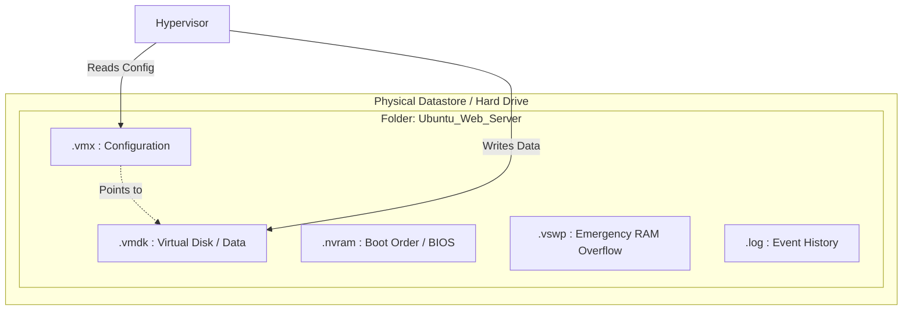

# Anatomy of a Virtual Machine and File Structures

While we conceptualize a Virtual Machine as a computer, to the Hypervisor and the Host Operating System, a VM is absolutely nothing more than a structured collection of specific files resting in a folder on a hard drive. Understanding these files is essential for VM administration, backup, and troubleshooting. Each file serves a distinct purpose in defining, operating, and recovering a virtual machine.

---

## 1. Background Context: What a VM Is Physically

A VM is not a tangible object. It is a software construct that appears to be a full computer to the Guest OS running inside it. But from the perspective of the host file system, a VM is simply a directory containing a small set of specialized files. These files encode everything the hypervisor needs to know about the VM's hardware configuration, store all the data the Guest OS writes, preserve boot settings, provide emergency memory overflow, and record operational logs. If you delete these files, the VM ceases to exist entirely -- there is no physical artifact left behind.

This file-based architecture is what makes VMs so portable. Because a VM is just a collection of files, it can be copied, moved, backed up, or cloned using standard file operations. This is fundamentally different from a physical server, where the data is inseparable from the hardware it runs on.

---

## 2. The Critical VM Files (VMware Standard Examples)

The following files represent the standard VMware VM structure. Other hypervisors (KVM, Hyper-V) use analogous files with different extensions, but the conceptual roles are identical.

### .vmx (Configuration File)

This is the DNA blueprint of the VM. It is a simple text file that dictates exactly how much virtual hardware to allocate. It contains lines like `memsize = "4096"` (allocate 4GB RAM) or `numvcpus = "2"` (allocate 2 CPUs). It also points to the location of the `.vmdk` file, defines network adapter types, specifies the firmware type (BIOS or UEFI), and sets various feature flags. The hypervisor reads this file every time the VM is powered on to reconstruct the virtual hardware environment. If this file becomes corrupted, the VM cannot start, even if all other files are intact.

### .vmdk (Virtual Disk File)

This is the virtual hard drive. Everything the Guest OS thinks is written to a physical disk is actually just written into this massive file. It contains the entire file system of the Guest OS, user files, and applications. If you copy this file to a USB drive, you have successfully captured the entire server's contents -- operating system, applications, configuration, and data. The `.vmdk` file is typically the largest file in the VM directory, often ranging from tens of gigabytes to several terabytes depending on the allocated disk size and actual data written. It can exist in thin-provisioned format (grows as data is written) or thick-provisioned format (pre-allocated to full size).

### .nvram (Virtual BIOS/UEFI)

Stores the startup configuration of the virtual motherboard. Just like a physical PC has a CMOS battery saving the boot order (e.g., Boot from CD before Hard Drive), the `.nvram` file saves this state for the VM. It preserves settings such as boot device priority, firmware passwords, and hardware feature toggles. While this is the smallest file in the VM directory, losing it means the VM reverts to default BIOS/UEFI settings on next boot, which could cause it to fail to boot from the correct device.

### .vswp (Swap File / Paging File)

This file only appears when the VM is powered ON. It acts as emergency overflow memory. Hypervisors allow **Memory Overcommitment** -- for example, running 10 VMs with 4GB RAM each on a Host that only has 32GB of physical RAM. This works because VMs rarely use all their allocated memory simultaneously. However, if all VMs demand their RAM at the exact same time, the physical RAM runs out. The hypervisor will forcefully move the contents of VM memory into the `.vswp` file on the hard drive to prevent a system crash. This makes the VM incredibly slow (disk access is orders of magnitude slower than RAM), but prevents a total failure. The `.vswp` file is automatically deleted when the VM is powered off.

### .log (Log Files)

A text file recording hypervisor events related to the VM. Used purely for troubleshooting boot failures, virtual hardware crashes, performance anomalies, and audit trails. The log files capture timestamps, error codes, hardware state changes, and migration events. They are rotated automatically (old logs are renamed and eventually deleted) to prevent unlimited disk consumption. When investigating a VM that will not start or is behaving unexpectedly, the `.log` file is typically the first place a hypervisor administrator looks.

---

## 3. Mermaid Diagram: VM File Encapsulation

This diagram illustrates how all VM files reside within a single folder on the host's physical storage. The hypervisor reads the `.vmx` configuration to know what hardware to present to the VM, and it writes all Guest OS data into the `.vmdk` file. The `.nvram` file preserves boot settings, the `.vswp` file provides emergency memory overflow, and the `.log` file records operational events for troubleshooting.

---

## 4. Summary of VM Files

| File Extension | Purpose | When It Exists |
|---------------|---------|----------------|
| **.vmx** | VM hardware configuration blueprint | Always (text file) |
| **.vmdk** | Virtual hard drive containing all Guest OS data | Always (largest file) |
| **.nvram** | Virtual BIOS/UEFI boot settings | Always (small binary) |
| **.vswp** | Emergency RAM overflow (swap) | Only when VM is powered ON |
| **.log** | Hypervisor event log for troubleshooting | Always (rotated automatically) |
