# Hardware Emulation vs System Virtualization

To understand the difference between Emulation and Virtualization, you must understand CPU Architectures and the concept of Instruction Set Architectures. While both techniques allow software to run in environments it was not originally designed for, they accomplish this through fundamentally different mechanisms with vastly different performance characteristics. This distinction is critical for understanding why virtualization is fast enough for production data centers while emulation is reserved for specialized use cases.

---

## 1. CPU Instruction Sets

A processor's language is called its **Instruction Set Architecture (ISA)**. Different processor families speak different languages:

- An Intel/AMD processor speaks **x86** (or x86-64 for 64-bit variants)
- An Apple M1 or a Raspberry Pi speaks **ARM**
- A Nintendo Wii speaks **PowerPC**

An x86 processor **physically cannot understand** ARM instructions. If you try to feed an ARM binary file to an Intel CPU, it will crash immediately -- the electrical signals representing ARM opcodes have no valid decoding in the x86 processor's circuitry. This is not a software problem that can be patched; it is a fundamental hardware incompatibility. The transistors on an x86 chip are physically wired to decode x86 instructions, just as the transistors on an ARM chip are wired to decode ARM instructions.

This hardware language barrier is the reason why emulation and virtualization exist as two separate approaches. When the Guest software speaks the same language as the Host hardware, virtualization can be used. When they speak different languages, emulation is required.

---

## 2. Hardware Emulation (The Translator)

### Definition

Emulation is the process of using software to completely fake a piece of hardware so that software designed for a different architecture can run on it. The emulator creates a software model of the target hardware, including its CPU, memory, and peripheral devices.

### The Mechanic

If you run a Nintendo Wii emulator (Dolphin) on your Windows PC, the emulator acts as a live translator. The game says "Move Mario" in PowerPC language. The emulator pauses, looks up the PowerPC instruction in its translation dictionary, converts it into the equivalent x86 instruction sequence, and hands it to your Intel CPU for execution. Every single instruction -- arithmetic operations, memory accesses, I/O commands -- must go through this translation process. The emulator must also simulate the target hardware's memory layout, interrupt controller, graphics pipeline, and peripheral interfaces, because the software being emulated expects all of these to exist and behave exactly as they would on the original hardware.

### Performance Impact

Because **every single instruction** must be intercepted, translated, and re-issued, Emulation is **massively slow**. It often requires a host machine that is 10x to 20x more powerful than the machine being emulated just to achieve acceptable performance. The translation overhead is not a small constant cost -- it multiplies the execution time of every instruction, and some complex target instructions may require dozens of host instructions to emulate. Additionally, the emulator must maintain a complete virtual representation of the target hardware's state, which consumes significant host RAM and CPU cycles.

### Use Cases

- Testing iOS/Android apps on a Windows PC (mobile development)
- Running legacy mainframe software on modern servers
- Preserving and playing retro video games
- Cross-architecture development and testing

Tools include QEMU (a general-purpose machine emulator), Dolphin (Wii/GameCube emulator), and Bochs (x86 PC emulator).

---

## 3. System Virtualization (The Traffic Cop)

### Definition

Virtualization does **not** translate architectures. It requires the Guest OS and the Host Hardware to speak the **exact same language** (e.g., x86 Guest on an x86 Host). This shared language is what makes virtualization fundamentally different from emulation.

### The Mechanic

Because the Guest OS and the Host CPU speak the same language, the Hypervisor does not need to translate instructions. Instead, it acts like a traffic cop. It passes the VM's instructions **directly** to the physical CPU for native execution. It only intervenes when necessary to ensure isolation -- for example, preventing VM A from overwriting the memory of VM B, or ensuring that VM A's network packets do not get mixed with VM B's network traffic. The vast majority of instructions execute on the physical CPU without any hypervisor involvement at all, which is why virtualization achieves near-native performance.

### Performance Impact

Because instructions hit the CPU natively, virtualization runs at **near bare-metal speeds** (95%+ efficiency in most workloads). The small performance overhead comes from the hypervisor's intervention on privileged instructions (I/O operations, memory management, device access), but these represent a small fraction of total instructions executed by a typical workload. With hardware-assisted virtualization (Intel VT-x, AMD-V), even this overhead is minimized by CPU-level virtualization support.

### Use Cases

- Running a Linux Web Server on a Windows Host (desktop virtualization)
- Enterprise Cloud Datacenters (AWS, Azure, GCP)
- Server consolidation (running multiple production workloads on fewer physical machines)
- Development and testing environments that mirror production

Tools include VMware (ESXi, Workstation), Hyper-V, KVM, Xen, and VirtualBox.

---

## 4. The Critical Distinction

**Emulation = Translation** -- Software imitating hardware of a different architecture. High overhead because every instruction must be translated in real time.

**Virtualization = Allocation** -- Hardware natively executing isolated code of the same architecture. Low overhead because instructions execute directly on the physical CPU with only isolation enforcement from the hypervisor.

This distinction explains why cloud providers use virtualization (not emulation) to run customer workloads. If AWS had to emulate x86 hardware for every VM, the performance penalty would make cloud computing economically impractical. Virtualization enables AWS to pack hundreds of x86 VMs onto x86 servers with minimal overhead, achieving the efficiency and scale that make cloud computing viable.

---

## 5. Mermaid Diagram: Emulation vs Virtualization Execution Flow

```mermaid
flowchart TD
    subgraph Emulation [Emulation: Translating Architecture]
        APP1[ARM App / Android]
        OS1[ARM Guest OS]
        EMU[Emulator / QEMU<br>Translates ARM to x86]
        CPU1[Intel x86 Physical CPU]
        
        APP1 --> OS1
        OS1 -->|ARM Instructions| EMU
        EMU -->|Heavy Delay: x86 Translation| CPU1
    end

    subgraph Virtualization [System Virtualization: Native Architecture]
        APP2[x86 App / Ubuntu]
        OS2[x86 Guest OS]
        HYP[Hypervisor / VMware<br>Pass-through and Isolation]
        CPU2[Intel x86 Physical CPU]
        
        APP2 --> OS2
        OS2 -->|x86 Instructions| HYP
        HYP -->|Direct Native Execution| CPU2
    end
```

The diagram illustrates the fundamental architectural difference. In the Emulation path, every ARM instruction from the Guest OS must pass through the Emulator's translation layer before reaching the x86 CPU, introducing significant delay at every step. In the Virtualization path, the x86 instructions from the Guest OS pass through the Hypervisor with minimal intervention, executing natively on the x86 CPU. The Hypervisor's role is not translation but coordination -- it ensures that multiple VMs can share the same CPU without interfering with each other, but it does not alter or translate the instructions themselves.

---

## 6. Summary

| Attribute | Hardware Emulation | System Virtualization |
|-----------|-------------------|----------------------|
| **Mechanism** | Translates instructions from one ISA to another | Passes same-ISA instructions directly to CPU |
| **Architecture Requirement** | Guest and Host can be different architectures | Guest and Host must share the same architecture |
| **Performance** | Massively slow (10-20x overhead) | Near bare-metal (95%+ efficiency) |
| **Hypervisor/Emulator Role** | Translator (decodes and re-encodes every instruction) | Traffic cop (isolates and schedules, does not translate) |
| **Primary Use Cases** | Cross-architecture testing, retro gaming, legacy software | Cloud datacenters, server consolidation, desktop virtualization |
| **Example Tools** | QEMU, Dolphin, Bochs | VMware, Hyper-V, KVM, Xen |
