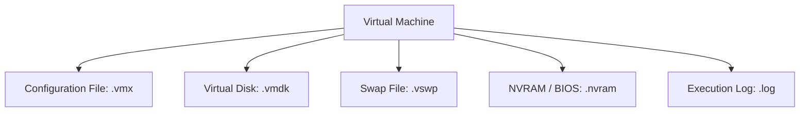

## 3.2. Anatomy and Technical Composition of a Virtual Machine

A virtual machine is not a physical computer; it is a collection of files managed by a hypervisor.

### 3.2.1. File Composition
*   **Configuration File (`.vmx` in VMware):** A text file containing VM configuration parameters, including the number of vCPUs, memory limits, network MAC addresses, and pointers to the virtual disks.
*   **Virtual Disk File (`.vmdk` in VMware, `.vhdx` in Hyper-V):** Contains the raw data of the virtual machine's hard drive, including the guest partition table, operating system files, and user data.
*   **Swap File (`.vswp`):** Created by the hypervisor when the VM boots. It acts as virtual memory, allowing the host to run VMs even if guest RAM allocation exceeds the host's physical memory.
*   **NVRAM File (`.nvram`):** Stores the virtual machine's BIOS or UEFI settings, including the boot device order and system clock configuration.
*   **Log File (`.log`):** Records virtual machine execution events, helping administrators troubleshoot hypervisor errors and boot failures.

### 3.2.2. Common Pitfall: Thin vs. Thick Provisioning
*   **Thick Provisioning:** Allocates the virtual disk's entire capacity on physical storage immediately upon creation. This guarantees disk space but can lead to unused, wasted storage.
*   **Thin Provisioning:** Allocates storage dynamically as the virtual machine writes new data. This optimizes storage utilization but requires administrators to monitor actual storage consumption to prevent host-wide out-of-space errors.