## 3.3. Virtual Machine Migration Techniques

Migration is the process of moving a running virtual machine from one physical host to another.

```mermaid
graph TD
    subgraph Pre-Copy Migration
    P1[Start VM on Host A] --> P2[Enable Dirty Page Tracking]
    P2 --> P3[Iteratively copy memory pages to Host B]
    P3 -->|Few pages remaining| P4[Suspend VM on Host A]
    P4 --> P5[Copy remaining state & registers]
    P5 --> P6[Resume execution on Host B]
    end
    subgraph Post-Copy Migration
    H1[Suspend VM on Host A] --> H2[Transfer execution state & registers]
    H2 --> H3[Resume VM on Host B immediately]
    H3 -->|Background Task| H4[Pull memory pages as needed via Network]
    end
```

### 3.3.1. Cold Migration
Cold migration requires stopping the virtual machine before moving its files.
1.  **Suspend or Power Off:** The virtual machine is shut down or suspended, saving its current RAM state to a swap file.
2.  **File Transfer:** The hypervisor copies the configuration (`.vmx`) and virtual disk (`.vmdk`) files across the network to the destination host.
3.  **Registration and Boot:** The destination host registers the VM and boots it back up.
*   **Key Advantage:** Straightforward to perform, with no risk of runtime data loss.
*   **Key Disadvantage:** Causes service downtime while files are copied, which can take hours for large virtual disks.

---

### 3.3.2. Hot / Live Migration (e.g., VMware vMotion)
Live migration moves a running virtual machine between physical hosts with zero downtime. This process requires shared storage (like a SAN or NAS) so both hosts can access the VM's virtual disk simultaneously.

#### A. Pre-Copy Migration
1.  **Initialization:** The target host reserves memory and virtual CPU resources for the incoming VM.
2.  **First Copy Round:** The source host copies all active RAM memory pages to the target host while the VM continues running.
3.  **Dirty Page Tracking:** While memory pages are being copied, the virtual machine continues writing new data. The source host tracks modified memory pages in a specialized bitmap (dirty page tracking).
4.  **Iterative Copy Rounds:** The source host copies only the modified memory pages (dirty pages) to the target host. This process repeats over several iterations.
5.  **Downtime Window (Freeze):** Once the remaining dirty pages can be copied in under 100 milliseconds, the hypervisor temporarily pauses execution on the source host.
6.  **Final State Transfer:** The final dirty pages and CPU register states are copied to the target host.
7.  **Resume Execution:** The target host assumes execution and registers the VM on the network, resuming operations without interrupting active user connections.

*   **Key Advantage:** Moves running workloads with zero noticeable service interruption.
*   **Key Disadvantage:** High network bandwidth consumption and performance degradation during dirty page copying.

---

#### B. Post-Copy Migration
1.  **Downtime Window:** The hypervisor immediately pauses the virtual machine on the source host.
2.  **Execution Transfer:** The hypervisor copies the CPU registers, basic execution state, and minimal metadata to the target host.
3.  **Immediate Resumption:** The target host resumes the virtual machine immediately, before copying its memory.
4.  **Demand Paging:** When the running VM tries to access a memory page that is still on the source host, it triggers a page fault. The target host retrieves the requested page over the network.
5.  **Background Page Pulling:** A background process copies the remaining memory pages from the source to the target host.

*   **Key Advantage:** Quick initial switchover, especially for VMs with high write rates that would generate excessive dirty pages in pre-copy mode.
*   **Key Disadvantage:** Network performance issues due to page faults, and high risk of VM corruption if the network connection drops during migration.