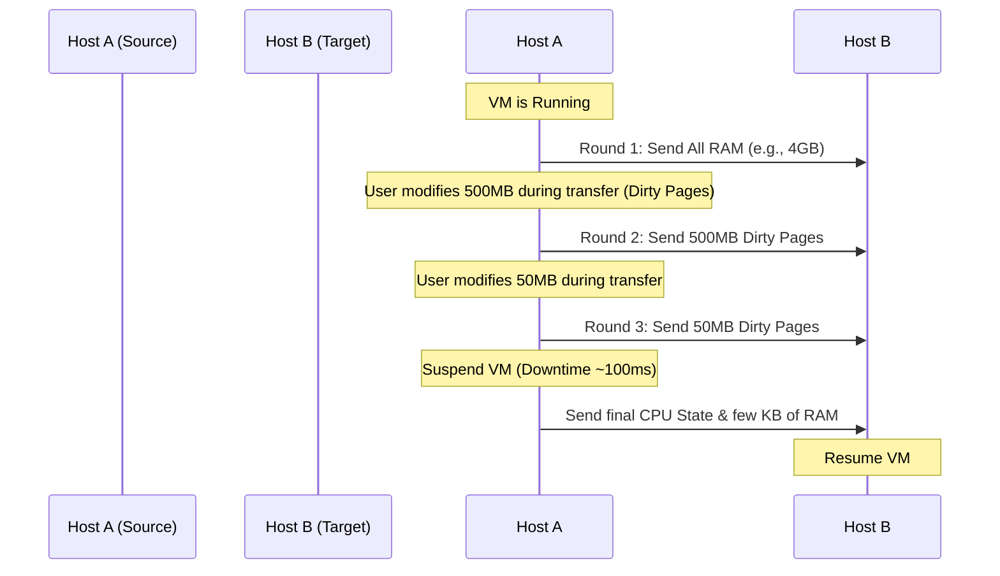

# VM Migration Mechanisms and State Transfer

VM Migration is the process of moving a running Virtual Machine from Physical Host A to Physical Host B without turning it off. This capability -- known as **Live Migration** (or vMotion in VMware terminology) -- is one of the most powerful features of modern hypervisors. It enables zero-downtime maintenance, load balancing across a cluster of servers, and disaster avoidance when a physical host begins showing signs of hardware failure. Without live migration, any hardware maintenance window would require shutting down applications, notifying users, and scheduling disruptive outages.

The fundamental challenge of live migration is that a VM is a stateful entity: it has CPU registers that are constantly changing, RAM that is being read from and written to in real time, network connections that are active, and disk I/O that is ongoing. Moving all of this state from one physical machine to another while the VM continues to operate is a non-trivial engineering problem. Two primary strategies have been developed to solve it: Pre-Copy and Post-Copy migration.

---

## 1. Pre-Copy Migration (The Standard Approach)

Pre-copy migration is the most widely used strategy in production data centers. It prioritizes minimizing downtime at the cost of a longer total migration time and higher network bandwidth consumption. The key insight is that it copies the VM's memory to the destination host while the VM is still running, then iteratively re-copies only the pages that changed during the previous copy.

### Step-by-Step Process

1. **Preparation:** Host A (the source) and Host B (the target) establish a reliable network connection. Both hosts verify that they have compatible CPU feature sets and that sufficient resources (CPU, RAM, storage) are available on Host B to accommodate the incoming VM.

2. **Iterative Memory Copy:** Host A begins copying the VM's entire RAM contents to Host B. Because the VM is still running and serving requests during this process, the user or applications running inside the VM may alter some data in RAM while it is being copied. These altered memory pages are no longer consistent with what was sent to Host B.

3. **Dirty Page Tracking:** The hypervisor marks any memory page that changes during the copy process as "dirty." Modern hypervisors use the CPU's memory management unit (MMU) to track which pages have been written to since the last copy operation. This hardware-assisted tracking is extremely efficient and adds negligible overhead to the running VM.

4. **Successive Iterations:** Host A sends only the dirty pages to Host B. It repeats this process through multiple iterative rounds. Each round is faster than the previous one because fewer pages get dirtied between iterations. The number of dirty pages typically converges exponentially, as the time window for each successive round shrinks.

5. **Stop and Switch (Downtime):** Once the set of dirty pages is small enough (a threshold determined by the hypervisor's configuration), the hypervisor pauses the VM on Host A. This pause is usually for a fraction of a second (often under 100 milliseconds). During this brief pause, the hypervisor sends the final few dirty pages and the CPU state (registers, instruction pointer, flags) to Host B. The VM is then resumed on Host B, and the migration is complete.

### Characteristics

- **Downtime:** Very low (typically milliseconds), making it nearly imperceptible to users.
- **Total Migration Time:** Longer, because multiple iterative copy rounds are required.
- **Network Bandwidth:** Higher consumption due to re-transmitting dirty pages multiple times.
- **Risk:** If the network is slow or the VM is modifying memory extremely rapidly (a "dirtying" workload), the iterative process may never converge, and the migration could stall or fail.

---

## 2. Post-Copy Migration (Lazy Copy)

Post-copy migration takes the opposite approach. It prioritizes reducing total migration time and network bandwidth at the cost of a slightly riskier execution model. Instead of copying all memory before switching, it switches first and fetches memory on demand.

### Step-by-Step Process

1. **Immediate Switch:** The hypervisor pauses the VM on Host A immediately. It transfers only the CPU state and registers to Host B, and starts the VM on Host B right away. At this point, the VM on Host B has a functional CPU but essentially no RAM contents.

2. **Network Page Faults:** The VM on Host B is running, but it has no RAM. Whenever the VM tries to read or write a memory address that has not yet been transferred, a "page fault" occurs. The hypervisor intercepts this fault, quickly requests that specific memory page from Host A over the network, receives it, injects it into the VM's address space, and then allows the VM to continue executing. This process is called demand paging, and it is similar in concept to how operating systems handle virtual memory swap files.

3. **Background Transfer:** Meanwhile, all remaining memory pages are copied from Host A to Host B in the background. As more pages are transferred, the frequency of network page faults decreases, and the VM's performance gradually improves until all pages reside on Host B and the migration is complete.

### Characteristics

- **Downtime:** Slightly higher initial pause than pre-copy, but the total migration time is shorter.
- **Network Bandwidth:** Lower overall consumption because each page is transferred exactly once.
- **Risk:** If the network connection between Host A and Host B drops during a post-copy migration, the VM crashes entirely because its memory is split across two servers. The VM cannot function without continuous access to the remaining pages on Host A. This makes post-copy migration unsuitable for unreliable or high-latency network links.

---

## 3. Comparison of Migration Strategies

| Attribute | Pre-Copy Migration | Post-Copy Migration |
|-----------|-------------------|---------------------|
| **Downtime** | Very low (milliseconds) | Slightly higher initial pause |
| **Total Migration Time** | Longer (multiple iterations) | Shorter (single pass) |
| **Network Bandwidth** | Higher (re-transmit dirty pages) | Lower (each page sent once) |
| **VM Performance During Migration** | Normal (VM runs on source throughout) | Degraded (page faults cause latency) |
| **Network Failure Risk** | Low (VM remains on source if network fails) | High (VM crashes if network drops) |
| **Best For** | Production environments, stability-critical workloads | Environments with reliable, low-latency networks where fast migration is prioritized |

---

## 4. Mermaid Diagram: Pre-Copy Iterative Process

This diagram illustrates the iterative nature of pre-copy migration. Notice how each successive round transfers a smaller and smaller volume of dirty pages, converging toward a point where the remaining dirty pages are small enough to transfer during a brief stop-and-switch window. The total data transferred exceeds the VM's RAM size (because dirty pages are re-sent), but the downtime is minimized to the final switch moment.
