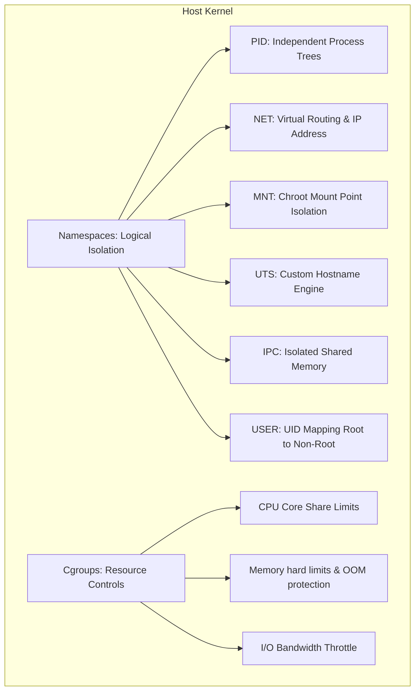

## 4.1. Linux Kernel Isolation Mechanics - Namespaces and Cgroups

Unlike virtual machines, containers share the host operating system's kernel. They achieve isolation using native features of the Linux kernel: **Namespaces** and **Cgroups**.

### 4.1.1. Namespaces
Namespaces isolate system resources, providing each container with its own logical view of the host system.
*   **PID Namespace:** Isoles the process tree. Inside a container, the main application runs as Process ID 1 (PID 1), while on the host system, it appears as a standard process with a different PID.
*   **NET Namespace:** Isolates network interfaces, IP routing tables, and port assignments. This allows multiple containers to run services on the same port (e.g., port 80) without conflicts on the host.
*   **MNT Namespace:** Isolates filesystem mount points. The container cannot access host directories unless they are explicitly mounted as volumes.
*   **UTS Namespace:** Allows each container to maintain its own hostname and domain name, separate from the host system.
*   **IPC Namespace:** Isolates Inter-Process Communication resources, such as system memory segments and message queues, preventing containers from intercepting other process data.
*   **User Namespace:** Maps user IDs within the container. This allows a user to run as root (UID 0) inside the container while mapping to a standard, non-privileged user on the host, reducing the risk of host compromise.

---

### 4.1.2. Cgroups (Control Groups)
Control Groups limit, prioritize, and monitor physical resource usage for a collection of processes.
*   **CPU Limits:** Defines the CPU cycles or specific cores a container can use, preventing a single container from exhausting host processing capacity.
*   **Memory Limits:** Configures memory consumption limits. If a container exceeds its memory limit, the Linux Out-Of-Memory (OOM) killer halts the container processes to protect the host system.
*   **I/O Limits:** Restricts disk read/write speeds, preventing a single container from dominating disk performance.