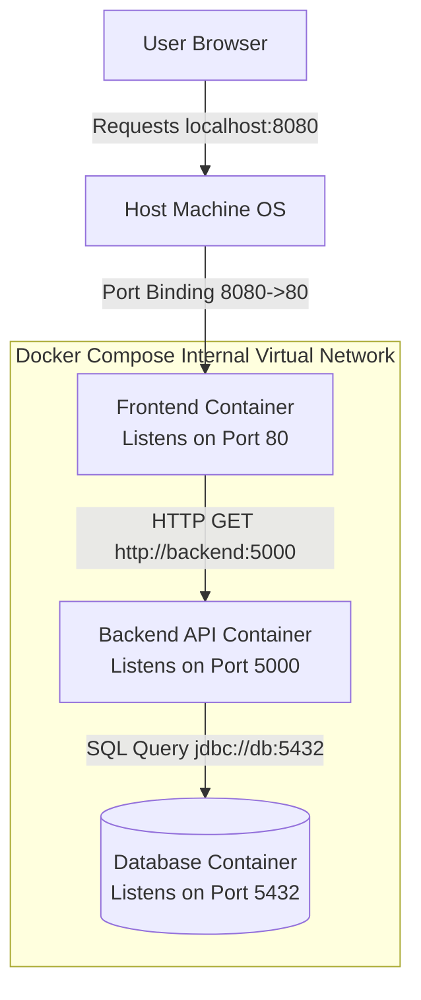

# Microservices, Docker Compose, and Container Networking

## Background Context: The Monolith vs. Microservices

- **Monolithic Application:** A massive block of code where the user interface, business logic, and database connections are all tangled together. If a bug in the UI crashes the app, the database connection dies too. Scaling requires duplicating the entire heavy application. The monolith starts as a simple, easy-to-develop application, but as it grows, the cognitive load on developers increases dramatically. Every change potentially affects every other part of the system, leading to long regression testing cycles and deployment anxiety. A single slow database query in one feature can degrade the performance of the entire application because all features share the same process and memory space.

- **Microservices Application:** The app is shattered into tiny, self-contained pieces (e.g., a Login Service, a Cart Service, a Payment Service). Each service is placed in its own independent Docker Container. Each microservice owns its data, its business logic, and its deployment lifecycle. The login service can be rewritten in Go while the payment service remains in Python, and both can be deployed independently without affecting each other. When the cart service experiences a traffic spike during a flash sale, only that service needs to scale out -- the other services continue running at their normal capacity.

---

## Why Do We Need Docker Compose?

If an app requires 5 microservices to work, typing `docker run ...` five times with complex networking commands is frustrating and prone to human error.

**Docker Compose** solves this. It is an orchestration tool for *single-machine* deployments. You define the 5 services in a single `docker-compose.yml` file. By typing `docker-compose up`, Compose automatically:

1. Creates a private, isolated virtual network on your machine.
2. Starts all 5 containers.
3. Attaches them to this private network.

A typical `docker-compose.yml` looks like this:

```yaml
version: "3.8"
services:
  frontend:
    build: ./frontend
    ports:
      - "8080:80"
    depends_on:
      - backend

  backend:
    build: ./backend
    ports:
      - "5000:5000"
    environment:
      - DB_HOST=db
    depends_on:
      - db

  db:
    image: postgres:15
    volumes:
      - pgdata:/var/lib/postgresql/data
    environment:
      - POSTGRES_PASSWORD=secret

volumes:
  pgdata:
```

This declarative approach captures the entire multi-service architecture in a single file that can be version-controlled, shared across the team, and used to reproduce identical environments on any machine. The `depends_on` directive ensures that services start in the correct order (database before backend, backend before frontend), and the `volumes` directive ensures that database data persists across container restarts.

---

## Container Communication and Port Binding

By default, a container is locked in its own Network Namespace. It has no access to the outside world, and the outside world cannot reach it.

### Internal Communication (Container to Container)

Because Docker Compose puts them on the same virtual network, they can talk to each other using their service names as hostnames. The "Frontend" container does not need to know the IP of the "Database" container; it simply sends a request to `http://database:3306`. Docker's internal DNS handles the translation.

This DNS-based service discovery is one of the most powerful features of Docker Compose. In a traditional deployment, you would need to configure each service with the IP addresses of its dependencies, and if an IP changes (due to a container restart), you would need to update the configuration. With Docker Compose, the service name is the stable identifier. Docker's embedded DNS server resolves the service name to the current container IP address, automatically handling the mapping as containers are created and destroyed.

### External Communication (Port Binding/Mapping)

If a user on a laptop wants to view the web app running inside the container, we must punch a hole through the namespace. We "bind" a port on the host machine to a port on the container.

- Example: `8080:80`.
- This means: "Take Port 8080 on my physical laptop, and map it directly to Port 80 inside the container." The user opens a browser to `localhost:8080`, and the traffic is tunneled to the Nginx server inside the container.

Port binding follows the format `HOST_PORT:CONTAINER_PORT`. The host port is what the outside world connects to; the container port is what the application inside the container listens on. These do not need to match. In the example `8080:80`, the host uses port 8080 (avoiding conflicts with any service already using port 80 on the host) while the containerized Nginx listens on its default port 80.

---

## Docker Network Types

Docker supports several network drivers, each suited to different use cases:

### Bridge Network (Default)

The default network type for standalone containers. Docker creates a virtual bridge (`docker0`) on the host, and each container gets a virtual ethernet interface connected to this bridge. Containers on the same bridge network can communicate with each other using IP addresses. Docker Compose creates a custom bridge network for each project, which adds DNS-based service discovery (standard bridge networks do not have DNS).

### Host Network

Removes network isolation entirely. The container shares the host's network namespace directly, using the host's IP address and ports. This provides the best network performance (no NAT overhead) but sacrifices isolation. It is commonly used for network-intensive applications like load balancers or monitoring agents that need direct access to the host's network interfaces.

### Overlay Network

Used in Docker Swarm and Kubernetes for multi-host networking. An overlay network spans multiple Docker daemons and enables containers on different physical hosts to communicate as if they were on the same local network. It uses VXLAN encapsulation to tunnel traffic between hosts, abstracting away the underlying physical network topology.

### Macvlan Network

Assigns a MAC address to each container, making it appear as a physical device on the network. The container gets its own IP address from the physical network's DHCP server. This is useful for legacy applications that require direct network presence, but it has limitations: the host cannot communicate with its own macvlan containers due to kernel security restrictions.

---

## Service Discovery in Container Networks

In a microservices deployment, services need to find each other dynamically. Hardcoding IP addresses is fragile because containers are ephemeral -- their IP addresses change every time they are recreated.

Docker Compose solves this with its built-in DNS server. When you define services in `docker-compose.yml`, Docker automatically creates DNS entries for each service name. The frontend container can reach the backend simply by using `http://backend:5000`, regardless of what IP address Docker assigned to the backend container. This DNS resolution works across container restarts and recreations.

In production environments with Kubernetes, service discovery works similarly but at a much larger scale. Kubernetes Services provide stable DNS names (`backend-service.default.svc.cluster.local`) that route to healthy pods, even as pods are created, destroyed, and moved between nodes.

---

## Mermaid Diagram: Docker Compose Networking


