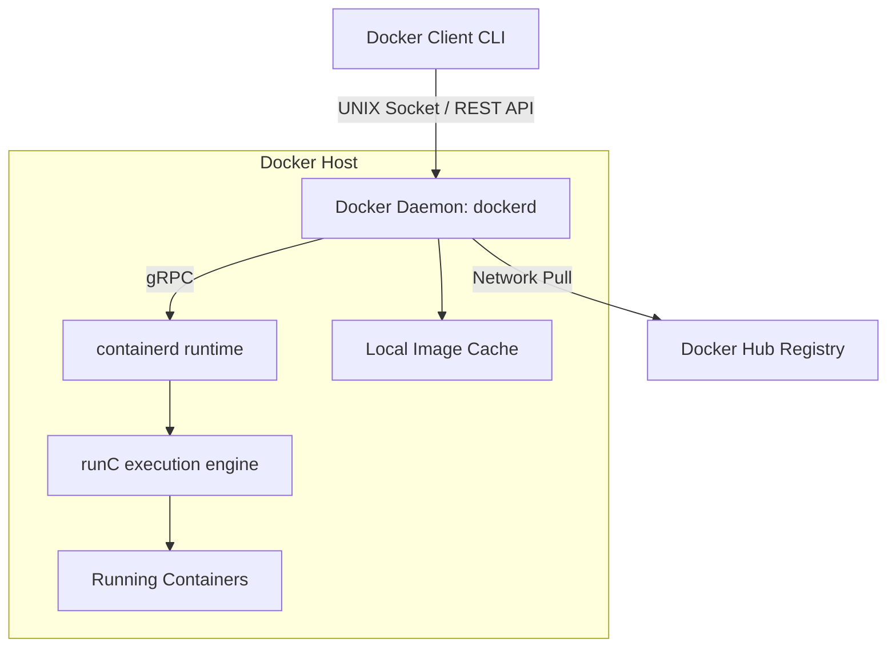

## 4.2. Docker Engine Architecture and Core Components

Docker is an open-source platform that simplifies container deployment by automating process isolation and image creation.

### 4.2.1. Docker Client
The primary interface (CLI) used to manage Docker resources. Commands like `docker build` or `docker run` are converted into REST API calls and sent to the Docker Daemon.

### 4.2.2. Docker Daemon (`dockerd`)
A background service running on the host system. It listens for Docker API requests and manages Docker objects, including networks, volumes, images, and containers.

### 4.2.3. Docker Registry (e.g., Docker Hub)
A registry that stores public and private container images. The Docker Daemon downloads (pulls) images from the registry to create local containers, and uploads (pushes) custom images to share them.