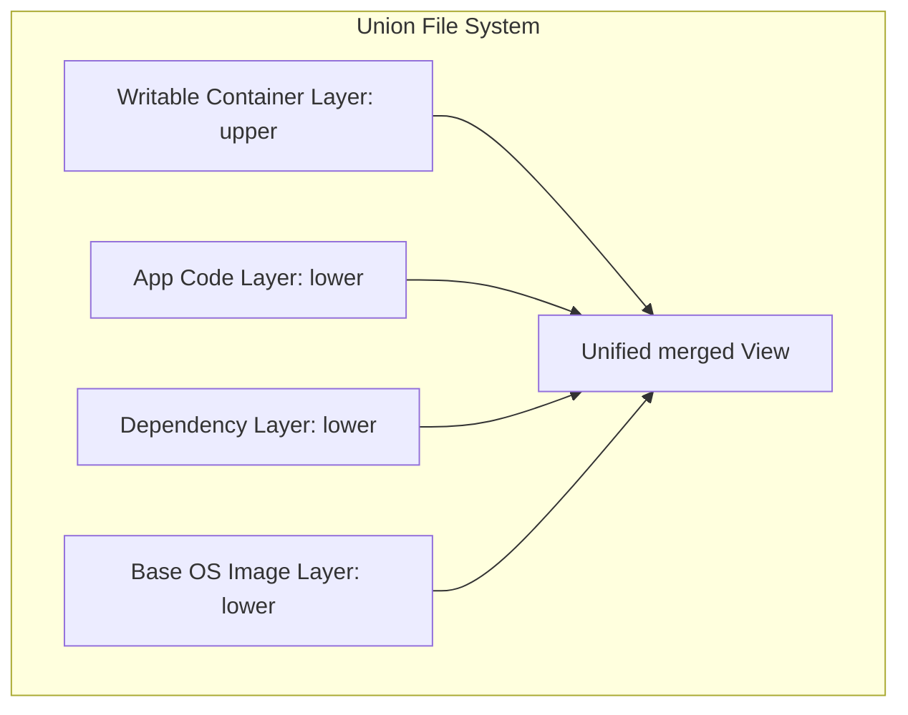

## 4.3. Dockerfile Mechanics and Multi-Container Applications

### 4.3.1. UnionFS and OverlayFS Storage
Docker images are built from layers. Docker uses **OverlayFS** to share base image layers among multiple running containers, minimizing disk space consumption.



*   **`lower` Layer (Read-Only):** The base layers of a Docker image. These layers are immutable and can be shared among multiple containers.
*   **`upper` Layer (Writable):** Created when a container starts. Any changes, file creations, or deletions made during runtime are saved only in this layer.
*   **`merged` Layer (Unified View):** A logical layer that combines the read-only image layers and the writable container layer into a single, cohesive filesystem.
*   **Copy-on-Write (CoW) Mechanism:** When a container modifies an existing file in the read-only image, OverlayFS copies the file to the writable `upper` layer before applying the modifications. The original file in the image remains unchanged.

---

### 4.3.2. Detailed Analysis of a Dockerfile

```dockerfile
# Step 1: Base Image
FROM python:3.10-slim

# Step 2: Set working directory
WORKDIR /app

# Step 3: Copy requirements first to leverage caching
COPY requirements.txt .

# Step 4: Install dependencies
RUN pip install --no-cache-dir -r requirements.txt

# Step 5: Copy application code
COPY . .

# Step 6: Expose runtime port
EXPOSE 5000

# Step 7: Define startup command
CMD ["python", "app.py"]
```

#### Why Copy `requirements.txt` Before Application Code?
Docker builds images layer by layer, caching each step. If a step's files have not changed, Docker reuses the cached layer. 
*   **Optimized Approach:** Copying `requirements.txt` and running `pip install` before copying the rest of the application code ensures that Docker only runs the slow dependency installation step when the dependencies change. If you only modify application code, Docker uses the cached dependency layer, significantly reducing build times.

---

### 4.3.3. Multi-Container Applications with Docker Compose
For applications that require multiple services (such as a backend application and a database), managing individual containers manually can be complex. **Docker Compose** lets you define and manage multi-container applications using a single YAML configuration file.

```yaml
version: '3.9'

services:
  db:
    image: postgres:15
    container_name: postgres-db
    environment:
      POSTGRES_USER: devuser
      POSTGRES_PASSWORD: devpassword
      POSTGRES_DB: appdb
    volumes:
      - pgdata:/var/lib/postgresql/data
    networks:
      - app-network

  web:
    image: my-web-app:latest
    container_name: web-backend
    ports:
      - "8080:5000"
    environment:
      - DATABASE_URL=postgres://devuser:devpassword@db:5432/appdb
    depends_on:
      - db
    networks:
      - app-network

volumes:
  pgdata:

networks:
  app-network:
    driver: bridge
```

#### Key Architecture Concepts in Docker Compose:
*   **Internal Service Discovery (DNS lookup):** Docker Compose automatically configures a shared network. Containers can resolve other services on the network using their service name as the hostname (e.g., the web service connects to the database using `db:5432`).
*   **Volume Persistence:** Mounting a volume (e.g., `pgdata`) ensures that database data is saved on the host and survives container restarts or deletions.
*   **Port Mapping:** Maps a port on the host to a port inside the container (`host_port:container_port`). In the example above, traffic to port 8080 on the host is routed to port 5000 inside the `web` container.