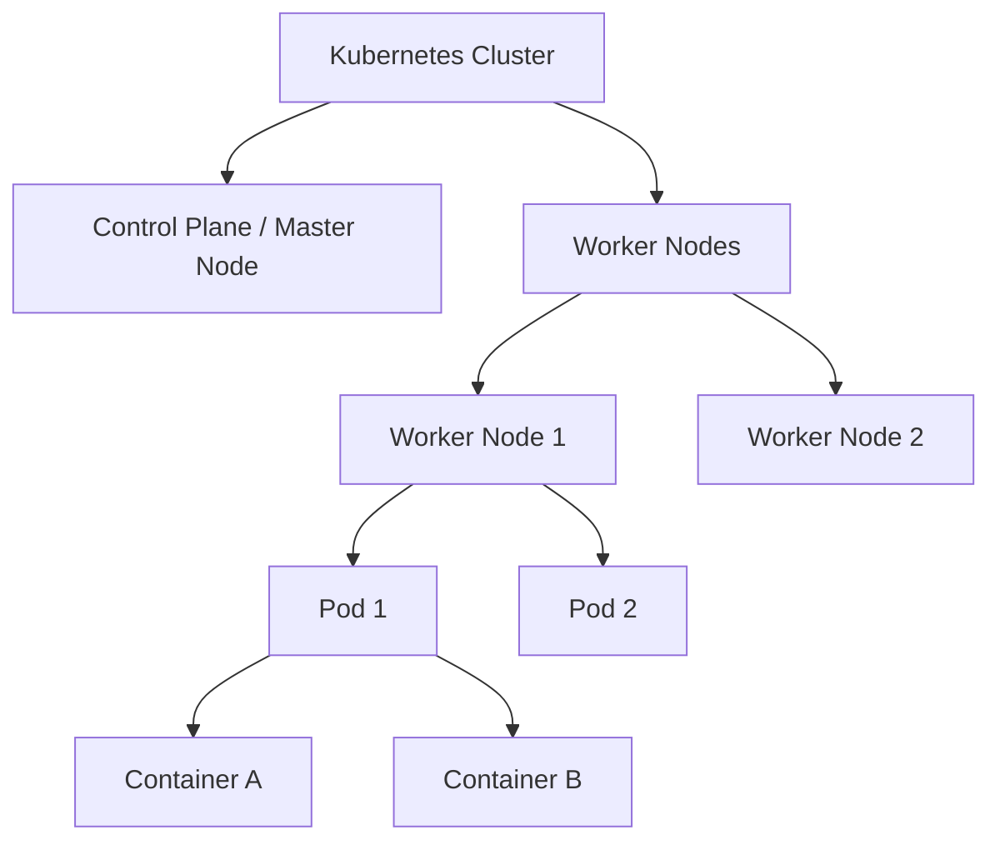

## 4.4. Container Orchestration and Kubernetes Foundations

While Docker is excellent for running containers on a single host, production environments require managing workloads across a cluster of multiple servers. **Container Orchestration** automates the deployment, scaling, networking, and self-healing of containers across a cluster.

### 4.4.1. Core Production Challenges
1.  **High Availability:** Automatically rescheduling containers if a physical host server fails.
2.  **Auto-Scaling:** Scaling the number of containers up or down based on system traffic and resource usage.
3.  **Load Balancing:** Evenly distributing incoming network traffic across multiple container instances.
4.  **Rolling Updates:** Updating application versions with zero downtime.

---

### 4.4.2. Kubernetes (K8s) Key Terminology

*   **Cluster:** A set of physical or virtual machines, divided into a Control Plane (Master Node) and multiple Worker Nodes, that run containerized applications.
*   **Node:** A single machine in the cluster. It can be a physical server in a datacenter or a virtual machine running on a cloud provider.
*   **Pod:** The smallest deployable unit in Kubernetes. A Pod hosts one or more containers that share the same network namespace, IP address, port range, and storage volumes.
*   **Deployment:** A controller that defines the desired state for your application, such as the number of replicas. It automatically manages updates and handles container recovery if a node fails.
*   **Service:** An abstraction layer that provides a stable, permanent IP address and DNS name for a dynamic set of Pods, enabling reliable network communication.
*   **ConfigMap:** Stores non-confidential configuration data in key-value pairs, allowing you to decouple application configuration from the container image.