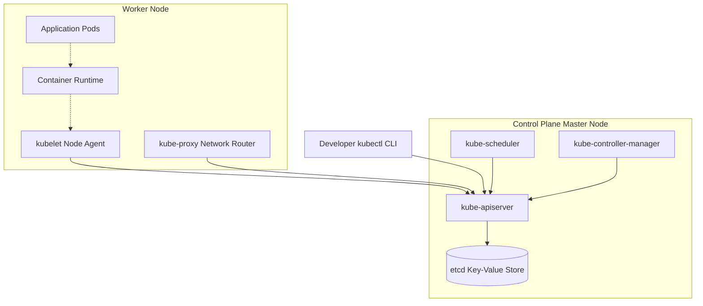

## 4.5. Kubernetes Control Plane and Worker Node Architecture

Kubernetes uses a master-worker architecture to manage containerized applications.

### 4.5.1. Control Plane (Master Node) Components
The Control Plane makes global decisions about the cluster (such as scheduling workloads) and detects and responds to cluster events.
*   **API Server (`kube-apiserver`):** The central front-end of the Control Plane. It exposes the Kubernetes API and handles all communication between cluster components.
*   **Scheduler (`kube-scheduler`):** Monitors newly created Pods that have no assigned node, and selects the best worker node for them to run on.
*   **Controller Manager (`kube-controller-manager`):** Runs background control loops that regulate the state of the cluster, maintaining the desired number of running Pods and nodes.
*   **Data Store (`etcd`):** A highly available, distributed key-value store that serves as Kubernetes' backing store for all cluster data and state.

### 4.5.2. Worker Node Components
Worker nodes run the containerized applications scheduled by the Control Plane.
*   **Kubelet:** An agent that runs on each node in the cluster. It ensures that the containers described in PodSpecs are running and healthy.
*   **Kube-Proxy (`kube-proxy`):** A network proxy that runs on each node, maintaining network rules to handle communication to and from your Pods.
*   **Container Runtime:** The software responsible for running the containers, such as Docker, containerd, or CRI-O.