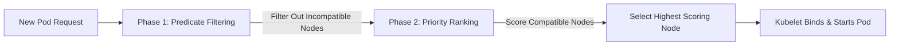
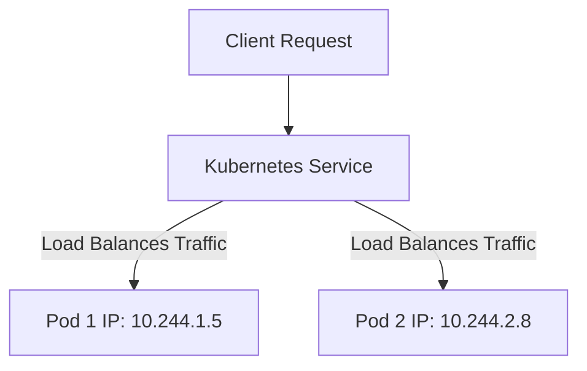

## 4.6. Pod Scheduling, Resource Management, and Services

### 4.6.1. The Scheduling Workflow
When a new Pod is submitted to the API Server, the `kube-scheduler` selects the best worker node for it using a two-phase process:



#### Phase 1: Predicate Filtering
The scheduler filters out nodes that cannot run the Pod. It evaluates conditions called **predicates**:
*   **`PodFitsResources`:** Checks if the node has enough free CPU and memory to satisfy the Pod's resource requests.
*   **`PodFitsHostPorts`:** Ensures the network ports requested by the Pod are not already in use on the node.
*   **`NoVolumeZoneConflict`:** Verifies that the requested storage volumes are accessible to the node.
*   **`MatchNodeSelector`:** Checks if the node labels match the selectors defined in the PodSpec.

#### Phase 2: Priority Ranking
The scheduler scores the remaining compatible nodes to find the best host for the Pod, using several **priority functions**:
*   **`BalancedResourceAllocation`:** Scores nodes based on resource balance, aiming to keep CPU and memory usage optimized across the cluster.
*   **`LeastRequestedPriority`:** Favors nodes with lower requested resource loads to distribute Pods evenly.
*   **`CalculateSpreadPriority`:** Prefers nodes that do not already run Pods from the same service, improving application resilience.

---

### 4.6.2. Pod Resource Configuration
Kubernetes lets you manage compute resources using **Requests** and **Limits**:

```yaml
apiVersion: v1
kind: Pod
metadata:
  name: web-app-pod
spec:
  containers:
  - name: web-app
    image: nginx:latest
    resources:
      requests:
        memory: "64Mi"
        cpu: "250m"
      limits:
        memory: "128Mi"
        cpu: "500m"
```

*   **Requests (Guaranteed Minimum):** The minimum resources the container requires to run. The scheduler uses this value to determine which node can host the Pod.
*   **Limits (Maximum Allowed):** The maximum resources the container can consume. If a container exceeds its memory limit, it is terminated (OOMKilled). If it exceeds its CPU limit, the system throttles its CPU usage, limiting its performance.

---

### 4.6.3. Kubernetes Services and Network Access Models
Because Pods are ephemeral and their IP addresses change when they are recreated, Kubernetes uses **Services** to provide stable networking.



*   **ClusterIP (Default):** Exposes the Service on a cluster-internal IP. This service is only reachable from within the cluster and is ideal for internal communication (e.g., connecting a backend to a database).
*   **NodePort:** Exposes the Service on each Node's IP at a static port (typically between 30000 and 32767). External clients can access the service from outside the cluster by connecting to any node's IP on that port.
*   **LoadBalancer:** Exposes the Service externally using a cloud provider's load balancer (such as AWS ALB or Azure Load Balancer). This automatically routes external internet traffic directly to your Pods.