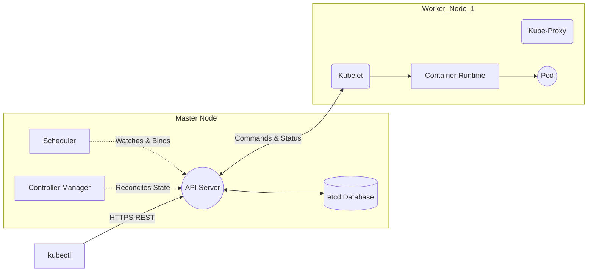

# Kubernetes Architecture and Pod Scheduling Workflow

## Deep Dive: Control Plane vs. Worker Nodes

Docker handles single-machine containers. Kubernetes (K8s) handles clusters of thousands of machines.

Kubernetes follows a declarative model: you tell it what you want (the desired state), and it continuously works to make reality match that desire. You do not tell Kubernetes to "start a container on Node 3." You tell it "I want 5 Nginx pods running," and it figures out where to place them, monitors their health, and replaces them if they fail. This declarative approach is what makes Kubernetes so powerful for managing large-scale deployments -- it eliminates the need for operators to manually track and manage the state of hundreds or thousands of containers across dozens of machines.

---

### The Control Plane (Master Node)

The brain of the cluster. It makes global decisions.

1. **kube-apiserver:** The front door. All commands (`kubectl apply`) go here. It is the *only* component allowed to talk to the database (etcd). The API server authenticates requests, validates them against the schema, performs admission control checks, and persists the object to etcd. It also serves as the gateway for all inter-component communication -- the scheduler, controller manager, and kubelets all communicate through the API server, never directly with each other.

2. **etcd:** The highly-available Key-Value database. It stores the "Desired State" (e.g., "I want 5 Nginx pods running"). etcd uses the Raft consensus algorithm to ensure consistency across multiple nodes, providing strong guarantees about data durability. If the API server crashes, it can restart and recover its state from etcd. If etcd loses data, the cluster loses its brain -- which is why etcd clusters in production always run with at least 3 nodes and regular backups.

3. **kube-scheduler:** The dispatcher. It watches for newly created Pods that have no assigned node, checks hardware constraints, and assigns them to a Worker Node. The scheduler performs two phases: filtering (which nodes meet the pod's requirements, such as sufficient CPU/RAM, specific node selectors, or taint tolerations) and scoring (among eligible nodes, which is the best fit based on affinity rules, spread policies, and resource utilization).

4. **kube-controller-manager:** The active watcher. It runs infinite loops checking `Current State vs Desired State`. If you ask for 5 pods, and 1 dies, the controller notices the current state is 4, and asks the API server to create a new one. There are many specialized controllers: the ReplicaSet controller maintains pod counts, the Deployment controller manages rolling updates, the Node controller monitors node health, and the Service controller manages load balancer integration.

---

### The Worker Nodes

The muscle of the cluster. They run the actual payloads.

1. **Kubelet:** The captain of the worker node. It listens to the API server. If told to run a Pod, it talks to Docker/Containerd to spin up the containers. It reports node health back to the Master. The kubelet is also responsible for mounting volumes, pulling secrets, and executing liveness/readiness probes. If a liveness probe fails, the kubelet kills the container and the controller manager creates a replacement.

2. **kube-proxy:** The networking genius. It maintains network rules on the host to allow communication between Pods and out to the internet. It implements the Kubernetes Service abstraction by programming iptables or IPVS rules on the node, ensuring that traffic sent to a Service IP is load-balanced across the healthy pods backing that service.

3. **Container Runtime:** The engine (like Docker, Containerd, CRI-O) that actually executes the container. Kubernetes uses the Container Runtime Interface (CRI) to communicate with the runtime, which means it is not tied to Docker specifically. In fact, modern Kubernetes deployments often use Containerd directly, bypassing the Docker daemon entirely for reduced overhead.

---

### The Pod

The absolute smallest deployable unit in K8s.

- **Why not deploy containers directly?** Sometimes containers need to be tightly coupled. Example: A web server container and a log-collector container. By putting them in the same Pod, they share the same IP address, same port space, and same storage volumes. They communicate via `localhost`.

A Pod is not just a group of containers -- it is a shared execution context. All containers in a Pod are scheduled on the same node, share the same network namespace (same IP, same ports), and can share storage volumes. This co-location enables the sidecar pattern, where a helper container augments the primary container. Common sidecars include log collectors (Fluentd, Filebeat), proxy containers (Envoy, Linkerd), and initialization containers that prepare the environment before the main container starts.

---

### The Exact Workflow of Pod Scheduling

What actually happens when you type `kubectl apply -f nginx.yaml`?

1. `kubectl` sends an HTTP POST request to the **API Server**.

2. **API Server** validates the user's credentials and syntax, then writes the pod record into **etcd** as "Pending".

3. **Scheduler** notices a Pending pod. It filters nodes (Predicates: e.g., "Does the node have enough RAM?") and ranks them (Priorities: e.g., "Which node has the most free CPU?"). It binds the pod to `Node-2` and tells the API Server.

4. **API Server** updates **etcd** with the binding.

5. **Kubelet** on `Node-2` sees it has a new assignment. It tells the **Container Runtime** to pull the image and start the container.

6. **Kubelet** reports back to the API Server that the Pod is "Running".

This entire process typically completes in under 5 seconds. The scheduler's filtering and scoring algorithms are what make Kubernetes intelligent about placement. It considers resource requests and limits, node selectors, affinity and anti-affinity rules, taints and tolerations, and pod topology spread constraints. For example, if you specify `podAntiAffinity` rules, the scheduler will try to spread your pods across different nodes or availability zones, ensuring that a single node failure does not take down all instances of your application.

---

## Mermaid Diagram: Kubernetes Architecture

