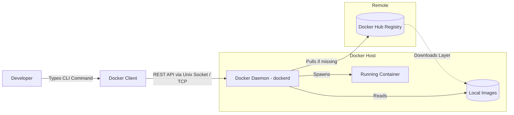

# Docker Engine Architecture and Container Lifecycle

## Background Context: The Engine Components

Docker is not just a single application; it is a client-server architecture split into distinct, interacting parts. Understanding this separation is critical because it explains how Docker commands are processed, where the actual work happens, and why Docker can manage containers on remote machines just as easily as on the local host.

---

### 1. Docker Daemon (`dockerd`)

This is the server. It runs continuously in the background on the host OS.

It does the actual heavy lifting: interacting with the Linux Kernel to set up the Namespaces, creating the Cgroups, compiling the UnionFS layers, and managing the networks. The daemon listens for API requests on a Unix socket (`/var/run/docker.sock`) or a TCP port. Every Docker command you execute ultimately translates into a REST API call to the daemon.

The daemon is responsible for all container lifecycle management: creating, starting, stopping, and deleting containers. It also manages image operations (pulling, building, tagging, and pushing images), network management (creating bridge networks, overlay networks, and managing DNS), and volume management (creating and mounting persistent storage). When you type `docker run`, the daemon pulls the image (if not cached), creates a new container filesystem using OverlayFS, sets up the namespace isolation, configures the cgroup resource limits, creates the virtual network interface, and finally starts the container's main process.

---

### 2. Docker Client (`docker` CLI)

This is the user interface. When you type `docker run ubuntu`, you are talking to the Client. The Client does no processing; it packages your command into a REST API call and sends it to the Daemon.

*Crucial Detail:* Because it uses REST API, the Docker Client can be on your laptop in Paris, and the Docker Daemon can be on a server in Tokyo. You configure this by setting the `DOCKER_HOST` environment variable to point to the remote daemon's address. This remote execution capability is fundamental to how Docker Machine and Docker Swarm work, and it is also the basis for many CI/CD pipelines where the build environment runs Docker but the actual containers execute on remote hosts.

The client is intentionally thin. It does not know how to create namespaces, manage cgroups, or build filesystem layers. Its sole responsibility is to format your commands into API requests, send them to the daemon, and display the results. This separation of concerns means that alternative clients (like Docker Compose, Portainer, or SDK libraries in Python, Go, and Java) can all interact with the same daemon through the same API.

---

### 3. Docker Registry (Docker Hub)

The centralized library of images. If the Daemon is told to run an image it does not have locally, it automatically connects to the Registry to pull it down.

Docker Hub is the default public registry, hosting millions of images ranging from official base images (ubuntu, alpine, node) to community-contributed application images. Organizations can also run private registries (using Docker Registry, AWS ECR, Google Artifact Registry, or Azure Container Registry) to store proprietary images that should not be publicly accessible. The registry stores images as collections of layers, and when you pull an image, Docker only downloads the layers it does not already have locally. If you already have the `ubuntu:20.04` base layer from a previous pull, and a new image is built on top of it, Docker will reuse the cached layer and only download the new layers.

---

## The Container Lifecycle (State Machine)

Containers are ephemeral (short-lived). They transition through specific states, each with precise semantics:

1. **Created:** The Daemon has allocated the namespaces and Cgroups, but the application process inside has not started yet. The container's filesystem (OverlayFS layers) has been assembled, the network namespace has been configured, and the cgroup resource limits have been set. The container is ready to run, but is waiting for an explicit `docker start` command. You can inspect a created container's configuration, but no process is executing.

2. **Running:** The main process (PID 1 inside the container) is actively executing. As long as this process is alive, the container is in the Running state. The container has its own PID namespace, so the main application process appears as PID 1 inside the container, even though it is mapped to a different PID on the host. The container will remain in the Running state until the main process exits, is killed, or the container is explicitly stopped. If the main process spawns child processes, they run within the same container namespace and cgroup.

3. **Paused:** The Daemon uses Cgroups (specifically the freezer cgroup subsystem) to suspend the CPU execution of all processes in the container. The RAM remains intact, but the application uses 0% CPU. This is different from stopping a container: when paused, the process table, open files, network connections, and memory state are all preserved. The processes are simply frozen in place and will resume exactly where they left off when you unpause the container. This is useful for temporarily freeing CPU resources without losing the container's in-memory state.

4. **Stopped (Exited):** The main process has terminated (either successfully finished its task, crashed, or was commanded to stop). The container is dead, but its Read/Write layer (data) is still saved on the disk. It can be restarted. When a container stops, its network namespace is torn down (the virtual ethernet pair is removed), its cgroup is destroyed, and its processes are killed. However, the filesystem changes made in the upper (read-write) layer are preserved, so when you restart the container, it picks up where it left off. This is why you can `docker start` a stopped container but not a deleted one.

5. **Deleted:** The container and its temporary Read/Write layer are permanently wiped from the host disk. This operation is irreversible: all data in the container's upper layer is gone. Only data stored in Docker Volumes (which bypass UnionFS) survives container deletion. This is why volumes are essential for any data that must persist beyond the container's lifecycle -- databases, uploaded files, configuration state.

---

## Mermaid Diagram: Docker Architecture and API

