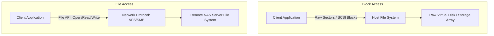

## 5.1. Storage Foundations and Access Models

Computing systems rely on persistent storage to save data after power-offs or system restarts. In networked environments, data is accessed using two primary models: **Block Access** and **File Access**.

### 5.1.1. Block Access Model
The storage device is presented to the host as raw sectors of fixed size (typically 512 bytes or 4096 bytes). The host operating system manages the physical disk, creates partitions, and formats it with a local file system (such as NTFS or ext4).
*   **Key Characteristics:**
    *   Exposes raw, unformatted blocks of storage.
    *   Communication uses low-level storage commands (SCSI, NVMe).
    *   Offers high performance, making it ideal for databases and virtual disk drives.

### 5.1.2. File Access Model
The storage device is managed by a remote server that runs its own file system. The client machine accesses files and directories over the network using standardized file-sharing protocols.
*   **Key Characteristics:**
    *   Exposes files and directories rather than raw blocks.
    *   Communication uses high-level network protocols (NFS, SMB).
    *   Simplifies file sharing across multiple client machines, but introduces network protocol overhead.