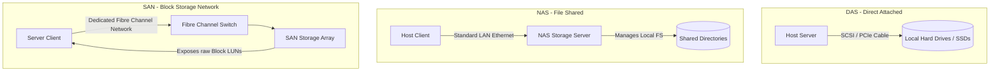

## 5.2. Networked Storage Architectures - DAS NAS SAN

Networked storage architectures are categorized based on how they connect to host servers: **Direct Attached Storage (DAS)**, **Network Attached Storage (NAS)**, and **Storage Area Network (SAN)**.

### 5.2.1. Direct Attached Storage (DAS)
DAS refers to storage devices directly connected to a single host server without an intervening network.
*   **Key Characteristics:**
    *   Connects directly to the server via internal bus (SATA, NVMe) or external cables (SAS, USB, Thunderbolt).
    *   Provides low latency and high data throughput.
    *   Storage capacity cannot be shared with other physical servers.
*   **Advantages:**
    *   **Simple Deployment:** Easy to configure with no network setup required.
    *   **Low Cost:** Economical solution for single-server setups.
    *   **Excellent Performance:** Direct connection minimizes latency.
*   **Disadvantages:**
    *   **No Multi-Host Sharing:** Cannot be accessed by other physical servers.
    *   **Poor Utilization:** Storage space is locked to a single host, which can lead to wasted capacity.
    *   **Limited Scalability:** Adding capacity is limited by the server's physical drive slots.

---

### 5.2.2. Network Attached Storage (NAS)
A dedicated storage appliance connected to a standard TCP/IP network, providing file-level storage services to heterogeneous clients.
*   **Key Characteristics:**
    *   Operates as an independent network node with its own operating system and IP address.
    *   Exposes shared folders over standard networks.
    *   Uses file-sharing protocols like **NFS** (Linux/Unix), **SMB/CIFS** (Windows), and **AFP** (macOS).
*   **Advantages:**
    *   **Easy Sharing:** Simplifies file sharing across different operating systems.
    *   **Centralized Management:** Consolidates file storage, backups, and security policies in a single appliance.
    *   **Flexible Capacity:** Administrators can expand storage by adding drives without interrupting network services.
*   **Disadvantages:**
    *   **Network Performance Overhead:** High network traffic can introduce latency and degrade file-transfer speeds.
    *   **Single Point of Failure:** If the NAS appliance or network fails, all clients lose access to their files.
    *   **Unsuitable for Databases:** File-level access introduces too much latency and lacks the raw block write performance required by relational databases.

---

### 5.2.3. Storage Area Network (SAN)
A specialized, high-speed network that provides servers with block-level access to consolidated, physical storage.
*   **Key Characteristics:**
    *   Connects servers to storage arrays using a dedicated network, separate from the local area network (LAN).
    *   Exposes storage resources as raw block devices called **LUNs (Logical Unit Numbers)**.
    *   Uses high-speed storage network technologies like **Fibre Channel (FC)** or **iSCSI** (which runs SCSI commands over standard Ethernet networks).
*   **Advantages:**
    *   **Exceptional Performance:** Dedicated networks and block-level access deliver high throughput and low latency.
    *   **Consolidated Storage Pools:** Allows multiple servers to share storage pools, improving overall capacity utilization.
    *   **High Reliability:** Built with redundant switches, controllers, and cabling to prevent downtime.
*   **Disadvantages:**
    *   **High Complexity:** Requires specialized hardware, Fibre Channel switches, and trained storage administrators.
    *   **High Initial Cost:** Significant investment required for dedicated storage networks and arrays.
    *   **No Native File Sharing:** Exposes raw block devices; sharing files among multiple servers requires a clustered filesystem (like GFS2 or VMFS).