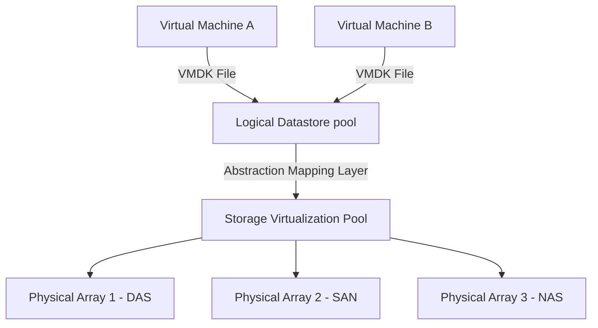
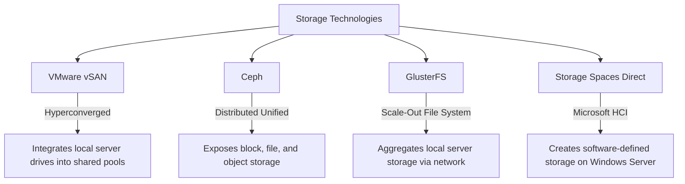

## 5.3. Storage Virtualization, Datastores, and High Availability

### 5.3.1. Datastores and Volumes
Storage virtualization pools physical storage devices from multiple networked arrays into a single, logical management view.

*   **Logical Datastore:** An abstraction layer that hides the complexity of the underlying physical storage (whether DAS, NAS, or SAN). It presents a unified storage pool to the hypervisor, where virtual machines are stored as files (such as `.vmdk` files).
*   **Logical Volume:** A virtual partition created within a storage pool. It can span multiple physical drives and be resized dynamically without disrupting running applications.

---

### 5.3.2. Advanced Storage Features
Modern virtualized storage platforms include advanced features to improve data availability, performance, and reliability:
*   **Multipathing:** Uses multiple physical network paths between a server and its storage array. This prevents a single cable or switch failure from interrupting storage access and helps balance network loads.
*   **Mirroring (RAID 1):** Writes data to two or more physical drives simultaneously in real-time, protecting the system from disk failures.
*   **Active Replication:** Copies data between storage systems in real-time (synchronous replication) or at scheduled intervals (asynchronous replication) to support disaster recovery.
*   **Storage High Availability (HA):** Automatically mounts virtual disks on an alternate host if a physical server fails, ensuring application continuity.

---

### 5.3.3. Key Storage Technologies

*   **VMware vSAN:** A software-defined, hyperconverged storage solution. It pools local SSDs and HDDs from servers in a cluster to create a shared, high-performance datastore managed directly by the hypervisor.
*   **Ceph:** A free, open-source software-defined storage platform. It runs on commodity hardware to provide unified **Block**, **File**, and **Object** storage from a single, distributed cluster.
*   **GlusterFS:** A scalable, network-attached filesystem. It aggregates storage from multiple servers over network links into a single, unified parallel network filesystem.
*   **Microsoft Storage Spaces Direct (S2D):** A software-defined storage solution built into Windows Server. It pools local drives on a cluster of servers to create highly available storage at a fraction of the cost of traditional SANs.