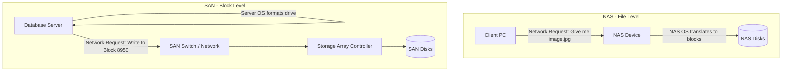

# Block vs File Access and SAN vs NAS Architectures

## Background Context: How Operating Systems Read Data

To understand NAS and SAN, you must understand how an OS views storage.

1. **Block-Level Access (Disks):** The lowest level of storage. A physical HDD/SSD is divided into sectors/blocks (e.g., 512 bytes). The OS sends commands like: "Write this raw data to Sector 1400." The disk does not know what a "file" or a "folder" or a "JPEG" is. It only knows blocks.

2. **File-Level Access (OS Abstraction):** The OS formats the raw blocks with a **File System** (NTFS, ext4, APFS). The File System maintains a map (metadata) linking logical files (like `document.txt`) to the physical blocks where the data is stored. Applications request *files*; the OS translates that into *block requests* for the hardware.

This distinction between block-level and file-level access is the fundamental architectural divide in storage systems. Block-level access gives the operating system direct control over how data is laid out on the physical media, enabling optimizations like defragmentation, journaling, and block-level snapshots. File-level access abstracts these details away, allowing applications to work with human-readable names and hierarchical directories. The choice between these access modes determines everything else about a storage architecture: the protocols used, the network requirements, and the performance characteristics.

---

## Deep Dive: Storage Architectures

### 1. DAS (Direct Attached Storage)

- *Architecture:* A disk physically plugged into the motherboard via SATA, NVMe, or USB.
- *Trait:* It provides **Block-level** access. The local OS formats it.
- *Limitation:* It is captive to that specific machine. If the motherboard burns out, the data is offline until the disk is physically moved.

DAS is the simplest and oldest storage model. Every laptop with an internal SSD uses DAS. In enterprise environments, DAS appears as internal drives in rack-mounted servers or as external JBOD (Just a Bunch of Disks) enclosures connected via SAS or USB. The key characteristic of DAS is exclusivity: the storage is directly and exclusively attached to a single host. This exclusivity provides excellent performance (no network overhead, no protocol translation) but creates the storage silo problem: if Server A has unused disk space, Server B cannot access it.

### 2. NAS (Network Attached Storage)

- *Architecture:* A dedicated standalone appliance with its own CPU, RAM, and its own OS.
- *Trait:* It provides **File-level** access over the network.
- *How it works:* The NAS OS formats its internal disks. When a client PC connects, it uses file-sharing protocols (SMB for Windows, NFS for Linux). The client PC says "Give me `report.pdf`." The NAS OS calculates the blocks, reads them, packages them into a file, and sends the file over the standard Ethernet (IP) network.
- *Limitation:* Since the NAS handles the file system, if the network is busy, performance degrades. It is great for sharing Word documents, but terrible for running a high-performance Database.

NAS devices are essentially specialized file servers optimized for storage. Popular NAS vendors include Synology, QNAP, and NetApp. The NAS appliance manages the file system, handles user authentication and access control, and presents shares to client machines. This centralized management is both a strength and a weakness: it simplifies administration but creates a bottleneck because every file operation must traverse the network and be processed by the NAS operating system. For home users and small offices sharing documents and media files, this bottleneck is negligible. For database servers requiring thousands of I/O operations per second with microsecond latency, NAS is entirely inadequate.

### 3. SAN (Storage Area Network)

- *Architecture:* A highly specialized, dedicated, extremely fast network connecting servers directly to massive arrays of disks.
- *Trait:* It provides **Block-level** access over the network.
- *How it works:* The SAN does *not* manage files. It takes a massive pool of physical disks, carves out a virtual chunk (a LUN - Logical Unit Number), and presents it to a remote server. The remote server's OS sees the SAN storage exactly as if it were a physical disk plugged into its own motherboard. The remote server formats it with NTFS/ext4.
- *Protocols:* Fibre Channel (uses laser/fiber optics, massively expensive), iSCSI (block commands wrapped in IP packets).
- *Advantage:* Absolute top-tier performance required for Datacenters, Databases, and running Virtual Machines.

SAN is the enterprise-grade storage solution. By providing block-level access over the network, SAN gives the server the same low-level control over storage as DAS, but with the added benefits of centralization, pooling, and advanced features like snapshots, replication, and thin provisioning. The server formats the LUN with its own file system and manages it exactly like a local disk. This means the server can use file system features like journaling, encryption, and compression that would not be possible with a NAS. The cost of a SAN is substantial: Fibre Channel switches, host bus adapters (HBAs), and storage arrays from vendors like EMC, NetApp, and HPE can run into hundreds of thousands of dollars.

---

## The Modern Evolution: HCI and Cloud Storage

Historically, SANs required a completely separate physical network (Fibre Channel switches, dedicated cables) which was hugely expensive.
Today, **HCI (Hyper-Converged Infrastructure)** merges everything. Technologies like VMware vSAN pool the local DAS disks of multiple servers, send the data over high-speed standard Ethernet (100Gbps+), and create a virtual SAN entirely through software.

HCI represents a fundamental shift in how storage is architected. Instead of buying separate compute servers and separate storage arrays, HCI combines them into a single building block. Each HCI node is a standard server with local SSDs and HDDs. A software layer (like VMware vSAN, Nutanix, or Ceph) pools the local storage of all nodes and presents it as a shared storage resource. Need more capacity? Add another node. The software automatically rebalances data across the cluster. This linear scalability and simplified procurement have made HCI the dominant architecture for private cloud deployments.

---

## Mermaid Diagram: SAN vs NAS Mechanics

