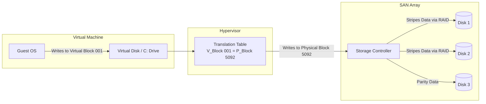

# RAID, Datastores, and Advanced Storage Features

## Background Context: Why RAID?

The slides introduce DAS (Direct Attached Storage) and mention RAID. Why is RAID vital in both DAS and SAN architectures?

Because physical hard drives contain moving parts (or degrading flash cells in SSDs), they *will* fail. In enterprise IT, data loss is unacceptable. **RAID (Redundant Array of Independent Disks)** links multiple physical drives together to provide speed and data survival (redundancy).

RAID was first defined in a 1987 paper by David Patterson, Garth Gibson, and Randy Katz at the University of California, Berkeley. The original paper coined the term "Redundant Array of Inexpensive Disks" -- the idea was that several cheap drives could outperform and outlast a single expensive drive. Over time, "Inexpensive" was replaced with "Independent" to reflect the focus on reliability rather than cost savings. Today, RAID is ubiquitous in enterprise storage, appearing in everything from small NAS appliances to massive SAN arrays.

---

## RAID Levels

### RAID 0 (Striping)

- **How it works:** Data is split (striped) across two or more disks with no redundancy. Each disk stores a portion of every file.
- **Performance:** Excellent read and write speed, as multiple disks operate in parallel.
- **Redundancy:** None. If any single disk fails, **all data across the entire array is lost**.
- **Capacity:** 100% of total disk space is usable (e.g., 4 x 1TB = 4TB usable).
- **Use case:** Temporary data, caching, or scenarios where speed matters more than data survival (video editing scratch disks, game loading).

RAID 0 is the only RAID level that provides no fault tolerance. It is a performance optimization pure and simple. Because data is interleaved across all disks, a read request for a large file can be serviced by all disks simultaneously, multiplying throughput by the number of disks. However, the failure probability increases with each additional disk: a 4-disk RAID 0 array is four times more likely to experience a disk failure than a single disk.

### RAID 1 (Mirroring)

- **How it works:** Data is written identically to two separate disks. Every write operation is duplicated.
- **Performance:** Read speed can be improved (either disk can serve a read request). Write speed is slightly slower than a single disk because data must be written twice.
- **Redundancy:** Excellent. If Disk A fails, Disk B takes over instantly with no downtime.
- **Capacity:** 50% of total disk space is usable (e.g., 2 x 1TB = 1TB usable).
- **Use case:** Critical boot drives, operating system volumes, and small databases where data integrity is paramount.

RAID 1 provides the simplest form of redundancy. The mirrored disk is an exact, real-time copy of the primary disk. When the primary disk fails, the system switches to the mirror with no interruption. Rebuilding a failed disk is straightforward: simply copy the entire contents of the surviving disk to the replacement. The main cost is the 50% capacity overhead -- you buy two disks but can only use one disk's worth of space.

### RAID 5 (Striping with Distributed Parity)

- **How it works:** Uses 3 or more disks. Data is striped across all disks, and parity information (a mathematical calculation that enables data reconstruction) is distributed across all disks.
- **Performance:** Good read speed (striping across multiple disks). Write speed is slower than RAID 0 because parity must be calculated and written for each write operation.
- **Redundancy:** Can survive the failure of exactly one disk. The parity information on the remaining disks is used to reconstruct the missing data on the fly.
- **Capacity:** (N-1) disks worth of usable space (e.g., 4 x 1TB = 3TB usable).
- **Use case:** File servers, application servers, and general-purpose storage where a balance of performance, redundancy, and capacity is needed.

RAID 5 uses XOR (exclusive OR) operations to calculate parity. If you have three data blocks (A, B, C), the parity P is calculated as P = A XOR B XOR C. If block B is lost due to disk failure, it can be reconstructed as B = A XOR C XOR P. This mathematical property allows the storage controller to rebuild any single missing block using the remaining data and parity blocks. The vulnerability of RAID 5 is during a rebuild: with modern high-capacity disks, a rebuild can take many hours, during which the array operates in a degraded state with no redundancy. An unrecoverable read error during the rebuild process can result in permanent data loss.

### RAID 6 (Double Parity)

- **How it works:** Similar to RAID 5 but with two independent parity blocks distributed across all disks.
- **Performance:** Slightly slower writes than RAID 5 due to dual parity calculation. Read performance is similar.
- **Redundancy:** Can survive the simultaneous failure of **two** disks.
- **Capacity:** (N-2) disks worth of usable space (e.g., 6 x 1TB = 4TB usable).
- **Use case:** Large arrays with high-capacity disks where rebuild times are long and the risk of a second failure during rebuild is significant.

RAID 6 is the recommended minimum for arrays using large SATA disks (4TB and above) because the probability of encountering an unrecoverable read error during a RAID 5 rebuild becomes unacceptably high. The dual parity of RAID 6 provides a safety net: even if one disk fails and an unrecoverable error is encountered on another disk during the rebuild, the data can still be reconstructed.

### RAID 10 (Mirrored Stripes)

- **How it works:** Combines RAID 1 and RAID 0. Disks are paired into mirrors (RAID 1), and then the mirrored pairs are striped together (RAID 0).
- **Performance:** Excellent. Reads benefit from both striping and mirroring. Writes are faster than RAID 5/6 because no parity calculation is needed.
- **Redundancy:** Can survive multiple disk failures as long as no two failed disks are in the same mirror pair.
- **Capacity:** 50% of total disk space is usable (e.g., 4 x 1TB = 2TB usable).
- **Use case:** High-performance databases, virtualization hosts, and any workload requiring both speed and redundancy.

RAID 10 is the preferred choice for write-intensive workloads because it avoids the parity calculation overhead of RAID 5 and RAID 6. The trade-off is capacity: like RAID 1, you lose 50% of your raw storage to mirroring. For organizations that prioritize performance and reliability over storage efficiency, RAID 10 is often the best choice.

---

## RAID Level Comparison

| RAID Level | Minimum Disks | Redundancy       | Capacity Usable      | Read Performance | Write Performance | Common Use Case           |
| ---------- | ------------- | ---------------- | -------------------- | ---------------- | ----------------- | ------------------------- |
| RAID 0     | 2             | None             | 100%                 | Excellent        | Excellent         | Cache, scratch, temp data |
| RAID 1     | 2             | 1 disk           | 50%                  | Good             | Fair              | OS boot, critical data    |
| RAID 5     | 3             | 1 disk           | (N-1)/N              | Good             | Fair              | General file servers      |
| RAID 6     | 4             | 2 disks          | (N-2)/N              | Good             | Fair-Poor         | Large arrays, archival    |
| RAID 10    | 4             | 1 per mirror pair| 50%                  | Excellent        | Good              | Databases, virtualization |

---

## The Magic of the Datastore (Virtual Disk Mapping)

In a virtualized environment (like a SAN connected to VMware), a VM believes it has a pristine, local 500GB "C: Drive".

In reality, the Hypervisor creates an abstraction called a **Datastore**.

1. The VM asks to write data to Block 5 of its virtual disk (`.vmdk`).
2. The Hypervisor catches this request. It looks at a **Translation Table** (Virtual Disk Map).
3. The Hypervisor translates "VM 1, Virtual Block 5" to "Physical Datastore Block 984,332".
4. The SAN takes over and writes that data across 5 different physical disks using RAID.

The VM is completely blind to this massive complexity.

The datastore is the bridge between the virtual and physical storage worlds. It is a logical container that maps virtual disk files (`.vmdk` in VMware, `.qcow2` in KVM) to physical storage blocks. A single datastore can hold hundreds of VMs, and a single VM's virtual disk might have its blocks scattered across dozens of physical disks in a RAID array. The hypervisor's translation table maintains this mapping, and it is updated in real-time as blocks are allocated, moved (during Storage vMotion), or freed (when a VM is deleted).

---

## Thin vs Thick Provisioning

When creating a virtual disk, you must choose how storage is allocated:

- **Thin Provisioning:** The virtual disk starts small and grows as data is written. If you create a 500GB thin-provisioned disk but only write 50GB of data, it consumes only 50GB of physical storage. This is efficient for storage utilization but dangerous if not monitored: you can over-provision (allocate more virtual storage than physical storage exists), and if all VMs write to their full capacity simultaneously, the datastore runs out of space and VMs crash.

- **Thick Provisioning (Lazy Zeroed):** The full 500GB of physical storage is allocated upfront, but the blocks are not zeroed out immediately. Old data on the physical disk is erased on first write. This provides slightly faster creation than eager zeroed but still guarantees that the space exists.

- **Thick Provisioning (Eager Zeroed):** The full 500GB is allocated and every block is explicitly zeroed out during creation. This takes the longest to create but provides the best performance (no first-write penalty) and is required for certain features like Fault Tolerance in VMware.

---

## Snapshots

A snapshot captures the state of a VM at a specific point in time. It does not copy the entire disk; instead, it freezes the current state and creates a delta file. All subsequent writes go to the delta file, leaving the original disk unchanged. If you revert to the snapshot, the delta file is discarded and the VM returns to its state at the time of the snapshot.

Snapshots are not backups. They are dependent on the original disk file -- if the original disk is corrupted, the snapshot is useless. Running on a snapshot for extended periods degrades performance because every read must check the delta file first, and the delta file grows continuously. Best practice is to use snapshots for short-term operations (before applying a patch, before a configuration change) and delete them within 24-48 hours.

---

## Deduplication

Storage deduplication eliminates duplicate blocks of data, storing only one copy and creating pointers to it. If 100 VMs all use the same Windows Server 2019 base image, deduplication stores the common blocks once instead of 100 times, potentially saving terabytes of storage.

There are two types:

- **Inline deduplication:** Performed as data is being written. The storage system checks each incoming block against a hash index before writing it. If a match is found, the block is not written; a pointer is created instead. This saves storage but adds latency to write operations.
- **Post-process deduplication:** Data is written to disk normally, and a background process scans for duplicate blocks and consolidates them. This avoids write latency but requires additional temporary storage.

---

## Storage Tiering

Modern storage arrays support automatic tiering, which moves data between different types of storage media based on access frequency:

- **Hot tier:** NVMe or SSD -- for frequently accessed data requiring microsecond latency (databases, VM boot drives).
- **Warm tier:** SAS HDD or high-capacity SSD -- for moderately accessed data (file shares, email archives).
- **Cold tier:** High-capacity SATA HDD or tape -- for rarely accessed data (backups, compliance archives).

The storage controller monitors access patterns and automatically promotes hot data to faster tiers and demotes cold data to slower tiers. This provides the performance of SSD for active data at a cost closer to HDD for the overall storage pool.

---

## Advanced Storage Features Enabled by Virtualization

### Storage vMotion (Live Storage Migration)

Just like normal vMotion moves a VM's *RAM* from Host A to Host B, Storage vMotion moves a VM's *virtual disk files (`.vmdk`)* from SAN A to SAN B without turning the VM off. The hypervisor mirrors the disk writes to both SANs until the copy is complete, then seamlessly cuts the connection to the old SAN.

### Multipathing

If a server connects to a SAN using a single Fibre Channel cable, and a mouse chews through that cable, the entire server crashes. Multipathing involves installing multiple physical network cards (HBAs) and running multiple cables to different switches on the SAN. The hypervisor balances the traffic across all cables, and if one breaks, it routes traffic through the surviving cables without dropping a single byte of data.

Multipathing uses protocols like MPIO (Multipath I/O) on Windows and DM-Multipath on Linux. It provides two key benefits: fault tolerance (automatic path failover) and performance (load balancing across active paths). In active-active configurations, traffic is distributed across all available paths, increasing aggregate bandwidth. In active-passive configurations, one path carries traffic while others stand by for failover.

---

## Mermaid Diagram: Datastore Block Translation

