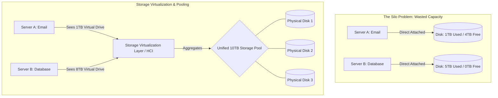

# Solving Storage Silos with Virtualization and Pooling

## Background Context: The Legacy "Storage Silo" Problem

Before storage virtualization, data centers operated in **Silos**.
Imagine a company buys three servers: Server A (Email), Server B (Database), and Server C (Files).

- Server A has 5TB of disks, but only uses 1TB.
- Server B has 5TB of disks, and is 100% full.
- Server C is from a different manufacturer (e.g., Dell vs. HP) and uses a completely different management interface.

**The Problem:** Server B is crashing because it is full, while Server A has 4TB of wasted, idle space. Because they are physically wired as Direct Attached Storage (DAS), Server B *cannot* borrow space from Server A. This results in massive wasted spending and administrative nightmares.

The storage silo problem is not merely an inconvenience -- it represents a fundamental failure of resource utilization. In a siloed environment, each server's storage is an island. The storage utilization across the data center is often 30-40% on average, meaning that for every 100TB of purchased storage, 60-70TB sits idle. Meanwhile, specific servers may be at 95% capacity, forcing emergency purchases of additional storage that will not arrive for weeks. This pattern of simultaneous scarcity and waste is the direct consequence of the DAS model, where storage is physically bound to a specific server.

The problem is compounded by vendor heterogeneity. Different server purchases over the years result in a patchwork of storage hardware from different manufacturers, each with its own management console, firmware update process, and feature set. The storage administrator must maintain expertise across all these platforms, and moving data between them requires manual export and import processes. This operational complexity increases costs, slows provisioning, and makes disaster recovery planning significantly more difficult.

---

## The Solution: Storage Virtualization

Storage virtualization does for hard drives what server virtualization (VMware) did for CPUs. It decouples the physical storage hardware from the servers that use it.

### How It Works

#### 1. Aggregation (Pooling)

A software layer (or specialized SAN appliance) connects to Server A, Server B, and Server C's disks. It strips away the brand names and physical boundaries, merging all the disks into one massive, unified "Storage Pool" (e.g., a single 15TB pool).

The aggregation layer abstracts the physical characteristics of each disk -- its manufacturer, interface type (SAS, SATA, NVMe), capacity, and health status. To the storage administrator, the pool appears as a single, homogeneous resource. The software handles the complexity of managing heterogeneous hardware behind the scenes, including mapping logical addresses to physical locations across different disk types and tracking which disks belong to which physical servers.

This pooling eliminates the utilization problem. If Server A only uses 1TB of its 5TB, the remaining 4TB joins the pool and becomes available for Server B. The overall utilization of the pooled storage can reach 80-90% because the software can dynamically allocate and reallocate capacity based on actual demand rather than per-server fixed allocations.

#### 2. Abstraction (Logical Volumes)

The storage administrator then carves out "Virtual Volumes" from this pool.

- The Database server needs 8TB? The software creates an 8TB virtual volume and presents it to the server.
- The physical data for that 8TB volume might be scattered across the disks of Server A, B, and C. The Database server has no idea; it just sees a local "D: Drive".

The abstraction layer provides several critical capabilities:

- **Thin provisioning:** Virtual volumes can be larger than the physical storage currently available. A 10TB virtual volume might only consume 2TB of physical space initially, growing as data is written. This eliminates the need to predict future storage requirements with precision.
- **Dynamic expansion:** Volumes can be expanded on the fly without downtime. If the database outgrows its 8TB allocation, the administrator can expand it to 12TB with a few clicks, and the server sees the additional space immediately.
- **Policy-based management:** Storage policies can define performance tiers, replication requirements, and snapshot schedules at the volume level. A database volume might be placed on SSD storage with hourly snapshots and synchronous replication, while an archive volume might be on HDD with daily snapshots and asynchronous replication.

---

## The Ultimate Evolution: Hyper-Converged Infrastructure (HCI)

In the past, achieving storage virtualization required buying incredibly expensive Storage Area Networks (SANs) and specialized Fibre Channel switches.

**HCI (Hyper-Converged Infrastructure)** represents the modern cloud era.

- Instead of buying separate compute servers and separate storage SANs, HCI uses standard, off-the-shelf 1U servers packed with standard SSDs.

- A software layer (like VMware vSAN or Ceph) clusters the local SSDs of all the servers over a standard high-speed Ethernet network.

- It creates a virtual SAN strictly through software.

- *Why it is revolutionary:* If you need more storage or compute, you do not need to buy a $100,000 SAN array. You just slide one more standard server into the rack, plug in the ethernet cable, and the software automatically absorbs its CPU and Storage into the cluster.

HCI collapses the traditional three-tier architecture (compute, network, storage) into a single building block. Each HCI node contains compute (CPU, RAM), storage (SSDs, HDDs), and networking (10Gbps or 25Gbps Ethernet). The software-defined storage layer pools the local storage of all nodes and presents it as shared storage to the VMs running on those same nodes. This eliminates the SAN entirely, along with its associated cost, complexity, and specialized skill requirements.

The scalability model of HCI is linear and predictable. Need more capacity? Add a node. Need more compute? Add a node. Each node contributes both compute and storage, so scaling one automatically scales the other. The software handles data rebalancing, fault tolerance, and performance optimization automatically. VMware vSAN, for example, uses a distributed RAID architecture where data is mirrored or striped across multiple nodes, providing the same redundancy as traditional RAID without requiring dedicated RAID controllers.

The economic impact of HCI is significant. Traditional SAN arrays from vendors like EMC, NetApp, or HPE can cost $100,000 to $500,000 for a mid-range configuration, plus annual maintenance fees of 15-20% of the purchase price. An HCI cluster of comparable capacity might cost $50,000 to $150,000 in standard servers, with software licensing that is typically more predictable and transparent. More importantly, the total cost of ownership is lower because HCI reduces the number of separate systems to manage, simplifies capacity planning, and eliminates the need for specialized SAN administration skills.

---

## Mermaid Diagram: Silos vs Virtualized Storage Pools

