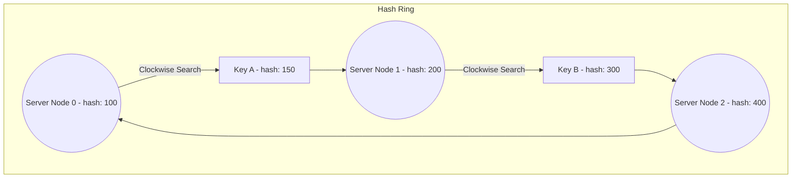
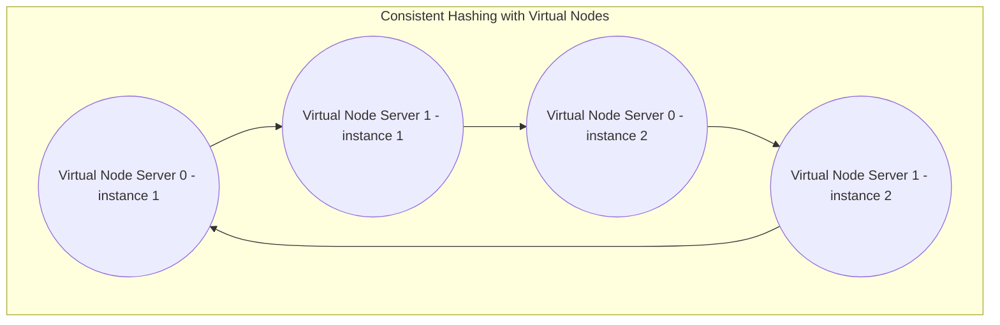

## 6.2. Distributed Hash Tables and Consistent Hashing

Distributed systems must be able to distribute billions of files across thousands of physical servers without relying on a central database, which can become a bottleneck or a single point of failure.

### 6.2.1. The Failure of Traditional Hashing: `hash(key) % N`
In a traditional distributed system, you might determine which server stores an object using a modulo hash:
$$\text{Server ID} = \text{hash}(\text{key}) \pmod N$$
Where $N$ is the number of servers in the cluster.
*   **The Critical Problem:** If a server fails or a new server is added, $N$ changes. Because $N$ has changed, almost all keys in the system will hash to a different Server ID. This forces the system to move nearly all stored files to new servers across the network, leading to high network congestion and potential system crashes.

---

### 6.2.2. Consistent Hashing Mechanics
Consistent Hashing solves this issue by mapping both the **data keys** and the **server nodes** to the same logical circle, called a **Hash Ring** (typically ranging from $0$ to $2^{32} - 1$).

1.  **Map Nodes to the Ring:** Each physical server's IP address or hostname is hashed, placing the server at a specific coordinate on the ring.
2.  **Map Objects to the Ring:** When a file is uploaded, its key is hashed using the same algorithm, placing the file at a coordinate on the ring.
3.  **Locate the Server:** To find which server stores a file, the system starts at the file's coordinate and moves **clockwise** along the ring until it encounters the first server node.
4.  **Handling Server Changes:**
    *   **Adding a Node:** When a new server is added, it only assumes responsibility for a small portion of the ring. Only the files located in that specific segment need to be moved to the new server; the rest of the cluster remains unaffected.
    *   **Removing a Node:** If a server fails, its files are reassigned to the next active server clockwise on the ring. The rest of the cluster remains untouched.

---

### 6.2.3. Optimization: Virtual Nodes
If you only have a few physical servers, consistent hashing can distribute workloads unevenly, leading to hot spots where some servers hold much more data than others.

To prevent uneven distribution, consistent hashing systems use **Virtual Nodes (Vnodes)**. 
*   Instead of placing a physical server on the ring once, the system hashes the server multiple times with different identifiers (e.g., `Server0#1`, `Server0#2`, `Server0#3`).
*   This creates multiple virtual nodes for each server, spreading them evenly across the ring. This ensures a balanced distribution of data across all physical servers in the cluster.