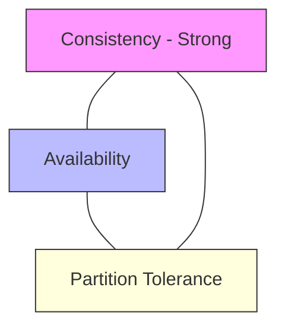

## 6.3. Data Consistency Models and CAP Theorem

In a distributed system, data is copied (replicated) across multiple servers to ensure availability and reliability. However, this raises the challenge of keeping the copies consistent when data is updated.

### 6.3.1. CAP Theorem
The CAP Theorem states that a distributed system can only guarantee two of these three properties simultaneously:

1.  **Consistency (C):** Every read request receives the most recent write or an error.
2.  **Availability (A):** Every non-failing node returns a successful response for every request, without guaranteeing it contains the most recent write.
3.  **Partition Tolerance (P):** The system continues to operate despite network communication failures or dropped packets between nodes.

In production environments, network partitions are inevitable. Therefore, a distributed system must choose between:
*   **CP (Consistency/Partition Tolerance):** Prioritizes data accuracy. If a network partition occurs, the system blocks write requests until the database is synchronized, sacrificing availability.
*   **AP (Availability/Partition Tolerance):** Prioritizes system uptime. The system continues to accept write requests on any available node. This ensures the application remains online, but some nodes will return stale data until they are synchronized, sacrificing strong consistency.

---

### 6.3.2. Data Consistency Models

#### A. Strong Consistency
Strong consistency guarantees that once a write operation completes, all subsequent read requests will return that updated value, regardless of which node is queried.
*   **Behind the Scenes:** The system uses synchronous replication protocols. A write request is only confirmed as successful after it has been written to and verified by a majority of nodes in the cluster.
*   **Advantages:** Simple for developers to manage; guarantees data accuracy.
*   **Disadvantages:** High write latency and low write availability if some nodes are unreachable.
*   **Primary Use Case:** Financial transactions, user account balances, metadata stores.

---

#### B. Eventual Consistency
The system accepts writes immediately on any node without waiting for synchronization. Over time, updates propagate through the network, and all database copies eventually converge to the same value.
*   **Behind the Scenes:** Uses asynchronous replication. Write requests are confirmed immediately on a single node, and updates are sent to other nodes in the background.
*   **Advantages:** Low write latency and high system availability.
*   **Disadvantages:** Temporary data inconsistencies; read requests can return stale data until synchronization is complete.
*   **Primary Use Case:** DNS records, social media feeds, CDN caches, shopping carts.

---

#### C. Causal Consistency
A consistency model that guarantees operations that are logically related (causally connected) are read in the correct order across all nodes. Unrelated operations can be processed in any order.
*   **Behind the Scenes:** The system uses dependency tracking tools, such as vector clocks, to track and enforce the causal relationships between operations.
*   **Advantages:** Better performance than strong consistency while maintaining logical order.
*   **Disadvantages:** Requires additional metadata tracking, which can add complexity.
*   **Primary Use Case:** Collaborative document editing, nested comment threads on social media.