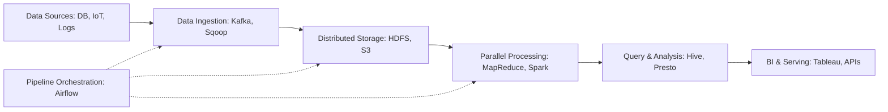

## 7.1. Big Data Foundations and Architecture

Big Data refers to datasets that are too large, fast, or complex for traditional databases to process.

### 7.1.1. The 5Vs of Big Data
*   **Volume:** The sheer scale of data generated, ranging from Terabytes to Exabytes.
*   **Velocity:** The speed at which new data is generated and needs to be processed (such as IoT sensor streams or real-time financial market feeds).
*   **Variety:** The diversity of data formats, including structured SQL databases, semi-structured JSON logs, and unstructured videos or documents.
*   **Veracity:** The trustworthiness and quality of the data, which often requires cleaning to remove noise or errors.
*   **Value:** The actionable insights and business intelligence derived from analyzing the data.

---

### 7.1.2. The Standard Big Data Pipeline

1.  **Data Sources:** Raw data generated by relational databases, applications, IoT devices, or network logs.
2.  **Ingestion:** Collects and transports raw data to storage using tools like **Apache Kafka** (for real-time streams) or **Apache Sqoop** (for relational database transfers).
3.  **Distributed Storage:** Stores massive datasets across clusters using distributed file systems like **HDFS** or cloud object storage like **Amazon S3**.
4.  **Processing:** Processes data in parallel across nodes using frameworks like **Hadoop MapReduce** (disk-based batch processing) or **Apache Spark** (in-memory processing).
5.  **Analysis:** Runs SQL-like queries on the processed data using tools like **Apache Hive** or **Presto**.
6.  **Serving:** Exposes insights to end-users via business intelligence dashboards (like Power BI or Tableau) or web APIs.
7.  **Orchestration:** Schedules and coordinates the entire pipeline using workflow managers like **Apache Airflow**.