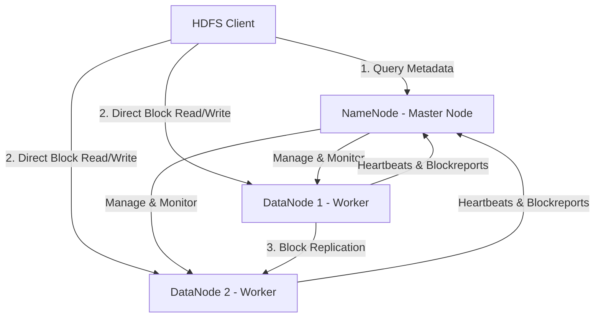
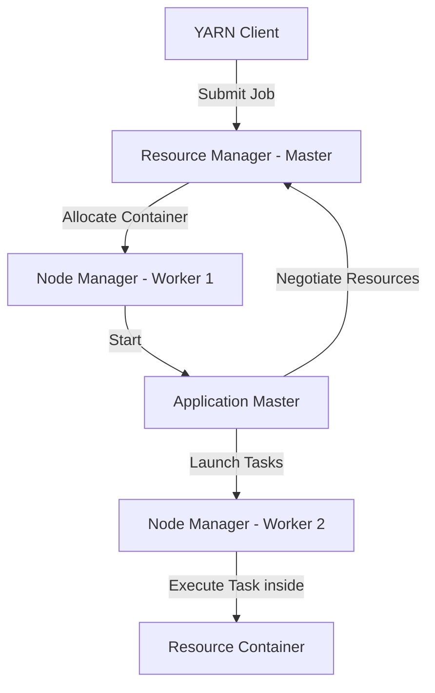

## 7.2. Apache Hadoop Ecosystem and HDFS

Apache Hadoop is an open-source framework designed for the distributed storage and processing of large datasets across clusters of commodity hardware.

### 7.2.1. HDFS Architecture (Hadoop Distributed File System)
HDFS uses a master-worker architecture to store large files across a cluster.

*   **NameNode (Master Node):** Manages the file system namespace, directory structure, and metadata (such as the location of file blocks). It is a single point of failure unless configured with active-passive high availability.
*   **DataNodes (Worker Nodes):** Store and retrieve physical blocks of data as directed by the NameNode. They report active blocks and health status to the NameNode via regular heartbeats.
*   **Block Allocation and Replication:**
    *   HDFS automatically splits large files into fixed-size blocks (typically 128MB).
    *   To prevent data loss, each block is replicated across multiple DataNodes (the default replication factor is 3).
    *   **Rack Awareness:** HDFS places block replicas across different server racks to protect data from entire rack-level power or network failures.

---

### 7.2.2. YARN Architecture (Yet Another Resource Negotiator)
YARN manages resources and schedules tasks across the Hadoop cluster.

*   **ResourceManager (Master):** The central authority that allocates CPU and memory resources to running applications across the cluster.
*   **NodeManager (Worker):** An agent that runs on each node, monitoring container resource usage (CPU, memory, disk) and reporting status to the ResourceManager.
*   **ApplicationMaster (Per-Job):** A framework-specific library that negotiates resources with the ResourceManager and works with NodeManagers to execute and monitor application tasks.