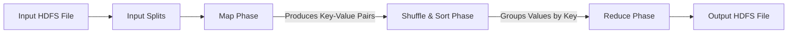

## 7.3. MapReduce Programming Model and Execution Engine

MapReduce is a programming model designed to process massive datasets in parallel using a distributed cluster.



### 7.3.1. The Three MapReduce Phases
1.  **Map Phase:** The input dataset is split into independent chunks. Mapper tasks process these chunks in parallel across nodes, transforming raw data into intermediate key-value pairs:
    $$\text{Map}(k_1, v_1) \rightarrow \text{list}(k_2, v_2)$$
2.  **Shuffle & Sort Phase:** The MapReduce framework automatically groups and sorts the intermediate key-value pairs by key, ensuring that all values associated with the same key are routed to the same reducer:
    $$\text{Shuffle}(\text{list}(k_2, v_2)) \rightarrow \text{grouped}(k_2, \text{list}(v_2))$$
3.  **Reduce Phase:** Reducer tasks process the grouped data in parallel, aggregating or summarizing the values to produce the final output, which is written back to HDFS:
    $$\text{Reduce}(k_2, \text{list}(v_2)) \rightarrow \text{list}(k_3, v_3)$$

---

### 7.3.2. Detailed Mathematical Example: Netflix Movie Rating Analysis
We want to calculate the average rating for each movie in a dataset.

*   **Input Data Format (User ID, Movie ID, Rating):**
    ```text
    User1, Movie10, 4.0
    User2, Movie10, 5.0
    User3, Movie10, 3.0
    User4, Movie20, 2.0
    ```

#### Phase 1: Map Phase
The mapper reads lines from HDFS and outputs the Movie ID as the key, and the rating along with a counter of 1 as the value:
$$\text{Map}(\text{Line}) \rightarrow \text{Emit}(\text{MovieID}, (\text{Rating}, 1))$$

*   **Mapper Outputs:**
    *   `Movie10` $\rightarrow$ `(4.0, 1)`
    *   `Movie10` $\rightarrow$ `(5.0, 1)`
    *   `Movie10` $\rightarrow$ `(3.0, 1)`
    *   `Movie20` $\rightarrow$ `(2.0, 1)`

---

#### Phase 2: Shuffle & Sort Phase
The framework automatically groups all values associated with the same Movie ID:
*   **Intermediate Grouped Output:**
    *   `Movie10` $\rightarrow$ `[(4.0, 1), (5.0, 1), (3.0, 1)]`
    *   `Movie20` $\rightarrow$ `[(2.0, 1)]`

---

#### Phase 3: Reduce Phase
The reducer sums the ratings and the counters to calculate the average rating for each movie:
$$\text{Reduce}(\text{MovieID}, \text{list}(\text{Rating}, 1)) \rightarrow \text{Emit}(\text{MovieID}, \frac{\sum \text{Rating}}{\sum 1})$$

*   **Reducer Computations:**
    *   **For Movie 10:**
        $$\text{Sum of Ratings} = 4.0 + 5.0 + 3.0 = 12.0$$
        $$\text{Count} = 1 + 1 + 1 = 3$$
        $$\text{Average Rating} = \frac{12.0}{3} = 4.0$$
        **Output:** `Movie10` $\rightarrow$ `4.0`
    *   **For Movie 20:**
        $$\text{Sum of Ratings} = 2.0$$
        $$\text{Count} = 1$$
        $$\text{Average Rating} = \frac{2.0}{1} = 2.0$$
        **Output:** `Movie20` $\rightarrow$ `2.0`