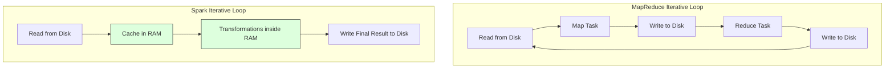
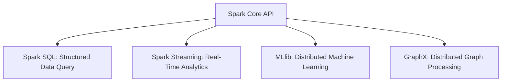

## 7.4. Apache Spark In-Memory Computation Engine

Apache Spark is a distributed computing framework designed to overcome the performance limitations of MapReduce by processing data in memory.

### 7.4.1. Why Spark is Faster than MapReduce
*   **MapReduce Disk Bottleneck:** MapReduce writes intermediate data to physical disks after each Map and Reduce phase. This causes significant disk read/write and network overhead, especially for iterative algorithms like machine learning.
*   **Spark In-Memory Processing:** Spark stores intermediate results in RAM, allowing tasks to query data directly from memory without writing to disk. This can make Spark up to 100 times faster than traditional MapReduce for iterative workloads.

---

### 7.4.2. Core Abstractions: RDDs and DataFrames
*   **Resilient Distributed Dataset (RDD):** Spark's foundational abstraction. It is a read-only, partitioned collection of records that can be processed in parallel across the cluster. If a node fails, RDDs use lineage graphs to automatically reconstruct lost partitions.
*   **DataFrame:** A distributed collection of data organized into named columns, similar to a table in a relational database. DataFrames use Spark's **Catalyst Optimizer** to optimize execution queries automatically.

---

### 7.4.3. Spark Core Modules

*   **Spark SQL:** Supports querying structured data using standard SQL or DataFrame APIs, optimizing execution queries automatically.
*   **Spark Streaming:** Enables real-time stream processing, allowing developers to process live data streams using the same APIs as batch processing.
*   **MLlib:** A scalable machine learning library that provides distributed algorithms for classification, regression, clustering, and collaborative filtering.
*   **GraphX:** A distributed graph-computation engine that simplifies the creation and analysis of graph-structured data.