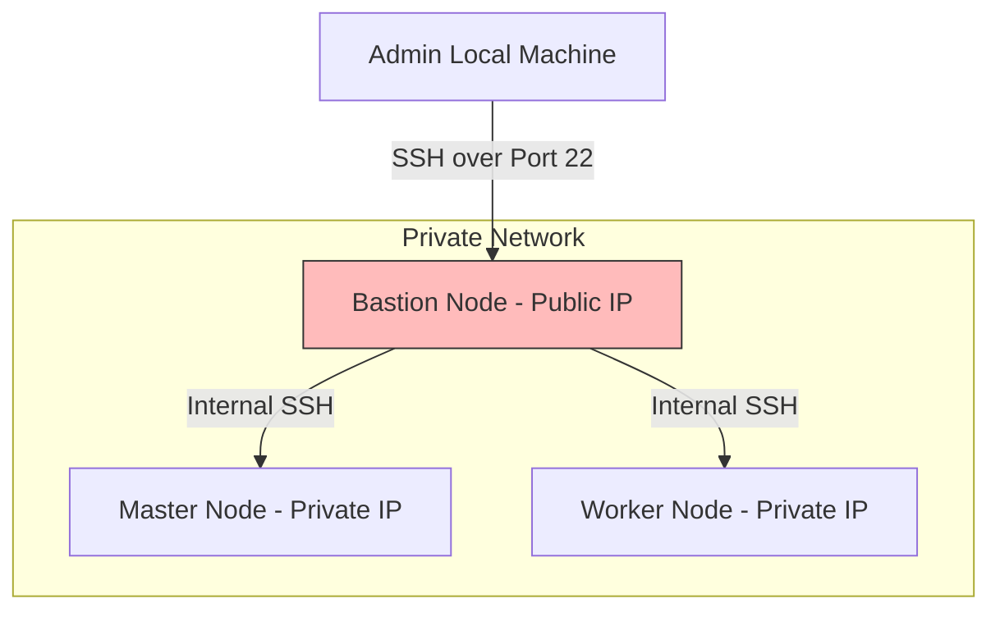

## 8.1. TP 1 - Cloud Provisioning with OpenStack and Taikun

This lab guides you through provisioning a Kubernetes cluster on **OpenStack** using the **Taikun** management platform.

### 8.1.1. Conceptual Lab Review Questions and Solutions

#### Q1: What is a cloud provider (e.g., OpenStack)?
*   **Detailed Answer:** A cloud provider is an organization or platform that provides access to virtualized computing, storage, and networking resources over the internet on a pay-as-you-go basis. **OpenStack** is an open-source cloud operating system that pools local datacenter resources (servers, storage arrays, network switches) and exposes them through a unified dashboard and API, functioning as an open-source alternative to public clouds like AWS or Azure.

#### Q2: What is the purpose of the Taikun platform in this lab?
*   **Detailed Answer:** Taikun is a centralized management and orchestration platform. It acts as an abstraction layer over cloud providers (like OpenStack, AWS, or Azure). Instead of requiring developers to manually configure networks, hypervisors, and security groups, Taikun provides a unified interface to automate the provisioning, scaling, and monitoring of Kubernetes clusters across different cloud environments.

#### Q3: What is a project in Taikun?
*   **Detailed Answer:** A project in Taikun is a logical boundary that groups related virtual machines, Kubernetes clusters, networking rules, and user access controls. Projects help organizations organize resources, track usage, and manage team permissions.

#### Q4: Why must we allocate quotas (CPU, RAM) to a project?
*   **Detailed Answer:** Quotas prevent projects from overconsuming shared physical hardware resources. In multi-tenant environments, setting CPU, memory, and storage limits ensures fair resource distribution and prevents unexpected billing overruns.

#### Q5: Explain the roles of the Master Node, Worker Node, and Bastion Node.
*   **Detailed Answer:**
    *   **Master Node (Control Plane):** Manages the state of the Kubernetes cluster. It runs the API Server, Scheduler, and Controller Manager to handle container orchestration, API requests, and workload scheduling.
    *   **Worker Node:** Runs the actual containerized applications. It hosts the Container Runtime, Kubelet, and Kube-Proxy to execute workloads and manage network routing.
    *   **Bastion Node:** A secure gateway server (jump box) that acts as the single point of entry to the cluster. It has a public IP address, allowing authorized administrators to log in securely and connect to the cluster's internal, private network nodes.



#### Q6: What is an SSH key pair and what is it used for?
*   **Detailed Answer:** An SSH key pair is a secure authentication method that uses public-key cryptography. It consists of a **private key** (which must be kept secret on the administrator's local machine) and a **public key** (uploaded to the remote server). When connecting, the server verifies that the client has the matching private key, providing more secure authentication than traditional passwords.

#### Q7: What command is used to connect to the Bastion node from your local terminal?
*   **Detailed Answer:**
    ```bash
    ssh -i /path/to/private_key clouduser@bastion_public_ip
    ```
    *   **`-i` flag:** Specifies the path to the private SSH key used for authentication.
    *   **`clouduser`:** The default administrator username on the remote virtual instance.
    *   **`bastion_public_ip`:** The public IP address assigned to the Bastion host.

#### Q8: What is the purpose of the Python script executed on the Bastion?
*   **Detailed Answer:** Running a basic Python script on the Bastion verifies that the Python interpreter is installed and functioning correctly on the newly provisioned host. It serves as a simple smoke test to confirm the operating system environment is ready for application deployment.