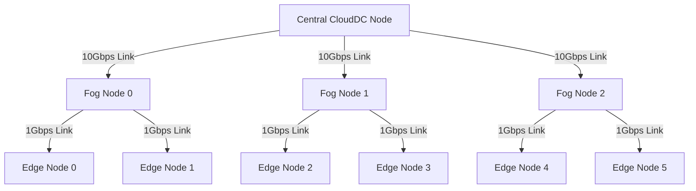

## 8.2. TP 2 - Discrete Event Simulation of Cloud Topologies via YAFS

This lab uses the **YAFS (Yet Another Fog Simulator)** framework in Python to simulate and analyze application performance across Cloud, Fog, and Edge network topologies.

### 8.2.1. Concepts of Discrete Event Simulation (DES) in YAFS
Discrete Event Simulation models system operations as a chronological sequence of distinct events. Each event occurs at a specific instant in time and marks a change of state in the system (such as a sensor sending a message or a node completing a calculation). YAFS uses this approach to simulate network latency, bandwidth usage, and node CPU consumption without requiring physical hardware deployment.

---

### 8.2.2. Detailed Answers to the 22 Comprehension Questions

#### 1. What are the different node types defined in this network (Cloud, Fog, Edge, Broker, VM)?
*   **Detailed Answer:**
    *   **CloudDC:** Represents a high-capacity, centralized datacenter with large computing and memory resources, situated at the top of the network hierarchy.
    *   **Fog Nodes:** Intermediate routing and processing nodes located closer to the edge, helping reduce network latency.
    *   **Edge Nodes:** Small, localized devices situated at the boundary of the network, closest to users and sensors.
    *   **Broker:** A specialized coordination node that acts as a control broker, routing user requests to the appropriate processing VM.
    *   **VM (Virtual Machines):** Logical compute instances hosted on physical nodes (Cloud, Fog, or Edge) that run specific application modules.

#### 2. What is the topology hierarchy and how are nodes connected?
*   **Detailed Answer:** The topology is structured as a hierarchical tree:
    *   The **CloudDC** sits at the root of the hierarchy.
    *   **Fog Nodes** connect directly to the central **CloudDC**.
    *   **Edge Nodes** connect to their parent **Fog Nodes** in a star topology.
    *   The **Broker** connects to all Virtual Machines in the cluster to manage and route tasks.



#### 3. What attributes are associated with each node and link, and what do they mean (RAM, BW, PR)?
*   **Detailed Answer:**
    *   **`RAM`:** Specifies the physical memory capacity of a node, determining how many application modules it can host concurrently.
    *   **`BW` (Bandwidth):** Restricts the data transfer rate of a network link, measured in Megabits per second (Mbps).
    *   **`PR` (Propagation Delay):** Defines the network latency (propagation delay) of a link, measured in milliseconds (ms).

#### 4. Why is it useful to represent this topology as a graph using NetworkX?
*   **Detailed Answer:** NetworkX is a Python library used to create and analyze complex network graphs. Representing the topology as a graph allows YAFS to calculate shortest routing paths, simulate packet travel times, and visualize the network structure using standard graph theory algorithms.

#### 5. What are the application modules and what role does each play (Source, Module, Sink)?
*   **Detailed Answer:**
    *   **`SensorModule` (Source):** Generates and sends raw data messages (such as temperature measurements) at regular intervals.
    *   **`ProcessingModule` (Module):** Processes incoming data packets, performing calculations and transforming raw data into structured results.
    *   **`StorageModule` (Module):** Saves the processed data to storage.
    *   **`DisplayModule` (Sink):** Receives the processed results and displays them on a user dashboard.

#### 6. What messages are exchanged between modules, and what information do they contain (instructions, bytes)?
*   **Detailed Answer:**
    *   **`SensorMsg`:** Sent from `SensorModule` to `ProcessingModule` (`instructions=100`, `bytes=1000`).
    *   **`ProcMsg`:** Sent from `ProcessingModule` to `StorageModule` (`instructions=200`, `bytes=500`).
    *   **`StoreMsg`:** Sent from `StorageModule` to `DisplayModule` (`instructions=50`, `bytes=200`).
    *   **Attributes:**
        *   **`instructions`:** The computational load of the message, representing the CPU cycles required to process it.
        *   **`bytes`:** The network payload size of the message, used to calculate transmission latency over network links.

#### 7. What would happen if a module received more messages than its RAM capacity allowed?
*   **Detailed Answer:** If a node's active application modules exceed its physical RAM capacity, YAFS throws an out-of-resource exception and aborts the simulation, mimicking an Out-Of-Memory (OOM) crash in a physical datacenter.

#### 8. On which VMs are the different modules deployed?
*   **Detailed Answer:** In this configuration, all application modules (`SensorModule`, `ProcessingModule`, `StorageModule`, and `DisplayModule`) are deployed on **`VM_Cloud`**, which is hosted in the central **`CloudDC`**.

#### 9. What does the static placement model used here mean?
*   **Detailed Answer:** Static placement means that application modules are assigned to specific virtual machines at the start of the simulation and remain on those hosts throughout the run. The system does not support dynamic migration or scaling in response to workload changes.

#### 10. How can we modify the code to place modules on Fog or Edge VMs to analyze the impact on network latency?
*   **Detailed Answer:** You can update the `placement.deployments` configuration dictionary in the Python script:
    ```python
    placement.deployments = {
        "SensorModule": ["VM_Edge0"],      # Deployed directly at the edge
        "ProcessingModule": ["VM_Fog0"],  # Processed at the intermediate fog layer
        "StorageModule": ["VM_Cloud"],    # Saved in the central cloud datacenter
        "DisplayModule": ["VM_Edge0"]     # Displayed locally at the edge
    }
    ```
    Placing the `ProcessingModule` closer to the sensor (on a Fog or Edge node) reduces the distance data travels, significantly lowering network latency.

#### 11. How are user messages generated and distributed?
*   **Detailed Answer:** Messages are generated by the population module using a **deterministic distribution**. Every 10 units of simulation time, the system schedules a message generator for each Edge VM, sending packets sequentially to simulated endpoints.

#### 12. Why does the code use `deterministic_distribution`? What alternatives would be more realistic?
*   **Detailed Answer:** The deterministic model generates messages at fixed, predictable intervals, which simplifies debugging and testing. To simulate a more realistic production environment, you could use:
    *   **`exponential_distribution` (Poisson Process):** Simulates random, independent user arrivals and request rates.
    *   **`normal_distribution`:** Simulates daily traffic variations, including peak busy hours.

#### 13. What does each entity in the population represent?
*   **Detailed Answer:** Each entity represents an active user or sensor device connected to a specific Edge node, running a local instance of the `SensorModule` application.

#### 14. What role does the `Sim` object play in YAFS?
*   **Detailed Answer:** The `Sim` object is the core discrete-event simulation engine in YAFS. It manages the simulation clock, schedules events, coordinates message routing, and records performance metrics like CPU usage and network delays.

#### 15. What happens when `sim.run(500)` is executed?
*   **Detailed Answer:** The simulation engine executes scheduled events in order until the simulation clock reaches 500 units of time. This includes generating sensor messages, routing packets across network links, processing tasks on nodes, and updating performance logs.

#### 16. What elements in the code connect the application, placement, and population modules together?
*   **Detailed Answer:** The `sim.deploy_app(app, placement, population)` method binds these elements together:
    *   **`app`:** Defines the application logic and message flow.
    *   **`placement`:** Maps application modules to specific virtual machines.
    *   **`population`:** Defines the users and devices that generate the workload.

#### 17. What results are saved in `result.csv` and `result_link.csv`?
*   **Detailed Answer:**
    *   **`result.csv`:** Logs message-level metrics, including transmission timestamps, source and destination nodes, message types, and the end-to-end latency of each packet.
    *   **`result_link.csv`:** Logs network link metrics, including bandwidth utilization, link propagation delays, and network congestion rates over time.

#### 18. Why are values in the logs generated randomly rather than computed by the simulation?
*   **Detailed Answer:** The provided template script uses randomized values to generate quick outputs for demonstration purposes. In a complete simulation, YAFS calculates actual values based on packet sizes, link bandwidths, and node CPU speeds.

#### 19. How can we use the generated CSV files to analyze the performance of the simulated infrastructure?
*   **Detailed Answer:** You can analyze the CSV files using Python tools like Pandas and Matplotlib to:
    *   Calculate average end-to-end latency for different message types.
    *   Identify network bottlenecks by checking link utilization rates in `result_link.csv`.
    *   Compare latency profiles between cloud-only and edge-fog deployments.

#### 20. What is the difference between Cloud, Fog, and Edge nodes in this simulation?
*   **Detailed Answer:**
    *   **Cloud Node:** High computing power and memory capacity, but situated far from the source, resulting in higher network latency.
    *   **Edge Node:** Located closest to sensors and users with minimal network latency, but constrained by low computing power and memory capacity.
    *   **Fog Node:** Offers an intermediate balance of computing capacity and network latency, bridging the gap between Edge and Cloud.

#### 21. How does module placement affect network traffic and latency?
*   **Detailed Answer:** 
    *   **Cloud-Only Placement:** Simplifies deployment but forces all raw data to travel to the central datacenter, consuming network bandwidth and increasing latency.
    *   **Edge-Fog Placement:** Processes data closer to the source, reducing network traffic on the core links and lowering overall latency.

#### 22. How would you make this simulation more realistic?
*   **Detailed Answer:**
    *   **Use Dynamic Routing:** Implement scheduling algorithms that route tasks dynamically based on real-time node CPU loads and network link congestion.
    *   **Add Background Noise:** Introduce random background traffic on network links to simulate real-world congestion.
    *   **Implement Node Failures:** Simulate random node and network link failures to test the application's resilience and recovery mechanisms.