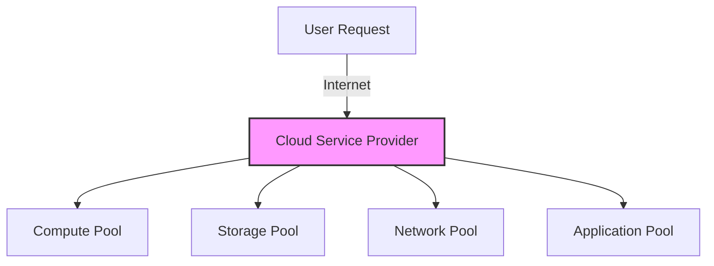
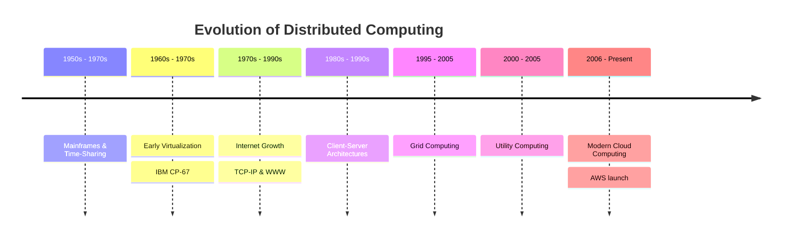
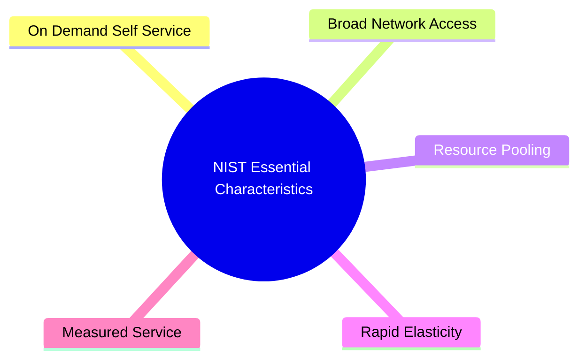
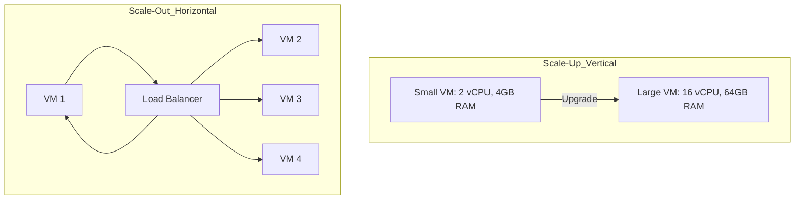
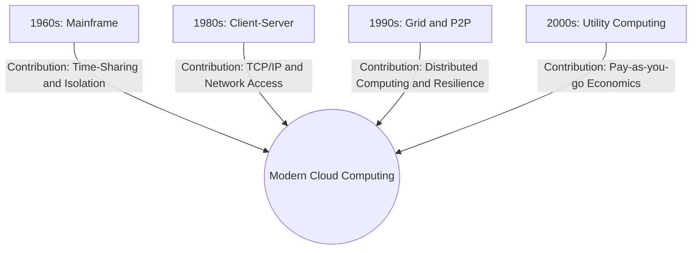

## 1.1. Cloud Computing Definition and Foundations

### 1.1.1. Core Definition
Cloud Computing is a paradigm that enables ubiquitous, convenient, on-demand network access to a shared pool of configurable computing resources (e.g., networks, servers, storage, applications, and services). These resources can be rapidly provisioned and released with minimal management effort or service provider interaction.

The transition from traditional computing to Cloud Computing represents a fundamental shift from **purchasing physical assets** to **subscribing to utility services**.



### 1.1.2. The Consumption Model Shift
*   **CapEx (Capital Expenditure):** Traditional IT requires high up-front costs to buy physical hardware, secure datacenters, and plan for 3-5 years of maximum expected growth. This leads to idle resources during off-peak times.
*   **OpEx (Operational Expenditure):** Under the cloud model, billing is operationalized. Companies pay only for what they consume per hour, minute, or second. This aligns IT expenses directly with actual business activity.

### 1.1.3. Essential Background Concepts
To understand why the cloud is a consumption model rather than a new physical technology, consider its core pillars:
1.  **Abstraction:** Physical hardware is hidden behind virtualized software layers.
2.  **Orchestration:** Management software automates the deployment and scaling of resources, removing the need for manual server setup.
3.  **Utility Billing:** Fine-grained metering tools track resource usage in real-time, functioning similarly to an electricity grid.

════════════════════════════════════════════════════════════════════════
📄 FILE: Chapter 1 - Introduction to Cloud Computing/1.10 What is a Workload.md
   Language: markdown
════════════════════════════════════════════════════════════════════════

# What is a Workload

## 1. What is a Workload?

A **workload** is the actual computing task or set of operations your system performs. It is what the servers are **doing** -- the active part of your application. The concept of a workload is central to cloud computing because every decision about infrastructure sizing, scaling policies, and cost optimization ultimately revolves around understanding and managing workloads effectively.

### In simple terms:

A workload is your **application running** -- not just its code, but everything it does:

- Processing user requests, including authentication, authorization, business logic execution, and response generation.
- Storing and retrieving data from databases, caches, and file systems.
- Running background jobs such as data processing pipelines, scheduled tasks, and asynchronous operations.
- Handling APIs, file uploads, analytics, and any other computational activity that consumes CPU, memory, storage, or network resources.

When you deploy something to the cloud, your "workload" is what the cloud resources (VMs, containers, storage, etc.) are executing. The workload determines the resource requirements of your infrastructure -- a compute-heavy workload requires more CPU, a data-intensive workload requires more storage and memory, and a network-heavy workload requires more bandwidth. Understanding the characteristics of your workload is essential for choosing the right cloud services and configuring them optimally.

### Examples:

|Type|Example|
|---|---|
|Web App|Handling page requests, authentication, rendering dynamic content, and serving static assets.|
|Database|Managing queries, transactions, indexing, replication, and ensuring data consistency and durability.|
|AI Model|Processing inference requests on trained models, or training models on large datasets using GPU-accelerated compute.|
|Microservice|Handling one specific function like "user payments" -- receiving payment requests, validating transactions, communicating with payment gateways, and recording results.|

So your workload = your **running code + data processing + runtime environment.** The workload is the living, active expression of your application in production, consuming resources and delivering value to users.

---

## 2. What is Deployment?

**Deployment** is the process of **putting your code and configuration into a live environment** so it can be accessed and used by others. Deployment is the critical bridge between development and production -- it transforms code that exists on a developer's machine into a running service that is accessible to users over the internet.

You can think of it as:

> "Moving your project from your local machine to a server (physical or virtual) so it runs 24/7 and is available on the internet."

### Deployment includes:

- Uploading your app files or container image to the target infrastructure.
- Setting up the runtime (Node.js, Python, PHP, etc.) and ensuring that all dependencies are installed and configured correctly.
- Configuring databases, environment variables, and security settings to match the production environment.
- Starting your services on the target server or VM and verifying that they are running correctly.

### Deployment Examples:

- Using **Vercel** or **Netlify** -- they handle the whole deployment process automatically. You push your code to a Git repository, and the platform automatically builds, deploys, and serves your application. This is the simplest deployment model, ideal for frontend applications and serverless functions.
- Using **AWS EC2** or **Google Cloud Compute Engine** -- you deploy manually or with CI/CD pipelines. You are responsible for provisioning the infrastructure, installing the runtime, configuring the network, and deploying your code. This model offers maximum control but requires more operational expertise.
- Using **Docker or Kubernetes** -- deployment means scheduling and managing your container workloads. You package your application and its dependencies into a container image, push it to a registry, and orchestrate its deployment across a cluster of machines using Kubernetes or a similar orchestration platform. This model provides excellent portability and scalability but requires familiarity with containerization concepts and tools.

---

## 3. Where Does Your Website Live?

Your website "lives" on a **server** -- which is a **physical or virtual machine** connected to the internet. When you visit a URL, your request goes to this server, which serves back HTML, data, or API responses. The server is always running and listening for incoming requests, ready to respond to any client that connects to it.

There are several **hosting levels**, each offering a different balance of control, cost, and capability:

|Type|Where it Lives|Control Level|Example|
|---|---|---|---|
|**Shared Hosting**|On the same physical server with many other sites|Low|Bluehost, Hostinger|
|**VPS (Virtual Private Server)**|On a virtualized machine isolated from others|Medium|DigitalOcean, Linode|
|**Dedicated Server**|On your own physical machine|High|OVH, Hetzner|
|**Cloud Instance**|On cloud infrastructure using dynamic resources|Very flexible|AWS EC2, Google Cloud, Azure|

When you deploy on **cloud platforms**, your site lives inside **a virtual machine or container** hosted on **the provider's physical servers** (in data centers). The key advantage of cloud hosting is that your infrastructure is not fixed -- you can scale up during traffic spikes and scale down during quiet periods, paying only for the resources you actually use. This elasticity is what distinguishes cloud hosting from traditional hosting models, where you pay for a fixed allocation of resources regardless of your actual usage.

---

## Summary Table

|Concept|Description|Example|
|---|---|---|
|**Workload**|The code and processes your app runs in production|API requests, DB queries|
|**Deployment**|The act of publishing and running your app on a remote server|Deploying via Vercel or EC2|
|**Where it Lives**|The actual environment or infrastructure hosting your app|Cloud VM, container, or bare-metal server|


════════════════════════════════════════════════════════════════════════
📄 FILE: Chapter 1 - Introduction to Cloud Computing/1.11 What is Serverless.md
   Language: markdown
════════════════════════════════════════════════════════════════════════

# What is Serverless

## 1. What is Serverless?

Despite the name, **serverless doesn't mean "no servers."** It means **you don't manage servers** -- the cloud provider does it automatically for you. Servers still exist, but they are completely abstracted away from the developer's perspective. The provider handles all server provisioning, scaling, patching, and maintenance, allowing developers to focus entirely on writing code.

### In traditional hosting:

You rent a full server or VM (like in VPS or EC2). You have to:
- Configure the operating system, including user accounts, security patches, and system-level configurations.
- Scale resources when traffic grows, which requires monitoring usage patterns and manually (or through automation) adjusting capacity.
- Handle updates and uptime, including OS patches, runtime updates, and ensuring the server remains available during hardware or software failures.

### In serverless:

You just **upload your code**, and the cloud runs it on demand. The provider automatically:
- Starts a container when your code is called, provisioning a lightweight execution environment in milliseconds.
- Allocates CPU/RAM only when needed, ensuring that resources are not wasted on idle capacity.
- Scales to thousands of users instantly, creating as many concurrent instances of your function as needed to handle incoming requests.
- Shuts down when idle (you pay for usage, not uptime), eliminating the financial waste of running servers that sit idle for most of the day.

### So serverless = pay-per-execution + auto-scaling + no infrastructure management.

### Examples of Serverless Services:

|Type|Example|
|---|---|
|Serverless Functions|AWS Lambda, Cloudflare Workers, Vercel Functions|
|Serverless Databases|Firebase Firestore, Supabase DB, DynamoDB|
|Serverless Hosting|Vercel, Netlify, Cloudflare Pages|

---

## 2. Serverless Internals: What "Serverless" Really Does Under the Hood

When you deploy serverless code (like a function), the provider -- AWS, Vercel, Cloudflare, etc. -- does something like this:

1. Receives a request (HTTP event, cron job, file upload, etc.)
2. Spins up a **lightweight container or isolate** to run your code
3. Executes your function
4. Returns the result and destroys or suspends the environment

This all happens in **milliseconds**. So the runtime must:
- **Start extremely fast** -- any delay in initialization directly impacts user-facing latency.
- **Be lightweight** -- the smaller the execution environment, the faster it can be provisioned and the more instances can run on the same hardware.
- **Handle concurrency efficiently** -- multiple invocations of the same function must be able to run in parallel without interfering with each other.

This is why **Node.js dominates in serverless** environments, as we will explore in the next section.

---

## 3. Why Node.js Fits Serverless So Well

It is not that serverless cannot work with Python, Django, PHP, or Spring Boot -- it is that **Node.js aligns better with how serverless systems are designed to work**. The following analysis explains precisely why this alignment exists.

|Feature|Why It Matters for Serverless|Node.js Advantage|
|---|---|---|
|**Startup Time**|Functions are constantly being started and stopped. The language runtime must boot instantly.|Node.js starts in milliseconds. Python and Java take much longer to spin up.|
|**Concurrency**|Many requests might run simultaneously in the same instance.|Node's event loop handles high concurrency with minimal memory.|
|**Cold Start**|When a new function instance is created, it needs to initialize.|Node has very small cold-start overhead compared to Java or Django.|
|**Package Size**|Code is deployed as zip bundles or containers. Smaller = faster.|Node apps are typically smaller and simpler to bundle.|
|**Environment Compatibility**|Serverless providers often use Linux-based sandbox environments with limited system access.|Node runs smoothly without external dependencies (no need for full frameworks or servers).|

### Why Python, Django, PHP, or Spring Boot Struggle

These can run on serverless, but they are **not efficient for it** by design.

**Python:**
- Works fine for short scripts (e.g., AWS Lambda).
- But frameworks like Django or Flask have **slow cold starts** -- they load a lot of middleware and routes on boot.
- Fine for batch tasks or data pipelines, not ideal for high-traffic web functions.

**PHP:**
- Traditionally needs a **web server** (Apache or Nginx + PHP-FPM) to handle requests.
- In serverless, each function call would need to **recreate that environment** -- inefficient.
- Serverless PHP exists (e.g., Bref on AWS Lambda) but it is more complex to optimize.

**Spring Boot (Java):**
- Heavy framework with **slow startup** (often seconds).
- Each function instance loads the **JVM**, which consumes memory and takes time.
- You can use **Quarkus or GraalVM** to optimize for serverless, but Node still beats it in latency.

### The Real Reason Node.js Dominates

Node.js was designed for **event-driven, non-blocking I/O** -- exactly what serverless is about. Serverless = run a small function fast, handle an event, and disappear.

Node can:
- Initialize fast, reducing cold-start times to a few milliseconds.
- Stay idle without using CPU, making it efficient for sporadic request patterns.
- Reuse the same instance for multiple concurrent requests through its event loop architecture.
- Handle both frontend (Next.js) and backend seamlessly, making it an ideal full-stack serverless language.

Providers like **Vercel**, **Cloudflare Workers**, and **Netlify Functions** built their serverless engines around this asynchronous, lightweight model -- that is why Node is the native choice.

### Modern Workarounds

However, newer systems **are expanding beyond Node**:

|Language|Where Serverless Works Well|
|---|---|
|**Python**|AWS Lambda, Google Cloud Functions, Azure Functions|
|**Go**|AWS Lambda, Cloudflare Workers (via WASM) -- very fast startup|
|**Rust**|Cloudflare Workers, Deno Deploy -- extreme performance|
|**Java**|AWS Lambda (via GraalVM or SnapStart)|
|**PHP**|AWS Lambda with Bref layer|

So it is not impossible -- it is just that **Node is naturally optimized** for this model, while others require additional tools or optimizations to fit.

### Language Serverless Readiness Summary

|Language|Serverless Readiness|Notes|
|---|---|---|
|**Node.js**|Excellent|Instant startup, perfect for event-driven tasks|
|**Python**|Good|Great for data or ML tasks, slower for APIs|
|**Go**|Excellent|Compiled, tiny footprint, near-zero cold starts|
|**PHP**|Moderate|Works with layers like Bref, but less efficient|
|**Java (Spring Boot)**|Poor-Moderate|Heavy runtime, but improving with GraalVM|
|**Rust / Deno**|Excellent (new)|Ultra-fast and safe, used in edge computing|

Serverless prefers languages that start instantly, run lightweight processes, and handle thousands of concurrent small tasks efficiently. That is why **Node.js dominates** -- it was built for that environment.

---

## 4. Platform Comparisons

### Cloudflare (Serverless at the Edge)

**How it is serverless:** Cloudflare owns **a global network of data centers** -- thousands of edge nodes distributed around the world. Each node runs a **lightweight runtime engine (V8 isolates)** -- similar to how your browser runs JavaScript.

When you deploy a **Cloudflare Worker**, you are not deploying to one server -- your code is **replicated to all edge nodes**. When a user makes a request:
1. The nearest Cloudflare node intercepts it.
2. The Worker runs inside an isolate -- a super-light environment that boots in **under 5 ms**.
3. No containers, no VMs -- just micro-sandboxes inside a shared runtime.

That is how it can be **instant, cheap, and global**.

**Why it is cheap/free:**
- Cloudflare already needs those nodes for its CDN business (serving websites).
- Running extra compute for small functions costs very little.
- They monetize through **premium plans**, **traffic-based billing**, and **enterprise security services**, not the basic serverless users.

### Vercel (Serverless Deployment and Hosting)

**How it is serverless:** Vercel is built on top of other cloud providers (mostly AWS, GCP, and Cloudflare). When you deploy:
1. Your code is built into **static files** and **serverless functions**.
2. Static files are stored in edge caches (like Cloudflare CDN).
3. Serverless functions are deployed to AWS Lambda or Vercel's own serverless runtime.

When a user visits your website:
- HTML/JS/CSS are served instantly from the nearest CDN node.
- If the page has dynamic content (e.g., API or database call), a **serverless function** spins up to process it, executes once, and dies.

**Why it is free:**
- Static sites cost almost nothing to host or cache.
- Most functions run for milliseconds -- far below the cost threshold.
- Vercel charges heavy users (business and pro plans) but subsidizes hobby and dev tiers.

They are betting that **the majority of projects stay small**, while enterprise clients pay for scalability.

### Supabase (Serverless Backend Built on Postgres)

**How it is serverless:** Supabase wraps **PostgreSQL**, **authentication**, **storage**, and **API generation** inside managed containers. They use **Kubernetes** or similar orchestration to:
- Launch small database instances on-demand
- Suspend them when idle
- Auto-scale connections and caching layers

Their **Edge Functions** are built like Vercel's -- tiny Node.js or Deno runtimes spun up and destroyed per call. So, your "backend" is just a collection of managed microservices, not one big server.

**Why it is free:**
- PostgreSQL databases are **containerized and shared** -- small projects get small resource slices.
- Idle projects cost nearly nothing since they are paused.
- They make profit on active, large-scale apps that require dedicated resources or higher SLAs.

### Firebase (Google's Serverless Backend)

**How it is serverless:** Firebase is built on **Google Cloud Platform** -- specifically:
- Firestore runs on **Google's internal distributed NoSQL infrastructure** (same tech as Bigtable).
- Hosting uses **Google CDN + Cloud Storage.**
- Cloud Functions run on **Google Cloud Run** (which uses containers that start on request).

All this means your code, storage, and databases are **event-driven** -- they spin up only when used. Firebase can serve **millions of requests** without a single developer touching a server.

**Why it is free:**
- Firebase is a **developer acquisition tool** for Google Cloud.
- They absorb the cost of small projects to get devs into their ecosystem.
- Free tier limits (database reads/writes, function calls) ensure no abuse.

Idle apps cost nearly nothing -- no one is paying for idle CPU cycles.

### MongoDB Atlas (Serverless Database Hosting)

**How it is serverless:** Atlas automates database deployment and scaling on AWS, GCP, or Azure. When you create a "serverless" cluster:
1. It uses **on-demand compute** and **auto-scaling storage**.
2. It does not reserve full VMs -- instead, it provisions micro-containers that run queries as needed.
3. Idle databases hibernate or drop to minimal resource usage.

That is how it supports pay-per-query pricing -- you are not billed for uptime, only for actual DB usage.

**Why it is free:**
- The free cluster runs on **shared hardware** -- multiple users on the same node.
- It is enough for learning and small apps.
- They profit when developers upgrade to larger clusters or higher SLAs.

---

## 5. Why All of This Is Possible (The Underlying Revolution)

The real magic comes from **three layers of modern cloud technology**:

### 1. Virtualization to Containers to Isolates

Each generation got lighter:
- **VM:** full OS (hundreds of MB) -- provides complete isolation but at the cost of significant resource overhead.
- **Container:** process-level isolation (tens of MB) -- shares the host kernel but isolates the application's view of the system.
- **Isolate:** sandboxed function (few KB) -- the lightest form of isolation, running only the function code in a tightly constrained sandbox.

That is why Cloudflare can run **thousands of functions on a single machine**, each for milliseconds.

### 2. Global Networks

CDNs (like Cloudflare, Google, AWS Edge) have massive global presence. By running your code **at the edge**, latency drops and scalability becomes automatic.

### 3. Orchestration and Billing Automation

Modern platforms measure **per millisecond** of CPU time and **per MB** of memory. This allows precise metering and ultra-fine-grained billing -- enabling generous free tiers.

---

## 6. Isolated Lightweight Containers

### What "isolated lightweight containers" actually means

When you use something like **Cloudflare Workers**, **Vercel Functions**, **Supabase Edge Functions**, or **Firebase Cloud Functions**, your code doesn't run on a "full virtual machine" like a VPS or EC2 instance. Instead, it runs inside something much lighter -- **a container-like environment** (or sometimes even smaller, a "micro-VM" or "isolate").

### Comparison:

|Concept|Description|Example Use|
|---|---|---|
|**VM (Virtual Machine)**|Emulates a full computer -- CPU, RAM, OS, everything. Heavy but very isolated.|VPS, EC2, Google Compute Engine|
|**Container (like Docker)**|Shares the host OS kernel but runs apps in isolated spaces (lightweight).|Kubernetes, Docker|
|**Isolate / Micro-VM**|Even smaller: runs just your function code, no OS, no dependencies.|Cloudflare Workers, Vercel Functions|

### How this makes Serverless Possible

Normally, hosting your app means keeping a machine always on -- costing money even when no one uses it. Serverless changes this model:

1. **You upload only your function or app logic.**
2. **The platform (like Vercel or Cloudflare)** packages it into an isolated environment (a lightweight runtime -- often Node.js or V8 isolate).
3. When a request comes in:
    - It spins up (in milliseconds) that small environment.
    - Runs your code.
    - Returns the response.
    - Then instantly shuts down or "freezes" until the next request.

No idle time = **no wasted compute** = **free or cheap hosting**.

### How they achieve speed and low cost

**1. Multi-tenant Infrastructure:** They don't give you a whole machine. Instead, one physical server runs **thousands** of these micro-containers simultaneously -- each user's code is isolated, but the CPU and memory are shared efficiently.

**2. Sandboxing:** Each small "container" (or isolate) has its own memory space and security sandbox, so it cannot interfere with others -- but it doesn't need to boot an OS.

**3. Cold and Warm Starts:**
- **Cold Start**: When your code runs for the first time, they spin up an isolate.
- **Warm Start**: If requests keep coming, they reuse that isolate to avoid reloading your code.

This optimization keeps latency extremely low (a few milliseconds).

### Why It Is Free (or very cheap)

Because you don't have a dedicated server running 24/7:
- You pay **per execution**, not per hour.
- Cloudflare, Vercel, Supabase, etc., can afford free tiers because:
    - Most projects are small (few invocations per day).
    - They reuse their global edge servers.
    - Compute is distributed, so cost per user is almost negligible.

Essentially, they are selling **shared micro-time** on a massive global system.

### Analogy

Think of it like a **co-working office**:
- A VPS = your own locked office (you pay rent 24/7 even when empty).
- A Docker container = a flexible desk in a large office floor.
- A Serverless function = you just drop in, use the meeting room for 10 minutes, and leave -- you only pay for the time you were in.

---

## 7. Serverless Request Lifecycle

```text
             +----------------------------+
             |        User / Client       |
             | (Browser, App, or Request) |
             +-------------+--------------+
                           |
                           v
             +----------------------------+
             |  DNS / CDN Layer           |
             | (Cloudflare, Vercel Edge)  |
             +-------------+--------------+
                           |
     +---------------------+----------------------+
     | Cached File?        | Yes -> Return Static  |
     | (HTML, JS, CSS)     |                      |
     +---------------------+----------------------+
                           | No
                           v
             +----------------------------+
             |   Edge Function Invoked    |
             | (Serverless "Isolate")     |
             +-------------+--------------+
                           |
           +---------------+------------------+
           | Load your code (Node.js, Deno,   |
           | or V8 Isolate runtime).          |
           | No OS. Just a sandboxed runtime. |
           +---------------+------------------+
                           |
                           v
             +----------------------------+
             |  Your Function Executes    |
             |  (Reads DB, Calls API, etc.)|
             +-------------+--------------+
                           |
                           v
             +----------------------------+
             |  Response Returned to Edge |
             | (Maybe cached for reuse)   |
             +-------------+--------------+
                           |
                           v
             +----------------------------+
             |   Sent Back to User        |
             | (Fast, low-latency result) |
             +----------------------------+
```

### What is happening inside

1. **User sends request** to your app (e.g., `https://myapp.vercel.app`).
2. **DNS routes** it to the **nearest edge node** (the closest data center).
3. **If the content is cached**, Cloudflare or Vercel just returns it instantly.
4. **If not cached**, your **serverless function** is invoked.
    - This function runs in an **isolated lightweight container** (no OS, just runtime).
    - The platform spins it up in a few milliseconds.
5. The function **runs your backend logic** (DB read, API call, etc.).
6. The **result** is returned, maybe cached, then sent back to the user.

### Key insight

There is **no full server boot**. No "machine" waiting for connections. Just a **global grid** of ultra-fast runtimes that wake up when your code is needed, and vanish right after.

---

## 8. Summary Tables

### Platform Summary

|Platform|What Makes It "Serverless"|Why It Is Cheap/Free|
|---|---|---|
|**Cloudflare**|Runs code in V8 isolates on thousands of edge nodes|Reuses CDN network; compute cost per request is near zero|
|**Vercel**|Deploys to serverless runtimes and caches static assets globally|Static hosting is cheap; enterprise customers subsidize free users|
|**Supabase**|Auto-managed PostgreSQL + auth + storage using container orchestration|Shared, suspended, and auto-scaled resources|
|**Firebase**|Uses Google's internal scalable backend for DB, auth, and hosting|Free tier as funnel to Google Cloud; pay only when active|
|**MongoDB Atlas**|Database-as-a-Service with on-demand compute and auto-scaling|Shared clusters; charges large-scale usage only|

### Platform Type Summary

|Platform|Type|What It Provides|Key Feature|
|---|---|---|---|
|**Cloudflare**|Edge Network and CDN|CDN, security, serverless functions|Runs code globally at the edge|
|**Vercel**|Serverless Web Hosting|Build and host static/Next.js apps|Auto-deployment and scaling|
|**Supabase**|Serverless Backend|SQL DB, auth, storage, APIs|Open-source Firebase alternative|
|**Firebase**|Serverless Backend|NoSQL DB, auth, storage, hosting|Google-managed backend suite|
|**MongoDB Atlas**|Managed Database|Cloud-hosted MongoDB|Scalable NoSQL DB service|
|**Serverless (concept)**|Cloud Architecture|Auto-managed runtime for your code|Pay per use, no server setup|

---

## 9. Final Summary

Serverless systems work because they:
- **Run your logic in micro-containers that live for milliseconds**
- **Share resources dynamically across millions of users**
- **Use massive automation to eliminate idle cost**
- **Earn profit from scale and enterprise tiers, not from you**

That is why they can give you:
- Global performance
- Zero setup
- Almost free access

And you never touch a single server -- though millions of servers are quietly working for you.

- **Serverless** = you focus on code, not servers.
- **Vercel / Cloudflare** = host and run your frontend + serverless backend.
- **Supabase / Firebase / Atlas** = provide backend services (databases, auth, APIs).
- Together, they form a **modern full-stack cloud**: Your frontend (Vercel) + backend (Supabase) + global edge (Cloudflare) + database (Atlas or Supabase DB).

Serverless feels like magic because the platform gives you **isolated compute units** (like containers but lighter). They **start instantly** and **die instantly**. You **never manage** OS, servers, or scaling. You **only pay** for active use. And globally distributed systems (like Cloudflare's edge network) make it all fast and cheap.


════════════════════════════════════════════════════════════════════════
📄 FILE: Chapter 1 - Introduction to Cloud Computing/1.2 Historical Evolution of Computing Paradigms.md
   Language: markdown
════════════════════════════════════════════════════════════════════════

## 1.2. Historical Evolution of Computing Paradigms



### 1.2.1. Detailed Evolution of Paradigms
*   **Mainframes and Time-Sharing (1950s-1970s):** Large, expensive central systems executed tasks for multiple users. Users accessed the mainframe via passive terminals. **Time-sharing** was developed to allocate CPU cycles dynamically, laying the foundation for multi-user resource sharing.
*   **Early Virtualization (1960s-1970s):** IBM pioneered virtualization on the System/360 Model 67. The Control Program (CP) created independent virtual machines, while the Console Monitor System (CMS) provided a single-user interactive environment inside those VMs. This allowed mainframe resources to be safely partitioned.
*   **Development of Internet and Web (1970s-1990s):** The launch of ARPANET, TCP/IP, and the World Wide Web created a global network. This network made it possible to access computing resources remotely over long distances.
*   **Client-Server Architectures (1980s-1990s):** Computing shifted from centralized mainframes to distributed networks. Client machines made requests to local servers, which managed files, databases, and network traffic.
*   **Grid Computing (1995-2005):** A decentralized architecture that linked independent, geographically dispersed computers to tackle massive computational problems. Grid computing relies on specialized operating systems and lacks the ease of virtualization, but it proved the viability of large-scale resource sharing.
*   **Utility Computing (2000-2005):** This model packaged computing resources as a metered service, similar to water or electricity. It introduced pay-as-you-go pricing to the industry, though the underlying technology had not yet matured.
*   **Modern Cloud Computing (2006-Present):** In 2006, Amazon Web Services (AWS) launched Simple Storage Service (S3) and Elastic Compute Cloud (EC2). This combined virtualization, utility billing, and automated orchestration into a mature commercial platform, marking the start of the modern cloud era.

════════════════════════════════════════════════════════════════════════
📄 FILE: Chapter 1 - Introduction to Cloud Computing/1.3 NIST Characteristics of Cloud Computing.md
   Language: markdown
════════════════════════════════════════════════════════════════════════

## 1.3. NIST Characteristics of Cloud Computing

The National Institute of Standards and Technology (NIST) defines five essential characteristics that distinguish cloud computing from traditional virtualized datacenters:



### 1.3.1. On-Demand Self-Service
A consumer can provision computing capabilities, such as server time and network storage, unilaterally as needed. This process is fully automated and does not require human intervention from the service provider.
*   **Behind the Scenes:** Users interact with an API Gateway. The platform's orchestrator automatically allocates virtual resources, configures networks, and mounts storage volumes in minutes.

### 1.3.2. Broad Network Access
Capabilities are available over the network and accessed through standard mechanisms. This ensures compatibility with heterogeneous client platforms, including mobile phones, tablets, laptops, and workstations.
*   **Behind the Scenes:** Services are exposed via standard protocols like HTTP/HTTPS. They rely on web-native architectures, API gateways, and global Content Delivery Networks (CDNs) to reduce latency.

### 1.3.3. Resource Pooling
The provider's computing resources are pooled to serve multiple consumers using a multi-tenant model. Physical and virtual resources are dynamically assigned and reassigned according to consumer demand. The customer generally has no control or knowledge over the exact location of the provided resources (e.g., specific country, state, or datacenter host).
*   **Behind the Scenes:** Hypervisors and container runtimes isolate tenant workloads on shared physical CPUs, RAM, and disks. Compute schedulers balance these workloads across cluster nodes to maximize hardware use.

### 1.3.4. Rapid Elasticity
Capabilities can be elastically provisioned and released—sometimes automatically—to scale rapidly outward or inward with demand. To the consumer, the capabilities available for provisioning often appear to be unlimited and can be appropriated in any quantity at any time.
*   **Behind the Scenes:** Auto-scaling groups monitor metrics like CPU utilization or request queues. When thresholds are crossed, the system automatically boots new virtual instances or schedules additional containers.

### 1.3.5. Measured Service
Cloud systems automatically control and optimize resource use by leveraging a metering capability at some level of abstraction appropriate to the type of service (e.g., storage, processing, bandwidth, and active user accounts). Resource usage can be monitored, controlled, and reported, providing transparency for both the provider and consumer.
*   **Behind the Scenes:** Background agents track resource consumption. This data is processed by billing systems to generate detailed usage reports and invoices.

════════════════════════════════════════════════════════════════════════
📄 FILE: Chapter 1 - Introduction to Cloud Computing/1.4 Cloud vs On-Premise Strategic Analysis.md
   Language: markdown
════════════════════════════════════════════════════════════════════════

## 1.4. Cloud vs On-Premise Strategic Analysis

Choosing between an on-premise infrastructure and cloud migration requires evaluating cost, control, scalability, and security:

### 1.4.1. Detailed Comparison Matrix

| Aspect | Cloud Computing | On-Premise |
| :--- | :--- | :--- |
| **Financial Model** | **Operational Expenditure (OpEx):** Low upfront cost, variable metered billing. | **Capital Expenditure (CapEx):** High upfront cost for hardware, building facilities, and licenses. |
| **Scalability** | **Near-Instantaneous:** Horizontal scaling can be automated based on real-time traffic. | **Manual & Slow:** Requires buying, mounting, and configuring new hardware over weeks or months. |
| **Control & Customization** | **Shared Control:** Limited access to low-level hardware or physical network layers. | **Absolute Control:** Total ownership over hardware, firmware, and network configurations. |
| **Maintenance** | **Managed by Provider:** Hardware swaps, power, cooling, and virtualization patching are automated. | **Managed Internally:** Dedicated IT staff must handle physical hardware lifecycle and facilities. |
| **Disaster Recovery** | **Built-in Redundancy:** Multiple geographic availability zones and automated backup tools. | **Self-Designed:** Requires building and maintaining redundant backup datacenters. |
| **Security Responsibility** | **Shared Responsibility Model:** Clear, divided responsibilities between provider and customer. | **Full Security Responsibility:** Internal teams must secure everything from physical fences to software. |

### 1.4.2. Common Pitfalls to Avoid
*   **The Cloud Premium Trap:** Many organizations assume the cloud is always cheaper. However, running steady, predictable workloads 24/7 on the cloud without optimization can cost more than modern on-premise systems. The cloud is most cost-effective for variable workloads that leverage its elasticity.
*   **Ignoring Data Egress Charges:** Cloud providers often charge minimal fees to ingest data (ingress) but bill heavily to retrieve data (egress). Failing to account for egress costs can lead to unexpectedly high monthly invoices.

════════════════════════════════════════════════════════════════════════
📄 FILE: Chapter 1 - Introduction to Cloud Computing/1.5 Evolution, Elasticity, and Scalability Mechanics.md
   Language: markdown
════════════════════════════════════════════════════════════════════════

# Evolution, Elasticity, and Scalability Mechanics

## Background Context: The Path to Cloud

The slides mention the evolution from Mainframes (1950s) to Grid Computing and P2P, but the *technological thread* that connects them is often misunderstood. Each era contributed a specific, irreplaceable concept that the modern cloud inherits today.

**Mainframe (Time-sharing):** Introduced the concept of *multiplexing* -- slicing CPU time so multiple users felt like they had their own machine. It introduced **isolation**, the absolute foundation of cloud. Without isolation, multi-tenant cloud environments would be impossible, as one user's workload could interfere with another's execution, memory, or storage. The mainframe proved that a single massive hardware resource could be securely shared among independent users, a principle that underpins every modern cloud data center.

**Grid Computing:** Introduced **distributed resource pooling**. Instead of one supercomputer, thousands of smaller PCs worked together. However, Grid computing lacked *general-purpose environments*; it was usually hardcoded for specific math/science problems. Grid computing demonstrated that workload could be split across many nodes and reassembled, but it could not provide the flexible, general-purpose compute environments that modern applications require. This limitation meant grid computing remained niche, used primarily in academic and research contexts rather than commercial applications.

**Utility Computing:** Introduced the **economic model** (Pay-as-you-go). It treated computing like electricity. The utility model was revolutionary because it decoupled the cost of computing from the ownership of physical hardware. Instead of buying machines that sat idle for most of their lifecycle, organizations could pay only for the compute cycles they actually consumed, transforming IT from a capital investment into an operational expense.

**Cloud Computing:** Combined the *isolation* of mainframes, the *distributed power* of Grid, and the *billing model* of Utility computing, enabled by **Virtualization** (which detached the OS from the physical hardware). Virtualization was the crucial missing link -- it allowed the same physical server to run multiple independent operating systems simultaneously, each completely isolated from the others, while sharing the underlying hardware resources efficiently. This meant that the economic benefits of utility computing could be applied to general-purpose workloads, and the distributed power of grid computing could be harnessed through orchestrating virtual machines across data centers.

---

## Deep Dive: Elasticity vs. Scalability

These two terms are frequently used interchangeably, but technologically, they solve different problems. Understanding the distinction is critical for designing cloud architectures correctly and for passing cloud certification exams.

### Scalability (The "Capacity" Problem)

Scalability is the infrastructure's ability to handle an increasing workload by adding resources. It is typically planned and involves structural changes to the system architecture. Scalability is about ensuring that as demand grows over time, the system can accommodate that growth without degrading performance. It is a design consideration that must be built into the system from the start, whether through stateless application design, database sharding strategies, or load-balanced architectures.

**Vertical Scalability (Scale-Up):** Adding more CPU, RAM, or Disk to an *existing* machine. This is the simplest form of scalability because it does not require changes to the application architecture. However, it has a fundamental limitation: you eventually hit a hardware ceiling. A motherboard can only hold so much RAM, and a CPU socket can only accommodate processors of a certain core count. Vertical scaling also often requires downtime, as the VM may need to be rebooted to recognize the newly added RAM or CPU cores. In practice, vertical scaling is useful for short-term capacity increases but cannot serve as a long-term growth strategy.

**Horizontal Scalability (Scale-Out):** Adding *more machines* to a pool and distributing the load (usually via a Load Balancer). The advantage of horizontal scaling is that it is theoretically infinite. If an app is built as a microservice with stateless design, you can scale from 3 instances to 3,000 instances seamlessly. Horizontal scaling does require the application to be designed for distributed execution, which means handling session state externally, ensuring database concurrency, and implementing service discovery. However, once the architectural foundations are in place, horizontal scaling provides virtually unlimited growth potential without the hardware ceilings that constrain vertical scaling.

### Elasticity (The "Timing" Problem)

Elasticity relies on scalability but adds **automation and speed**. It is the system's ability to *scale out* when demand spikes, and crucially, to *scale in* (remove resources) when demand drops, ensuring you don't pay for idle servers. Elasticity is what makes cloud computing financially transformative -- it means that the infrastructure automatically matches resource allocation to actual demand in real time, eliminating both the performance penalties of under-provisioning and the financial waste of over-provisioning.

Elasticity requires monitoring systems that can detect changes in demand (such as CPU utilization exceeding a threshold), auto-scaling policies that define the response (such as adding two more VMs), and orchestration systems that can provision or deprovision resources within minutes or seconds. The speed of this response is what distinguishes an elastic system from a merely scalable one. An elastic system responds to demand changes automatically and rapidly, without human intervention.

> [!TIP] Exam/Interview Trick
> If a system requires a human engineer to click "add 5 servers" in a console, the system is **scalable**, but it is **not highly elastic**. Elasticity implies rapid, trigger-based automation (e.g., "If CPU > 80% for 5 minutes, add 2 VMs"). The key differentiator is the absence of human decision-making in the scaling loop. An elastic system makes its own scaling decisions based on predefined policies and real-time metrics, executing those decisions within seconds or minutes rather than hours or days.

---

## Mermaid Diagram: Scale-Up vs Scale-Out




════════════════════════════════════════════════════════════════════════
📄 FILE: Chapter 1 - Introduction to Cloud Computing/1.6 The Five Essential NIST Characteristics and Financial Models.md
   Language: markdown
════════════════════════════════════════════════════════════════════════

# The Five Essential NIST Characteristics and Financial Models

## Background Context: What Actually Defines a Cloud?

The slides mention terms like "On-Demand" and "Resource Pooling," but it is vital to understand that a system is only truly considered "Cloud Computing" if it strictly adheres to the five characteristics defined by NIST (National Institute of Standards and Technology). If a private data center lacks even one of these, it is merely a highly virtualized environment, not a true cloud. The NIST definition, published in SP 800-145, provides the authoritative framework that distinguishes genuine cloud computing from other forms of hosted or virtualized IT services. Understanding these characteristics is essential not only for academic purposes but also for making informed architectural decisions about when and how to adopt cloud services in real-world organizations.

---

## The Five Essential Characteristics

### 1. On-Demand Self-Service

**The Mechanic:** Users must be able to provision computing capabilities (server time, network storage) automatically, without requiring human interaction from the service provider. This means that the entire process of requesting, allocating, and activating compute resources must be automated through self-service portals or APIs.

**Why it matters:** It eliminates the traditional IT ticketing system. In a traditional data center, provisioning a new server might involve submitting a request, waiting for approval, having a sysadmin physically rack and cable a machine, install an OS, and configure networking -- a process that could take weeks. In a cloud environment, an API or web console handles the deployment in minutes rather than weeks. This self-service capability fundamentally changes the relationship between developers and infrastructure, enabling rapid experimentation and iteration without bottlenecks.

### 2. Broad Network Access

**The Mechanic:** Capabilities are available over the network and accessed through standard mechanisms (HTTP/REST APIs). The cloud's resources must be reachable through standard internet protocols, not through proprietary connections or specialized hardware.

**Why it matters:** It ensures device independence. You can manage a massive server farm from a thin client, a tablet, or a workstation. Broad network access means that the cloud is not tied to a specific location, device, or platform. This characteristic enables remote work, global collaboration, and the ability to monitor and manage cloud resources from anywhere in the world. It also means that cloud services can be consumed by a wide variety of client applications, from web browsers to mobile apps to IoT devices, without requiring specialized client software.

### 3. Resource Pooling (Multi-Tenancy)

**The Mechanic:** The provider's computing resources are pooled to serve multiple consumers using a multi-tenant model. Physical and virtual resources are dynamically assigned and reassigned based on demand. The pooling mechanism abstracts the physical hardware behind a virtualization layer, allowing multiple customers to share the same physical servers, storage arrays, and network infrastructure without being aware of each other.

**Why it matters:** The customer generally has no control or exact knowledge over the precise physical location of the provided resources (though they may specify a geographic region). This drives the economies of scale that make cloud computing cost-effective. By pooling resources across thousands of customers, cloud providers can achieve utilization rates far higher than any individual organization could achieve on its own. This high utilization translates directly into lower costs per unit of compute, which is then passed on to customers through competitive pricing.

### 4. Rapid Elasticity

Capabilities can be elastically provisioned and released to scale rapidly outward and inward. In many cases, resources appear to be unlimited and can be appropriated in any quantity at any time. This characteristic is covered in detail in note 1.1, but its importance within the NIST framework cannot be overstated. Rapid elasticity is what allows a small startup to handle a sudden viral spike in traffic just as effectively as a large enterprise handles its peak holiday shopping season. The speed and automation of scaling are what differentiate cloud elasticity from the manual, slow scaling processes of traditional IT infrastructure.

### 5. Measured Service (Pay-as-you-go)

**The Mechanic:** Cloud systems automatically control and optimize resource use by leveraging a metering capability at some level of abstraction appropriate to the type of service (e.g., storage, processing, bandwidth, active user accounts). Every action, every CPU cycle, every gigabyte of storage, and every gigabyte of data transferred is tracked and measured with precision.

**Why it matters:** Resource usage can be monitored, controlled, and reported. This provides absolute transparency for both the provider and the consumer. Measured service enables the pay-as-you-go model that makes cloud computing financially attractive. It also provides organizations with detailed insights into their resource consumption patterns, allowing them to optimize their workloads and reduce waste. Without measured service, the economic model of cloud computing would collapse, as there would be no way to allocate costs fairly among the many customers sharing the same physical infrastructure.

---

## Financial Shift: CAPEX vs. OPEX

The transition from On-Premise to Cloud is not just a technological shift; it is fundamentally a financial restructuring. This financial transformation is often the primary driver behind cloud adoption decisions, as it directly impacts an organization's cash flow, balance sheet, and financial risk profile.

### On-Premise = CAPEX (Capital Expenditure)

You must buy physical servers, racks, cooling systems, and real estate upfront. Capital expenditure requires large upfront investments before any value is delivered. This creates significant financial risk, as the organization must predict its future computing needs accurately and invest accordingly.

**The Flaw:** You must over-provision. If you expect a traffic spike on Black Friday, you must buy hardware for that peak. For the rest of the year, that expensive hardware sits idle, deprecating in value. This means that for the majority of the time, a significant portion of the organization's capital investment is generating zero return. Furthermore, hardware depreciates rapidly -- a server purchased today will be worth a fraction of its original cost in three to five years, regardless of how heavily it was used. The CAPEX model also creates long procurement cycles, as hardware purchases often require capital approval processes that can take months.

### Cloud Computing = OPEX (Operational Expenditure)

You treat computing like a utility (electricity or water). You pay only for what you consume, month to month. Operational expenditure transforms IT costs from fixed, upfront investments into variable, usage-based expenses that scale directly with business activity.

**The Advantage:** Zero upfront costs. The financial risk of hardware failure, obsolescence, and idle time is completely transferred to the cloud provider. This means organizations no longer need to predict their future computing needs with precision -- they can simply consume more when demand increases and consume less when it decreases. The OPEX model also enables faster innovation, as teams can experiment with new ideas without requiring capital approval for each new project. If an experiment fails, the cost is limited to the compute time actually consumed, rather than the full cost of a server that must now be repurposed or written off.

---

## Mermaid Diagram: CAPEX Over-provisioning vs OPEX Elasticity

```mermaid
xychart-beta
    title "Traditional CAPEX vs Cloud OPEX"
    x-axis [Jan, Feb, Mar, Apr, May, Jun, Jul, Aug, Sep, Oct, Nov, Dec]
    y-axis "Resource Capacity / Demand" 0 --> 100
    line [20, 25, 30, 25, 20, 40, 45, 50, 45, 30, 85, 90]
    bar [100, 100, 100, 100, 100, 100, 100, 100, 100, 100, 100, 100]
    text "Bar: Fixed On-Prem CAPEX (Massive Wasted Space)"
    text "Line: Actual User Demand (Matches Cloud OPEX Cost)"
```


════════════════════════════════════════════════════════════════════════
📄 FILE: Chapter 1 - Introduction to Cloud Computing/1.7 The Historical Paradigm Shifts Preceding Cloud Computing.md
   Language: markdown
════════════════════════════════════════════════════════════════════════

# The Historical Paradigm Shifts Preceding Cloud Computing

## Background Context: The Cloud was not invented overnight

The modern cloud did not suddenly appear in 2006 with AWS. It is the culmination of 70 years of attempting to solve two persistent problems in computer science: **Resource Underutilization** and **High Capital Expenditure (CAPEX)**. By understanding the distinct eras of computing, you understand exactly *what* specific feature each era contributed to the modern Cloud. Each paradigm shift addressed a fundamental limitation of its predecessor while introducing new capabilities that would eventually be synthesized into what we now call cloud computing. The story of the cloud is not one of a single breakthrough, but rather a gradual accumulation of ideas, each building on the last, until the technology and economics aligned to make a new model of computing possible.

---

## 1. Mainframe Computing (1950s - 1970s)

**The Paradigm:** Organizations bought massive, million-dollar supercomputers (like IBM's System/360). Employees connected to this central brain using "dumb terminals" (monitors and keyboards with no actual computing power). The entire organization's computing capability was concentrated in a single, room-sized machine that cost millions of dollars to purchase and required a dedicated team of operators to maintain. This centralized model meant that all computing resources were under the control of a single administrative group, which simplified management but created a single point of failure and a massive bottleneck for access.

**The Breakthrough (Time-Sharing):** John McCarthy introduced the concept of Time-Sharing. The Mainframe sliced its CPU time into milliseconds, serving multiple users simultaneously. Time-sharing was revolutionary because it allowed multiple users to interact with the computer as if they each had their own dedicated machine. The mainframe rapidly switched between user sessions, giving each user a small time slice of CPU attention before moving on to the next. From the user's perspective, the computer was responsive and dedicated to their task, even though it was actually serving dozens or hundreds of users concurrently.

**What it contributed to the Cloud:** The absolute foundational concept of **Resource Mutualization (Multi-tenancy)**. It proved that a single massive hardware resource could securely serve multiple independent users. Without this foundational insight, the entire economic model of cloud computing would be impossible, as the ability to share hardware among multiple tenants is what drives the cost efficiencies that make cloud computing viable.

**The Limitation:** Extreme cost. Only massive corporations and governments could afford them. The capital investment required to purchase and maintain a mainframe was so enormous that it effectively excluded small and medium-sized organizations from accessing significant computing power. This created a deeply unequal landscape where computing resources were available only to the wealthiest institutions.

---

## 2. Client-Server and The Web (1980s - 1990s)

**The Paradigm:** The invention of the microprocessor made PCs cheap. Companies stopped buying mainframes and started buying hundreds of smaller desktop computers (Clients) connected to a central Server via a Local Area Network (LAN). This shift democratized computing power, putting a dedicated processor on every desk. However, it also created a new challenge: how to coordinate and share information across these distributed machines. The client-server model addressed this by designating certain machines as servers that provided shared services (file storage, print services, database access) to the client machines on the network.

**What it contributed to the Cloud:** **Standardized Communication Protocols** (TCP/IP, HTTP) and **Decentralization**. It proved that computation didn't have to happen in one single room; it could happen over a network using standardized request-response architecture. The development of TCP/IP as a universal networking protocol and HTTP as a standard application-level protocol laid the groundwork for the global, interconnected computing infrastructure that cloud computing depends on. Without these standardized protocols, the seamless global connectivity that characterizes modern cloud services would be impossible.

**The Limitation:** Resource Silos. If Server A was at 100% capacity and Server B was at 10% capacity, there was no easy way to share the load. Each server was an island of compute power, unable to dynamically redistribute workloads to underutilized machines. This meant that organizations routinely over-provisioned their server infrastructure, buying enough hardware to handle peak loads on each individual server, even though much of that capacity sat idle for most of the time.

---

## 3. Grid Computing (1995 - 2005)

**The Paradigm:** Scientists needed supercomputers but couldn't afford them. Instead, they connected thousands of standard, geographically dispersed PCs over the internet to work together on a single massive mathematical problem (e.g., SETI@home). Grid computing represented a fundamentally different approach to distributed computing: rather than building one enormous machine, it harnessed the collective power of many ordinary machines. The SETI@home project was a landmark example, recruiting millions of volunteers who donated their idle CPU cycles to analyze radio telescope data in the search for extraterrestrial intelligence.

**What it contributed to the Cloud:** **Distributed Compute Power**. It proved that thousands of cheap, standard machines could be orchestrated to act as one giant, resilient supercomputer. Grid computing demonstrated that massive computational problems could be decomposed into smaller tasks, distributed across a heterogeneous network of machines, and reassembled into a coherent result. This principle of work decomposition and distribution is fundamental to how modern cloud platforms process large-scale workloads.

**The Limitation:** It required applications to be heavily modified to work in a grid. You couldn't just run a standard Windows Server on a Grid. Grid computing was application-specific by nature -- each application had to be explicitly designed to decompose its workload into grid-compatible tasks. This meant that grid computing could never serve as a general-purpose computing platform, limiting its adoption to specialized scientific and research applications.

---

## 4. P2P (Peer-to-Peer) (1990s - 2010s)

**The Paradigm:** Networks like BitTorrent or Napster where every node is both a client and a server simultaneously. There is no central authority. In a P2P network, every participant contributes resources (bandwidth, storage, processing power) and consumes resources from other participants. This creates a self-organizing, decentralized network that can scale organically as more nodes join. The absence of a central server eliminates the single point of failure that plagues client-server architectures.

**What it contributed to the Cloud:** **Absolute Resilience and Automated Discovery**. If a node dies in a P2P network, the network reroutes automatically without human intervention. Cloud orchestrators (like Kubernetes) borrow heavily from P2P resilience algorithms. The self-healing nature of P2P networks, where the network automatically detects failed nodes and redistributes their workload, directly inspired the fault-tolerance mechanisms built into modern cloud orchestration platforms. Service discovery in cloud environments also draws on P2P concepts, as services must be able to find and communicate with each other dynamically without hardcoded endpoints.

---

## 5. Utility Computing (2000 - 2005)

**The Paradigm:** IBM and others theorized that computing power should be sold like electricity or water. You don't buy a power plant to turn on a lightbulb; you just pay the power company for the kilowatts you use. The utility computing vision was elegantly simple: computing should be a metered service, consumed on demand and billed according to actual usage. This was a radical departure from the prevailing model, where organizations purchased and maintained their own computing infrastructure as a capital asset.

**What it contributed to the Cloud:** The **Pay-As-You-Go Economic Model**. This completely destroyed the CAPEX model and birthed the modern OPEX (Operational Expenditure) era of IT. The utility model transformed computing from a product that you buy and own into a service that you consume and pay for. This shift had profound implications for how organizations budget for IT, how they manage financial risk, and how quickly they can scale their computing capabilities in response to changing business conditions.

> [!TIP] Exam/Interview Summary
> If asked how Cloud evolved, use this formula:
> **Cloud = Mainframe (Multi-tenancy) + Client-Server (Networking) + Grid (Distributed Hardware) + Utility (Billing Model).**

---

## Mermaid Diagram: Evolutionary Timeline of Cloud




════════════════════════════════════════════════════════════════════════
📄 FILE: Chapter 1 - Introduction to Cloud Computing/1.8 What The Cloud Means.md
   Language: markdown
════════════════════════════════════════════════════════════════════════

# What The Cloud Means

## 1. What "the Cloud" Means

In essence, **the cloud** refers to a **virtualized computing environment** that delivers computing resources (like storage, processing power, and applications) **as services over a network**, typically the Internet. This is a fundamental departure from the traditional model of computing, where organizations purchased, maintained, and operated their own physical hardware on their own premises. The cloud replaces this ownership model with a consumption model, where resources are accessed remotely and paid for based on actual usage.

Rather than running software or storing data on your personal machine, you use **resources that live in remote data centers**, managed by a cloud provider (e.g., AWS, Azure, Google Cloud). These providers operate massive facilities filled with thousands of servers, and they make the compute power of those servers available to customers over the internet. The customer never needs to see, touch, or manage the physical hardware -- they simply access the services they need through APIs, web consoles, or command-line tools.

So, the "cloud" is **not a single machine** -- it is a **layer of distributed, virtualized resources**. It is made up of:

- **Data centers** (the physical hardware layer) -- The buildings, servers, networking equipment, power supplies, and cooling systems that physically house the cloud's infrastructure. Data centers are the tangible foundation upon which all cloud services are built.
- **Virtual machines / containers** (the virtual compute layer) -- Software-based abstractions of physical computers that allow multiple independent workloads to run on the same physical hardware, isolated from one another.
- **Middleware or orchestration layer** (the control/management layer) -- The software systems that manage the creation, deployment, scaling, and monitoring of virtual resources across the data center.
- **APIs / Services** (the access and application layer) -- The interfaces through which customers interact with cloud resources, whether through web consoles, REST APIs, SDKs, or command-line tools.

---

## 2. Core Components in a Cloud Context

### A. Data Center

A **data center** is the **physical infrastructure** that contains servers, networking equipment, cooling systems, and power supplies. It is the tangible, physical reality behind the abstract concept of "the cloud." Every cloud service that a customer accesses is ultimately powered by physical hardware sitting inside a data center somewhere in the world. Data centers are designed for maximum reliability, with redundant power supplies, backup generators, sophisticated cooling systems, and multiple network connections to ensure continuous operation even in the event of equipment failures or external power outages.

**Role:** It is where the "cloud" actually lives physically. Without data centers, there is no cloud. The geographic distribution of data centers across regions and availability zones is what enables cloud providers to offer low-latency access to users around the world, as well as the redundancy and disaster recovery capabilities that enterprises require.

**In simulations or models**, a data center is often represented as a **node** with computational capacity (CPU, RAM, storage, etc.). This abstraction allows researchers and engineers to model the behavior of cloud systems without needing to represent every individual server, focusing instead on the aggregate capacity and performance characteristics of the data center as a whole.

### B. Virtual Machine (VM)

A **VM** is a **software-based emulation** of a physical computer. It runs inside a host machine (usually a data center server). A VM behaves exactly like a real machine: it has its own operating system, its own file system, its own network interface, and its own allocated portion of CPU and RAM. However, all of these resources are virtualized, meaning they are simulated and controlled by a software layer called the hypervisor rather than being directly mapped to physical hardware.

**Purpose:**
- To isolate workloads (different users, apps, or tenants). Isolation ensures that one VM cannot access or interfere with the memory, storage, or network traffic of another VM running on the same physical host, even though they share the same underlying hardware.
- To provide scalability and elasticity (create/destroy on demand). VMs can be provisioned in minutes and terminated just as quickly, enabling the rapid scaling that characterizes cloud computing.
- To simulate multiple systems on the same physical machine. A single physical server can host dozens of VMs, each running a different operating system and application, maximizing the utilization of the physical hardware.

**In the cloud:** You might have multiple VMs running on a single server node, each serving a client or application. This multi-tenant model is what drives the economic efficiency of cloud computing, as the cost of the physical hardware is distributed across many customers.

### C. Server

A **server** is the actual **machine** (physical or virtual) that provides computational services -- runs the VM, hosts the application, or stores data. In the context of cloud computing, the term "server" can refer to either a physical machine in a data center rack or a virtual machine provisioned by a cloud provider. The distinction is important because cloud users typically interact with virtual servers, while cloud providers manage the physical servers that host them.

**In real-world terms:** Servers inside a data center form the backbone of the cloud infrastructure. They are the workhorses that execute the computations, store the data, and serve the network requests that power every cloud application.

**In simulations:** A "server" can represent either a physical machine or a logical node in the network topology that executes services. This flexibility allows simulation frameworks to model cloud systems at different levels of granularity, depending on the research questions being addressed.

---

## 3. The Full Picture (Cloud Workflow Example)

Let us walk through a simplified example to see how all these pieces connect in a real cloud workflow. This example illustrates the end-to-end path that a request takes through a cloud system, from the initial user request to the final delivery of results.

1. **A user (or IoT device)** sends a computation request -- e.g., "Process this sensor data." This request originates from a client application running on a user's device, whether that is a web browser, a mobile app, or an IoT sensor.
2. The request travels over the network and is received by the **cloud platform's entry point**, which routes it to the appropriate processing resource. In many cloud architectures, this routing is handled by a load balancer or an API gateway that determines which compute resource should handle the request based on factors like current load, geographic proximity, and resource availability.
3. The platform queries the **resource manager** to find which **VM** or **data center** has available capacity. The resource manager maintains a real-time inventory of all compute resources in the cloud, tracking CPU utilization, memory availability, and storage capacity across all hosts and data centers.
4. The **task is assigned** to that resource. The resource manager selects the optimal compute node for the workload and instructs the orchestration system to schedule the task on that node.
5. The **VM (running on a server in a data center)** processes the data. The VM executes the application code, reads and writes data to storage, and communicates with other services as needed to complete the requested computation.
6. The **result** is sent back through the network to the original requester. The response may be cached at various points along the network path to improve performance for future requests, and it is delivered to the user's device through the same network infrastructure that carried the original request.

---

## 4. Visual Summary (Conceptual)

```
+---------------------------------------------------------------+
|                         CLOUD SYSTEM                          |
|---------------------------------------------------------------|
|                    MIDDLEWARE / ORCHESTRATION                  |
|   - Service allocation  - Request routing                     |
|   - Load balancing      - Monitoring                          |
|---------------------------------------------------------------|
|           DATA CENTERS (physical infrastructure)              |
|     +-----------------------------------------------+         |
|     |  SERVER 1   |  SERVER 2   |  SERVER 3         |         |
|     | (runs VMs)  | (runs VMs)  | (runs VMs)        |         |
|     +-----------------------------------------------+         |
|---------------------------------------------------------------|
|             CLIENTS / DEVICES / USERS (front-end)             |
|         | Browser |  Mobile App |  IoT Device |               |
+---------------------------------------------------------------+
```

---

## 5. In Simulation Context (YAFS, iFogSim, etc.)

In cloud and fog computing simulation frameworks, the abstract concepts described above are represented as specific modeling constructs that allow researchers to study the behavior of cloud systems under controlled conditions.

- **Topology** defines how data centers, brokers, and devices are connected. The topology specifies the network links between nodes, including their bandwidth and latency characteristics, which determine how quickly data can move between different parts of the simulated system.
- **Population** defines how users or devices send requests. The population model specifies the rate, pattern, and distribution of workload generation across the simulated system, allowing researchers to study how the system performs under different demand scenarios.
- **Application** defines modules (like source, processing, sink). The application model describes the computational tasks that must be performed, including their resource requirements and the dependencies between different processing stages.
- **Simulation engine** executes the whole process (time-driven or event-driven). The simulation engine advances the simulation clock and processes events in the correct order, ensuring that the simulated system behaves in a way that accurately represents the real-world system being studied.


════════════════════════════════════════════════════════════════════════
📄 FILE: Chapter 1 - Introduction to Cloud Computing/1.9 Understanding Cloud Providers, Hosting Services, and VPS.md
   Language: markdown
════════════════════════════════════════════════════════════════════════

# Understanding Cloud Providers, Hosting Services, and VPS

## Clarifying the Question

What is the difference between a **hosting service** and a **cloud provider**? What does it mean when someone says "a cloud provider gives resources while a hosting service gives services"? What exactly does each one give you? To what level of access do you have control? Does a cloud provider just give you a file explorer or terminal? And is a **cloud** basically just a **VPS**? This note answers all of these questions step by step, providing clear distinctions between these often-confused concepts.

---

## 1. Hosting Service vs Cloud Provider

|Aspect|**Hosting Service**|**Cloud Provider**|
|---|---|---|
|**What They Offer**|Ready-made **services** (like websites, emails, or databases).|Raw **resources** (CPU, RAM, storage, and networking) so you can build and deploy your own systems.|
|**Level of Control**|Very limited -- usually only file-level or cPanel access.|Very high -- full control of OS, infrastructure, networking, and scaling.|
|**User Interface**|Web dashboard, cPanel, or file manager (no root access).|Cloud console, API, or terminal (root access).|
|**Examples**|GoDaddy, Bluehost, Hostinger, OVH Shared Hosting.|AWS, Google Cloud, Microsoft Azure, DigitalOcean, Linode.|
|**Use Case**|Personal websites or simple apps.|Full-scale applications, APIs, microservices, AI, or enterprise systems.|

The fundamental distinction comes down to abstraction level. A hosting service abstracts away everything -- the OS, the server configuration, the runtime environment -- and gives you a pre-built environment where you simply upload your files. A cloud provider, by contrast, gives you raw infrastructure and lets you build whatever you need on top of it. This difference in abstraction level translates directly into a difference in flexibility: hosting services are simple and limited, while cloud providers are complex and virtually unlimited.

---

## 2. What They Actually Give You

### Hosting Service Gives You:

- A **ready-to-use environment**:
    - Website space (FTP or file manager)
    - A **preinstalled web server** (Apache/Nginx)
    - Email accounts and database tools
- **No control over OS or infrastructure**. You cannot install custom software, change system configurations, or modify the underlying server in any way.
- It is simple and limited -- just enough to host a website or app. The hosting service has already made all the infrastructure decisions for you, and you simply operate within the constraints they have defined.

### Cloud Provider Gives You:

- **Virtual Machines (VMs)** -- your own private compute resources with full OS-level control.
- **Storage services** (block, file, or object storage) that can be attached to VMs or accessed independently through APIs.
- **Networking** (firewalls, private IPs, load balancers) that allows you to build complex network topologies.
- **Databases and managed services** (RDS, Firestore, etc.) that provide fully managed database engines without the need to install, configure, or maintain database software.
- **Full OS control** (install any system, any package). You have root access to your VMs and can customize them however you like.
- **APIs, SDKs, and automation** tools for scaling and integration that enable infrastructure-as-code practices and programmatic management of your cloud resources.

---

## 3. Level of Access Comparison

|Feature|Hosting Service|Cloud Provider|
|---|---|---|
|File System|Partial (via web UI or FTP)|Full (via SSH/terminal)|
|Operating System|Hidden (you cannot modify)|Full control|
|Networking|Predefined|Fully customizable|
|Root Privileges|No|Yes|
|Automation|Limited|Full (via APIs, IaC tools like Terraform)|

The access level difference is not just a matter of convenience -- it fundamentally determines what you can build. With a hosting service, you are constrained to the specific applications and configurations that the hosting provider supports. With a cloud provider, you can build anything from a simple static website to a globally distributed microservices architecture, because you have complete control over every layer of the technology stack.

---

## 4. File Explorer vs Terminal

**Hosting Service:** Gives you a **file manager** and sometimes a **limited shell**. You can edit files but not system settings. The file manager is typically a web-based interface that allows you to upload, download, and edit files in your hosting space. Some hosting services also provide a limited terminal or shell access, but this access is heavily restricted and does not include root privileges.

**Cloud Provider:** Gives you full **SSH access** (a real terminal) to your VM. You can install, configure, and control the OS like your own computer. SSH access means you have a complete, unrestricted command-line interface to your virtual machine, allowing you to install any software package, modify any configuration file, and execute any command that the OS supports. This level of access is essential for running complex applications that require custom software, specific runtime versions, or non-standard system configurations.

---

## 5. Who Provides What

|Role|Responsibility|
|---|---|
|**Cloud Provider**|Owns and manages the physical data centers, servers, and networks. Provides you with virtual access (VMs, containers, APIs).|
|**Server**|The actual machine (physical or virtual) that runs your software.|
|**Hosting Provider**|Rents you preconfigured access to a specific service or part of a server.|

Understanding this hierarchy is essential for troubleshooting and planning. When something goes wrong with a hosting service, your options are limited to contacting support, because you have no access to the underlying infrastructure. When something goes wrong with a cloud provider, you have the tools and access to diagnose and often resolve the issue yourself, because you control the VM and its configuration.

---

## 6. Analogy

|Analogy|Meaning|
|---|---|
|Renting a hotel room|**Hosting service** -- everything is ready; you just move in. The furniture is already arranged, the utilities are already connected, and you simply occupy the space.|
|Renting an empty apartment|**Cloud provider** -- you get space and utilities, but you build everything yourself. You bring your own furniture, set up your own internet, and configure the space exactly how you want it.|

---

## 7. VPS Explained

### What is a VPS?

A **Virtual Private Server (VPS)** is one **virtual machine** that runs inside a physical server shared by many users. It behaves like your own computer on the internet. The VPS provides a middle ground between the limited control of shared hosting and the full infrastructure of a cloud provider -- you get your own isolated virtual machine with root access, but you are still sharing the underlying physical hardware with other customers.

- You can install your OS, run programs, host sites, or deploy APIs. The VPS is a complete, independent computing environment that you control entirely.
- You get **root access**. This means you have full administrative privileges on your virtual machine, allowing you to install any software, modify any configuration, and run any service.
- The **hardware** is divided among multiple VPS users by a **hypervisor**. The hypervisor ensures that each VPS receives its allocated share of CPU, RAM, and storage, and that one VPS cannot interfere with the operation of another.

### Where Do You Get a VPS?

You can get a VPS from:

1. A **traditional hosting service**, or
2. A **cloud provider**.

#### (A) VPS from a Hosting Service

- Fixed resources (e.g., 2 CPU, 4 GB RAM, 80 GB SSD). The resources allocated to your VPS are statically defined and cannot be changed without contacting the provider and often requiring a restart.
- Static -- upgrading requires downtime. Changing the resource allocation of your VPS typically involves shutting down the VM, modifying its configuration, and restarting it, which means your services are unavailable during the upgrade process.
- Simple web interface, sometimes no full scaling options. Traditional hosting providers offer VPS management through straightforward web interfaces, but they lack the advanced automation and orchestration capabilities of cloud providers.

#### (B) VPS from a Cloud Provider

- Fully dynamic resources. Cloud providers allow you to resize your VPS (called an "instance" in cloud terminology) on the fly, adding or removing CPU and RAM without downtime in many cases.
- Can clone, resize, or terminate instantly. Cloud instances can be duplicated, modified, and destroyed programmatically through APIs, enabling automated infrastructure management.
- Managed through APIs or automation tools. Infrastructure-as-code tools like Terraform, CloudFormation, and Pulumi allow you to define your entire cloud infrastructure in configuration files and manage it through version control.
- Runs inside a huge distributed infrastructure. Cloud instances run on top of the provider's massive, globally distributed infrastructure, giving you access to advanced features like auto-scaling, load balancing, and multi-region deployment that are not available from traditional hosting providers.

---

## 8. Cloud vs VPS

|Concept|VPS|Cloud|
|---|---|---|
|**Type**|A single virtual server|A large network of virtualized servers|
|**Scalability**|Manual|Automatic and on-demand|
|**High Availability**|Not guaranteed|Built-in redundancy|
|**Networking**|Basic|Advanced virtual networking|
|**Automation**|Minimal|Full automation and orchestration|
|**Billing**|Fixed monthly|Pay-per-use (per hour or GB)|
|**Examples**|Hostinger VPS, OVH VPS|AWS EC2, GCP Compute Engine, Azure VM|

A VPS is a single virtual machine with fixed resources and limited automation capabilities. A cloud platform, by contrast, provides an entire ecosystem of interconnected services, including dynamic scaling, managed databases, serverless functions, and advanced networking, all managed through APIs and automation tools. The cloud is not just a bigger VPS -- it is a fundamentally different model of computing that offers vastly more flexibility, resilience, and capability.

### In Short

> A **VPS** is like renting one virtual computer.
> A **Cloud Provider** gives you an entire virtual data center.

---

## 9. What a Cloud Provider Actually Offers

When you go to **AWS**, **Azure**, or **Google Cloud**, you are getting access to a **massive infrastructure** built on thousands of servers. They offer:

### 1. Compute

- Create virtual machines (VMs or instances) with customizable specifications.
- Choose OS, CPU, RAM, and disk according to your workload requirements.
- Full root/SSH access to your instances for complete control.

### 2. Storage

- Block storage (virtual disks) that can be attached to VMs for persistent data.
- Object storage (files, backups, data lakes) for storing unstructured data at massive scale.
- Databases as a service that provide fully managed database engines without the operational burden of installation, patching, and backup.

### 3. Networking

- Private networks (VPCs) for isolating your resources in a logically separated network environment.
- Firewalls, load balancers, and routing for controlling network traffic and distributing load across multiple instances.
- Secure internet gateways for controlled access to and from the public internet.

### 4. Managed Services

- Databases, caching, queues, and AI tools that provide powerful capabilities without the need to manage the underlying infrastructure.
- Container orchestration (Kubernetes, Docker) for deploying and managing containerized applications at scale.
- Serverless functions (e.g., AWS Lambda) for running code without provisioning or managing servers.

### 5. Management Tools

- Monitoring, scaling, and automation tools that provide visibility into your infrastructure and enable automatic responses to changing conditions.
- APIs and SDKs for programmatic control of every aspect of your cloud environment.
- Billing dashboards and resource usage tracking for understanding and optimizing your cloud spending.

---

## 10. Cloud Provider Workflow

When you use a cloud platform (AWS, Azure, GCP, etc.):

1. **Create an account** on the cloud provider's platform.
2. **Open the console** (dashboard) which provides a graphical interface for managing your resources.
3. **Create a VM (Instance)** -- Choose location, OS, and hardware specs based on your workload requirements.
4. **Deploy and connect via SSH** -- Establish a secure remote connection to your instance.
5. **Configure your software or app** -- Install dependencies, deploy your code, and set up your application.
6. **Attach networking, storage, and monitoring** -- Configure the network topology, attach storage volumes, and set up monitoring and alerting.
7. **Scale or automate** as needed -- Use auto-scaling groups, load balancers, and infrastructure-as-code tools to handle changing demand.

You pay only for what you use (per hour, per GB, etc.). This pay-per-use model is what makes cloud computing financially transformative for organizations of all sizes.

---

## 11. Summary Hierarchy

|Level|Example|Description|
|---|---|---|
|**Data Center**|Physical building|Contains hundreds of racks|
|**Rack**|Metal cabinet|Holds physical servers|
|**Server**|Physical machine|Runs multiple VMs|
|**Hypervisor**|Software layer|Creates and manages VMs|
|**VM (or VPS)**|Virtual machine|Runs OS and apps for user|
|**Cloud Platform**|AWS, Azure, GCP|Provides tools, APIs, and management for all the above|

---

## 12. Final Summary

- A **hosting service** gives you a **ready-made environment** with limited control and customization options.
- A **VPS** gives you **a single virtual server** with root access but without the advanced features of a full cloud platform.
- A **cloud provider** gives you **infrastructure**, **scalability**, and **tools** to build many VPS and services dynamically.
- The **cloud** is not one computer -- it is **a distributed network** of thousands of physical and virtual servers managed as one cohesive system.


════════════════════════════════════════════════════════════════════════
📄 FILE: Chapter 1 - Introduction to Cloud Computing/Chapter_1_Intro.md
   Language: markdown
════════════════════════════════════════════════════════════════════════

# Chapter 1: Introduction to Cloud Computing

════════════════════════════════════════════════════════════════════════
End of merged export – Chapter 1 - Introduction to Cloud Computing – Part 1 of 1
════════════════════════════════════════════════════════════════════════