# Cloud Computing and Big Data — Study Notes
**Course:** Master 1 — Applied Artificial Intelligence (I2A)  
**Institution:** Université M'Hamed Bougara  
**Source Material:** Chapter 2: Service and Deployment Models of Cloud Computing

---

## Plan of Study
1. **Architecture of a Cloud Infrastructure**
2. **Cloud Service Models (IaaS, PaaS, SaaS)**
3. **The Shared Responsibility Model**
4. **Cloud Deployment Models (Public, Private, Hybrid, Community)**

---

## 1. Architecture of a Cloud Infrastructure

Cloud Computing architecture refers to the complete set of physical and virtual components that coordinate to ensure the proper functioning, execution, and hosting of cloud services. This architecture is structured hierarchically, spanning from bare-metal hardware resources residing inside physical datacenters up to the end-user applications.

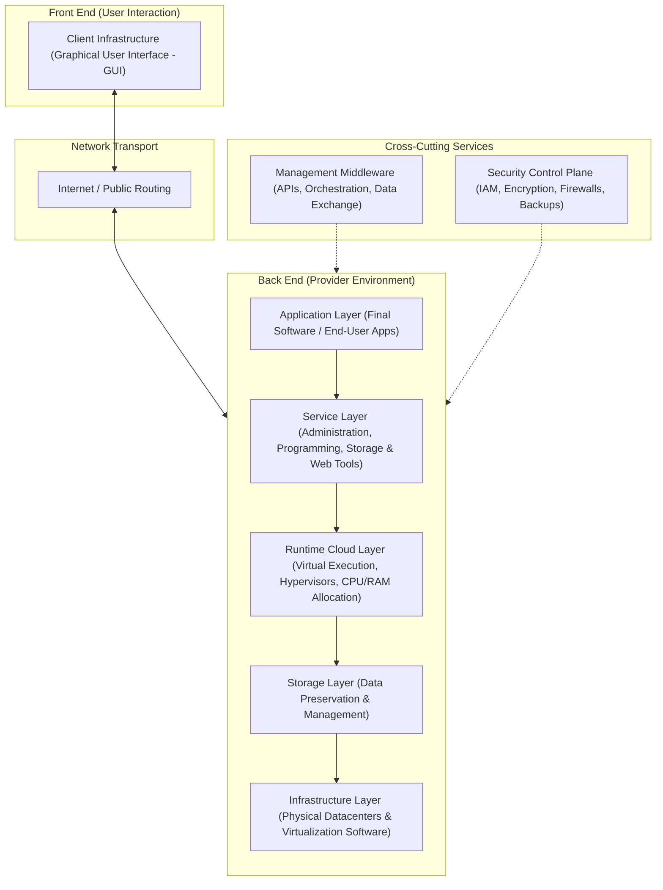

### 1.1. Architectural Layers & Components

#### Frontend Components
*   **Client Infrastructure:** The user-facing graphical interface (GUI) or browser-based portal allowing administrators and end-users to interact with cloud services.

#### Backend Components
*   **Application Layer:** The final software applications running in the cloud environment that users interact with to complete tasks.
*   **Service Layer:** Provides the underlying functions, application utilities, and development frameworks that users consume directly (such as administration consoles, APIs, database access, and specific programming configurations).
*   **Runtime Cloud Layer:** The virtual execution environment. Managed by hypervisors, this layer coordinates CPU, RAM, virtual storage, and network allocations to run concurrent tasks smoothly.
*   **Storage Layer:** Dedicated software and logical arrays utilized to systematically manage and preserve customer and platform data.
*   **Infrastructure Layer:** Includes the raw hardware resources (located in datacenters) alongside the basic virtualization programs necessary to run the cloud's software engine.
*   **Management Layer (Middleware):** Acting as an orchestrating bridge, this middleware links applications, operating systems, and basic cloud assets together. It enables components to exchange data and work in unison without requiring the user to manage low-level network and hardware details.
*   **Security Control Plane:** Ensures comprehensive protection across the environment, covering identity and access management (IAM), encryption, authentication, firewalls, and data backups.

---

### 1.2. The Underlying Infrastructure (Physical vs. Virtual Layers)

The foundational cloud framework—or the "underlying" infrastructure—refers to the hidden, essential resources beneath the visible, consumer-facing software. This foundation is divided into two distinct logical layers:

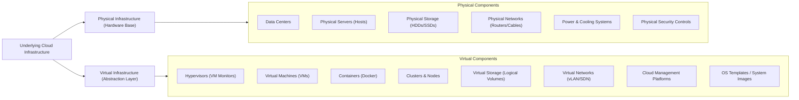

#### 1.2.1. Physical Infrastructure
The concrete, hardware-based layer housed directly inside secured provider facilities.
*   **Data Centers:** Highly secure buildings designed specifically to protect, power, and cool the physical hardware stacks.
*   **Physical Servers (Hosts):** Enterprise machines containing raw computing power, including physical CPUs, RAM modules, motherboard architectures, and network interface cards (NICs).
*   **Physical Storage:** Array systems composed of hard drives (HDDs) and solid-state drives (SSDs) designed to persist system and client data.
*   **Physical Network:** Routers, switches, optical cables, and physical firewalls connecting host servers together and routing traffic to the Internet.
*   **Power and Cooling Systems:** Specialized air conditioning and redundant power grids (UPS systems, generators) configured to prevent hardware failures.
*   **Physical Security:** Security guards, access control badges, biometric scanners, and continuous video monitoring.

#### 1.2.2. Virtual Infrastructure
Formed using virtualization software to abstract, divide, and partition raw physical hardware into flexible, isolated logical units.
*   **Hypervisor (Virtual Machine Monitor - VMM):** Software installed on physical host systems to split hardware resources into isolated, independent virtual systems (e.g., VMware, KVM, Hyper-V).
*   **Virtual Machines (VM):** Self-contained software instances simulating physical computers, running independent operating systems, applications, and configurations.
*   **Containers:** Lightweight, highly portable virtual runtimes (e.g., Docker) that package application code alongside its dependencies (libraries, configs) to deploy faster than standard VMs.
*   **Cluster:** A collection of interconnected physical or virtual servers cooperating as a unified logical computer to maximize availability and fault tolerance.
*   **Nodes:** The basic computing unit inside a cluster. Nodes execute assigned containers or VMs and manage workload distribution.
*   **Virtual Storage:** Logical drives and storage volumes dynamically assigned to VMs and containers, abstracting physical disk arrays.
*   **Virtual Network (vLAN, SDN):** Software-defined network paths enabling virtual machines to communicate securely over virtual channels isolated from other tenants.
*   **Cloud Management Platform (CMP):** The administrative dashboard (e.g., OpenStack, AWS Management Console, VMware vCloud) used to control and coordinate cloud assets.
*   **System Images (OS Templates):** Preconfigured OS files deployed instantly to create uniform virtual environments.

---

## 2. Cloud Service Models

Cloud service models define how computing resources are delivered, classifying services based on who manages specific layers of the technology stack.

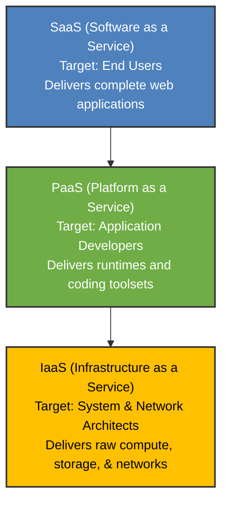

---

### 2.1. Infrastructure as a Service (IaaS)

IaaS provides on-demand access to fundamental computing infrastructure. The provider supplies physical assets and virtual hypervisors, leaving guest operating systems, application stacks, and networking parameters under the customer's direct control.

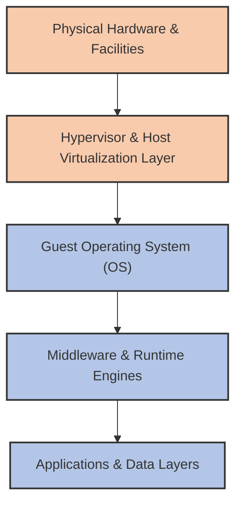

*   **Core Characteristics:**
    *   Exposes virtual infrastructure assets: VMs, raw disk storage, virtual networks, and firewalls.
    *   Relies on hypervisors to split a single physical host machine into isolated multi-tenant VMs.
    *   Offers the **highest level of infrastructure customization**, allowing users to choose operating systems, custom kernel configurations, and software-defined network paths.
*   **Advantages:**
    *   *Maximum Personalization:* Complete administrative control (root/administrator level) over virtual operating systems.
    *   *High Elasticity:* Simple, programmatic scaling of virtual memory, storage, and processing power.
    *   *Zero Physical CAPEX:* Eliminates the cost of acquiring and maintaining server racks.
    *   *High Availability:* Built-in failover, hardware backups, and recovery options managed by the provider.
*   **Disadvantages:**
    *   *Complex Systems Management:* Customers must manage guest OS updates, security patching, application deployments, and firewalls.
    *   *Skills Gap:* Requires specialized system administrators and DevOps engineers to configure and maintain safely.
    *   *Variable Costs:* Unmonitored CPU use or high network throughput can lead to unpredictable monthly billing.
*   **Industry Examples:** Amazon Web Services (AWS EC2, EBS), Microsoft Azure Virtual Machines, Google Cloud Compute Engine, OpenStack.

#### IaaS Practical Case Studies

##### Case Study 1: Academic Grading Web Application
An IT teacher wants to host a grading application for students. Instead of purchasing physical servers, they launch an **AWS EC2 (IaaS)** instance.
1. They create an EC2 virtual machine.
2. They choose an operating system (Ubuntu Linux).
3. They manually install their web server (Apache/Nginx), database engine (MySQL), and application code.
4. They configure networking rules (firewalls, SSH keys) and backups.
5. The application becomes accessible to students via a public IP address.

##### Case Study 2: Netflix Processing and Streaming Engine
Netflix uses **AWS EC2 (IaaS)** to host its video-encoding microservices. This model allows them to rent thousands of virtual instances during peak hours and spin them down when demand drops, paying only for the compute hours consumed (pay-as-you-go).

---

### 2.2. Platform as a Service (PaaS)

PaaS delivers a complete, pre-configured development environment. The cloud provider manages the physical infrastructure, hypervisors, operating systems, middlewares, runtimes, and databases, allowing developers to focus solely on writing and deploying application code.

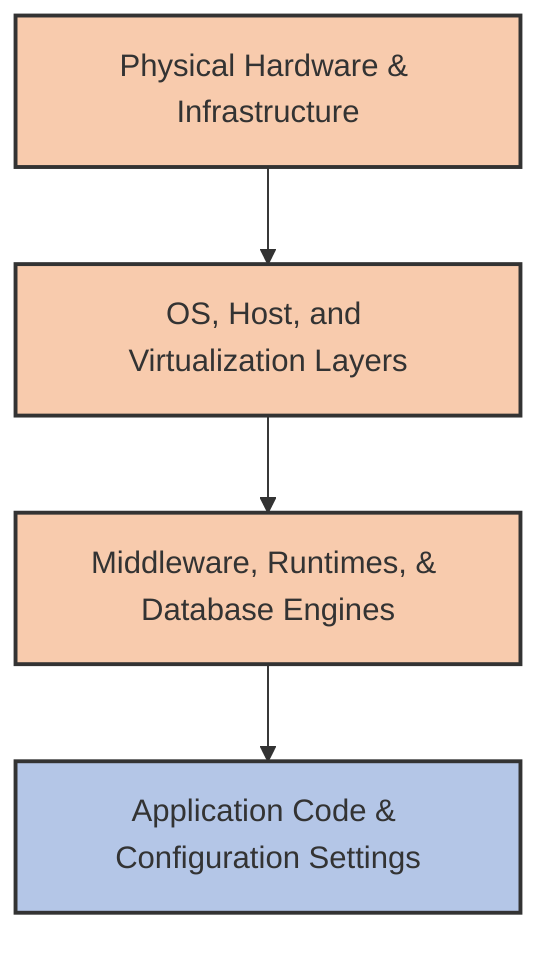

*   **Core Characteristics:**
    *   Provides built-in development platforms, compilers, interpreters, and ready-to-use databases.
    *   Simplifies deployments via Git commands, ZIP uploads, or container packages.
    *   Handles load balancing, software updates, and auto-scaling automatically.
*   **Advantages:**
    *   *Zero Operating System Management:* Developers do not spend time patching operating systems, installing runtime engines, or configuring middlewares.
    *   *Rapid Prototyping:* Accelerates development and deployment times.
    *   *Auto-Scaling:* Automatically matches computing resources to incoming traffic peaks.
    *   *Improved Collaboration:* Shared cloud platforms help distributed development teams work together efficiently.
*   **Disadvantages:**
    *   *Vendor Lock-In:* Applications written for a specific platform's API or configuration files can be difficult to migrate to another provider.
    *   *Limited Customization:* Developers cannot install custom OS drivers, change kernel parameters, or run unsupported runtime versions.
    *   *Testing Complexity:* Replicating cloud-managed services on a local development machine can be challenging.
*   **Industry Examples:** Heroku, Google App Engine, Azure App Service.

#### PaaS Practical Case Studies

##### Case Study 1: Student Flask (Python) Deployment
A student creates a Python Flask web application on their computer. Locally, they have to install Python, configure environments, set up servers, and manage system service definitions. 

By deploying to **Heroku (PaaS)**:
1. They register an account and initialize a Heroku project.
2. They push their repository using Git (`git push heroku main`).
3. Heroku automatically detects the code, resolves dependencies, and configures the web server.
4. The student adds a PostgreSQL database with a simple add-on.
5. The application is immediately online via a public URL.

##### Case Study 2: Real-Time Mobile Startup Analytics
A mobile startup is developing a real-time analytics application. Because they want to focus on their software rather than infrastructure, they deploy to **Google App Engine**. The platform automatically manages operational scaling, security updates, and database hosting.

---

### 2.3. Software as a Service (SaaS)

SaaS delivers fully functional, completed applications over the Internet. The provider manages the entire technology stack—from the physical servers up to the user interface. End-users access the software via web browsers, eliminating the need for local installations.

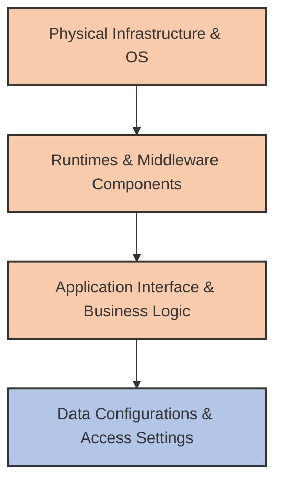

*   **Core Characteristics:**
    *   Eliminates local software installations and updates; applications run directly in web browsers.
    *   Utilizes a shared multi-tenant database architecture to host client applications efficiently.
    *   Uses web-native API services to handle licensing, subscriptions, and user management.
*   **Advantages:**
    *   *No Technical Maintenance:* The cloud provider handles all software updates, security patches, and performance optimizations.
    *   *Universal Access:* Users can log in safely from any internet-connected device.
    *   *Low Initial Costs:* Avoids expensive upfront licensing fees, replacing them with simple subscription-based pricing.
    *   *Integrated Customer Support:* Built-in troubleshooting, documentation, and technical help.
*   **Disadvantages:**
    *   *Minimal Customization:* Users cannot modify application source code, databases, or core visual interfaces.
    *   *Internet Dependency:* Requires a continuous, high-speed connection; offline capabilities are often limited.
    *   *Data Privacy Risks:* Organizations must trust third-party providers to secure sensitive data.
    *   *Integration Challenges:* Integrating SaaS platforms with on-premise legacy systems can be difficult.
*   **Industry Examples:** Google Workspace, Microsoft Office 365, Salesforce, Dropbox, Zoom.

#### SaaS Practical Case Study

##### Case Study: University Google Workspace Integration
A university implements Google Workspace to handle email, file sharing, and calendar operations. The university's IT department does not need to configure physical email servers or local storage arrays. Google handles all technical operations, allowing the university to focus on administrative tasks like user onboarding, account provisioning, and access permissions.

---

## 3. The Shared Responsibility Model

Security in the cloud is a shared responsibility between the provider and the customer. The provider secures the infrastructure hosting the services, while the customer secures their data, configurations, and applications within that infrastructure.

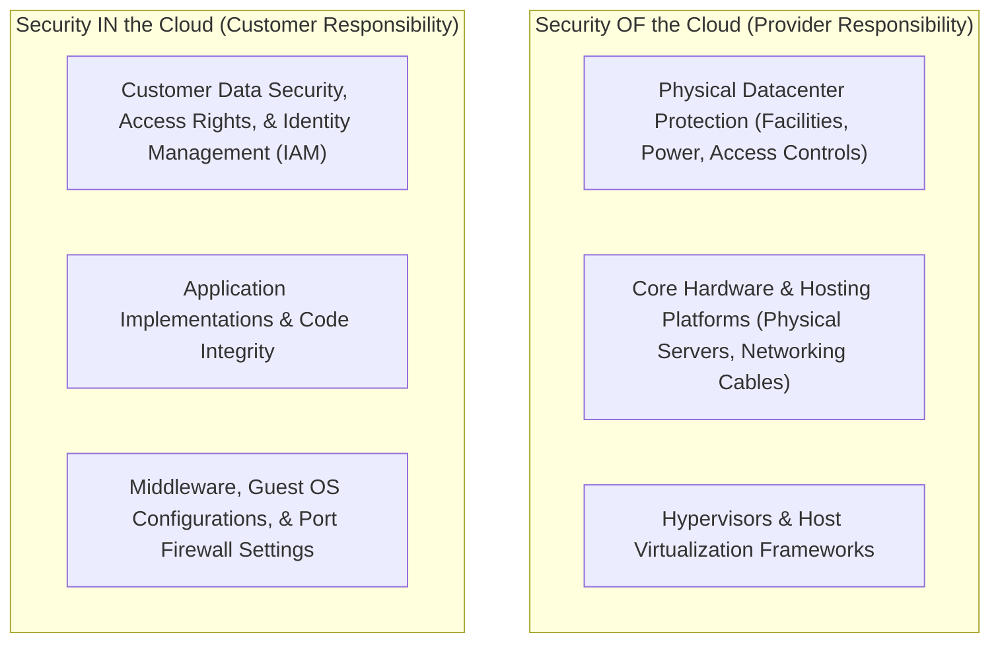

### 3.1. Responsibility Matrix by Service Model

As you move from IaaS to PaaS to SaaS, the provider's operational footprint expands, and the customer's management overhead shrinks.

| Technical Component | On-Premise | IaaS | PaaS | SaaS |
| :--- | :---: | :---: | :---: | :---: |
| **Physical Security & Facilities** | **Client** | Provider | Provider | Provider |
| **Core Servers, Cabling, & Storage Hardware** | **Client** | Provider | Provider | Provider |
| **Virtualization & Hypervisor Software** | **Client** | Provider | Provider | Provider |
| **Operating System Support & Patching** | **Client** | **Client** | Provider | Provider |
| **Middleware & Database Engines** | **Client** | **Client** | Provider | Provider |
| **Runtime Software Components** | **Client** | **Client** | Provider | Provider |
| **Application Code & Operations** | **Client** | **Client** | **Client** | Provider |
| **Access Rights & Identities (IAM)** | **Client** | **Client** | **Client** | **Client** |
| **Data Security & Classifications** | **Client** | **Client** | **Client** | **Client** |

---

### 3.2. Practical Security Scenarios

#### IaaS Scenario: Compromised Virtual Operating System
An organization launches an Ubuntu VM in an IaaS environment but fails to apply security patches for six months. An attacker exploits an unpatched OS vulnerability to gain access.
*   **Who is responsible?** The **customer**. The provider secures the physical hardware and hypervisor, but the customer is responsible for patching and securing the guest operating system.

#### PaaS Scenario: Vulnerable Application Code
A developer deploys a Python web application containing an SQL injection vulnerability to a PaaS environment. An attacker exploits this vulnerability to steal customer database records.
*   **Who is responsible?** The **customer**. The platform provider secures the underlying OS, middleware, and database engines, but the customer is responsible for securing their custom application code and logic.

#### SaaS Scenario: Weak Access Management and Shared Links
An employee shares a confidential document stored in a SaaS platform using a publicly accessible link. An unauthorized user accesses the document.
*   **Who is responsible?** The **customer**. The SaaS provider secures the software, servers, and data centers, but the customer is responsible for managing user access permissions, identity policies, and sharing configurations.

---

## 4. Cloud Deployment Models

Cloud deployment models define how infrastructure is hosted, owned, and isolated.

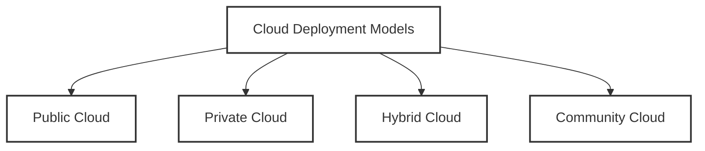

---

### 4.1. Public Cloud

An organization hosts its IT infrastructure on servers owned and managed by a third-party cloud provider. Multiple companies (tenants) share the same physical hardware resources, logically isolated by hypervisors and network-segmentation protocols.

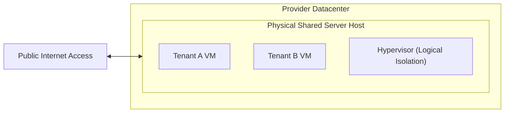

*   **Core Characteristics:**
    *   Computing resources are shared among multiple tenants over the public internet.
    *   Features pay-as-you-go pricing models.
    *   The provider is responsible for maintaining the physical facilities and hardware.
*   **Advantages:**
    *   *Low Initial Costs:* No up-front investments in physical hardware.
    *   *Rapid Elasticity:* Access to virtually unlimited computing resources to handle traffic spikes.
    *   *Zero Hardware Maintenance:* The provider manages physical servers, cooling, and network hardware.
    *   *Global Reach:* Organizations can deploy applications in multiple geographic zones with a single click.
*   **Disadvantages:**
    *   *Less Customization:* Users cannot customize low-level hardware or physical network configurations.
    *   *Data Sovereignty Concerns:* Keeping data on shared servers may conflict with regional regulations.
    *   *Variable Performance:* Shared hardware can suffer from performance fluctuations due to neighboring tenants ("noisy neighbors").
*   **Suitable For:**
    *   Applications with highly variable or unpredictable traffic.
    *   Startups requiring low initial capital expenses (CAPEX).
    *   Web hosting and public-facing applications.
*   **Unsuitable For:**
    *   Organizations with highly sensitive data requiring complete physical isolation.
    *   Companies requiring specialized hardware customizations.
*   **Case Study:** Early-stage e-commerce startups (like Airbnb in its early days) use public cloud platforms to scale global user traffic dynamically without purchasing physical servers.

---

### 4.2. Private Cloud

A cloud infrastructure dedicated exclusively to a single organization. It can be hosted internally in the organization's own datacenter, or externally managed by a third-party provider, but the physical hardware remains strictly dedicated to one tenant.

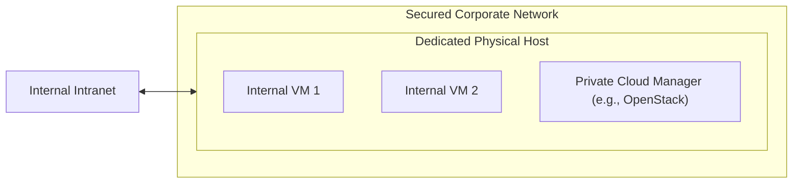

*   **Core Characteristics:**
    *   Hardware is completely isolated from other organizations.
    *   Provides higher security, data privacy, and control.
    *   Requires dedicated physical hardware and local network management.
*   **Advantages:**
    *   *Maximum Security:* Complete physical isolation protects sensitive workloads and intellectual property.
    *   *Predictable Performance:* Dedicated hardware eliminates performance interference from neighboring tenants.
    *   *High Customization:* Full control over physical configurations, server models, and security rules.
*   **Disadvantages:**
    *   *High Upfront Costs:* Requires significant capital investments in physical hardware, licensing, and facility setup.
    *   *Limited Elasticity:* Scaling is constrained by the physical hardware installed in the datacenter.
    *   *Maintenance Overhead:* Local IT teams are responsible for all hardware repairs, network configurations, and power management.
*   **Suitable For:**
    *   Financial institutions, healthcare organizations, and government agencies with strict compliance requirements.
    *   Organizations with predictable, stable workloads that do not require rapid scaling.
*   **Unsuitable For:**
    *   Small startups or organizations with highly variable workloads and tight budgets.
*   **Case Study:** A university builds a private cloud platform using **OpenStack** on its internal servers. This environment allows computer science students to provision virtual machines safely for coursework without exposing university data or incurring public cloud costs.

---

### 4.3. Hybrid Cloud

An IT infrastructure that connects a private cloud or local datacenter with a public cloud. This model allows data and applications to move dynamically between environments, helping organizations leverage the benefits of both.

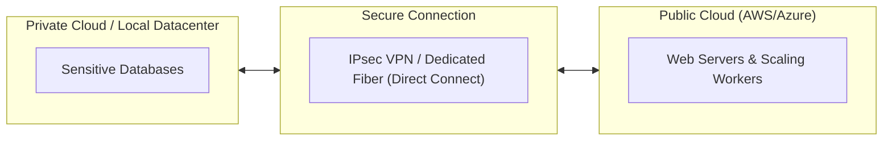

*   **Core Characteristics:**
    *   Integrates private resources with public cloud services.
    *   Uses secure VPN tunnels or dedicated physical connections (e.g., AWS Direct Connect, Azure ExpressRoute) for communication.
    *   Allows workloads to scale dynamically between environments based on demand or security needs.
*   **Advantages:**
    *   *Strategic Flexibility:* Sensitive data remains in the private cloud, while web-facing applications run on scalable public infrastructure.
    *   *Cost Optimization:* Organizations can use the public cloud to absorb temporary traffic spikes (cloud bursting) instead of buying permanent hardware.
    *   *Seamless Migration:* Supports gradual migration of workloads from legacy systems to the cloud.
*   **Disadvantages:**
    *   *High Management Complexity:* Requires managing identity, security, and networking across two different environments.
    *   *Network Latency Issues:* Data transfer between on-premise servers and the public cloud can introduce latency.
    *   *Complex Security Policies:* Organizations must maintain consistent security policies across public and private resources.
*   **Suitable For:**
    *   Organizations with strict data security requirements that also need the elastic scaling of the public cloud.
    *   Enterprises migrating slowly from legacy on-premise systems to public cloud platforms.
*   **Unsuitable For:**
    *   Small organizations lacking the technical expertise to manage dual environments.
*   **Case Study (Hospital AI Analysis):** A hospital stores sensitive patient records on-site inside its private cloud. To run deep learning diagnostic models, they securely anonymize the datasets and transmit them via VPN to a public cloud AI engine (such as Microsoft Azure). Once the analysis is complete, the diagnostic reports are sent back to the hospital's private cloud database.

---

### 4.4. Community Cloud

An infrastructure shared by several organizations with common goals, such as compliance requirements, security levels, or research objectives. It can be managed internally by the participating organizations or by a third-party provider.

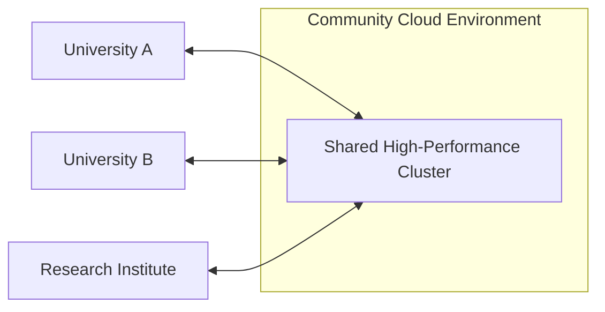

*   **Core Characteristics:**
    *   Shares costs and resources among a small group of participating organizations.
    *   Access is restricted to authorized community members.
    *   Tailored to meet specific industry standards or regulatory requirements.
*   **Advantages:**
    *   *Shared Costs:* Organizations split the cost of custom infrastructure, making it more affordable than a dedicated private cloud.
    *   *Tailored Compliance:* Pre-configured to meet specific sector requirements, such as federal security standards.
    *   *Collaboration:* Facilitates secure data sharing and collaboration among member organizations.
*   **Disadvantages:**
    *   *Complex Governance:* Managing resource allocation, cost distribution, and decision-making among multiple partners can be challenging.
    *   *Shared Vulnerabilities:* If one member's account is compromised, it can put other organizations on the network at risk.
    *   *Lower Flexibility:* Resource usage policies must be negotiated and agreed upon by the entire community.
*   **Suitable For:**
    *   Government bodies sharing collaborative portals (e.g., Government Cloud).
    *   Academic research associations performing intensive scientific research.
    *   Healthcare providers sharing diagnostic platforms.
*   **Unsuitable For:**
    *   Highly competitive private enterprises requiring complete autonomy.
*   **Case Study (EduCloud Platform):** Multiple regional universities pool their financial resources to build **EduCloud**, a shared community cloud platform. This environment hosts collaborative academic databases and high-performance computing clusters, allowing researchers to run large-scale climate simulations without any single university purchasing the hardware alone.