# Chapter 3: Virtualization (La Virtualisation)

---

## Course Context
* **Institution:** Université M'Hamed Bougara, Département d'informatique
* **Level:** Master 1 — Applied Artificial Intelligence (Intelligence Artificielle Appliquée - I2A)
* **Course:** Cloud Computing and Big Data
* **Instructor:** Djouher AKROUR
* **Academic Year:** 2025/2026

---

## 1. Introduction & Foundational Concepts

### 1.1. Core Definition
Virtualization is a set of hardware and/or software techniques that allow the execution of multiple independent applications (or operating systems) on a single physical host machine. It adds an abstraction layer between the underlying physical hardware resources and the applications or operating systems running above.

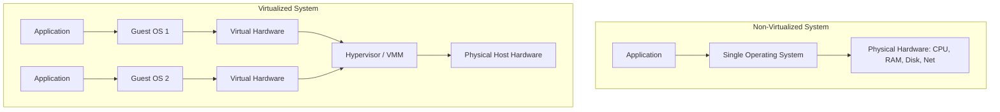

### 1.2. Why Virtualization Emerged
* **Before Virtualization:** Most physical servers ran only a single operating system and task at a time. This structural limitation left a vast majority of the machine's processing power idle, wasting hardware resources, space, and energy.
* **With Virtualization:** It became possible to run multiple virtual computers (Virtual Machines) on a single physical host. This consolidates workloads, maximizes physical hardware utilization, and allows the simultaneous execution of distinct tasks under isolated conditions.

### 1.3. Virtualization in Cloud Computing
Virtualization is the most critical underlying technology within cloud computing. Cloud providers leverage it to partition high-capacity physical servers into multiple smaller, isolated virtual servers. This partitioning enables multi-tenancy, allowing enterprises to lease and utilize only the resources they require on-demand, without incurring additional hardware acquisition or operational costs.

---

## 2. Technical Case Study: The Multi-Server Dilemma

To understand the benefits of virtualization, consider an enterprise requiring servers to fulfill four distinct, isolated operations:

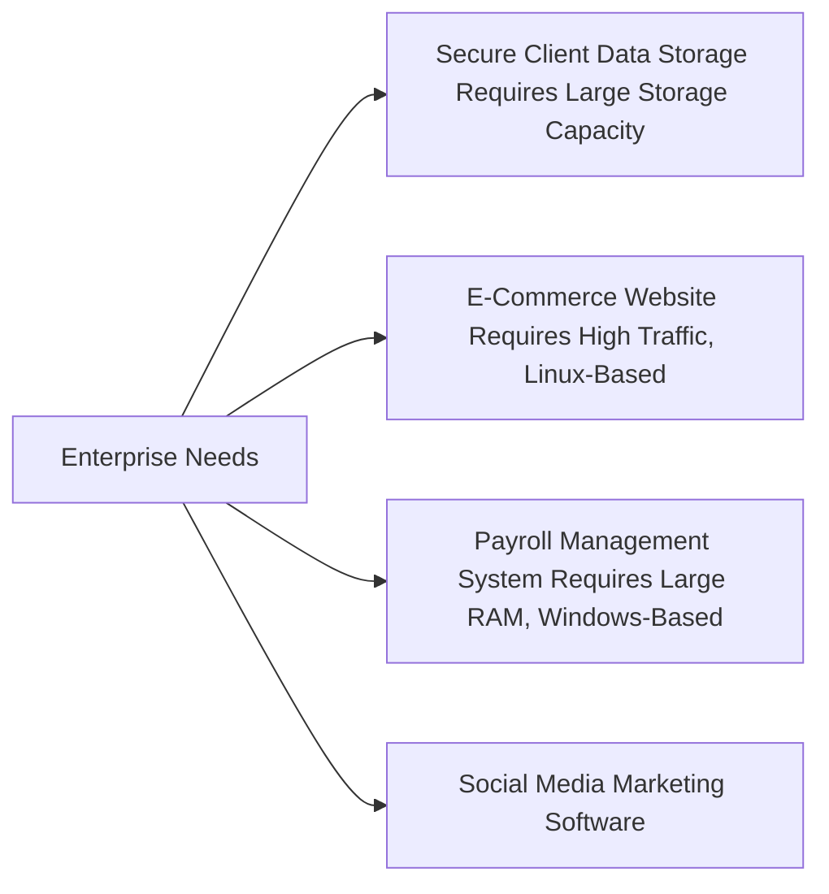

### 2.1. Solution A: Traditional Bare-Metal Deployment
* **Implementation:** The enterprise purchases, configures, and maintains **4 separate physical servers**, each dedicated to a single application.
* **Drawbacks:** High initial hardware capital expenditure (CapEx), high energy costs, underutilized server capacity, and complex physical maintenance.

### 2.2. Solution B: Virtualized Deployment
* **Implementation:** The enterprise deploys a small pool of high-capacity physical servers and runs the **4 separate workloads inside 4 isolated Virtual Machines (VMs)** on top of a hypervisor.
* **Benefits:**
    * **Economy:** Drastic reduction in physical hardware acquisition and maintenance costs.
    * **Flexibility:** Dynamic resource allocation (CPU, RAM, storage) can be adjusted per VM without physical intervention.
    * **Ecology:** Lower power consumption and cooling requirements in the data center.
    * **Centralized Management:** Unified administration of the entire infrastructure from a single pane of glass.
    * **Isolation:** A security breach or system failure on one VM remains sandboxed and does not impact other VMs.

---

## 3. History & Historical Milestones

Virtualization is not a novel concept; its architectural foundations date back over six decades.

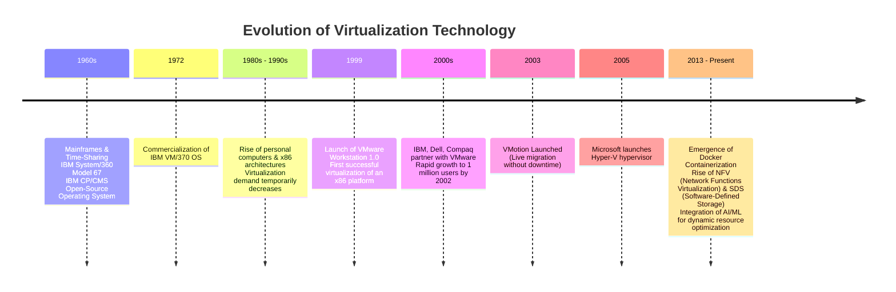

### 3.1. The Mainframe Era (1960s)
* **The Challenge:** Early mainframes were massive, expensive computers capable of performing high-volume processing. However, only one company division or terminal user could access the system at a time, forcing others to wait for their turn. This underutilization necessitated a method to share mainframe resources.
* **IBM System/360 Model 67:** IBM developed this hardware model to support time-sharing systems, though its initial implementation did not achieve immediate market success.
* **CP/CMS (Control Program / Console Monitor System):** IBM subsequently launched CP/CMS. It was highly innovative because its source code was open and free for IBM customers. It consisted of two main components:
    * **CP (Control Program):** The underlying control program that created, managed, and isolated virtual machines. It allowed users to manage virtual hardware from a physical terminal.
    * **CMS (Console Monitor System):** A lightweight, interactive, single-user operating system designed to run inside a VM managed by the CP.
* **Historical Impact:** CP/CMS proved that multiple CMS instances could run concurrently on a single physical host without degrading performance. Each VM had its own virtual peripherals mapped directly to the host's physical hardware. This architecture heavily inspired modern hypervisors.

### 3.2. Commercialization & The x86 Shift
* **1972 (VM/370):** IBM commercialized the VM/370 operating system, direct successor to late CP/CMS versions. In modern environments, the hypervisor serves the exact role once performed by IBM's Control Program (CP).
* **The 1980s & 1990s:** With the introduction and mass-market deployment of the x86 architecture and personal computers (PCs), physical hardware became cheap and plentiful. Consequently, the urgent need to virtualize hardware declined during this period.
* **1999 (VMware Workstation 1.0):** VMware successfully virtualized the complex x86 architecture, releasing VMware Workstation 1.0. This, combined with the exponential growth of the Internet and enterprise compute needs, revived global interest in virtualization.
* **The 2000s Expansion:**
    * **2000:** Enterprise hardware giants (IBM, Dell, Compaq) partnered with VMware.
    * **2003:** VMware released **VMotion**, an advancement allowing the live transfer of running VMs from one physical server to another with zero downtime.
    * **2005:** Microsoft launched **Hyper-V** to challenge VMware's dominance, offering support for multiple guest operating systems without requiring modifications to the guest kernel.

---

## 4. Hypervisors (Virtual Machine Monitors)

### 4.1. Definition
A hypervisor, or **Virtual Machine Monitor (VMM)**, is an intermediary software layer running between the physical server hardware (host system) and the virtual machines (guest systems). It abstracts the physical hardware to create, schedule, and isolate multiple VMs.

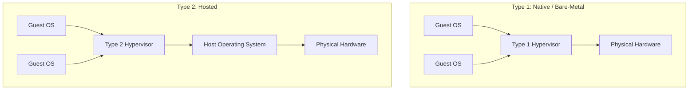

### 4.2. Core Roles of a Hypervisor

#### 1. Hardware Abstraction
The hypervisor creates a virtual representation of physical hardware (virtual CPU, virtual RAM, virtual storage controllers, virtual network cards) for each VM. The guest OS remains unaware that its devices are virtual and interacts with them as if it has exclusive access to the underlying physical silicon.

#### 2. Resource Allocation & Balance
The hypervisor dynamically schedules and distributes shared physical CPU, memory, storage, and networking resources. To maintain performance, the hypervisor:
* Uses advanced planning and scheduling algorithms.
* Prioritizes critical VMs over non-critical ones.
* Retains a buffer of excess physical resources to absorb workload spikes.

#### 3. Communication Mediation
It acts as a translator between guest systems and physical devices:
1. Intercepts virtual hardware calls (system calls/I/O requests) from the guest OS.
2. Translates them into equivalent instructions compatible with the physical hardware.
3. Transmits the requests to the physical hardware and returns the physical response back to the guest VM.

#### 4. Security & Isolation
* Enforces boundaries between VMs to prevent them from reading or modifying each other's memory spaces or network traffic.
* Controls VM access permissions to physical resources.
* Manages virtual networks bridging the VMs.

---

### 4.3. Type 1 vs. Type 2 Hypervisors

#### Type 1: Native / Bare-Metal
Type 1 hypervisors install and execute directly on the bare-metal server hardware without an intermediary host operating system.

* **Characteristics:**
    * **Direct Access:** Communicates directly with the physical CPU, memory, and storage controllers.
    * **High Performance:** No overhead from a host OS layer; almost all hardware capacity is dedicated to the virtual machines.
    * **Security:** Smaller attack surface. A compromise in a guest VM cannot easily compromise the hypervisor layer.
    * **Isolation:** Strong boundaries between virtual machines.
    * **Drawback:** Requires a separate physical management machine/console to configure and monitor the host.
* **Enterprise Use Cases:** Running production servers, private clouds, and large enterprise data centers where efficiency and high availability are required.
* **Industry Examples:** VMware ESXi, Microsoft Hyper-V, Xen.

#### Type 2: Hosted
Type 2 hypervisors run as standard software applications on top of an existing host operating system.

* **Characteristics:**
    * **Indirect Access:** Hardware access is mediated through multiple layers: `VM -> Hypervisor -> Host OS -> Physical Hardware`.
    * **Higher Overhead:** Slower I/O processing and lower performance due to multi-step request translation.
    * **Lower Reliability:** More points of failure. If the host operating system crashes or requires a reboot, all running VMs crash or stop immediately.
    * **Convenience:** Extremely easy to install, deploy, and configure. It inherits its hardware drivers and configurations directly from the host OS.
* **Use Cases:** Software development, running legacy applications, cross-platform testing, and educational or personal environments. Not suitable for production workloads.
* **Industry Examples:** Oracle VM VirtualBox, VMware Workstation Player, Microsoft Virtual Server 2005.

---

### 4.4. Structural Comparison

| Feature | Type 1 Hypervisor (Bare-Metal) | Type 2 Hypervisor (Hosted) |
| :--- | :--- | :--- |
| **Installation** | Directly on physical hardware (Bare-Metal) | On top of a host operating system |
| **Performance** | High (near native, direct hardware access) | Lower (depends on host OS scheduling and driver layers) |
| **Security** | Strong (fewer components, isolated from host OS flaws) | Moderate (vulnerabilities in the host OS affect all VMs) |
| **Resource Allocation**| Exclusively dedicated to running VMs | Shared with host OS background tasks and desktop apps |
| **Typical Target** | Enterprise datacenters, servers, and clouds | Personal computers, testing environments, developers |
| **Management** | Typically managed via remote specialized tools | Managed locally via a standard GUI application |

---

## 5. Anatomy of a Virtual Machine (VM)

### 5.1. Description
To the hypervisor and the host storage, a Virtual Machine is not a physical unit. It is simply a directory containing a structured collection of specific files. Inside this virtual container runs a complete, isolated operating system (Guest OS) and its applications.

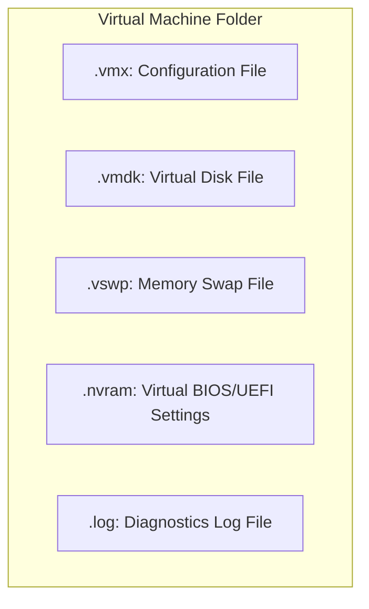

### 5.2. Technical File Structure (VMware Standards)
While file extensions vary between hypervisors (e.g., VMware vs. Hyper-V), the technical structure and logical roles remain identical:

* **`.vmx` (Configuration File):** A text-based file containing all the configuration parameters of the VM. It defines the allocated RAM, the number of virtual CPUs (vCPUs), paths to virtual disks, network interface MAC addresses, and power states. This is the primary blueprint of the VM.
* **`.vmdk` (Virtual Disk File):** The virtual representation of the VM's hard drive. It contains the actual guest file systems, operating system installations, programs, and user data. This file is typically the largest and grows dynamically or is pre-allocated.
* **`.vswp` (Swap / Paging File):** An emergency virtual memory file created by the hypervisor *only* when the VM is powered on and running. If the physical host runs out of RAM, the hypervisor swaps inactive VM memory pages to this file. It is deleted automatically when the VM powers off.
* **`.nvram` (Non-Volatile RAM File):** Stores the virtual machine's BIOS or UEFI configuration settings (such as the boot order, system clock settings, and hardware toggles). It is comparable to the physical CMOS memory chip on a motherboard.
* **`.log` (Log Files):** Text files maintaining a detailed chronological history of the VM's execution. These logs capture hypervisor alerts, boot steps, shutdowns, and crashes, making them the primary tool for diagnostic troubleshooting.

---

## 6. Virtual Machine Migration Techniques

VM Migration is the transfer of a VM's active execution state from one physical host to another.

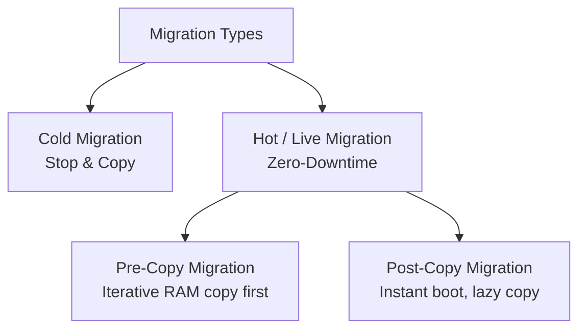

### 6.1. State Elements Transferred
A complete migration must package and move three distinct states over the network:
1. **Memory State:** Volatile and non-volatile RAM contents (this represents the largest data payload).
2. **CPU State:** CPU register values, active flags, and instruction pointers of the virtual CPUs (vCPUs).
3. **Network State:** MAC address configurations, IP states, and open socket information of the Virtual Network Interface Cards (vNICs) to maintain active connections.

### 6.2. Why Migrate?
* **Load Balancing:** Dynamic redistribution of active workloads from heavily congested physical hosts to underutilized ones.
* **Maintenance & High Availability:** Moving VMs off physical hardware that is showing early signs of failure, or clearing a host for scheduled physical maintenance without service interruption.
* **Performance Optimization:** Aligning VMs with hosts physically closer to database storages or specific networks.

---

### 6.3. Cold Migration (STOP and COPY)
This is the most basic, straightforward migration strategy.

#### Step-by-Step Algorithm
1. **Power Off:** The virtual machine is powered off or suspended, pausing all active processes and committing RAM states to disk.
2. **Data Copy:** The hypervisor copies the configuration files (`.vmx`) and the virtual disks (`.vmdk`) across the network to the destination physical host.
3. **Registration & Power On:** The target host registers the VM files within its inventory and powers the VM back on.
4. **Resumption:** The VM boots up, resuming operations from its last saved state.

* **Advantage:** Highly reliable, simple to perform, and involves zero memory transfer faults.
* **Disadvantage:** Severe service downtime; the applications are completely offline during the entire transfer window, which can take hours for large disks.

---

### 6.4. Hot / Live Migration
Live migration transfers a running virtual machine from one host to another with near-zero service interruption. It requires shared storage (SAN or NAS) accessible by both hosts so that virtual disks do not need to be copied over the network, only the execution states.

#### Strategy A: Pre-Copy Migration (Iterative Copying)
This is the industry standard for production environments. It copies the memory state *before* switching host execution.

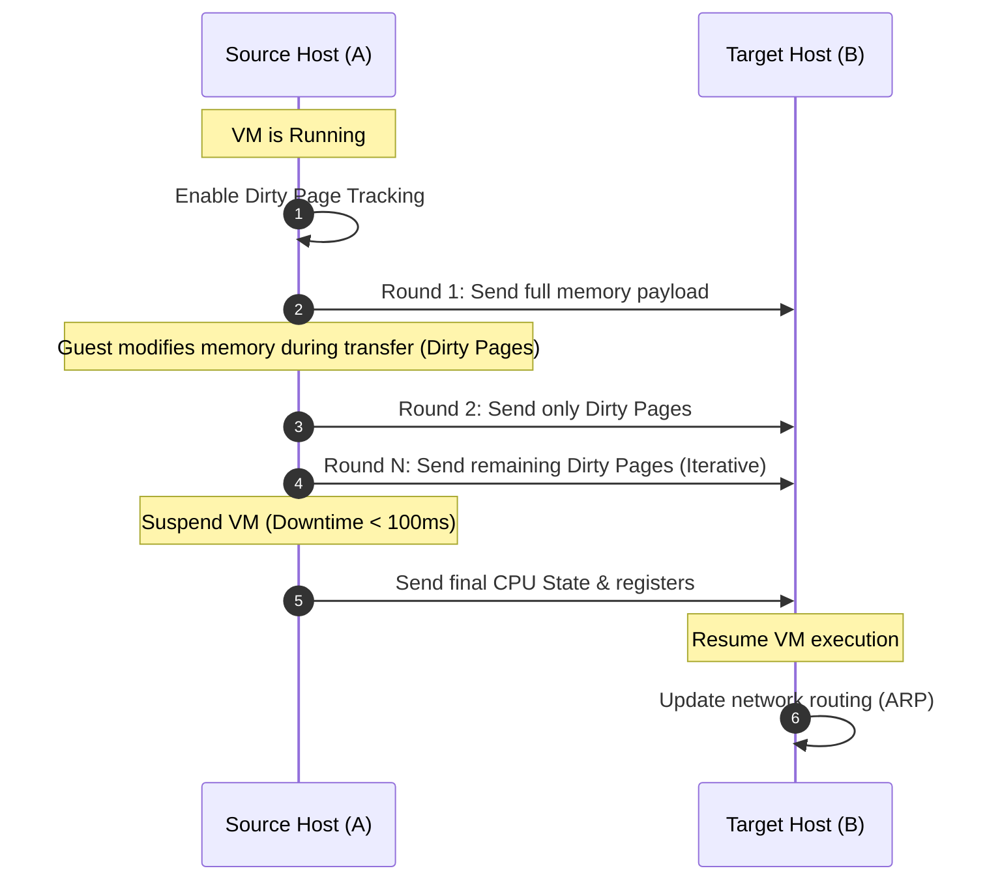

1. **Initialization:** Establish a connection between Source Host A and Target Host B. Enable **dirty page tracking** (marking any memory page modified by the VM after its initial copy).
2. **First Copy Pass:** Copy the VM's entire active RAM payload from Host A to Host B while the VM continues running.
3. **Iterative Copy Passes:** Because the VM continues processing, it modifies (dirties) some memory pages. The hypervisor copies only these modified pages to Host B. This step repeats over several iterative rounds, with each round transferring progressively smaller dirty page sets.
4. **Freeze Window:** Once the remaining dirty pages can be copied in milliseconds, the hypervisor temporarily pauses the VM on Host A.
5. **Final State Handover:** The final set of dirty pages, CPU registers, and execution states are copied to Host B.
6. **Resume:** The VM is resumed on Host B, and network tables (such as ARP tables) are updated to redirect traffic to the new host.

* **Advantage:** Minimal, near-imperceptible service downtime (typically under 100 milliseconds).
* **Disadvantage:** If the VM modifies its memory faster than the network can transmit (highly write-intensive workloads), the pre-copy rounds will fail to converge, prolonging the migration.

---

#### Strategy B: Post-Copy Migration (Lazy Copying)
Post-copy migration switches host execution *before* transferring the memory state.

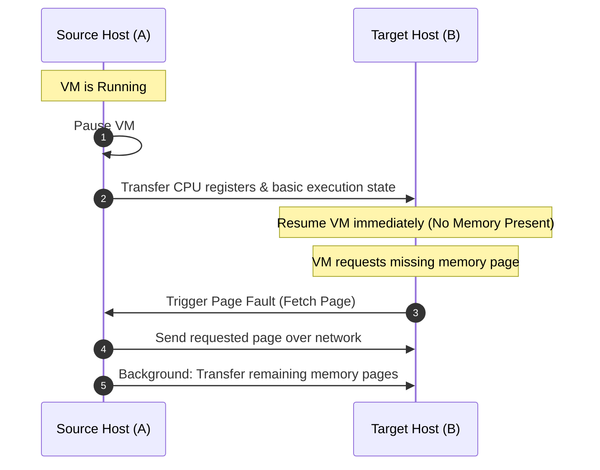

1. **Immediate Pause:** The hypervisor pauses the VM on Source Host A.
2. **Minimal Transfer:** Transfers only the CPU registers and basic execution state metadata to Target Host B.
3. **Immediate Boot:** Target Host B resumes the VM immediately. At this point, the VM is running but has no local memory payload.
4. **On-Demand Page Pulling (Page Fault Handling):** When the running VM attempts to access a memory address not yet transferred, it triggers a **page fault**. The target hypervisor intercepts this, requests the specific page from Host A over the network, injects it, and allows the VM to continue executing.
5. **Background Transfer:** Concurrently, a background process copies the remaining memory pages from Host A to Host B until the transfer is complete.

* **Advantage:** Instantaneous switchover. Guaranteed to succeed even for highly write-intensive workloads since each memory page is transferred exactly once.
* **Disadvantage:** High risk of VM corruption. If the network drops mid-migration, the VM's memory state is split across two hosts, causing a crash. Additionally, frequent network page faults cause performance degradation during the transfer.

---

## 7. Security in Virtualization

### 7.1. Virtualization as a Security Asset
Virtualization provides several built-in security advantages:
* **VM Isolation:** Each VM operates in an isolated sandbox. A compromise or system crash in VM A does not propagate to VM B.
* **Host Cloaking:** The host OS can be configured to remain invisible on the network, exposing only the guest VMs. This protects the host while allowing it to run monitoring tools (like Intrusion Detection Systems) without detection by attackers inside the VMs.
* **Decoy Systems (Honeypots):** VMs can be easily deployed as decoys (honeypots) to attract, isolate, and safely analyze attacker behavior without exposing physical hardware.

---

### 7.2. Virtualization Vulnerabilities & Attacks

#### 1. VM Escape (Évasion)
This is the most severe virtualization threat. 
* **Mechanic:** An attacker compromises the guest OS inside VM A, exploits a vulnerability in the hypervisor code, and escapes the virtual boundary to execute malicious commands directly on the host.
* **Consequence:** Once inside the host or hypervisor layer, the attacker gains full control over all other VMs running on that host, accessing their memory, storage, and configurations.

#### 2. VM Sprawl (Prolifération)
* **Mechanic:** Because VMs are easy to create, administrators often provision them for temporary tasks and forget to decommission them.
* **Consequence:** The datacenter accumulates unmanaged, unmonitored "zombie" VMs. These VMs consume resources and, because they do not receive security updates, become easy entry points for attackers to breach the network.

#### 3. VM Hopping (Passage non autorisé)
* **Mechanic:** An attacker compromises VM A and, by exploiting virtual switch or virtual network vulnerabilities managed by the hypervisor, jumps laterally to VM B on the same physical host.
* **Consequence:** Bypasses external corporate firewalls since the traffic remains internal to the host's virtual network.

#### 4. VM Hyperjacking (Prise de contrôle de l'hyperviseur)
* **Mechanic:** A highly sophisticated attack where malware installs a malicious hypervisor directly underneath the existing operating system (moving the OS to a VM layer) or compromises the existing Type 1 hypervisor.
* **Consequence:** The attacker gains complete control of the host machine while remaining invisible to standard antivirus and security tools running inside the guest operating systems.

---

### 7.3. Mitigation Solutions
To counter these threats, security frameworks recommend:
* **Hypervisor Hardening:** Regular patching and disabling of unused hypervisor features (like clipboard sharing or file-sharing APIs).
* **Identity and Access Management (IAM):** Restricting administrator access to the hypervisor console.
* **Secure Coding Practices:** Developing hypervisor APIs with strict boundary verification to block escape attempts.
* **Unified Lifecycle Management:** Keeping an active inventory of VMs and setting automatic expiration dates to prevent VM sprawl.

---

## 8. Taxonomy of Virtualization Techniques

The broad virtualization landscape can be structured into three main categories based on what level of the stack is abstracted.

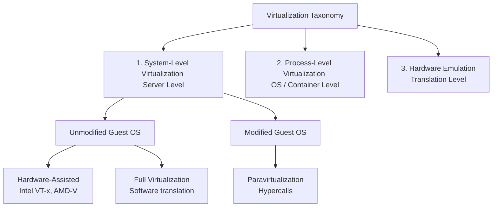

---

### 8.1. System-Level Virtualization (Server Level)
System-level virtualization abstracts physical hardware to run multiple complete, independent guest operating systems on a single host.

---

#### Strategy 1: Unmodified Guest OS
The guest operating system is unaware that it is virtualized and requires no modification to its kernel source code.

##### A. Full Virtualization (Virtualisation Totale)
* **Mechanic:** The guest OS attempts to execute privileged ring 0 kernel instructions. The hypervisor intercepts these instructions in software, translates them into safe instructions, and executes them on the physical hardware. This creates a complete abstraction layer.
* **Advantage:** Compatible with any commercial operating system (Windows, macOS) without modification.
* **Disadvantage:** Slower performance due to the overhead of real-time software instruction translation.
* **Tools:** Oracle VM VirtualBox, VMware Workstation.

##### B. Hardware-Assisted Virtualization (Virtualisation assistée par le matériel)
* **Mechanic:** Leverages virtualization features built directly into physical CPUs (Intel VT-x, AMD-V). The CPU provides a highly privileged mode (root mode, Ring -1) for the hypervisor, allowing the guest OS to run in Ring 0 without modification.
* **Advantage:** Eliminates software translation overhead. Sensitive instructions are handled directly by the processor, resulting in faster and more efficient execution.
* **Disadvantage:** Incompatible with older CPU models that lack hardware virtualization extensions.
* **Tools:** KVM, Microsoft Hyper-V.

---

#### Strategy 2: Modified Guest OS

##### Paravirtualization (Paravirtualisation)
* **Mechanic:** The guest operating system's kernel is modified before installation. The OS knows it is virtualized and cooperates with the hypervisor. Instead of attempting to execute privileged hardware instructions directly, the modified kernel makes direct API calls (called **hypercalls**) to the hypervisor.
* **Advantage:** High execution performance, minimal resource overhead, and efficient CPU scheduling.
* **Disadvantage:** Incompatible with proprietary operating systems (such as Windows) where the kernel source code cannot be modified. It is restricted to open-source operating systems like Linux.
* **Tools:** Xen Project.

---

#### System-Level Comparison

| Evaluation Feature | Full Virtualization (Complete) | Hardware-Assisted Virtualization | Paravirtualization |
| :--- | :--- | :--- | :--- |
| **Guest OS Modified?** | No | No | Yes (requires kernel source modification) |
| **Guest OS Aware?** | No | No | Yes (uses hypercalls) |
| **Instruction Translation** | Software binary translation | CPU hardware handles execution | Guest OS sends hypercalls directly to hypervisor |
| **Performance** | Moderate to low | High | High (excellent efficiency) |
| **OS Compatibility** | Universal (any standard OS) | High (requires x86 CPU extensions) | Restricted to modifiable/open-source OS |
| **Hypervisor Type** | Type 1 or Type 2 | Type 1 | Type 1 |

---

### 8.2. Process-Level Virtualization (OS / Container Level)
Rather than virtualizing the physical hardware, process-level virtualization virtualizes the operating system layer.

* **Mechanic:** Multiple isolated virtual environments (containers) run directly on the host machine, sharing the same host operating system kernel. Each container is allocated an isolated user space (consisting of its own file system, libraries, system processes, and network namespace).
* **Advantage:** Highly lightweight, fast startup times (seconds), and low resource overhead since no guest OS is duplicated.
* **Disadvantage:** Cannot run an operating system with a different kernel than the host (e.g., you cannot run a native Windows container on a Linux host kernel).
* **Tools:** Docker, Kubernetes, LXC.

---

### 8.3. Hardware Emulation
Emulation uses software to mimic the behavior of a completely different processor architecture or hardware platform.

* **Mechanic:** The emulator intercepts every hardware instruction written for a target architecture (e.g., ARM) and translates it in real-time into instructions compatible with the host architecture (e.g., x86). It simulates the target system's CPU registers, graphics pipelines, and peripherals entirely in software.
* **Advantage:** Wide compatibility. Allows cross-architecture software execution and testing.
* **Disadvantage:** Slower execution (often requiring a host machine 10x to 20x more powerful than the emulated system).
* **Cloud Use Cases:** Testing cross-platform mobile apps on x86 servers, maintaining legacy systems, and backward compatibility.
* **Tools:** QEMU (ARM/MIPS translation), Dolphin Emulator (Wii/GameCube).

---

### 8.4. Taxonomy Summary

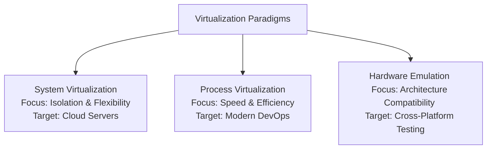

---

## 9. Containerization vs. System Virtualization

Containerization is a lightweight alternative to traditional VM-based virtualization. It gained popularity in the early 2010s to address the slow deployment, high costs, and heavy footprints of virtual machines.

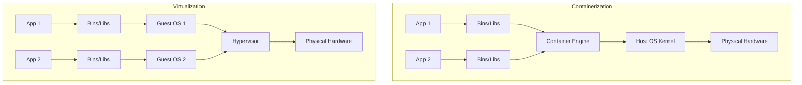

### 9.1. Key Differences
* **The VM Approach:** Each virtual machine contains a full guest operating system, virtual hardware drivers, libraries, and application code. VMs are heavy (typically gigabytes in size) and slow to boot.
* **The Container Approach:** Packages the application and its dependencies into a single lightweight package. All containers share the host machine's kernel, eliminating the need to duplicate the operating system layer.

---

### 9.2. Advantages & Disadvantages of Containerization

#### Advantages
* **Lightweight & Fast:** Sharing the host kernel minimizes resource footprint. Containers boot in seconds (compared to minutes for VMs).
* **Portability:** A container runs identically across any infrastructure (local developer laptops, private testing pools, or public cloud servers) without configuration drift.
* **Microservices Alignment:** Highly compatible with continuous integration and continuous deployment (CI/CD) pipelines, enabling developers to scale and update small parts of an application independently.

#### Disadvantages
* **Shared Kernel Risk:** Since all containers share the host OS kernel, a kernel vulnerability can compromise all containers running on that host.
* **Limited OS Diversity:** You cannot run a guest OS with a different kernel than the host (e.g., no native Linux containers on a Windows kernel without an intermediate translation layer).
* **Weaker Isolation:** Containers provide logical process-level isolation rather than hardware-level isolation, offering slightly weaker security boundaries than VMs (though container orchestrators like Kubernetes help mitigate this).

---

### 9.3. Detailed Comparison

| Comparison Feature | Virtualization (Virtual Machines) | Containerization (Containers) |
| :--- | :--- | :--- |
| **Abstractions Level** | Hardware Layer (CPU, RAM, Disk, Network) | Operating System Layer (User Space) |
| **Operating System** | Each VM runs its own complete Guest OS | All containers share the host OS kernel |
| **Startup Speed** | Slow (minutes to boot the Guest OS) | Extremely fast (seconds to launch the process) |
| **Resource Footprint** | Heavy (requires dedicated GBs of RAM and disk) | Extremely light (consumes MBs, shares resources) |
| **Isolation Strength** | Strong (enforced by hardware/hypervisor boundaries) | Moderate (enforced logically by OS namespaces) |
| **OS Flexibility** | High (can run Windows and Linux on the same host) | Restricted (must share the host OS kernel type) |
| **Primary Tools** | VMware ESXi, Hyper-V, VirtualBox | Docker, Kubernetes, LXC, Podman |
| **Best Use Case** | Running legacy applications and multi-tenant clouds | Microservices, DevOps pipelines, and rapid scaling |