# Chapter 4: Docker Engine and Container Virtualization

This course is designed for **Master 1 Applied Artificial Intelligence (I2A) — Cloud Computing and Big Data** (2025/2026) at the Computer Science Department, Université M'Hamed Bougara.

---

## Course Plan

1. **Containerization**
2. **Container**
3. **Linux Isolation and Storage Mechanisms**
4. **Container vs VM**
5. **Docker and its Components**
6. **Docker Architecture**
7. **Docker Operations**
8. **Advantages and Disadvantages**

---

## 1. Containerization

### 1.1. Definition of Containerization
* **Containerization** is a method of virtualization at the operating system (OS) level.
* It allows running multiple isolated applications sharing the same host operating system kernel.
* Each application runs in an independent environment called a **container**, without needing a complete operating system for each instance.
* **Result:** It is lighter, faster, and more efficient than virtualization using traditional Virtual Machines (VMs).

### 1.2. The Containerization Approach
* **No hardware emulation:** No full guest operating system is replicated.
* **Shared host kernel:** The host operating system's kernel is shared across all containers.
* **Native isolation:** Isolation is managed using native Linux kernel mechanisms (such as *namespaces* and *cgroups*).
* **Minimal footprint:** Each container bundles only the application and its strictly necessary dependencies.

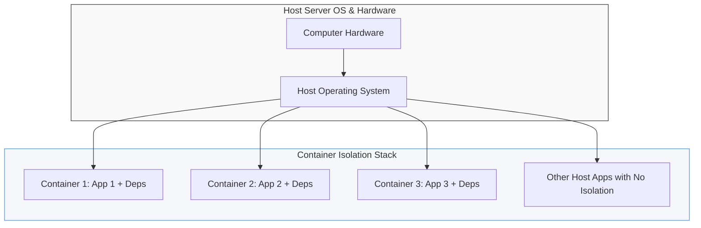

* **Multiple environments:** Enables running multiple independent container environments on a single physical host server.
* **Coexistence:** Standard (non-containerized) applications and containerized environments can easily coexist on the same host system.
* **Security containment:** Control and management applications generally run outside containers to guarantee security and host-level system administration.

---

## 2. Container

### 2.1. Definition of a Container
* A **container** is an isolated runtime environment that surrounds and protects an application during its execution.
* It bundles an application with all of its dependencies while sharing the host operating system's kernel.
* Although it appears as a small, self-contained system, it is fundamentally just an **isolated process** on the host, unable to interact with or disrupt other containers.

### 2.2. Typical Dependencies Packaged in a Container
A container does not package a whole operating system, only what is required for the application to function:
* **Source code** (the application itself).
* **Dependencies** (e.g., Node.js, Python, shared libraries).
* **System Configuration** (environment variables, standard Linux directories, designated networking ports).
* **Runtime** (execution interpreter or app server).
* **Databases** and internal application state.

> **Key Rule:** Regardless of the underlying machine executing the container, the runtime result remains identical.

### 2.3. What a Container Does *Not* Include
* **The Linux Kernel:** Shared directly with the host system, making containers highly lightweight.
* **Hardware Drivers:** Provided entirely by the host operating system.
* **A Complete Distribution:** Containers rely on minimal base images (e.g., *Alpine Linux*, *Ubuntu Slim*).

### 2.4. Main Characteristics of Containers

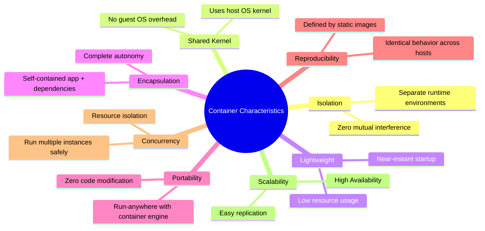

---

## 3. Linux Kernel Isolation and Storage Mechanisms

Containerization relies on **three fundamental technological pillars** native to the Linux kernel:

* **Namespaces:** Isolates the container's environment view from the host. (Isolation mechanism)
* **Cgroups (Control Groups):** Restricts and controls hardware resource consumption (CPU, RAM, I/O, network). (Isolation mechanism)
* **UnionFS / OverlayFS:** A layered, lightweight filesystem. (Storage mechanism)

---

### 3.1. Linux Kernel Namespaces

#### 3.1.1. Purpose of OS Isolation
* Historically, operating systems isolated processes and user data using **Virtual Memory** (allocating separate memory spaces to processes) and **User IDs (UIDs)** (assigning process ownership).
* These traditional mechanisms are insufficient at the scale of cloud computing, motivating the creation of new kernel-level isolation features like **namespaces** and **cgroups**.
* **Core Principle:** Isolation allows running multiple applications on the same physical computer without mutual interference or data leakage. An application confined within a namespace can neither see nor access resources assigned to other isolated namespaces or the host.

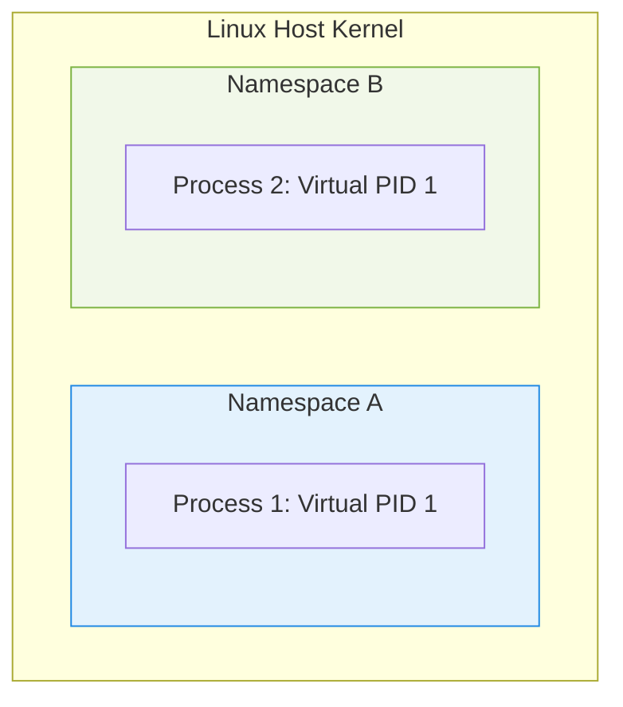

#### 3.1.2. Namespace Roles and Mechanisms
* **The Illusion of Isolation:** Namespaces provide processes inside a container with a virtual view of system resources, making them behave as if they are the only processes running on the machine.
* **Virtual Copies:** The Linux kernel creates virtual copies of system resources. Each namespace receives its own distinct instance of these resources, completely unaware of other namespaces.
* **Goals:**
  * *Security Isolation:* Prevents processes from spying on or modifying each other.
  * *Resource Contention Prevention:* Avoids conflicts (e.g., multiple processes trying to bind to the same network port).
  * *Lightweight Virtualization:* Provides a private view of the host OS without virtualization overhead.

#### 3.1.3. Types of Linux Namespaces
The kernel uses six primary namespaces to isolate system resources:

| Namespace Type | Description | Practical Example |
| :--- | :--- | :--- |
| **PID (Process ID)** | Isolates the process tree. | A process inside a container runs as PID 1 (acting as the init process), but on the host, it is represented as a standard process with an ID like PID 2456. |
| **NET (Network)** | Isolates network interfaces, routing tables, and ports. | Each container gets its own virtual network interface (e.g., `eth0`) and custom routing table. It can bind to port 80 without port conflicts on the host. |
| **MNT (Mount)** | Isolates file system mount points. | The container only sees its local directory structure and cannot access host system directories unless explicitly configured. |
| **UTS** | Isolates hostnames and NIS domain names. | Allows each container to maintain its own unique hostname separate from the physical host machine. |
| **IPC** | Isolates Inter-Process Communication resources. | Prevents containers from accessing shared memory segments, message queues, or semaphores belonging to other containers. |
| **User** | Isolates user and group ID spaces. | A user can hold root permissions (UID 0) inside the container while being mapped to a non-privileged user ID on the host, ensuring security. |

---

### 3.2. Cgroups (Control Groups)

* **Control Groups (cgroups)** allocate, prioritize, limit, and monitor physical resource utilization (such as CPU, RAM, disk I/O, and network bandwidth) across a group of processes.
* **Role:** Manages physical hardware resource allocation and boundaries.
* **Examples:**
  * Restricting a container to use a maximum of 20% of host CPU capacity.
  * Hard-limiting a container's RAM usage to 1 GB.
  * Throttling disk read/write bandwidth or network speeds.
* **Impact:** Prevents "noisy neighbor" scenarios where a single buggy or malicious process consumes all available memory or CPU, blocking other processes and crashing the host.

---

### 3.3. Namespace and Cgroup Summary

* **Namespace = "The Illusion of Isolation"**
  * *Goal:* Make a process feel entirely alone on the system.
  * *Mechanism:* Logical partitioning of kernel resources.
  * *Result:* Logical isolation and process security.
* **Cgroup = "The Resource Policeman"**
  * *Goal:* Prevent processes from exhausting system resources.
  * *Mechanism:* Strict physical limits and quotas.
  * *Result:* Guaranteed performance and resource fairness.

---

### 3.4. File Storage: UnionFS and OverlayFS

* **Context:** Multiple containers running on the same host often share a common base software environment (e.g., Ubuntu, Python runtime) but must write data without altering the shared base.
* **Solution:** **OverlayFS** (and its predecessor, UnionFS) is a layered filesystem engine designed to manage isolated container filesystem changes efficiently.
* **Principle:** It stacks a read-only base image layer with a dedicated, temporary read-write layer unique to each running container instance.

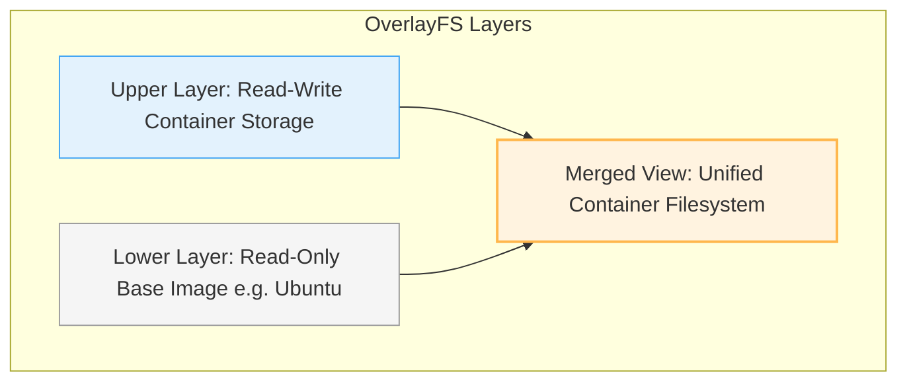

#### 3.4.1. File Storage Operations
* **Layer Combining:** OverlayFS merges at least two directories:
  * `lower` layer: Read-Only directory (the base container image).
  * `upper` layer: Read-Write directory (allocated individually to each container).
  * `merged` layer: A unified virtual directory combining both layers.
* **Reading Files:** When an application requests a file, OverlayFS searches the `upper` layer first. If not found, it retrieves it from the `lower` layer.
* **Writing and Modifying Files:** Uses **Copy-on-Write (CoW)**. If a container modifies a file existing in the read-only `lower` layer, OverlayFS copies the file up to the `upper` layer before applying the changes. The original file in the base image remains completely unaltered.

#### 3.4.2. UnionFS / OverlayFS Storage Matrix

| Storage Characteristic | Practical Effect |
| :--- | :--- |
| **Layer Sharing** | Significant disk space savings. |
| **Copy-on-Write (CoW)** | Extremely fast, avoiding the need to copy the entire filesystem. |
| **No Image Recreation** | Instantaneous container startup times. |

#### 3.4.3. Advantages of Layered File Storage
* Allows multiple running containers to share a single read-only base image.
* Keeps changes isolated inside each container's write layer.
* Optimizes image portability by shipping only the layer differences.
* Minimizes disk space usage and deployment times.
* When a container is deleted, only its specific write layer is discarded, leaving the shared base image intact.

---

## 4. Docker

### 4.1. Introduction to Docker
* Linux provides native isolation mechanisms, but configuring them manually (namespaces, cgroups, routing tables, permissions, layered filesystems) is highly complex.
* **Docker** simplifies and industrializes this process.
* Docker does not invent isolation or containerization; rather, it **packages and industrializes** container deployment, making it simple, portable, quick to start, and easily scalable.


### 4.2. What is Docker?
* Docker is an open-source containerization platform designed to build, run, and ship applications within isolated containers.
* It is optimized for modern architectures, including **Cloud Computing**, **CI/CD pipelines**, **Microservices**, and **DevOps**.

### 4.3. History of Docker
* **2013:** Created by **Solomon Hykes** at PaaS provider **dotCloud**.
* **2015:** Transitioned into an independent company, quickly becoming the de facto standard for cloud containerization.
* **Ecosystem Growth:** Rapidly adopted due to the growth of **Docker Hub** image repositories and orchestrators like **Kubernetes**.

---

### 4.4. Core Components of Docker Engine

The Docker Engine consists of five primary components:

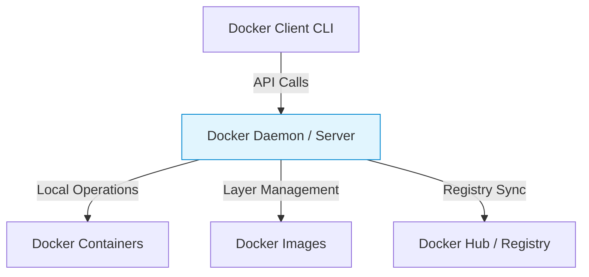

1. **Docker Daemon (`dockerd`):** A persistent background server running on the host OS. It manages networks, storage volumes, images, and container lifecycles. It processes REST API requests from the client and can communicate with other daemons.
2. **Docker Client:** The primary interface (CLI) used to execute commands (e.g., `docker run`). It translates CLI commands into REST API calls and forwards them to the local or remote daemon.
3. **Docker Hub / Registry:** A cloud registry used to store and distribute container images. Users can pull public images or push custom images to private or public repositories.
4. **Docker Images:** Read-only, immutable binary templates used to create containers. They cannot be modified directly; changes are made by running a container, modifying its state, and committing a new image.
5. **Docker Containers:** Executable instances of Docker images. They package the application and all dependencies, running as isolated processes on the host.

---

### 4.5. Container Lifecycle (State Machine)

A Docker container transitions through five primary states:

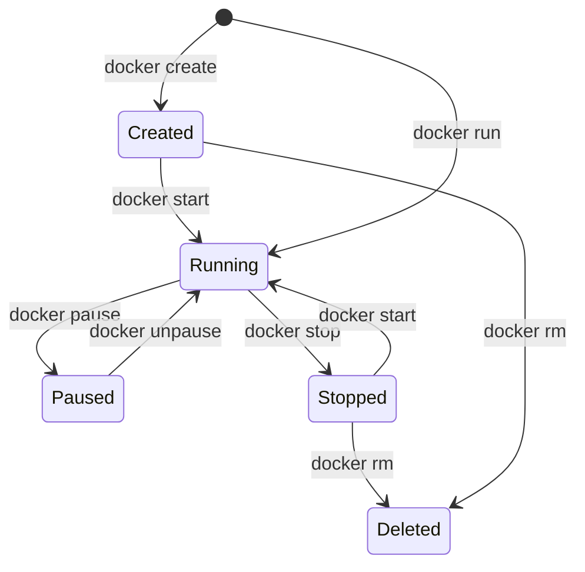

* **Created:** The container's filesystem layers, network namespaces, and cgroups are allocated, but its main process is not yet running.
* **Running:** The container's primary process (PID 1) is active and running.
* **Paused:** Container process execution is suspended at the CPU level using cgroups, retaining memory state but using 0% CPU.
* **Stopped:** The main process has terminated or received a shutdown command. Filesystem state is preserved on disk, allowing the container to be restarted.
* **Deleted:** The container and its temporary read-write filesystem layers are permanently removed from disk.

---

### 4.6. Detailed Docker Engine Architecture

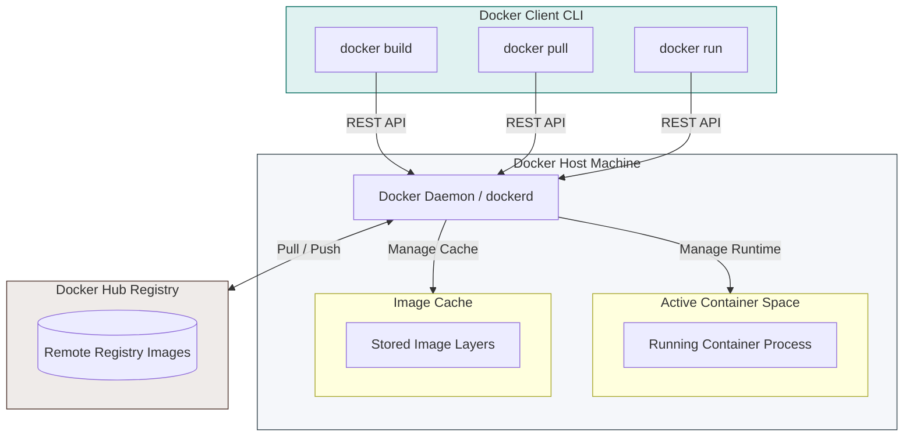

---

### 4.7. Dockerfile

* A **Dockerfile** is a plain-text configuration file containing the sequential instructions required to assemble a Docker image.
* **Image Definition:** It defines the filesystem and runtime configurations of the image, which acts as the blueprint for launching containers.
* **Layer Caching:** Each instruction in a Dockerfile adds a new read-only layer to the image. Docker caches these layers during the build process to speed up subsequent builds.

#### 4.7.1. Basic Dockerfile Example
```dockerfile
# Start from a pre-configured Python base image
FROM python:3.10

# Copy application source code into the container filesystem
COPY app.py /app/app.py

# Set the active working directory
WORKDIR /app

# Run a command to install dependencies during the build phase
RUN pip install flask

# Define the default command to execute when the container starts
CMD ["python", "app.py"]
```

* **Build Command:** To build an image from a Dockerfile, execute:
  ```bash
  docker build -t monimage .
  ```

#### 4.7.2. Layered Image Construction
* Docker images are made of read-only layers stacked on top of a base image.
* Each instruction in the Dockerfile creates a new layer containing only the differences (diffs) from the previous layer.
* When a container is launched, the Docker engine mounts a temporary, writable **container layer** on top of these read-only layers.

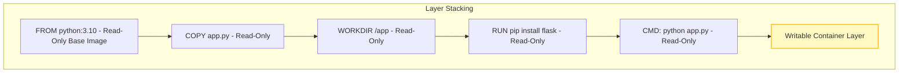

---

### 4.8. Core Terminology Reference

* **Image:** An immutable, read-only template containing the application code, runtime libraries, environment variables, and dependencies.
* **Layer:** A filesystem change generated by an instruction in a Dockerfile.
* **Container:** A running, isolated instance of an image.
* **Dockerfile:** A text file containing the configuration instructions to build a Docker image.
* **`docker build`:** The command used to compile a Docker image from a Dockerfile.
* **`docker run`:** The command used to instantiate and start a container from an image.

---

### 4.9. Advantages and Disadvantages of Docker

#### Advantages
* **No Pre-allocated RAM:** Memory is consumed dynamically based on workload demands, with no static pre-allocation required.
* **Lower Overhead:** More cost-effective than hypervisor-based virtual machines.
* **Lightweight:** Container images are very compact (measured in kilobytes or megabytes).
* **Speed:** Near-instant deployment and startup times.
* **Reusability:** Images can be built once and run consistently across various environments.
* **Portability and Scalability:** Simplifies horizontal scaling and application portability.

#### Disadvantages
* **Management Complexity:** Monitoring and orchestrating hundreds of containers manually is challenging.
* **Limited GUI Support:** Not suitable for applications that require a graphical user interface (GUI).
* **System Incompatibility:** Windows-native containers cannot run directly on a Linux kernel, and vice versa.
* **Lower Isolation Level:** Shared kernel architecture offers weaker security isolation compared to hypervisor-based virtualization.
* **Host Kernel Dependency:** Relies on the host operating system's kernel, limiting full virtualization.
* **Hardware Requirements:** Requires 64-bit architectures and is incompatible with legacy hardware systems.

---

## 5. Multi-Containerization and Docker Compose

### 5.1. Multi-Containerization
* **Definition:** Running multiple isolated container services to power a single application (common in microservices architectures).
* **Decomposition:** Splitting an application into independent services, such as a frontend web server, a backend API server, and a database, each running in its own container.

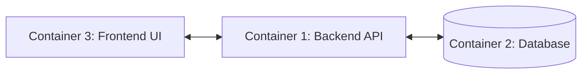

* **Orchestration:** These containers must run, network, and work together. Their multi-container configuration is defined using a `docker-compose.yml` file.

### 5.2. Docker Compose
* **Docker Compose** is a tool used to define and run multi-container applications on a **single host machine**.
* It is primarily used for local development, testing, and small-scale deployments.
* **Limitations:** It does not handle high availability (HA), automatic scaling, or automated failover recovery.
* **Configuration:** Uses a YAML file to define application services, networking ports, isolated network bridges, and persistent storage volumes.

---

### 5.3. Microservices Architecture
Microservices architecture divides a monolithic application into small, independent, and self-contained services.

* **Characteristics:**
  * Each service performs a single, specific business function (e.g., authentication, payment processing, catalogue).
  * Runs inside its own isolated container.
  * Can be developed, deployed, and scaled independently of other services.
  * Communicates with other services using standard protocols like REST APIs or message brokers.
* **Key Benefits:**
  * *Flexibility:* Update or rewrite a single service with minimal risk to the rest of the application.
  * *Scalability:* Scale only the high-traffic services rather than the entire application.
  * *Resilience:* A failure in one service does not necessarily crash the entire application.

---

### 5.4. Communication Between Containers

By default, containers are isolated and cannot communicate with each other.

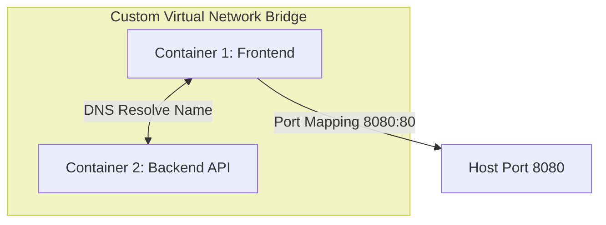

Containers communicate using four primary networking and storage models:

1. **Internal Virtual Network:** Containers are attached to a shared virtual network bridge created by the runtime. They can communicate using internal private IPs or by resolving container names using Docker's internal DNS.
2. **Port Mapping (Host Binding):** Maps a port inside the container to a port on the host machine (e.g., `8080:80`). This makes the container accessible externally via the host's IP and port (e.g., `http://localhost:8080`).
3. **Shared Volumes:** Containers share persistent data by mounting the same read-write directory on the host.
4. **Service Discovery:** Container orchestrators automatically assign stable network endpoints to containers, allowing services to discover and connect to each other dynamically.

#### 5.4.1. Network Protocols: REST APIs over HTTP
Container communication typically relies on standard networking protocols like TCP/IP and HTTP/HTTPS (REST APIs).

* **REST API Definition:** A architectural pattern that utilizes HTTP conventions to structure communication between services.
* **REST Core Requirements:**
  * Resource-based URLs (e.g., `/products`, `/clients/12`).
  * Consistent use of standard HTTP methods (GET to read, POST to create, PUT to update, DELETE to remove).
  * Data payloads formatted in JSON.

---

## 6. Container Orchestration and Kubernetes

### 6.1. Introduction to Container Orchestration
While managing containers on a single host is simple, running containers in production across multiple distributed servers presents several challenges:

* **Scaling:** Manually starting or stopping containers to match traffic demand is inefficient.
* **High Availability (HA):** Containers must restart automatically if they crash or if the underlying server fails.
* **Zero-Downtime Updates:** Deploying software updates must not interrupt service availability.
* **Load Balancing:** Traffic must be distributed evenly across all running container instances.
* **Monitoring:** Gaining visibility into cluster-wide resource usage and container health is difficult.
* **Service Discovery:** Containers need to locate each other dynamically as their IP addresses change.
* **Storage Persistence:** Ephemeral container storage must be backed by persistent volumes to prevent data loss.
* **Failover Management:** Detecting and recovering from host node failures must be automated.

> **Conclusion:** Managing large-scale deployments manually is impractical. A **Container Orchestrator** is required to automate these tasks and maintain application reliability.

---

### 6.2. What is Container Orchestration?
* **Container Orchestration** is the automated deployment, scaling, management, and networking of containerized applications across a cluster of multiple host machines.
* **Common Orchestrators:** **Kubernetes (K8s)**, **OpenShift**, and **Docker Swarm**.

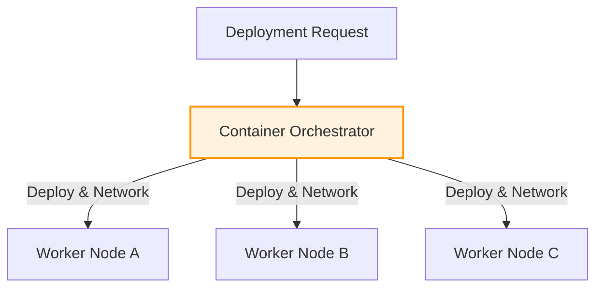

### 6.3. Key Tasks of an Orchestrator
* Provisioning and deploying containers across a cluster.
* Automatically scaling container counts up or down based on workload.
* Rescheduling and restarting failed containers (self-healing).
* Load balancing incoming traffic across containers.
* Dynamically scaling the physical or virtual machines in the cluster.
* Configuring container networking and service discovery.

### 6.4. Multi-Containerization vs. Orchestration

| Feature | Multi-Containerization | Orchestration |
| :--- | :--- | :--- |
| **Primary Focus** | Structuring an application into multiple containers. | Managing and automating container lifecycles across a cluster. |
| **Common Tools** | Docker Compose. | Kubernetes, OpenShift, Docker Swarm. |
| **Operational Level** | Application level (on a single host). | Infrastructure / Cluster level (across multiple hosts). |
| **Fault Tolerance** | No automated high availability or failover recovery. | Built-in self-healing, automated scaling, and traffic routing. |

---

## 7. Kubernetes (K8s)

### 7.1. What is Kubernetes?
* **Kubernetes (K8s)** is an open-source container orchestration platform originally created by **Google** in 2014.
* It automates the deployment, scaling, and management of containerized applications across a cluster of host machines.
* It provides high availability, automated scaling, and self-healing.

### 7.2. Key Features of Kubernetes
* **Horizontal Pod Autoscaling (HPA):** Automatically scales the number of Pods up or down based on CPU, memory usage, or custom metrics.
* **Load Balancing:** Automatically distributes incoming network traffic across identical running workloads.
* **Self-Healing (Auto-repair):** Restarts failed containers and reschedules Pods if their host node becomes unreachable.
* **Service Discovery:** Assigns a stable DNS name and IP address to a set of Pods, enabling reliable communication even as individual Pod IPs change.
* **Secrets Management:** Securely stores and manages sensitive data, such as API keys, tokens, and passwords, separate from container images.

---

### 7.3. Kubernetes Cluster Architecture

A Kubernetes cluster consists of a **Control Plane (Master Node)** that manages the cluster, and one or more **Worker Nodes** that run the application workloads.

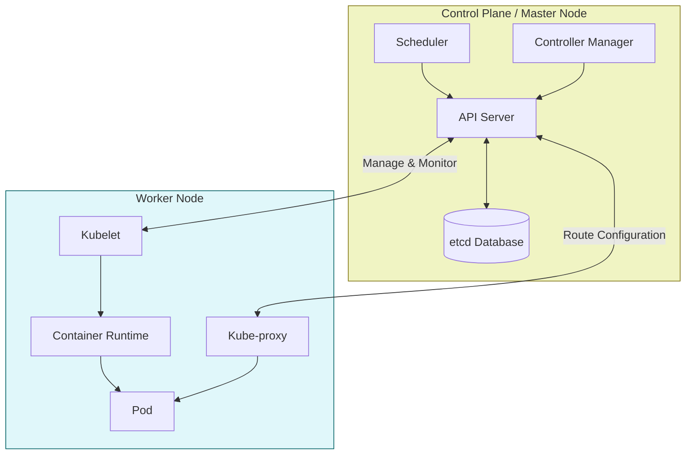

---

### 7.4. Control Plane (Master Node) Components
The Control Plane is the brain of the cluster, responsible for maintaining the desired state and managing workloads.

1. **API Server (`kube-apiserver`):** The central communication hub of the cluster. It exposes the Kubernetes API and handles all internal and external cluster requests.
   * *Request Lifecycle:* Authentication (validating identity) $\rightarrow$ Authorization (checking permissions via RBAC) $\rightarrow$ Admission Control (applying security policies and resource quotas).
2. **Scheduler (`kube-scheduler`):** Monitors newly created Pods that have no assigned node and schedules them onto the best available worker node based on resource requirements and constraints.
3. **Controller Manager (`kube-controller-manager`):** Runs continuous control loops to ensure the actual state of the cluster matches the desired state (e.g., maintaining the correct number of running Pod pods).
4. **`etcd` Database:** A highly available, distributed key-value store that acts as the single source of truth for all cluster configuration and state data.
   * **Consensus Engine:** Uses the **Raft Consensus Algorithm** to ensure data consistency across multiple database replicas, even during a node failure.
   * **Access Boundary:** Only the API Server can read or write to `etcd` directly.

---

### 7.5. Worker Node Components
Worker Nodes run the containerized application workloads.

1. **Kubelet:** A local node agent that communicates directly with the Control Plane. It receives Pod specifications (PodSpecs) from the API Server and instructs the container runtime to launch the required containers. It also monitors container health and reports status back to the API Server.
2. **Kube-proxy:** A network proxy that runs on each node, managing routing and network rules to load-balance traffic to and from Pods.
3. **Container Runtime:** The software engine that runs the containers (e.g., Docker, containerd, CRI-O).

---

### 7.6. Pod Scheduling Workflow

When you request the creation of a Pod, Kubernetes schedules it onto a worker node using a multi-step process:

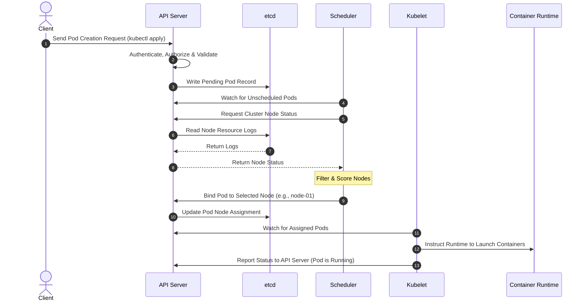

---

### 7.7. What is a Pod?
* A **Pod** is the smallest deployable and manageable unit in Kubernetes.
* It hosts one or more tightly coupled containers that share:
  * **Network Namespace:** All containers in a Pod share the same IP address, port space, and hostname.
  * **Storage Volumes:** Containers share mounted volumes for persistent storage.
  * **Lifecycle:** Containers in a Pod are scheduled, run, and terminated together.

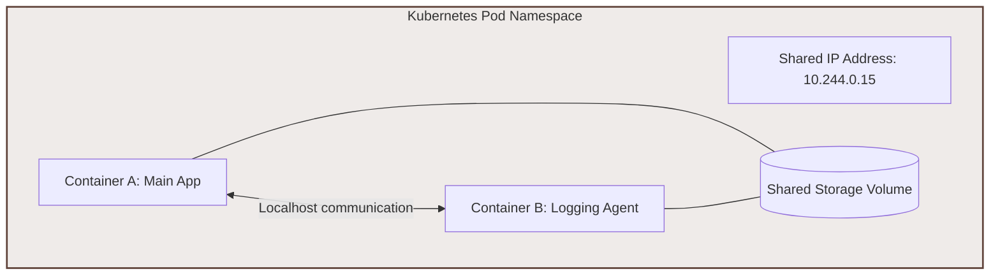

* **Core Characteristics:**
  * Group of co-located containers.
  * Automated container lifecycle and restarts.
  * Shared storage and volumes.
  * Unique IP address assigned to each Pod.

---

### 7.8. Pod Resource Allocation: Requests and Limits
Kubernetes manages host compute resources using resource **Requests** and **Limits**:

```yaml
resources:
  requests:
    memory: "64Mi"
    cpu: "250m"
  limits:
    memory: "128Mi"
    cpu: "500m"
```

* **Requests (Guaranteed Minimum):** The minimum amount of CPU and memory guaranteed to the container. The scheduler uses this value to determine which worker node has enough capacity to host the Pod.
* **Limits (Maximum Boundary):** The maximum amount of CPU and memory the container is allowed to consume.
  * If a container exceeds its memory limit, it is terminated with an **Out-Of-Memory (OOMKilled)** error.
  * If it exceeds its CPU limit, its CPU usage is throttled, limiting its performance.

---

### 7.9. ConfigMaps
* A **ConfigMap** is a Kubernetes object used to store non-sensitive configuration data (such as environment variables, URLs, or configuration files) in key-value pairs.
* **Decoupling:** It separates environment-specific configurations from container images, allowing you to run the same image in Development, Staging, and Production without rebuilding.

---

### 7.10. Deployments
* A **Deployment** is a controller that defines the desired state for a set of identical Pods (e.g., running 3 replicas).
* **Automated Management:** It manages rolling updates, automatically replaces failed Pods, and handles scaling.

---

### 7.11. Kubernetes Key Concepts Quick Reference

| Concept | Description |
| :--- | :--- |
| **Cluster** | A set of machines (nodes) working together to run containerized applications. |
| **Master / Control Plane** | The brain of the cluster, responsible for managing workloads and state. |
| **Node (Worker)** | A machine (virtual or physical) that runs application containers. |
| **Pod** | The smallest deployable unit in Kubernetes, hosting one or more containers. |
| **Deployment** | A controller that manages replica counts, updates, and scaling. |
| **Service** | A logical abstraction that provides a stable IP address and DNS name for a set of Pods. |
| **ConfigMap** | A key-value store used to decouple configuration data from container images. |

---

### 7.12. Kubernetes Services: Stable Network Access

Because Pods are ephemeral, their IP addresses change when they are recreated. A **Service** provides a stable network endpoint (IP address and DNS name) to route traffic reliably to a set of backend Pods.

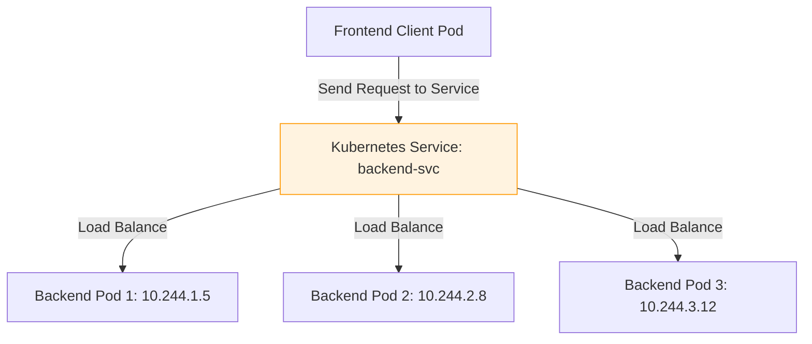

#### 7.12.1. Networking Abstractions
* **Pod IP:** A unique internal IP address assigned to each Pod.
* **Service:** A logical object that provides a stable, static IP address and load-balances traffic across a set of dynamic Pod IPs.

#### 7.12.2. Service Types

| Service Type | Visibility / Scope | Common Use Case |
| :--- | :--- | :--- |
| **ClusterIP** | Accessible only from within the Kubernetes cluster. | Internal database or backend API access. |
| **NodePort** | Opens a static port (30000-32767) on each node's IP. | Local testing or development environments. |
| **LoadBalancer** | Exposes the Service externally using a cloud provider's load balancer. | Public-facing production applications. |

---

### 7.13. Pod Placement Strategies
The scheduler assigns Pods to nodes using a **two-step scheduling process**:


#### Step 1: Node Filtering (Predicates)
The scheduler evaluates a set of rules called **predicates** to filter out nodes that are incompatible with the Pod:
* `PodFitsResources`: Checks if the node has enough free CPU and memory.
* `PodFitsHostPorts`: Ensures the requested host ports are not already in use on the node.
* `NoVolumeZoneConflict`: Checks if the requested storage volume is available in the node's zone.
* `MatchNodeSelector`: Ensures the node labels match the selectors specified in the Pod Spec.

#### Step 2: Node Ranking (Priority Functions)
The scheduler scores the remaining compatible nodes using **priority functions** to select the best host:
* `BalancedResourceAllocation`: Scores nodes based on resource balance, aiming to keep CPU and memory usage optimized.
* `LeastRequestedPriority`: Favors nodes with lower requested resource loads to distribute Pods evenly.
* `CalculateSpreadPriority`: Spreads replicas of the same service across different nodes to prevent a single point of failure.

---

### 7.14. Advantages and Challenges of Kubernetes

#### Advantages
* **High Availability & Self-Healing:** Automatically monitors and recovers workloads from container or node failures.
* **Automated Scaling:** Scales application instances horizontally based on traffic load.
* **Zero-Downtime Deployments:** Updates application versions progressively with no downtime.
* **Declarative Management:** Maintains the desired state of application configurations automatically.

#### Challenges
* **High Complexity:** Steeper learning curve to configure and manage.
* **Resource Overhead:** Requires dedicated host resources to run the Control Plane components.
* **High Initial Investment:** Demands significant technical expertise to configure and operate securely.

---

### 7.15. Docker and Kubernetes: Better Together
* **Docker Alone:** Ideal for single-container deployments and local development, simplifying application packaging and testing.
* **Docker + Kubernetes:** Crucial for large-scale production environments, automating scaling, self-healing, and multi-node cluster management.

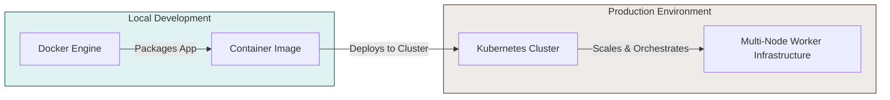