## Chapter 5: Virtual and Networked Storage

Computing systems rely on persistent (non-volatile) storage to preserve data after power-offs or system restarts. Users do not interact directly with raw disk hardware; instead, the operating system (OS) and storage systems provide logical abstractions and specialized access interfaces.

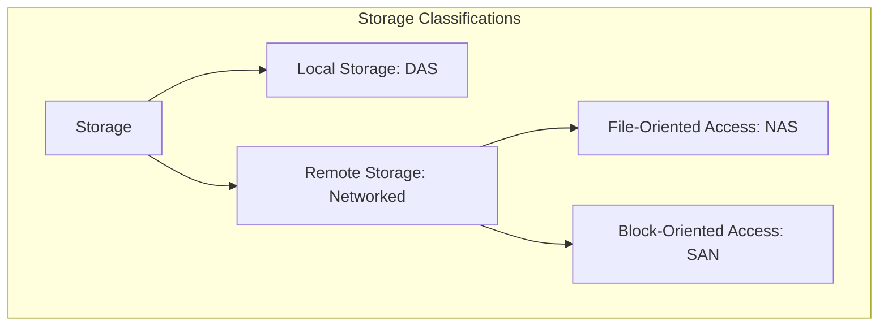

---

### 5.1. Storage Foundations and Access Models

Persistent storage is implemented in two main forms:
1. **Physical Devices:** Solid-State Drives (SSD) and Hard Disk Drives (HDD).
2. **Logical Abstractions:** Files and folders/directories that organize storage into intuitive structures.

Data is accessed over network architectures using two primary interfaces: **Block Access** and **File Access**.


#### 5.1.1. Disk Interface Abstraction (Block Access)
The storage device presents itself to the host as a structured sequence of fixed-size blocks (typically 512 bytes or 4096 bytes), numbered from zero ($0, 1, 2, \dots$).
* **Core Principle:** The disk operates strictly on **complete blocks**. It does not understand the concept of "files" or "folders"; it only executes sector/block operations.
* **Primitive Operations:**
  * `read(block)`: Reads an entire block.
  * `write(block)`: Overwrites an entire block.
* **Read/Write Execution:**
  * To write, the OS sends the block number and the payload block. The disk locates the block and overwrites its entire contents.
  * To read, the OS requests the block number, and the disk returns the complete block payload.
* **Characteristics:** Offers low latency, high throughput, and granular disk control. It is the ideal interface for local filesystems, databases, and VM system disks.

#### 5.1.2. File Interface Abstraction (File Access)
The File System (e.g., NTFS, ext4, APFS) acts as an abstraction layer between files/folders and physical blocks. 
* **Core Principle:** Applications treat data as a logical, variable-sized **stream of bytes** (byte-by-byte access) organized in a hierarchical directory tree. The underlying operating system maps these logical files to physical disk blocks.
* **System Operations:** Relies on the standard **open-close-read-write** execution model.
* **File System Operations:**
  * Translates logical files/folders into specific physical block sequences.
  * Maintains an internal mapping table (metadata) linking filenames to physical block addresses.
  * Handles organizational, renaming, moving, and deletion actions.
  * Protects data integrity and enforces permissions.

##### Execution Example: Saving a 3 MB File (`cours.pdf`)
1. **Application Action:** Requests to write a 3 MB file (`cours.pdf`).
2. **File System Processing:** Divides the 3 MB file into physical blocks. Assuming a 4 KB block size:
   $$\frac{3 \text{ MB}}{4 \text{ KB}} \approx 768 \text{ blocks}$$
3. **Disk Allocation:** Chooses available physical locations on the disk.
4. **Metadata Update:** Updates its internal allocation table:
   $$\text{Blocks } 580 \text{ to } 1347 \rightarrow \text{"cours.pdf"}$$
5. **Operational View:**
   * **The User** sees: `cours.pdf`
   * **The File System** sees: A list of mapped blocks ($580 \rightarrow 1347$).
   * **The Physical Disk** reads/writes: Raw blocks, with no awareness that they form a single document.

#### 5.1.3. Technical Comparison Matrix

| Feature | Block Access | File Access |
| :--- | :--- | :--- |
| **Access Unit** | Fixed-size blocks (e.g., 512B, 4KB). | Structured, named logical files. |
| **Server-Side View** | Raw, unformatted disk. | Hierarchical directory tree (folders/files). |
| **Level of Control** | Low-level, granular. | High-level (logical abstraction). |
| **Deployment Complexity** | High. | Low (intuitive for end users). |

---

### 5.2. Networked Storage Architectures: DAS, NAS, and SAN

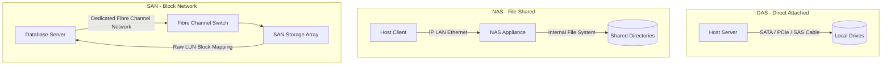

#### 5.2.1. Direct Attached Storage (DAS)
DAS is persistent storage connected directly to a host computer's motherboard or input/output (I/O) bus without an intervening network.

* **Architecture:** Utilizes dedicated local connections such as SATA, NVMe, SAS, USB, or Thunderbolt cables. It typically resides within the server chassis or an external multi-drive enclosure (e.g., TerraMaster D2, QNAP TR-004).
* **Interface:** Presents block-level storage directly to the local OS.
* **RAID Integration:** Uses **RAID (Redundant Array of Independent Disks)** to combine multiple physical drives for performance and fault tolerance.
  * **RAID 0 (Striping):** Splits data across multiple disks. High speed, zero redundancy.
  * **RAID 1 (Mirroring):** Duplicates data on two disks in real-time. Full fault tolerance.
  * **RAID 5 (Distributed Parity):** Stripes data and parity across $\ge 3$ disks. Can survive a single disk failure.
  * **RAID 6 (Double Parity):** Stripes data and dual parity across $\ge 4$ disks. Can survive two simultaneous disk failures.
  * **RAID 10 (Mirrored Stripes):** Combines RAID 1 and RAID 0. High performance and high redundancy.
  * **Hot Swapping:** Allows replacing failed physical disks while the system is running.
* **Advantages:**
  * Highly economical, simple to deploy, and requires no advanced network engineering skills.
  * Excellent raw performance with microsecond latencies.
* **Disadvantages:**
  * **Siloed Constraint:** Storage is exclusive to a single host machine; other servers cannot access idle capacity.
  * **Under-utilization:** Promotes capacity waste, as unused storage cannot be shared.
  * **Poor Scalability:** Physical limits are restricted by internal drive slots and bus capacities.

---

#### 5.2.2. Network Attached Storage (NAS)
An autonomous, dedicated storage appliance connected directly to a standard IP network, providing file-level storage services to heterogeneous clients.

* **Architecture:** Contains its own operating system, network interface card (NIC), CPU, RAM, and internal file system. It connects directly to IP network switches or routers.
* **Protocols:** Shares directory structures via standard network protocols:
  * **SMB/CIFS:** Predominant in Windows environments.
  * **NFS:** Standard for Linux and Unix platforms.
  * **AFP:** Legacy protocol for macOS systems.
* **Implementation Approaches:**
  1. **Host-Based (Software NAS):** An ordinary computer running standard hardware, equipped with a standard NIC, local disks, and file-sharing software. Highly economical but suffers from lower performance and limited scalability.
  2. **Dedicated (Server-Based):** Server-grade computers equipped with multi-core CPUs, large memory caches, and high-throughput I/O buses to process concurrent requests.
  3. **Specialized Hardware (Datacenter NAS):** Highly specialized storage arrays optimized for continuous operations. Engineered for high performance and resilience with long **MTTF (Mean Time To Failure)** metrics.
* **Advantages:**
  * Enables native file sharing across heterogeneous clients.
  * Integrates with containers, allowing directory structures to be mounted as remote folders.
  * The filesystem is managed entirely on the NAS server; only file data is transmitted over the network.
* **Disadvantages:**
  * Single point of failure: If the power supply, network link, or NAS controller fails, all connected clients lose access.
  * Relies heavily on network bandwidth, which can cause network congestion.
  * Introduces file system permission alignment issues across different host operating systems.

---

#### 5.2.3. Storage Area Network (SAN)
A specialized, high-speed, isolated network dedicated exclusively to block-level storage transmission, connecting application servers directly to massive disk arrays.

* **Architecture:** Completely isolated from the standard Local Area Network (LAN) to prevent storage traffic from competing with general network traffic.
* **Access Model:** Exposes storage resources as raw block devices. The host OS formats these blocks with its own filesystem (NTFS, ext4, APFS).
* **Interconnect Protocols:**
  * **Fibre Channel (FC):** Runs over specialized optical cables. Provides speeds from 2 Gb/s up to 128 Gb/s. Extremely reliable, ultra-low latency, but highly expensive.
  * **iSCSI:** Encapsulates SCSI block commands inside standard TCP/IP packets. More economical, but has lower performance than native Fibre Channel.
* **Virtual Mapping Mechanics:** The SAN array controller abstracts multiple physical disks and presents them to clients as logical, unified block devices:
  * A client's virtual blocks ($0, 1, 2, \dots$) map to physical locations using a **mapping table (virtual disk map)**.
  * Blocks can be scattered across multiple disks, which is abstracted from the host server.
* **Advantages:**
  * High performance, exceptional availability, and modular scalability.
  * Universal OS compatibility since it presents itself as a local raw disk.
  * Highly suited for clustering and Virtual Machine hypervisors.
* **Disadvantages:**
  * Extremely high initial capital investment.
  * No native file sharing: Since filesystems are managed client-side, multiple hosts cannot mount the same block device simultaneously without specialized cluster file systems (e.g., VMFS, GFS2).
  * Incompatible with direct container mounting due to the block-oriented interface.

---

### 5.3. Summary Tables: DAS vs. NAS vs. SAN

#### Access and Management Comparison

| Dimension | DAS | NAS | SAN |
| :--- | :--- | :--- | :--- |
| **Access Type** | Block Level | File Level | Block Level |
| **File System Location** | Managed on Server | Managed on NAS Appliance | Managed on Server |
| **Host System View** | Local Raw Disk | Shared Network Folder | Shared Local Raw Disk |

#### Core Criteria Comparison

| Criterion | DAS | NAS | SAN |
| :--- | :--- | :--- | :--- |
| **Connection Method** | Direct I/O Bus Cable | Standard IP Network | Fibre Channel / iSCSI |
| **Initial Cost** | Low | Moderate | High |
| **Resource Sharing** | No | Yes (File Level) | Yes (Block Level) |
| **Performance** | Excellent | Good (Network Bound) | Excellent (Dedicated Network) |
| **Scalability** | Limited | Moderate | High |

#### Operating System and Mounting Details

| Dimension | NAS | SAN |
| :--- | :--- | :--- |
| **Structural Role** | Storage appliance on LAN | Dedicated network for storage |
| **Target Workload** | General file sharing | High-performance enterprise apps |
| **Host Mounting** | Network Share (e.g., `/mnt/data`) | Local Block Device (e.g., `/dev/sdb`) |
| **Transfer Speeds** | Moderate (LAN RJ45 speeds) | Ultra-high (Fibre Channel / iSCSI) |
| **Workload Profile** | Personal use, SMBs, shared folders | Enterprise datacenters, virtualization |
| **Fault Tolerance** | Low (Single Controller point) | Highly Redundant Architecture |

---

### 5.4. Storage Virtualization, Datastores, and High Availability

Storage virtualization abstracts physical storage hardware from servers, pooling diverse physical devices into a unified logical storage resource.

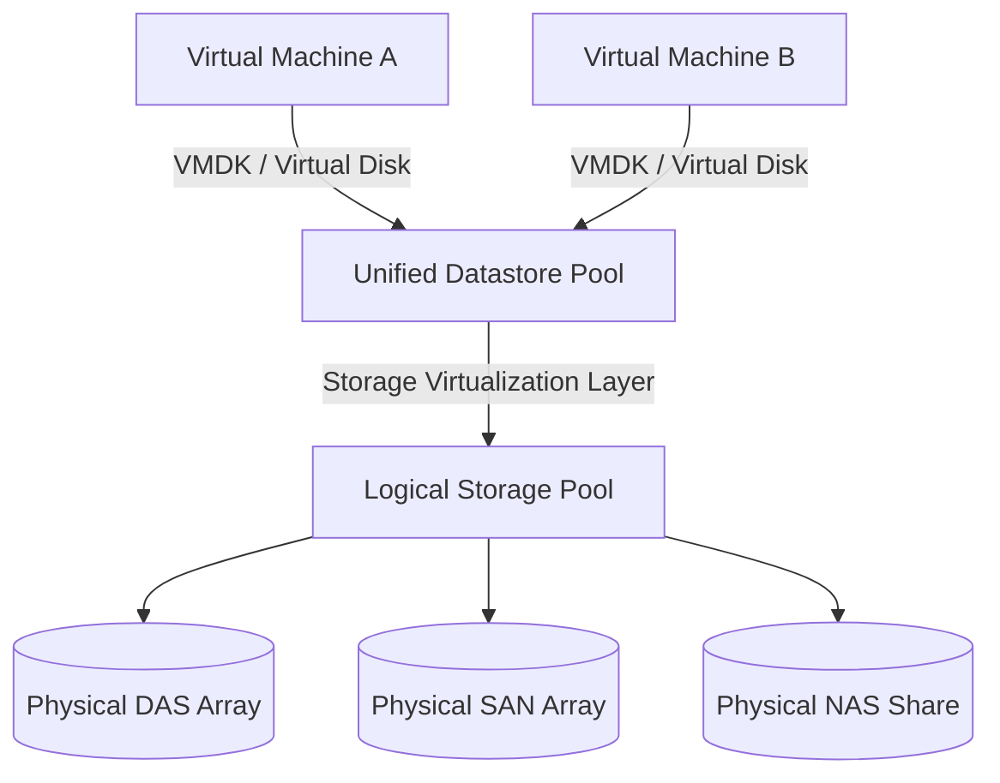

#### 5.4.1. Core Concepts
* **Logical Pool:** The aggregation of multiple physical storage systems (DAS, NAS, SAN) into a single logical volume.
* **Virtual Volume:** A logical partition sliced from the storage pool and presented to hosts.
* **Datastore:** A unified virtual storage representation presented to a hypervisor. It hides the complexities of the underlying physical storage and holds Virtual Machine files (e.g., `.vmdk`, configuration files, and snapshots).

#### 5.4.2. Advanced Storage Features
* **vMotion (Live Storage Migration):** Moves active VM files from one physical storage array to another without shutting down the VM, maintaining service continuity.
* **High Availability (HA):** Automatically restarts VMs on an alternate physical host if the original host experiences hardware failure.
* **Active Replication:** Syncs data between storage systems in real-time (synchronous) or on a schedule (asynchronous) to protect against disasters.
* **Mirroring (RAID 1):** Writes data blocks to two physical disks simultaneously to prevent downtime from a single disk failure.
* **Multipathing:** Uses multiple physical network adapters and switches between host servers and storage arrays to prevent single-path network failures and balance load.

---

### 5.5. Advanced Storage Management Features

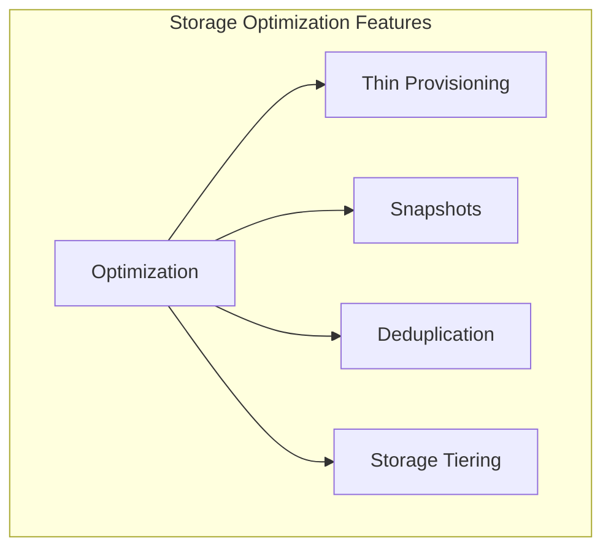

#### 5.5.1. Thin vs. Thick Provisioning
* **Thin Provisioning:** Allocates physical storage space dynamically as data is written. A VM allocated a 500GB virtual disk only consumes the physical space actually written (e.g., 50GB). This permits over-provisioning but requires careful capacity monitoring to prevent storage exhaustion.
* **Thick Provisioning (Lazy Zeroed):** Allocates the full virtual disk capacity (e.g., 500GB) upfront. The blocks are not zeroed out initially; they are cleared dynamically on first write.
* **Thick Provisioning (Eager Zeroed):** Allocates and completely zeroes out all block space during disk creation. It has the longest creation time but provides maximum performance by avoiding first-write latency.

#### 5.5.2. Snapshots
Captures a VM's disk state at a specific point in time by freezing the parent virtual disk and redirecting all new write operations to a delta file.
* **Key Principle:** Snapshots are not complete backups. They rely on the base disk and should be used short-term (e.g., before system patches) to avoid VM performance degradation.

#### 5.5.3. Deduplication
Optimizes capacity by identifying duplicate data blocks, keeping only a single copy, and replacing duplicate blocks with logical pointers.
* **Inline Deduplication:** Compares incoming data blocks with a hash index before writing to disk. This maximizes storage efficiency but adds write latency.
* **Post-Process Deduplication:** Writes data normally and performs deduplication in the background. This avoids write latency but requires temporary storage buffer space.

#### 5.5.4. Storage Tiering
Automatically shifts data between different physical media based on access frequency to optimize performance and cost:
* **Hot Tier:** NVMe/SSD storage for active, performance-critical data (e.g., production databases).
* **Warm Tier:** SAS HDD or high-capacity SSD for moderately accessed files (e.g., active file shares).
* **Cold Tier:** High-capacity SATA HDD or tape storage for archive and backup data.

---

### 5.6. Storage Silos and Hyper-Converged Infrastructure (HCI)

#### 5.6.1. The Legacy Storage Silo Problem
Traditional data centers connected storage directly to individual hosts (DAS). This model creates significant inefficiencies:
* **Heterogeneity:** Equipment from different manufacturers is often incompatible and requires separate management interfaces.
* **Resource Imbalance:** One server's storage may sit idle while another server crashes due to running out of disk space.
* **Complex Management:** Lacks a centralized storage console, increasing administrative overhead.

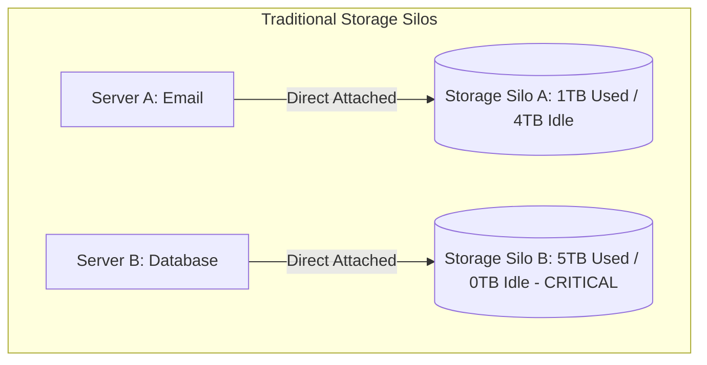

---

#### 5.6.2. Hyper-Converged Infrastructure (HCI)
HCI eliminates traditional SAN switches and dedicated fiber arrays by pooling local server drives into shared storage using software-defined storage architectures.

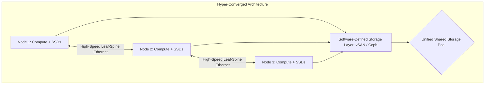

* **Network Transport:** Uses standard, low-cost high-speed Ethernet (using **Leaf-Spine network topologies** with low latency) instead of expensive Fibre Channel switches.
* **Storage Software Layer:** Pools local server SSDs/HDDs across a cluster using software-defined storage (SDS) engines.
* **Primary Technologies:**
  * **VMware vSAN:** A hypervisor-integrated, software-defined storage solution that pools local server SSDs/HDDs into a shared cluster datastore.
  * **Microsoft Storage Spaces Direct (S2D):** Software-defined storage integrated into Windows Server and Hyper-V.
  * **GlusterFS:** An open-source, scalable, parallel network file system (distributed NAS).
  * **Ceph:** An open-source, distributed software platform that provides unified Object, Block (SAN), and File (NAS) storage from a single cluster.

---

## Chapter 6: Cloud Storage and Distributed Systems

### 6.1. Cloud Storage Paradigms: Block, File, and Object

Cloud storage abstracts physical hardware further, offering three primary on-demand storage categories:

| Dimension | Block Storage | File Storage | Object Storage |
| :--- | :--- | :--- | :--- |
| **Data Structure** | Fixed-size raw sectors/blocks. | Hierarchical directory tree. | Flat namespace with independent objects. |
| **Access Methods** | SCSI, NVMe block protocols. | File APIs (Open, Read, Write, Seek). | HTTP/HTTPS REST APIs (GET, PUT, DELETE). |
| **Metadata** | Minimal (block address maps). | Standard attributes (permissions, size). | Fully customizable key-value metadata. |
| **Scalability** | Limited (to partition size). | Moderate (limited by file system indexing).| Massively scalable across clusters. |
| **Latency** | Extremely low (1-5 ms). | Moderate (network file sharing overhead). | High (HTTP REST request overhead). |
| **Update Support** | In-place, partial block writes. | Supports partial edits and appends. | Immutable; must overwrite the entire object. |
| **Primary Use Cases** | Databases, VM system disks. | Shared folders, legacy app migration. | Big Data, media assets, backups, archives. |
| **Industry Examples** | AWS EBS, Azure Disk, GCP Persistent Disk. | AWS EFS, Azure Files, GCP Filestore. | AWS S3, Azure Blob, GCP Cloud Storage. |

---

### 6.2. Distributed Hash Tables and Consistent Hashing

Distributed storage systems partition billions of files across thousands of physical server nodes without relying on a central database, which can become a bottleneck and single point of failure.

#### 6.2.1. Traditional Modulo Hashing Limitation
$$\text{Server ID} = \text{hash}(\text{key}) \pmod N$$
Where $N$ is the number of active server nodes in the cluster.
* **The Problem:** If a server node fails or is added, $N$ changes. Consequently, nearly all existing keys hash to a different Server ID. This triggers massive data redistribution across the network, which can lead to high network congestion.

---

#### 6.2.2. Consistent Hashing Mechanics
Consistent Hashing maps both data keys and server nodes to a shared coordinate space represented as a circle, called a **Hash Ring** (ranging from $0$ to $2^{32}-1$).

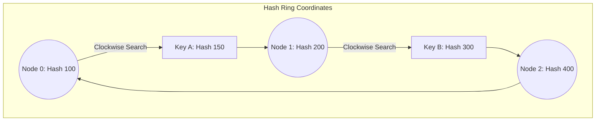

1. **Mapping Nodes:** Server hostnames or IP addresses are hashed to determine their position on the ring.
2. **Mapping Keys:** Data keys are hashed using the same algorithm to locate their coordinate on the ring.
3. **Key Resolution:** The key is stored on the first server node encountered by moving **clockwise** from the key's coordinate on the ring.
4. **Handling Scale Changes:**
  * **Adding a Node:** The new node assumes responsibility for a small segment of the ring. Only keys in that segment migrate to the new node; the rest of the cluster remains unaffected.
  * **Removing a Node:** If a node fails, its keys migrate to the next active server clockwise on the ring.

---

#### 6.2.3. Optimization: Virtual Nodes (Vnodes)
When a cluster contains few physical nodes, consistent hashing can cause unbalanced data distribution, leading to "hot spots" (where some nodes hold significantly more data than others).

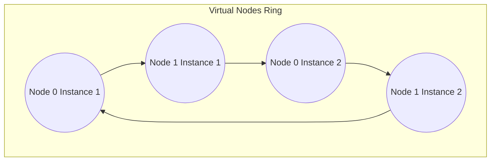

To balance data distribution, systems use **Virtual Nodes (Vnodes)**. Each physical server is hashed multiple times with different identifiers (e.g., `Server0#1`, `Server0#2`). This places multiple virtual nodes for each server on the ring, spreading data more evenly across the physical hardware.

---

### 6.3. Data Consistency Models and the CAP Theorem

Replicating data across multiple server nodes increases availability and reliability, but keeping these replicas synchronized presents architectural tradeoffs.

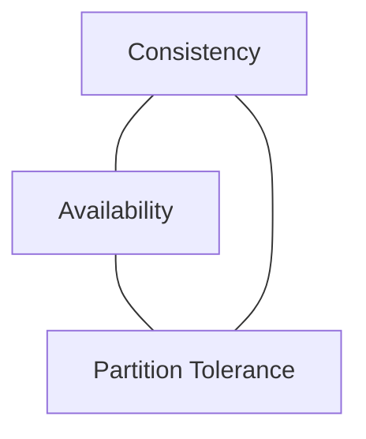

#### 6.3.1. CAP Theorem Properties
1. **Consistency (C):** Every read request returns the most recent write or an error.
2. **Availability (A):** Every healthy node returns a successful response for every request, without guaranteeing it contains the most recent write.
3. **Partition Tolerance (P):** The system continues to operate despite network failures or packet loss between nodes.

In a distributed environment, network partitions ($P$) are inevitable. Therefore, systems must choose between:
* **CP (Consistency / Partition Tolerance):** Prioritizes consistency. If a partition occurs, the system rejects write requests on disconnected nodes to prevent data divergence, sacrificing availability.
* **AP (Availability / Partition Tolerance):** Prioritizes availability. Nodes continue to accept writes locally during a partition. The system remains online, but some nodes will return stale data until the partition is resolved, sacrificing consistency.

#### 6.3.2. Data Consistency Models
* **Strong Consistency:** Guarantees that once a write operation completes, all subsequent reads across any node will return the updated value. It relies on synchronous replication, requiring a majority of nodes to confirm the write. This ensures accuracy but increases write latency.
* **Eventual Consistency:** Accepts write operations immediately on any available node and replicates updates asynchronously in the background. Read requests may temporarily return stale data, but all replicas eventually converge to the same value. This approach offers high availability and low latency.
* **Causal Consistency:** Guarantees that logically related operations (causally connected) are read in the same order across all nodes. Unrelated operations can be processed in any order. It uses dependency tracking tools like vector clocks.

---

## Chapter 7: Big Data Processing Frameworks

### 7.1. Big Data Foundations and Architecture

Big Data refers to datasets that are too large, fast, or complex for traditional database systems to process.

#### 7.1.1. The 5Vs of Big Data
* **Volume:** The scale of data generated, ranging from Terabytes to Exabytes.
* **Velocity:** The speed at which new data is generated and must be processed (e.g., IoT sensor streams or financial tickers).
* **Variety:** The diversity of data formats (e.g., structured SQL databases, semi-structured JSON logs, and unstructured video files).
* **Veracity:** The trustworthiness, quality, and cleanliness of the data.
* **Value:** The actionable business insights derived from analyzing the data.

---

#### 7.1.2. The Standard Big Data Pipeline

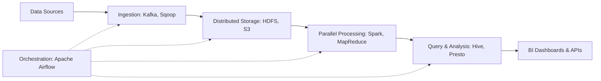

1. **Ingestion:** Gathers data from various sources using tools like **Apache Kafka** (for real-time streaming) or **Apache Sqoop** (for relational database transfers).
2. **Distributed Storage:** Stores large datasets across clusters using distributed file systems (e.g., HDFS) or cloud object storage (e.g., Amazon S3).
3. **Processing:** Transforms and processes data in parallel across nodes using frameworks like **Hadoop MapReduce** (disk-based) or **Apache Spark** (in-memory).
4. **Query & Analysis:** Runs SQL-like queries on processed data using engines like **Apache Hive** or **Presto**.
5. **Serving:** Exposes insights to end-users via business intelligence dashboards (e.g., Tableau) or web APIs.
6. **Orchestration:** Schedules and coordinates the pipeline workflow using tools like **Apache Airflow**.

---

### 7.2. Apache Hadoop Ecosystem and HDFS

Apache Hadoop is an open-source framework designed for the distributed storage and processing of large datasets across clusters of commodity hardware.

#### 7.2.1. HDFS Architecture
HDFS uses a master-worker architecture to manage distributed file storage.

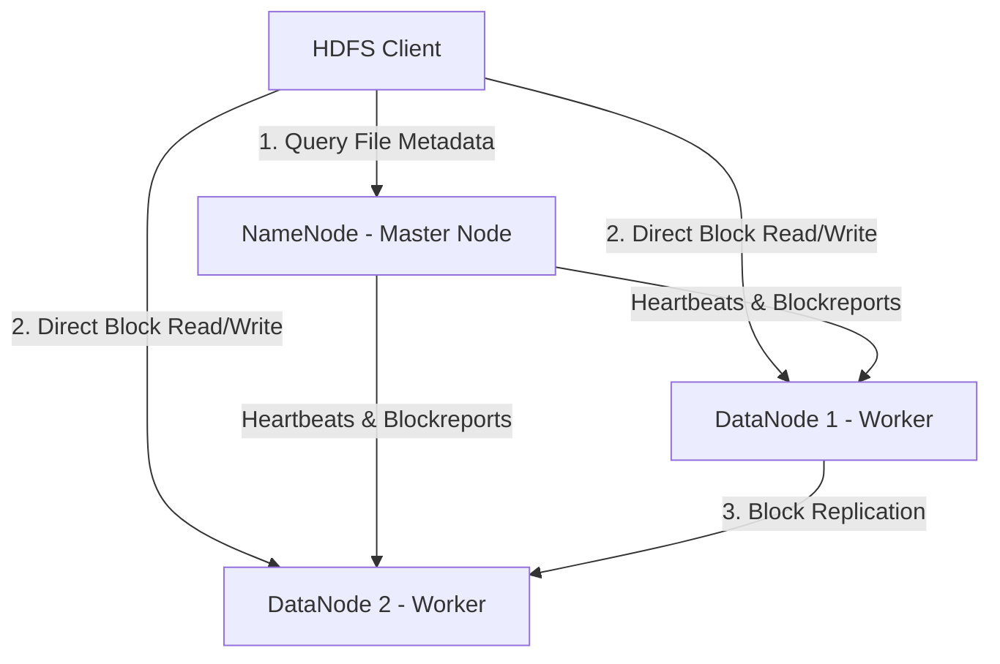

* **NameNode (Master):** Manages the file system namespace, directory structure, and block mapping metadata. It is a single point of failure unless configured with active-passive high availability.
* **DataNodes (Workers):** Store and retrieve physical data blocks, and send regular status reports (heartbeats) to the NameNode.
* **Block Allocation & Replication:**
  * Files are split into large, fixed-size blocks (typically 128MB).
  * Blocks are replicated across multiple DataNodes (default replication factor is 3) to prevent data loss.
  * **Rack Awareness:** HDFS places block replicas across different server racks to protect data against entire rack-level power or network failures.

---

#### 7.2.2. YARN Architecture (Yet Another Resource Negotiator)
YARN manages resources and schedules tasks across the Hadoop cluster.

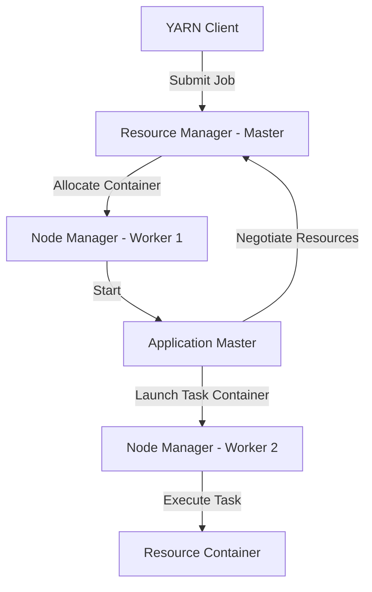

* **ResourceManager (Master):** The central authority that allocates CPU and memory resources to running applications across the cluster.
* **NodeManager (Worker):** An agent running on each cluster node that monitors resource container usage (CPU, memory, disk) and reports status to the ResourceManager.
* **ApplicationMaster (Per-Job):** A framework-specific component that negotiates resources with the ResourceManager and works with NodeManagers to execute and monitor tasks.

---

### 7.3. MapReduce Programming Model

MapReduce processes large datasets in parallel across a distributed cluster using three main phases:

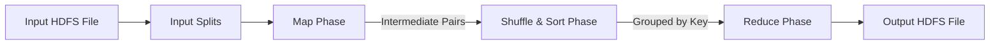

1. **Map Phase:** Mapper tasks process input splits in parallel, transforming raw data into intermediate key-value pairs:
   $$\text{Map}(k_1, v_1) \rightarrow \text{list}(k_2, v_2)$$
2. **Shuffle & Sort Phase:** The framework groups and sorts intermediate key-value pairs by key, routing all values associated with the same key to the same reducer:
   $$\text{Shuffle}(\text{list}(k_2, v_2)) \rightarrow \text{grouped}(k_2, \text{list}(v_2))$$
3. **Reduce Phase:** Reducer tasks process grouped data in parallel, aggregating values to produce a final result that is written back to HDFS:
   $$\text{Reduce}(k_2, \text{list}(v_2)) \rightarrow \text{list}(k_3, v_3)$$

---

#### 7.3.1. Case Study: Netflix Movie Rating Analysis
Calculate the average rating for each movie in the following dataset:

```text
User1, Movie10, 4.0
User2, Movie10, 5.0
User3, Movie10, 3.0
User4, Movie20, 2.0
```

##### 1. Map Phase
The mapper reads lines from HDFS and emits the Movie ID as the key, and the rating along with a counter of 1 as the value:
$$\text{Map}(\text{Line}) \rightarrow \text{Emit}(\text{MovieID}, (\text{Rating}, 1))$$

* **Mapper Output:**
  * `Movie10` $\rightarrow$ `(4.0, 1)`
  * `Movie10` $\rightarrow$ `(5.0, 1)`
  * `Movie10` $\rightarrow$ `(3.0, 1)`
  * `Movie20` $\rightarrow$ `(2.0, 1)`

##### 2. Shuffle & Sort Phase
The framework automatically groups all intermediate values by key:
* **Intermediate Grouped Output:**
  * `Movie10` $\rightarrow$ `[(4.0, 1), (5.0, 1), (3.0, 1)]`
  * `Movie20` $\rightarrow$ `[(2.0, 1)]`

##### 3. Reduce Phase
The reducer aggregates the ratings and counters to calculate the average rating for each movie:
$$\text{Reduce}(\text{MovieID}, \text{list}(\text{Rating}, 1)) \rightarrow \text{Emit}(\text{MovieID}, \frac{\sum \text{Rating}}{\sum 1})$$

* **Reducer Calculations:**
  * **For Movie 10:**
    $$\text{Sum of Ratings} = 4.0 + 5.0 + 3.0 = 12.0$$
    $$\text{Total Count} = 1 + 1 + 1 = 3$$
    $$\text{Average Rating} = \frac{12.0}{3} = 4.0$$
    * **Output:** `Movie10` $\rightarrow$ `4.0`
  * **For Movie 20:**
    $$\text{Sum of Ratings} = 2.0$$
    $$\text{Total Count} = 1$$
    $$\text{Average Rating} = \frac{2.0}{1} = 2.0$$
    * **Output:** `Movie20` $\rightarrow$ `2.0`

---

### 7.4. Apache Spark In-Memory Computation Engine

Apache Spark is a distributed computing framework designed to overcome the disk-based performance limitations of MapReduce by processing data in memory.

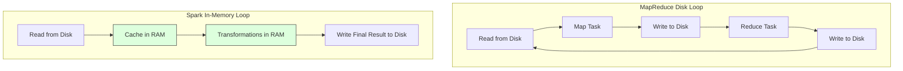

#### 7.4.1. Performance Advantages
* **MapReduce Disk Bottleneck:** MapReduce writes intermediate data to disk after each Map and Reduce phase, which can cause significant I/O and network overhead during iterative processing (e.g., machine learning algorithms).
* **Spark In-Memory Processing:** Spark caches intermediate results in RAM, allowing subsequent tasks to query data directly from memory without writing to disk. This can make Spark up to 100 times faster than MapReduce for iterative workloads.

#### 7.4.2. Core Abstractions
* **Resilient Distributed Dataset (RDD):** Spark's foundational abstraction. It is a read-only, partitioned collection of records distributed across cluster nodes. If a node fails, RDDs use lineage graphs (a history of transformations) to automatically reconstruct lost partitions.
* **DataFrame:** A distributed collection of data organized into named columns, similar to a table in a relational database. DataFrames use Spark's **Catalyst Optimizer** to automatically generate efficient execution plans.

#### 7.4.3. Spark Core Modules
* **Spark SQL:** Enables querying structured data using standard SQL queries or DataFrame APIs.
* **Spark Streaming:** Processes real-time data streams using the same APIs as batch processing.
* **MLlib:** A scalable machine learning library that provides distributed algorithms for classification, regression, clustering, and collaborative filtering.
* **GraphX:** A distributed graph-computation engine that simplifies the creation and analysis of graph-structured data.