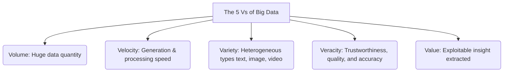
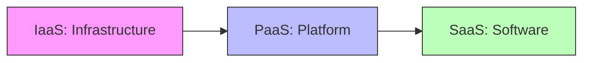
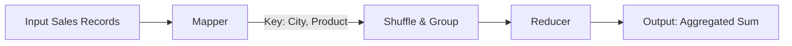
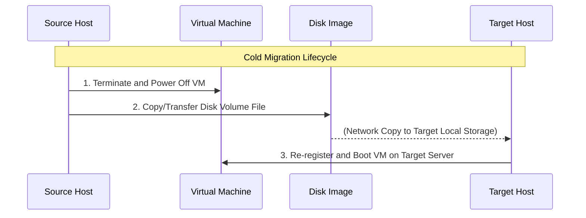

# Part 1: Theoretical & Factual Knowledge

## 1. Big Data Core Concepts

### Big Data & The 5 Vs
* **Definition of Big Data:** Datasets that are extremely voluminous, varied, and rapidly generated, whose processing exceeds the capabilities of traditional database systems.
* **The 5 Vs (Properties & Dimensions):**



---

## 2. Distributed Technologies

### Hadoop vs. Spark
* **Why Hadoop?**
  * **HDFS (Hadoop Distributed File System):** Distributed storage.
  * **MapReduce:** Distributed processing of large datasets.
  * **Fault Tolerance:** Automatic replication and recovery (not possible in classical systems).
* **Spark Advantages over MapReduce:**
  * **In-Memory Processing:** Eliminates slow disk reads/writes between steps, making it much faster.
  * **Richer APIs:** Built-in libraries for SQL, streaming, and machine learning.
  * **Fewer Disk Accesses:** Retains intermediate processing states in RAM.

---

## 3. Cloud Computing Fundamentals

### Value Proposition
* **Scalability & Elasticity:** Dynamically scale resources up/down on demand.
* **High Availability (HA):** Fault tolerance and minimized downtime.
* **Cost Reduction:** Pay-as-you-go pricing; eliminates upfront hardware investment.
* **Managed Services:** Turnkey access to pre-configured Big Data tools.

### SPI Service Models



* **IaaS (Infrastructure as a Service):** Provides raw compute, storage, and networking.
  * *Examples:* Amazon EC2, Google Compute Engine.
* **PaaS (Platform as a Service):** Provides managed platforms/runtimes; users only deploy code.
  * *Examples:* Google App Engine, AWS Elastic Beanstalk.
* **SaaS (Software as a Service):** Ready-to-use software applications hosted online.
  * *Examples:* Google Apps.

### Cloud Deployment Models
* **Public Cloud:** Infrastructure owned by a third-party provider and shared among multiple tenants (e.g., AWS, Microsoft Azure).
* **Private Cloud:** Infrastructure dedicated exclusively to a single organization (e.g., internal enterprise cloud).
* **Hybrid Cloud:** Combines public and private clouds, allowing data/apps to be shared between them.
* **Community Cloud:** Infrastructure shared and managed by multiple organizations with common goals.

---

## 4. Virtualization & Containerization

### Hypervisors
* **Type 1 (Bare-Metal / Without intermediate OS):**
  * Runs directly on physical hardware.
  * High performance and security.
  * Used in enterprise production environments (e.g., VMware ESXi).
* **Type 2 (Hosted / With intermediate OS):**
  * Runs on top of a host Operating System.
  * Simpler to set up and use.
  * Lower performance due to OS overhead (e.g., VirtualBox, VMware Workstation).

### Containers: Docker Concepts
* **Docker Image:** An immutable, read-only template containing the application code, runtime, and system libraries.
* **Docker Container:** A running instance of an image.
* **Volume (`db_data`):** An externalized directory mapped from the host to persist container data (e.g., database storage) across container lifecycles.
* **Para-virtualization:** Virtualization method that modifies the guest OS kernel to interact directly with the hypervisor, removing host OS overhead.
* **Cloisonnement (Isolation):** Operating-system-level virtualization that runs isolated application workloads (containers) sharing the host OS kernel.

---

## 5. Parallel Processing Paradigms

### SPMD (Single Program Multiple Data)
* **Definition:** A parallel execution model where the *same program* runs simultaneously across multiple compute nodes, but each node processes a *different subset* of the data.
* **Advantages:** Simple to design, flexible, scales well across large datasets.
* **Limitations:** Requires explicit synchronization barriers; prone to load-imbalance issues if data partitions are unequal.

### Cluster vs. Cloud
* **Cluster:** A local network of physical machines tightly coupled together to act as a single unit for targeted computing tasks.
* **Cloud:** A utility model that lets users rent virtualized resources remotely on demand, with no control over physical placement.

---

## 6. OpenStack Ecosystem

### Core Components
* **Keystone:** Identity, authentication, and service directory.
* **Glance:** Image registry and management.
* **Nova:** Compute instance provisioning engine.
* **Swift:** Distributed object storage service.
* **Neutron:** Virtual network management service.

---

## 7. Amazon VPC Concepts
* **Region / Availability Zone (AZ):** Separate geographic areas containing multiple isolated datacenters.
* **VPC (Virtual Private Cloud):** A logically isolated virtual network within AWS.
* **Public Subnet:** A subnet with routing rules connected to an Internet Gateway.
* **Internet Gateway:** An attached gateway allowing instances within a VPC to communicate with the internet.
* **Route Table:** A set of rules directing network traffic from subnets to destinations.

---
---

# Part 2: Applied & Execution Guide

## 1. Docker Compose Diagnostic & Debugging

### Step-by-Step Analysis of a Faulty Configuration
A common exam exercise involves identifying logical errors in a YAML configuration file. Use this reference configuration and troubleshooting guide:

```yaml
services:
  web:
    image: nginx:latest
    ports:
      - "3306:80"                      # ERROR 1: Exposes web on 3306 (MySQL port)
    depends_on:
      - db
    environment:
      DB_HOST: localhost              # ERROR 2: Containers cannot use 'localhost' to talk to each other
      DB_PORT: 3306

  db:
    image: mysql:8                    # ERROR 3: Missing MYSQL_ROOT_PASSWORD environment variable
    ports:
      - "3306:3306"                    # ERROR 4: Exposing database port to the host is a security risk
    volumes:
      - db_data:/var/lib/mysql

volumes:
  db_data:
```

### Corrections & Explanations

#### Error 1: Incorrect Port Mapping on Web Service (`3306:80`)
* **Problem:** Port `3306` is reserved for MySQL database engines.
* **Correction:** Map to HTTP port `80` or `8080`.
  ```yaml
  ports:
    - "80:80"
  ```

#### Error 2: Localhost Database Routing Hostname (`DB_HOST: localhost`)
* **Problem:** `localhost` refers to the isolated container environment, not the host machine or other containers.
* **Correction:** Route traffic to the alias of the database container service defined in the compose file (`db`).
  ```yaml
  DB_HOST: db
  ```

#### Error 3: Missing Required Environment Variable in MySQL 8
* **Problem:** MySQL containers fail to start up if an administrator password is not defined.
* **Correction:** Add `MYSQL_ROOT_PASSWORD` under the `environment` block.
  ```yaml
  environment:
    MYSQL_ROOT_PASSWORD: securepassword
  ```

#### Error 4: Unnecessary Public Database Port Exposure (`3306:3306`)
* **Problem:** Exposing database ports directly to the host system creates an unnecessary security vulnerability.
* **Correction:** Remove the `ports` directive from the `db` service. The application container can still communicate with it internally through the shared default Docker network.

---

## 2. MapReduce Program Design

### Architectural Pipeline



### Exercise: Calculate Total Quantities Sold per Product and City

#### Key-Value Pair Design
* **Key Format:** `(City, Product)`
* **Value Format:** `Quantity`

#### Mapper Processing Logic
1. Reads each individual transaction entry from the dataset source.
2. Extracts the `City`, `Product`, and `Quantity` attributes.
3. Outputs a key-value record:
   $$\text{Key} = (\text{City}, \text{Product}) \longrightarrow \text{Value} = \text{Quantity}$$

#### Reducer Aggregation Logic
1. Receives a structured list of intermediate values grouped under a unique compound key.
2. Iterates through the list of quantities.
3. Sums up the values and outputs the final calculated result:
   $$\text{Key} = (\text{City}, \text{Product}) \longrightarrow \text{Value} = \sum(\text{Quantities})$$

---

## 3. Database Modeling & Project Schema Design

### Database Schema Definition
For scheduling applications with high relational complexity, implement this structured schema:

```sql
-- Core Department Entities
CREATE TABLE departements (
    id SERIAL PRIMARY KEY,
    nom VARCHAR(255) NOT NULL
);

-- Academic Training Programs
CREATE TABLE formations (
    id SERIAL PRIMARY KEY,
    nom VARCHAR(255) NOT NULL,
    dept_id INT REFERENCES departements(id),
    nb_modules INT DEFAULT 0
);

-- Student Registry
CREATE TABLE etudiants (
    id SERIAL PRIMARY KEY,
    nom VARCHAR(100) NOT NULL,
    prenom VARCHAR(100) NOT NULL,
    formation_id INT REFERENCES formations(id),
    promo VARCHAR(50) NOT NULL
);

-- Course Modules
CREATE TABLE modules (
    id SERIAL PRIMARY KEY,
    nom VARCHAR(255) NOT NULL,
    credits INT NOT NULL,
    formation_id INT REFERENCES formations(id),
    pre_req_id INT REFERENCES modules(id)
);

-- Exam Room Inventory
CREATE TABLE lieu_examen (
    id SERIAL PRIMARY KEY,
    nom VARCHAR(100) NOT NULL,
    capacite INT NOT NULL,
    type VARCHAR(50) NOT NULL,
    batiment VARCHAR(100) NOT NULL
);

-- Faculty Members
CREATE TABLE professeurs (
    id SERIAL PRIMARY KEY,
    nom VARCHAR(255) NOT NULL,
    dept_id INT REFERENCES departements(id),
    specialite VARCHAR(255) NOT NULL
);

-- Course Enrollments
CREATE TABLE inscriptions (
    etudiant_id INT REFERENCES etudiants(id),
    module_id INT REFERENCES modules(id),
    note DECIMAL(4,2),
    PRIMARY KEY (etudiant_id, module_id)
);

-- Scheduled Exam Events
CREATE TABLE examens (
    id SERIAL PRIMARY KEY,
    module_id INT REFERENCES modules(id),
    prof_id INT REFERENCES professeurs(id),
    salle_id INT REFERENCES lieu_examen(id),
    date_heure TIMESTAMP NOT NULL,
    duree_minutes INT NOT NULL
);
```

### Advanced Relational Constraint Optimization

#### Ensuring Students Have at Most One Exam per Day
Use custom PL/pgSQL validation triggers to enforce complex scheduling rules:

```sql
CREATE OR REPLACE FUNCTION check_student_exam_overlap()
RETURNS TRIGGER AS $$
BEGIN
    IF EXISTS (
        SELECT 1 
        FROM examens e
        JOIN inscriptions i ON e.module_id = i.module_id
        WHERE i.etudiant_id IN (
            SELECT etudiant_id 
            FROM inscriptions 
            WHERE module_id = NEW.module_id
        )
        AND e.date_heure::DATE = NEW.date_heure::DATE
        AND e.id <> NEW.id
    ) THEN
        RAISE EXCEPTION 'Constraint Violated: A student is already scheduled for an exam on this date.';
    END IF;
    RETURN NEW;
END;
$$ LANGUAGE plpgsql;

CREATE TRIGGER trg_limit_student_exams
BEFORE INSERT OR UPDATE ON examens
FOR EACH ROW EXECUTE FUNCTION check_student_exam_overlap();
```

---

## 4. Virtual Machine Migration Steps



---

## 5. Discrete Event Simulation Implementation (YAFS)

The following pipeline details how to run network and application performance simulations in YAFS (Yet Another Fog Simulator):

### Topology Definition
Define nodes (compute capacity, RAM, coordinates) and interconnecting links (bandwidth, latency) using a NetworkX graph structure.

```python
import networkx as nx
from yafs.topology import Topology

t = Topology()
g = nx.Graph()

# Add physical resource nodes
# id, compute capacity (MIPS), RAM (MB)
g.add_node(0, RAM=16000, type="CloudDC")
g.add_node(1, RAM=4000, type="FogNode")
g.add_node(2, RAM=1000, type="EdgeNode")

# Add network link relationships
# Source, Destination, Bandwidth (Mbps), Latency/Propagation Delay (ms)
g.add_edge(0, 1, BW=10000, PR=50)
g.add_edge(1, 2, BW=1000, PR=5)

t.G = g
```

### Application Workload Modeling
Define running microservices, input message streams, and performance requirements (CPU execution steps, network payload bytes).

```python
from yafs.application import Application, Message

app = Application(name="TelemetryPipeline")

# Define execution modules
app.set_modules([
    {"SensorModule": {"Type": "Source"}},
    {"ProcessingModule": {"RAM": 512, "Type": "Compute"}},
    {"DisplayModule": {"Type": "Sink"}}
])

# Define messages (instructions, payload size in bytes)
m_sensor = Message("SensorMsg", "SensorModule", "ProcessingModule", instructions=100, bytes=1000)
m_output = Message("ProcMsg", "ProcessingModule", "DisplayModule", instructions=50, bytes=200)

app.add_source_messages(m_sensor)
app.add_service_messages(m_output)
```

### Module Placement & Traffic Orchestration
Bind workloads to target nodes and define the simulated request volumes.

```python
from yafs.placement import Placement
from yafs.population import DeterministicDistribution

# Static Placement Strategy
class StaticModuleDeployment(Placement):
    def __init__(self, d_map):
        super(StaticModuleDeployment, self).__init__()
        self.d_map = d_map

    def initial_allocation(self, sim, app_name):
        for module_name, node_id in self.d_map.items():
            sim.deploy_module(app_name, module_name, [node_id])

# Deploy SensorModule on EdgeNode (2) and ProcessingModule on FogNode (1)
placement = StaticModuleDeployment({"SensorModule": 2, "ProcessingModule": 1, "DisplayModule": 2})
```