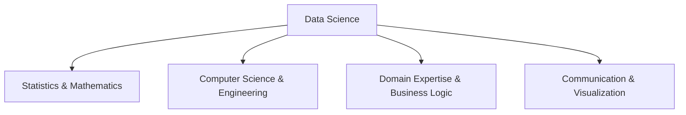
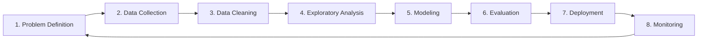

# Chapter 1: Introduction to Data Science

## 1.1. Data Science Fundamentals and Workflows

### 1. Definition and Core Identity
Data Science is an interdisciplinary field that combines statistical methodologies, mathematical models, computational science, and domain expertise to extract insights and actionable knowledge from structured, semi-structured, and unstructured data. It serves as the analytical foundation for data-driven decision-making and automation.

### 2. The Modern Data Science Workflow
A standard data science project follows a structured, iterative lifecycle, typically formalized by methodologies like CRISP-DM (Cross-Industry Standard Process for Data Mining).

1. **Problem Definition**: Translating a business or clinical objective into a measurable data science goal. (e.g., converting "reduce patient readmissions" to "predict 30-day readmission risk with an AUC-ROC of at least 0.85").
2. **Data Collection**: Querying databases (SQL), ingesting telemetry logs, calling web APIs, or gathering streaming IoT sensor data.
3. **Data Cleaning and Preprocessing**: Handling missing values, detecting anomalies and outliers, correcting inconsistent records, and resolving data type mismatches.
4. **Exploratory Data Analysis (EDA)**: Utilizing descriptive statistics, univariate/bivariate visualizations, and correlation matrices to understand distribution patterns and hidden structures.
5. **Modeling**: Training statistical and machine learning algorithms (e.g., regression, decision trees, neural networks) on historical data to capture predictive patterns.
6. **Evaluation**: Assessing the model on unseen test data using robust metric evaluation (e.g., F1-score, precision-recall curve, mean absolute error) to prevent overfitting.
7. **Deployment**: Integrating the trained model artifacts into production environments (e.g., exposing an endpoint using FastAPI, containerizing via Docker, or deploying to cloud clusters).
8. **Monitoring**: Continually evaluating real-world predictions against actual outcomes to detect data drift, concept drift, and performance degradation.

### 3. Comparison of Data Science and Related Fields

| Field | Core Objective | Primary Data Horizon | Key Methodologies | Output Examples |
| :--- | :--- | :--- | :--- | :--- |
| **Data Science (DS)** | Extract patterns, predict trends, build automated decision systems. | Future & Present (Predictive & Prescriptive) | Predictive modeling, machine learning, statistical inference, data pipelines. | Predictive models, recommendation engines, automated pipelines. |
| **Machine Learning (ML)** | Build algorithms that learn patterns from data and generalize to unseen scenarios. | Automated Pattern Learning | Supervised/Unsupervised learning, Deep Learning, Optimization. | Model files (`.pkl`, `.onnx`), real-time inference APIs. |
| **Artificial Intelligence (AI)** | Create systems capable of mimicking human cognitive tasks (reasoning, perception). | Dynamic & Contextual | Natural Language Processing, Computer Vision, Reinforcement Learning. | Autonomous driving agents, conversational LLMs, chess bots. |
| **Big Data** | Ingest, store, and process massive, high-velocity datasets. | Scale, Volume & Ingestion | Distributed computing (Spark, Hadoop), NoSQL, stream processing. | Petabyte-scale distributed data storage, parallel map-reduce jobs. |
| **Business Intelligence (BI)** | Analyze historical business data to generate reports and assist human decision-making. | Past (Descriptive & Diagnostic) | Querying, relational modeling, dashboarding, KPI analysis. | Interactive dashboards (PowerBI, Tableau), structured monthly reports. |

---