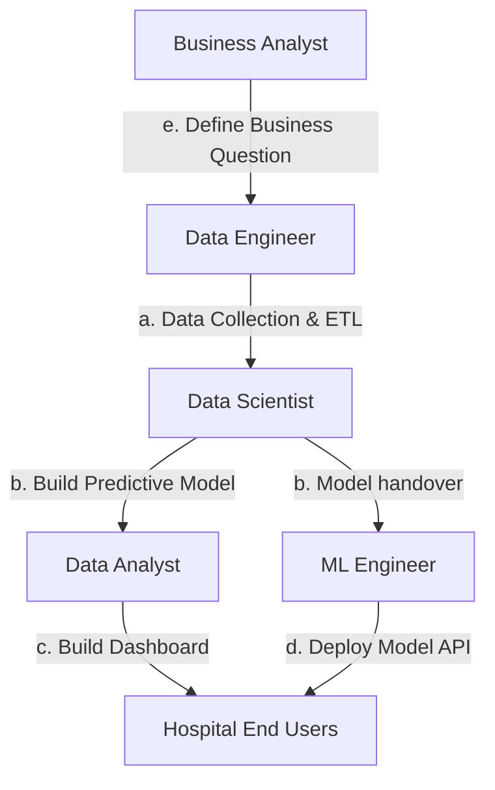
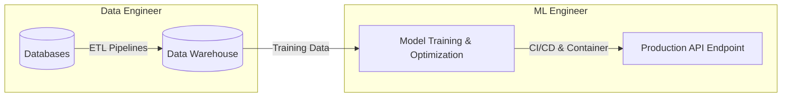

## 1.3. Exercise 2. Project Roles and Critical Thinking

### Problem Statement
A hospital wants to build a system that predicts whether a patient is at risk of **heart disease** within the next 5 years.
Specialists involved: **Data Analyst, Data Scientist, Data Engineer, ML Engineer, Business Analyst**.

#### Tasks
1. **Match the Roles**: Assign the following tasks to the correct role(s):
   * *(a) Collect patient records from multiple hospital databases and prepare them for use.*
   * *(b) Build a predictive model using patient data to estimate heart disease risk.*
   * *(c) Create a dashboard to show current statistics about patient risk factors (age, weight, smoking).*
   * *(d) Deploy the predictive model so doctors can access it via a web application.*
   * *(e) Define the business question: "How can we reduce the number of undetected high-risk patients?"*
2. **Critical Thinking**:
   * Explain why a **Data Engineer** and a **Machine Learning Engineer** cannot simply replace each other.
   * Explain why a **Data Analyst** and a **Data Scientist** cannot fully replace each other.

---

### Solution and Role Matching

#### 1. Task Matching Table

| Task | Matching Role | Reasoning |
| :--- | :--- | :--- |
| **(a) Collect patient records from multiple hospital databases and prepare them for use.** | **Data Engineer** | This task involves orchestrating ETL (Extract, Transform, Load) pipelines, connecting to heterogeneous data stores, establishing security/privacy compliance, and structuring clean data warehouses. |
| **(b) Build a predictive model using patient data to estimate heart disease risk.** | **Data Scientist** | This requires statistical knowledge, feature selection, exploratory data analysis, mathematical modeling, hyperparameter optimization, and validation metric assessment. |
| **(c) Create a dashboard to show current statistics about patient risk factors.** | **Data Analyst** | This task involves translating historical patient cohorts into visual metrics, tracking current hospital statistics, and summarizing demographic/lifestyle distributions via interactive reports. |
| **(d) Deploy the predictive model so doctors can access it via a web application.** | **Machine Learning Engineer** | This is a software engineering and infrastructure task. It requires wrapping the model in an API (FastAPI, Flask), managing containerization (Docker), designing scaling architecture (Kubernetes), and monitoring pipeline health. |
| **(e) Define the business question: "How can we reduce undetected high-risk patients?"** | **Business Analyst** | This task bridges clinical operational needs with technical objectives, establishing baseline KPIs, identifying resource bottlenecks, and defining project requirements. |

---

### 2. Critical Thinking Analysis

#### Why a Data Engineer and a Machine Learning Engineer Cannot Replace Each Other
While both roles require strong software engineering skills, their primary objectives, tools, and paradigms are fundamentally different:

* **Data Engineer**: Focuses on the foundation of the data pipeline. They build robust, scalable systems that extract raw data from unstructured/structured sources, clean it, transform it, and load it into low-latency query environments (Data Lakes, Data Warehouses).
  * *Primary Skillset*: Database architecture, data modeling, pipeline orchestration tools (Airflow), Big Data engines (Spark, Hive), and SQL/NoSQL systems.
* **Machine Learning Engineer**: Focuses on the productionization of model artifacts. They take the experimental code written by Data Scientists and convert it into high-performance, maintainable software.
  * *Primary Skillset*: Model optimization, deployment patterns (REST APIs, gRPC), containerization (Docker, Kubernetes), MLOps principles (CI/CD pipelines for models), and model monitoring frameworks (Prometheus, Grafana).
* **Summary**: A Data Engineer is responsible for getting the data to the warehouse; an ML Engineer is responsible for taking the model that uses this data and making it run reliably at scale.

#### Why a Data Analyst and a Data Scientist Cannot Fully Replace Each Other
Although both roles involve analyzing data and extracting insights, they differ in analytical depth, mathematical tools, and operational timelines:

* **Data Analyst**: Focuses primarily on descriptive and diagnostic analytics. They interpret historical data to explain "what happened" and "why it happened."
  * *Methodologies*: Aggregations, SQL joins, spreadsheet reporting, dynamic visualizations, and KPI dashboarding.
  * *Deliverables*: Dashboards, slide presentations, and executive summaries for business stakeholders.
* **Data Scientist**: Focuses on predictive and prescriptive analytics. They build models to forecast "what will happen" and develop optimal policies for "how we can make it happen."
  * *Methodologies*: Advanced calculus, linear algebra, hypothesis testing, machine learning algorithms, and exploratory statistical scripting.
  * *Deliverables*: Trained machine learning model files, custom prediction pipelines, and statistical analysis reports.
* **Summary**: A Data Analyst provides hindsight and insight based on past data; a Data Scientist provides foresight and predictive intelligence to guide future decisions.

---
