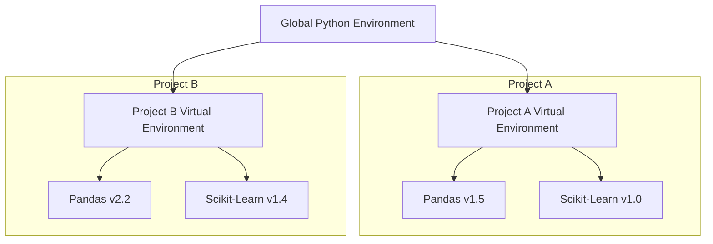

# Chapter 2: Setting Up the Python Environment

## 2.1. Managing Python Environments and Package Managers

### 1. The Anatomy of Python Isolation
When building professional data science pipelines, maintaining environment isolation is a key software engineering practice. Running all projects inside Python's global operating system environment can lead to dependency conflicts, where different libraries require incompatible versions of the same core packages.



### 2. Package Management: Pip vs. Conda

| Feature | Pip (Python Package Installer) | Conda (Anaconda/Miniconda) |
| :--- | :--- | :--- |
| **Scope** | Manages Python packages only. | Manages multi-language packages (Python, C++, R, Java). |
| **Package Source** | Python Package Index (PyPI). | Anaconda Repository, Conda-Forge. |
| **Environment Tooling** | Requires secondary tooling (e.g., `venv`, `virtualenv`). | Integrated environment manager. |
| **Dependency Resolver** | Historical issues with dependency loops; resolves Python packages only. | Advanced resolver that checks for C-library dependencies (excellent for compiled binaries). |
| **Binary Support** | Relies on pre-built wheels (`.whl`); complex to compile from source if unavailable. | Distributes pre-compiled binaries directly, preventing compilation errors. |

### 3. Comprehensive Virtual Environment Command Guide

#### Using Python's Native `venv`
Create a project folder, navigate to it, and initialize a virtual environment:
```bash
# Create directory
mkdir HospitalDataAnalysis
cd HospitalDataAnalysis

# Initialize virtual environment (usually named 'env' or '.venv')
python -m venv env
```

Activate the environment based on your operating system:
* **Windows (Command Prompt)**:
  ```cmd
  env\Scripts\activate.bat
  ```
* **Windows (PowerShell)**:
  ```powershell
  .\env\Scripts\activate.ps1
  ```
* **macOS / Linux**:
  ```bash
  source env/bin/activate
  ```

Once activated, your terminal prompt will display `(env)` as a prefix. To deactivate:
```bash
deactivate
```

#### Using Conda Environment Management
Create an environment with a specific Python version:
```bash
conda create --name ds_env python=3.10 -y
```

Activate the environment:
```bash
conda activate ds_env
```

List all available Conda environments:
```bash
conda env list
```

Deactivate the environment:
```bash
conda deactivate
```

---
