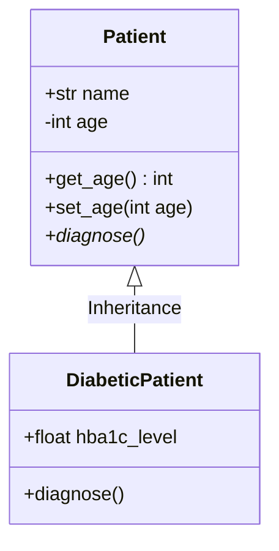
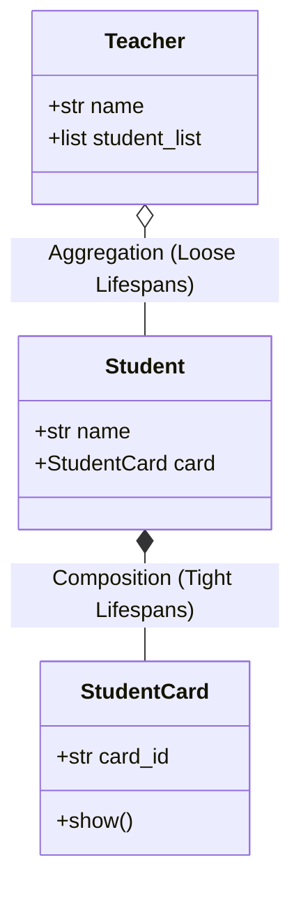

## 3.2. Object-Oriented Programming in Python

Object-Oriented Programming (OOP) allows developers to build modular, maintainable, and reusable code by grouping attributes (data) and methods (functions) inside objects.

### 1. Class vs. Instance Attributes
* **Class Attributes**: Variables shared across all instances of a class.
* **Instance Attributes**: Variables unique to each class instance, defined within the class constructor (`__init__`).

```python
class Patient:
    # Class Attribute (shared across all instances)
    medical_facility = "City General Hospital"
    
    def __init__(self, name, age):
        # Instance Attributes (unique to each instance)
        self.name = name
        self.age = age
```

### 2. The Four Pillars of OOP



#### Encapsulation (Data Hiding)
Encapsulation restricts direct access to an object's internal state. In Python, this is done by prefixing attribute names with single or double underscores (`_` or `__`) to control visibility.

```python
class BankAccount:
    def __init__(self, owner, balance):
        self.owner = owner
        self.__balance = balance  # Private attribute, protected from direct modification
        
    def get_balance(self):
        return self.__balance
        
    def deposit(self, amount):
        if amount > 0:
            self.__balance += amount
```

#### Inheritance
Inheritance allows a child class to inherit attributes and methods from a parent class, promoting code reuse.

```python
class Physician:
    def __init__(self, name, department):
        self.name = name
        self.department = department
        
    def write_prescription(self):
        return "Broad-spectrum prescription written."

# Cardiologist inherits from Physician
class Cardiologist(Physician):
    def conduct_ekg(self):
        return "Conducting electrocardiogram on patient."
```

#### Polymorphism
Polymorphism allows different classes to share an interface while implementing different logic under the same method name.

```python
class Patient:
    def record_vitals(self):
        pass

class AdultPatient(Patient):
    def record_vitals(self):
        return "Adult vitals: BP 120/80, heart rate 72 bpm."

class InfantPatient(Patient):
    def record_vitals(self):
        return "Infant vitals: Resp rate 30, heart rate 110 bpm."

# Execute polymorphic function call
def print_vitals(patient_obj: Patient):
    print(patient_obj.record_vitals())
```

#### Abstraction
Abstraction hides complex implementation details, exposing only the essential features of an object. This is implemented in Python using the `abc` (Abstract Base Classes) module.

```python
from abc import ABC, abstractmethod

class DiagnosticTest(ABC):
    @abstractmethod
    def run_test(self):
        pass

class BloodTest(DiagnosticTest):
    def run_test(self):
        return "Analyzing serum components..."
```

---

### 3. Object Relationships: Composition vs. Aggregation

* **Composition ("Part-of" / Strong Relationship)**: The parent object owns the child object, and their lifecycles are tightly coupled. If the parent is destroyed, the child is also destroyed.
* **Aggregation ("Has-a" / Weak Relationship)**: The parent object references the child object, but they exist independently. If the parent is destroyed, the child continues to exist.



#### Composition Code Example
```python
class StudentCard:
    def __init__(self, card_id):
        self.card_id = card_id

class Student:
    def __init__(self, name, card_id):
        self.name = name
        # Strong relationship: Card is created and destroyed with the Student
        self.card = StudentCard(card_id)
```

#### Aggregation Code Example
```python
class Student:
    def __init__(self, name):
        self.name = name

class Teacher:
    def __init__(self, name):
        self.name = name
        self.students = [] # Loose relationship: Students exist independently
        
    def add_student(self, student_obj):
        self.students.append(student_obj)
```

---

### 4. Magic (Dunder) Methods Reference
Magic methods (surrounded by double underscores) allow user-defined classes to interact with Python's built-in syntax (e.g., comparison operators, printing, arithmetic).

| Magic Method | Built-in Trigger | Common Implementation Target |
| :--- | :--- | :--- |
| `__init__(self, ...)` | Instance instantiation | Initializing class constructors. |
| `__str__(self)` | `str(obj)` or `print(obj)` | Readable, user-friendly representation. |
| `__repr__(self)` | Interactive prompt inspection | Formal, debugging-friendly string representation. |
| `__add__(self, other)` | Addition operator `+` | Merging classes, vector arithmetic. |
| `__eq__(self, other)` | Equality check `==` | Structuring semantic entity equivalence. |
| `__lt__(self, other)` | Comparison check `<` | Ordering list structures of instances. |

---
