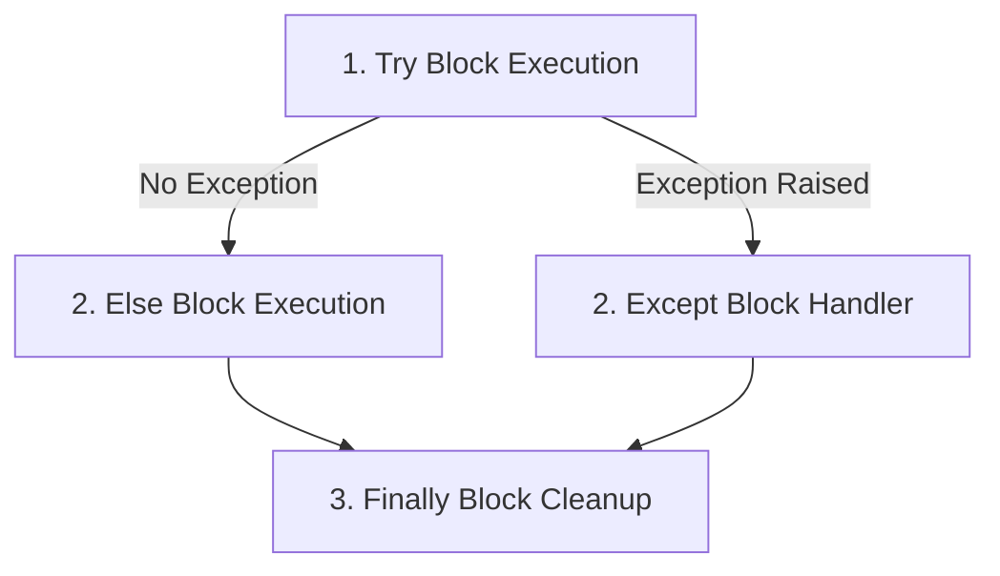

## 3.3. Advanced Control Flow, Iterators, and Exception Handling

### 1. Iterators vs. Generators
* **Iterators**: Objects containing a countable number of values that implement the iterator protocol (`__iter__()` and `__next__()`).
* **Generators**: Functions that produce a sequence of values using the `yield` keyword instead of `return`. They pause execution after each yield, preserving state, which makes them highly memory efficient when processing large datasets.

```mermaid
graph TD
    subgraph Iterator
    I_Init[it = iter(iterable)] --> I_Next[next(it)]
    I_Next --> I_Value[Yields Value]
    I_Next -->|End of Sequence| I_Stop[Raises StopIteration]
    end
    
    subgraph Generator
    G_Call[Call Generator Function] --> G_State[Function execution begins]
    G_State --> G_Yield[Yield value encountered]
    G_Yield -->|Yields value and pauses execution| G_Wait[Waits for next() request]
    G_Wait --> G_State
    end
```

```python
# Custom iterator class
class SequenceIterator:
    def __init__(self, limit):
        self.limit = limit
        self.current = 0
        
    def __iter__(self):
        return self
        
    def __next__(self):
        if self.current < self.limit:
            val = self.current
            self.current += 1
            return val
        else:
            raise StopIteration

# Generator function alternative
def sequence_generator(limit):
    current = 0
    while current < limit:
        yield current
        current += 1
```

### 2. Safe Execution using Try-Except-Else-Finally
* **`try`**: Block of code containing operations that could raise an exception.
* **`except`**: Handles specific errors when they occur, preventing application crashes.
* **`else`**: Runs code *only* if no exceptions were raised in the `try` block.
* **`finally`**: Runs code *always* (e.g., closing file streams, releasing network locks), regardless of whether an exception occurred.



```python
def load_and_divide_numbers(filename, denominator):
    try:
        # Resource acquisition
        file = open(filename, "r")
        numerator = float(file.readline().strip())
        result = numerator / denominator
    except FileNotFoundError:
        print("Error: The specified file does not exist on disk.")
        result = None
    except ZeroDivisionError:
        print("Error: division by zero is mathematically undefined.")
        result = None
    except ValueError:
        print("Error: Could not convert data within file to a float.")
        result = None
    else:
        print("Database/File read and division successful.")
    finally:
        # Ensure resource is closed to prevent memory leaks
        try:
            file.close()
            print("File stream successfully closed.")
        except NameError:
            # File was never successfully opened
            pass
    return result
```

---
