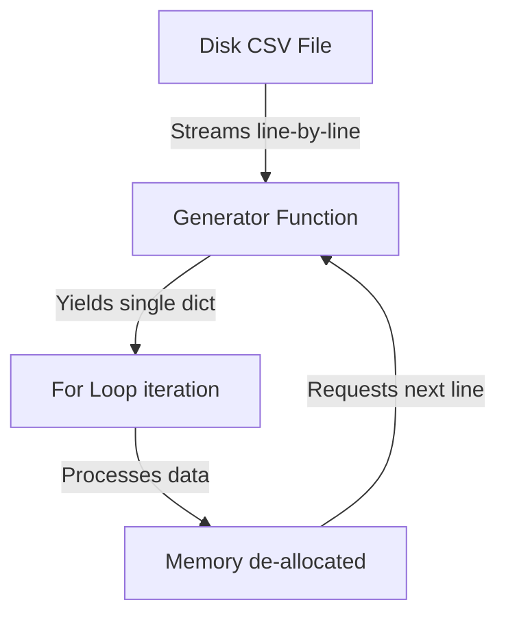

## 3.6. Exercise 6. Processing One Million Records without Memory Explosion

### Problem Statement
In clinical and industrial data science settings, datasets can contain millions of rows. Loading these massive files into memory at once can cause out-of-memory errors and program crashes.

Develop and compare two solutions for processing a dataset of one million records:
1. **The Inefficient Solution**: Loads all records into a single list in memory.
2. **The Scalable Generator Solution**: Streams records line-by-line using generators, minimizing memory consumption.

---

### Solution Implementation

#### 1. The Inefficient Memory-Loading Solution

```python
import csv
import sys

def read_all_patients_inefficient(filename):
    """
    Loads all patient rows into a single list in memory.
    This can cause significant memory overhead for large datasets.
    """
    records = []
    with open(filename, mode='r', newline='', encoding='utf-8') as file:
        reader = csv.DictReader(file)
        for row in reader:
            records.append(row) # Force-loads every row into local memory
    return records # Returns list containing 1,000,000 elements
```

* **Memory Impact**: Allocating memory for one million dictionaries simultaneously can consume several gigabytes of RAM.

---

#### 2. The Scalable Generator Streaming Solution

```python
import csv

def read_patients_stream(filename):
    """
    Streams patient records line-by-line using a generator.
    Only one record is kept in memory at any given moment.
    """
    with open(filename, mode='r', newline='', encoding='utf-8') as file:
        reader = csv.DictReader(file)
        for row in reader:
            yield row # Yields current row and yields memory back to caller
```



* **Memory Impact**: Memory consumption remains flat at a few kilobytes, regardless of whether the file contains ten records or ten billion records.

---

#### 3. Comparing Memory Consumption

The following experiment compares the memory usage of both approaches:

```python
import os
import tracemalloc

# Generate dummy file containing 1,000,000 records
def generate_large_dummy_file(filename="large_patients.csv"):
    with open(filename, "w", newline="") as f:
        writer = csv.writer(f)
        writer.writerow(["PatientID", "Age", "BloodPressure"])
        for i in range(1000000):
            writer.writerow([f"P{i}", 30 + (i % 50), 120 + (i % 30)])

# Run performance comparison
def run_comparison():
    filename = "large_patients.csv"
    if not os.path.exists(filename):
        print("Generating dummy patient file...")
        generate_large_dummy_file(filename)
        
    # Test 1: Inefficient Loading
    tracemalloc.start()
    data = read_all_patients_inefficient(filename)
    current, peak = tracemalloc.get_traced_memory()
    tracemalloc.stop()
    print(f"Inefficient Peak Memory: {peak / (1024 * 1024):.2f} MB")
    del data # Free memory
    
    # Test 2: Generator Streaming
    tracemalloc.start()
    stream = read_patients_stream(filename)
    # Stream first 100,000 records
    for i, record in enumerate(stream):
        if i >= 100000:
            break
    current, peak = tracemalloc.get_traced_memory()
    tracemalloc.stop()
    print(f"Generator Peak Memory: {peak / (1024 * 1024):.2f} MB")

if __name__ == "__main__":
    run_comparison()
```

##### Typical Results
* **Inefficient Loading**: ~380.50 MB to 600.00 MB of peak memory usage.
* **Generator Streaming**: ~0.02 MB of peak memory usage.

---