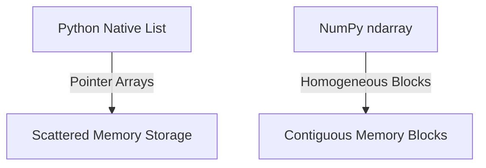
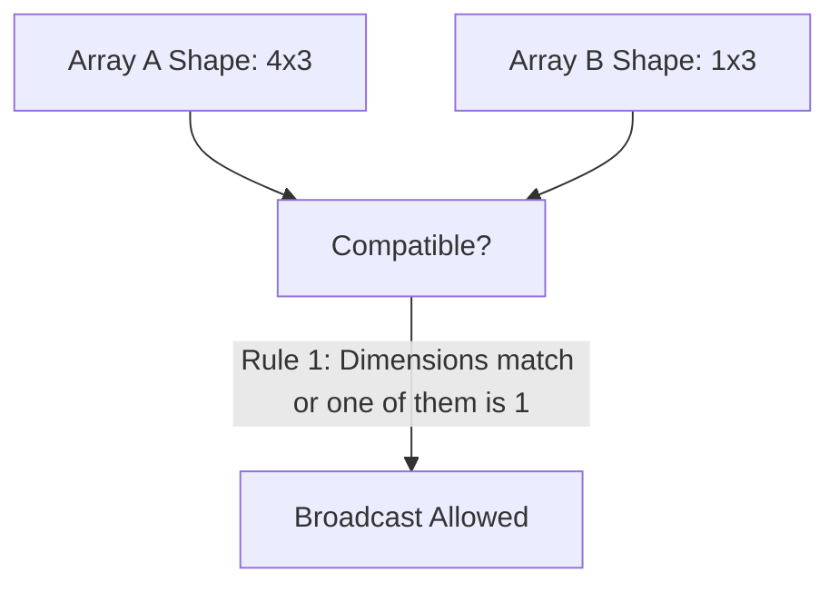

# Chapter 4: Essential Python Libraries for Data Science

## 4.1. NumPy Deep Dive

NumPy (Numerical Python) is the foundation of scientific and engineering computations in Python. It provides high-performance n-dimensional arrays (`ndarray`) and vectorized operations to bypass Python's native loops.



### 1. The Anatomy of Fast Vector Calculations
* **Homogeneous Elements**: Every item in a NumPy array must be of the exact same data type (e.g., `float64`, `int32`), enabling contiguous memory allocation.
* **Contiguous Memory**: Arrays are stored in uninterrupted memory blocks, allowing the CPU to efficiently pre-fetch values and run parallel vector instructions (SIMD).
* **Vectorization**: Performing mathematical operations on entire arrays at once, executing the loops in compiled C code rather than slow Python loops.

### 2. Array Initialization and Attributes
```python
import numpy as np

# Create array from nested list
arr = np.array([[1.0, 2.0, 3.0], [4.0, 5.0, 6.0]], dtype=np.float64)

# Print attributes
print(f"Dimension: {arr.ndim}")  # Returns 2 (2D array)
print(f"Shape: {arr.shape}")    # Returns (2, 3)
print(f"Size: {arr.size}")      # Returns 6 (total elements)
print(f"Data Type: {arr.dtype}") # Returns float64
```

### 3. Vector Slicing Syntax
For any 2D array, slicing follows the pattern: `arr[row_start:row_end, col_start:col_end]`

```python
# Access elements in a 3x3 array
a = np.array([
    [10, 20, 30],
    [40, 50, 60],
    [70, 80, 90]
])

# Extract sub-matrix [[50, 60], [80, 90]]
sub_matrix = a[1:3, 1:3]
```

---

### 4. Broadcasting Rules Reference
Broadcasting allows arithmetic operations between arrays of different shapes, dynamically extending the smaller array to match the larger array's shape.



#### The Rules of Compatibility
1. **Dimension Evaluation**: Evaluate dimensions starting from the trailing dimension (right-to-left).
2. **Size Compatibility**: Two dimensions are compatible if:
   * They are equal in size, or
   * One of them is exactly 1.
3. If these conditions are met, the array with dimension size 1 is virtually stretched to match the larger size.

---